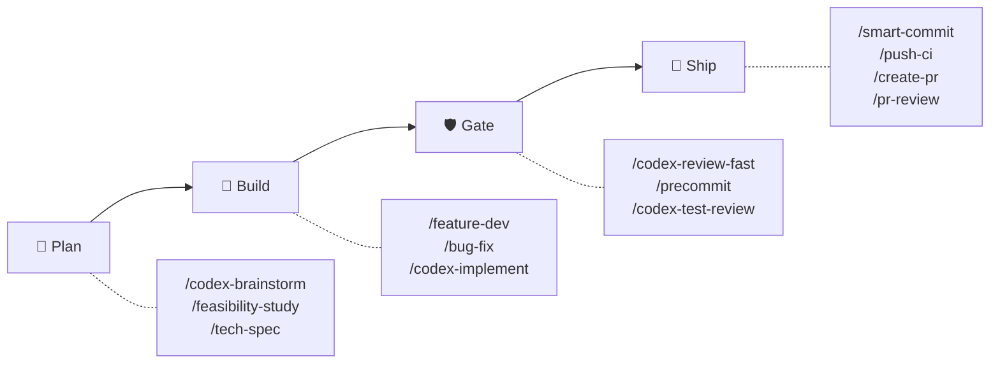

# sd0x-dev-flow


**Idioma**: [English](README.md) | [繁體中文](README.zh-TW.md) | [简体中文](README.zh-CN.md) | [日本語](README.ja.md) | [한국어](README.ko.md) | Español

> La capa harness para Claude Code.

**Deja que el modelo elija el camino. Mantén el «hecho» verificable.**

v4 da a Claude discreción dentro de un conjunto cerrado de anchors fijado por tests; los hooks son recordatorios ligados al digest (digest-bound) que sobreviven la compactación, y Codex revisa de forma independiente.

Control plane completo en Claude Code. Distribución solo de skills para Codex CLI y otros agentes compatibles.

<!-- BEGIN:HERO-COUNT -->
100 bundled · 100 public skills · 16 agents — ~4% de la ventana de contexto de Claude
<!-- END:HERO-COUNT -->

[](LICENSE) [](https://www.npmjs.com/package/skills)

## Inicio rápido

```text
# Claude Code — control plane completo
/plugin marketplace add sd0xdev/sd0x-harness
/plugin install sd0x-dev-flow@sd0xdev-marketplace

# Configurar tu proyecto
/project-setup
```

Un solo comando autodetecta framework, package manager, base de datos, entry points y scripts. Instala un subconjunto de rules y hooks; el plugin completo incluye 16 rules + 7 hooks. Usa `--lite` para solo configurar CLAUDE.md (sin rules/hooks).

```bash
# Codex CLI / Cursor / Windsurf / Aider — solo skills
npx skills add sd0xdev/sd0x-harness
```

Después, dentro de Codex CLI, genera el kernel AGENTS.md e instala el hook `commit-msg`. La puerta `pre-push` es opt-in: añade `--with-push-gate` para instalarla también:

```text
$codex-setup init
```

<!-- BEGIN:INSTALL-COVERAGE -->
| Método | Herramientas | Cobertura |
|--------|-------------|-----------|
| Instalar plugin | Claude Code | Completa (100 bundled skills, hooks, rules, auto-loop) |
| `npx skills add` | Codex CLI, Cursor, Windsurf, Aider | Solo Skills (100 public skills) |
| `$codex-setup init` | Codex CLI | Kernel AGENTS.md + hook commit-msg (la puerta pre-push es opt-in) |
<!-- END:INSTALL-COVERAGE -->

**Requisitos**: Claude Code 2.1+ | Node.js 18+ | `jq` (`pre-edit-guard` y `post-edit-format` procesan el payload del hook con él — sin `jq` ambos terminan con código 0, así que la protección de rutas sensibles y el formateo automático quedan desactivados en silencio) | [Codex CLI](https://github.com/openai/codex) (opcional para instalar el plugin; es el reviewer por defecto de los gates de review `/codex-*` — ante `codex_fail` — que el `start` o el `resume` del adaptador terminen con código 1, y nada más — un reviewer de respaldo consciente del contrato asume el gate con el mismo mecanismo, fail-closed según el contrato de cada familia y registrando `[REVIEWER_FALLBACK]`; si falta el adaptador, hay un error de configuración, la ejecución no concluye o falla un `alloc`/`cleanup`, no se despacha ningún respaldo, no se registra marcador alguno y el gate queda abierto; solo cuando ningún revisor alternativo produce un veredicto válido la review emite `⚠️ Need Human` en lugar de un veredicto)

### Configuración de Codex exec

El bucle de revisión habla con Codex a través de `codex exec`, mediante un adaptador pequeño. **No hay ningún servidor MCP que registrar**: este plugin ya no despacha a través de `codex mcp-server`.

**1. En una shell** — instala el CLI de Codex (>= 0.149.0) e inicia sesión:

```bash
codex --version
```

**2. En Claude Code** — instala el adaptador de transporte en el proyecto. Es un slash command, no
un comando de shell: escrito en una terminal intentaría ejecutar una ruta absoluta:

```text
/sd0x-dev-flow:install-scripts codex-exec.js
```

El paso 2 es opcional: la primera revisión que necesite el adaptador lo instala automáticamente, con la misma búsqueda de tres niveles que `precommit-fast` usa para su runner. Ejecútalo de forma explícita solo si prefieres que la instalación no ocurra durante una revisión.

**El modelo y el esfuerzo de razonamiento viven ahora en un perfil de Codex, no en un comando de registro.** Indica uno en `rules/auto-loop-project.md`:

```markdown
## Codex Profile

review
```

Ese nombre se resuelve a `$CODEX_HOME/<name>.config.toml`: la forma profile-v2 que `codex exec -p` superpone a tu configuración base (`codex exec --help`: «Layer `$CODEX_HOME/<name>.config.toml` on top of the base user config»). Así, un perfil `review` con `model_reasoning_effort = "high"` da al bucle de revisión la misma profundidad que daba el antiguo `-c`, sin tocar tus sesiones interactivas de Codex. Dejar `## Codex Profile` vacío también es válido: el adaptador no pasa `-p` y Codex usa su propia configuración por defecto.

El adaptador fija por sí mismo el sandbox y la política de aprobación en cada despacho, así que ninguno es una decisión de configuración; el contrato completo está en `skills/codex-code-review/references/codex-transport.md`.

## Por qué v4

Los modelos frontier pueden planificar, agrupar y recuperarse a partir de estado estructurado — ya no necesitan que el harness dicte cada siguiente comando. v4 pasa de la **coreografía a los contratos**: el harness dejó de guionizar los movimientos del modelo y empezó a definir qué debe ser cierto cuando el trabajo se declara terminado, sin relajar ni un solo anchor de seguridad o de review.

| Dimensión | v3 (coreografía) | v4 (contratos) |
|-----------|------------------|----------------|
| Rol del hook | Emitir el siguiente comando a ejecutar | Imprimir recordatorios + hechos `[AUTO_LOOP_STATE]` — clase de cambio, estado de veredicto por plano |
| Terminación | Secuencia de pasos guionizada («fix → re-review inmediato») | Invariante de terminación (terminal completion invariant): todo gate que la clase de cambio requiere ha pasado después de la última edición |
| Fuerza de las reglas | Uniforme — cada regla se lee como obligatoria | Tres tiers: **Anchor** (nunca), **Default** (desviarse declarando una señal), **Guidance** (consultivo) |
| Profundidad de review | Máxima por defecto | Tiers escalados por riesgo (`fast` / `standard` / `thorough`); seguridad e integridad de datos siempre escalan |
| Estancamiento detectado / tope de rondas alcanzado | Traspaso al humano | Primer disparo: autodiagnóstico estructurado + un ajuste acotado, y luego continuar — salvo que aplique una salida humana (seguridad/integridad de datos, cambio a nivel de arquitectura, ambigüedad de requisitos); el mismo cambio alcanzando el tope de nuevo tras su diagnóstico: siempre humano |

El núcleo no negociable vive en un **Anchor Register cerrado** (`rules/discretion.md`) que ningún override de proyecto puede degradar — la resolución es Anchor-first, y una suite de tests falla por diseño si se elimina una entrada del Register. Dentro de ese límite, la propiedad es explícita:

| Propietario | Posee |
|-------------|-------|
| **Modelo** | Agrupación, timing, escalado de la profundidad de review, desviaciones de tier Default (declaradas, y luego seguir trabajando) |
| **Harness** | Estado de recordatorio ligado al digest, guards a nivel de git (`commit-msg` instalado por `/codex-setup init`, `pre-push` opt-in), el conjunto cerrado de anchors |
| **Humano** | Aprobaciones irreversibles (push, commit, merge) y los puntos de salida enumerados |

El modelo posee el camino. El harness posee la evidencia y los límites no negociables. El humano conserva la autoridad irreversible.

## Novedades en 4.4

> Si tras actualizar a **4.4.0** notas una caída en la calidad de review — defectos reales que se cuelan, o revisiones que convergen demasiado pronto — por favor [abre un issue](https://github.com/sd0xdev/sd0x-harness/issues). Esta versión cambia el **criterio** del review, y los reportes de campo son la única forma de validarlo.

**En lenguaje llano**: el auto-loop permitía que las reviews excavaran sin límite — el reviewer señalaba un test débil, el fix añadía un guard más fuerte, la siguiente ronda atacaba ese guard, y así recursivamente. Medimos un caso real: 9 rondas de review donde 7 de 8 hallazgos bloqueantes atacaban la **solidez de los propios test guards**, y ninguno el cambio entregado. 4.4 traza la línea: una vez que una propiedad queda demostrada en ambas direcciones sobre su ruta real, el endurecimiento adicional de esa propiedad es no bloqueante salvo que un AC o un invariante de seguridad lo exija.

| Cambio | Antes | Después |
|--------|-------|---------|
| Límite de assurance | A un guard siempre se le podía exigir un guard del guard | Un test que rechaza prueba ambas direcciones sobre la ruta real — **esa prueba representativa es el límite**; endurecimiento adicional queda como Nit no bloqueante salvo que un AC o invariante de seguridad lo exija |
| El campo Prevention | Se leía como "cada fix debe añadir otro artefacto de defensa" — la semilla de la espiral | Una **explicación** de qué control existente atrapa esa clase; normalmente el test de regresión que el fix ya incluye |
| Review dispatch | Los re-dispatches podían acumular directivas de "ataca X ahora", anclando al reviewer cada vez más hondo | **Contrato fijo de tres partes**: tarea congelada (tarea, baseline, ACs, focus del usuario), hechos actuales, contrato de review fijo — las listas de ataque son patrón prohibido |
| Encuadre del reviewer | "Céntrate en encontrar problemas" | "Céntrate en **defectos materiales**" — más un assurance boundary y un boundary check en lugar del gap check abierto |
| Pensamiento de diseño | Delegado al review, con el código ya escrito | Nudge al escribir: cuando la forma no es obvia, nombra el diseño más simple elegido y por qué — preguntas, no cuotas |

**Por qué creemos que es correcto** (y por qué aun así pedimos reportes): [IFScale](https://arxiv.org/abs/2507.11538) mide la degradación del seguimiento por modelo al subir la densidad de 10 a 500 instrucciones simultáneas; la investigación de [context rot](https://www.trychroma.com/research/context-rot) encuentra que contextos más largos y distractores temáticamente afines reducen la fiabilidad; y [Vercel agent evals](https://vercel.com/blog/agents-md-outperforms-skills-in-our-agent-evals) midió que un índice de documentación siempre presente alcanzó el 100% frente al 79% de una skill con instrucciones de activación explícitas — la carga de instrucciones y los contratos difusos tienen costes medibles. El núcleo del auto-loop queda intacto: el terminal completion invariant, edit-reopens-gate, la disciplina sub-threshold, el diagnóstico de estancamiento y todos los anchors de seguridad permanecen exactamente igual.

## Lo que hace este harness

> [Harness engineering](https://martinfowler.com/articles/exploring-gen-ai/harness-engineering.html) es la disciplina de diseñar todo lo que rodea al LLM — tool loops, gestión de contexto, hooks, state machines, capas de seguridad — en lugar de entrenar el modelo en sí. Mitchell Hashimoto acuñó el término en febrero de 2026; [Anthropic engineering](https://www.anthropic.com/engineering/effective-harnesses-for-long-running-agents) y [Martin Fowler](https://martinfowler.com/articles/exploring-gen-ai/harness-engineering.html) han publicado al respecto; [arXiv 2603.05344](https://arxiv.org/html/2603.05344v1) lo formaliza.

sd0x-dev-flow es una reference implementation. Cada fila de la tabla mapea un subproblema canónico de harness a código concreto que puedes estudiar:

| # | Subproblema de harness | Implementación en sd0x-dev-flow | Evidencia de código |
|---|------------------------|--------------------------------|---------------------|
| 1 | **Tool loop control** | Invariante de terminación (terminal completion invariant) — todo gate que una clase de cambio requiere debe pasar después de la última edición; el modelo elige cuándo y cómo ejecutarlos | [`rules/auto-loop.md`](rules/auto-loop.md) + [`scripts/review-state.js`](scripts/review-state.js) |
| 2 | **Digest-bound reminder state** | Los veredictos los anota el modelo (`node scripts/review-state.js note <plane> <pass\|fail>`) y quedan ligados al digest del árbol — una edición reabre el recordatorio de su plano porque el digest cambió; los sentinels de gate (`✅ Ready` / `## Overall: ✅ PASS`) siguen siendo señales de la capa de comportamiento | [`scripts/review-state.js`](scripts/review-state.js) + [`rules/auto-loop.md`](rules/auto-loop.md) (§ Gate Sentinels, § Enforcement) |
| 3 | **Context recovery across compaction** | Línea base de git (rama + archivos sin commit) y recordatorios de gates pendientes re-inyectados tras SessionStart(compact) | [`hooks/post-compact-auto-loop.sh`](hooks/post-compact-auto-loop.sh) |
| 4 | **Lifecycle interceptors** | 5 tipos de hook event despachados a 7 scripts — cuatro hooks de recordatorio consultivos, un auto-formateador y dos guards bloqueantes (ediciones de rutas sensibles; un Codex dispatch mal lanzado) (SessionStart ejecuta además `scripts/namespace-hint.sh`): PreToolUse / PostToolUse / Stop / SessionStart / UserPromptSubmit | [`hooks/`](hooks/) (7 scripts) + [`.claude/settings.json`](.claude/settings.json) |
| 5 | **Capability-based tool gating** | Frontmatter de skill `allowed-tools` — p. ej., `/ask` no tiene Edit/Write | 92 de 100 skills públicas declaran `allowed-tools` |
| 6 | **Defense-in-depth safety** | Los guards a nivel de git instalados siguen siendo duros — commit-msg-guard allí donde lo instaló `/codex-setup init` (el plugin de Claude con `/project-setup` no lo instala), y pre-push-gate sobre `/dev/tty` cuando se ha optado por él; pre-edit-guard sigue bloqueando las ediciones de rutas sensibles (un guard de seguridad, no enforcement de workflow — requiere `jq`; sin jq, el guard no se activa); el Stop hook recuerda — las capas que custodian acciones irreversibles conservaron sus dientes, la capa de review se volvió consultiva por diseño | [`scripts/pre-push-gate.sh`](scripts/pre-push-gate.sh) + [`scripts/commit-msg-guard.sh`](scripts/commit-msg-guard.sh) + [`hooks/stop-guard.sh`](hooks/stop-guard.sh) |
| 7 | **Generator-evaluator split** | Codex revisa lo que escribió Claude e investiga el repositorio por su cuenta — nunca recibe una conclusión que confirmar | [`rules/codex-invocation.md`](rules/codex-invocation.md) + [`rules/auto-loop.md`](rules/auto-loop.md) (Review Dispatch) |
| 8 | **Incremental progress tracking** | Disciplina de estancamiento basada en evidencia: tres rondas de revisión que no cierran ningún hallazgo — contadas por el modelo a partir de los reportes de review — disparan una clasificación estructurada más un ajuste acotado. El presupuesto de rondas por tier (por defecto 6 / 15 / 30, sobrescribible 3–50) queda como red de seguridad ante un bucle desbocado y ejecuta el mismo diagnóstico en su primer hit, con salidas humanas enumeradas | [`rules/auto-loop.md`](rules/auto-loop.md) (§ Stall Detection and Diagnosis; detalles en `skills/codex-code-review/references/loop-diagnostics.md`) |
| 9 | **Human-in-the-loop safety gates** | Aprobación por `AskUserQuestion` antes de cada push de `/push-ci` — siempre obligatoria, y la autorización misma cuando el hook `pre-push` opt-in no está instalado; con el hook instalado, la confirmación por `/dev/tty` es la credencial terminal para pushes a ramas protegidas (más detección de non-fast-forward) | [`scripts/pre-push-gate.sh`](scripts/pre-push-gate.sh) + [`skills/push-ci/SKILL.md`](skills/push-ci/SKILL.md) |
| 10 | **Self-improvement loop** | Corrección → registrar lesson → promover a regla tras 3+ recurrencias | [`rules/self-improvement.md`](rules/self-improvement.md) |

La mayoría de proyectos de harness cubren 2–4 de estos subproblemas. sd0x-dev-flow cubre los 10 — lo que hace el código útil como objeto de estudio, no solo como herramienta.

## Cómo funciona



Todo orbita alrededor de una sola regla — el **terminal completion invariant** (invariante de terminación): el trabajo sobre un cambio solo puede declararse completo cuando todo gate que su clase de cambio requiere ha pasado *después de la última edición en esa clase*. Las ediciones de código requieren un review independiente — de Codex por defecto, o de un reviewer de respaldo consciente del contrato y validado cuando Codex no está disponible — y luego `/precommit`; los docs `.md` requieren `/codex-review-doc`. Cuándo ejecutarlos, cómo agrupar las ediciones y con qué profundidad revisar son decisiones del modelo — el invariante restringe el estado final, no la coreografía.

Los hooks reportan **hechos, no órdenes**: imprimen recordatorios y una línea de hechos `[AUTO_LOOP_STATE]` (clase de cambio, estado de veredicto por plano) y el modelo es dueño de la decisión. Qué bloquea lo decide el tier (`fast` P0 · `standard` P0/P1 · `thorough` P0/P1/P2); los hallazgos por debajo de esa línea se registran y el bucle continúa en lugar de abrir otra ronda. Un estancamiento — tres rondas de revisión que no cierran nada, contadas por el modelo — o, como red de seguridad, alcanzar el tope de rondas dispara un autodiagnóstico estructurado (¿problema de arquitectura? ¿doc demasiado largo? ¿difusión de atención?) y un ajuste acotado antes de que el bucle se reanude, en lugar de un traspaso automático; las salidas humanas siguen vigentes sea cual sea el disparador (los cambios de seguridad e integridad de datos se saltan el diagnóstico por completo; un estancamiento diagnosticado como de nivel de arquitectura o como ambigüedad de requisitos va al humano).

No hay modo de enforcement (hook-lightweighting, 2026-08-13): todo hook de la capa de review es un recordatorio que sale con 0. El informe del reviewer es lo que establece el veredicto; el modelo luego lo anota (`node scripts/review-state.js note <plane> <pass|fail>`, ligado al digest — una edición reabre su plano) para retirar el recordatorio. Un veredicto sin anotar sigue en pie — solo mantiene vivo su recordatorio —, y la manera honesta de silenciar un recordatorio es ejecutar el gate y anotar el resultado. Los guards fuera de la capa de review conservan su fuerza: pre-edit-guard sigue bloqueando las ediciones de rutas sensibles (con `jq` disponible; sin jq, el guard no se activa), y los guards a nivel de git instalados siguen siendo duros (commit-msg-guard mediante `/codex-setup init`, pre-push-gate opt-in).

Un segundo reviewer está disponible vía `/codex-review-branch --dual` y viene desactivado por defecto. Ver [docs/hooks.md](docs/hooks.md) para detalles de hooks y dependencias.

<details>
<summary>Detalle: Diagrama de secuencia del bucle de review</summary>

```mermaid
sequenceDiagram
    participant D as Developer
    participant C as Claude
    participant X as Codex exec
    participant H as Hooks

    D->>C: Edit code
    H->>H: Reminder state re-opens (digest changed)
    C->>X: Codex review (sandbox, researches repo itself)
    X-->>C: Findings + gate sentinel
    C->>C: note the verdict (review-state.js)
    C->>C: Gate on the tier's blocking severity

    alt Blocking findings
        C->>C: Fix them (sub-threshold: log and move on)
        alt Umbral R-a (3 replies; override 2–6) o desbordamiento de contexto R-b
            C->>X: Nuevo primer dispatch en un thread nuevo (la baseline congelada viaja con él)
            X-->>C: Informe nuevo
            C->>C: Reconciliar los findings antiguos con el informe nuevo y re-derivar el gate
            C->>C: Registrar [THREAD_ROTATED] (old → new threadId)
        else Bajo el umbral
            C->>X: codex exec resume <threadId>
            X-->>C: Re-verificación
        end
        Note over C,X: La rotación conserva la scope baseline congelada; las rachas de stall y los topes de rondas no se reinician
    end

    C->>C: /precommit (auto)
    C-->>D: ✅ All gates passed

    Note over H: Stop: owed gates re-reminded — never blocked
```

</details>

## Funcionalidad destacada: Review por tiers

Un solo reviewer — Codex — por defecto en todas partes. El **tier** decide cuánto rigor recibe un cambio, y qué tan grave debe ser un hallazgo para reabrir el bucle:

| Tier | Para | Bloquea en | Tope de rondas |
|------|------|-----------|----------------|
| `fast` | Documentación, configuración, ediciones pequeñas de bajo riesgo | P0 | 6 |
| `standard` **(por defecto)** | Funcionalidades y correcciones ordinarias | P0, P1 | 15 |
| `thorough` | Seguridad, integridad de datos, releases, API pública | P0, P1, P2 | 30 |

El tier configurado es una línea base, no un techo — el modelo escala cuando el cambio lo amerita, y los cambios de seguridad o de integridad de datos siempre se revisan en `thorough` sea cual sea la configuración.

**80 es nota de aprobado.** Los hallazgos por debajo del umbral de bloqueo del tier se registran (`[NIT_DEFERRED]` — una convención de reporte en el informe de review; nada lo persiste) y el bucle avanza a `/precommit` — sin pasada extra de correcciones ni ronda extra de review. `/codex-review-branch` los retoma cuando el cambio se revise en profundidad.

Los topes de rondas de arriba son deliberadamente holgados, porque **un tope no distingue un bucle que converge de uno que da vueltas**: detiene a ambos en el mismo número. Lo que sí los distingue es la evidencia: tres rondas de revisión consecutivas que no cierran ningún hallazgo — contadas por el modelo a partir de los reportes de review, normalmente muchas rondas antes del tope — disparan el diagnóstico de abajo. El tope queda como red de seguridad ante un bucle desbocado.

Los topes de rondas de arriba son los valores por defecto del tier — un override de proyecto `## Max Rounds` (3–50) tiene precedencia. Alcanzar el tope es un punto de diagnóstico, no un traspaso automático: el modelo clasifica el estancamiento (arquitectura, doc demasiado largo, difusión de atención, afirmaciones no verificadas, tier desajustado, ambigüedad de requisitos), hace un ajuste acotado y se reanuda. Las salidas humanas siguen siendo vinculantes sea cual sea el disparador: los cambios de seguridad/integridad de datos se saltan el diagnóstico y van directo al humano, un estancamiento clasificado como de nivel de arquitectura o como ambigüedad de requisitos sale al humano, y el mismo cambio alcanzando el tope una segunda vez tras su diagnóstico siempre lo hace. (Los cambios a nivel de arquitectura, la eliminación de funcionalidades o una petición del usuario de detenerse salen al humano en cualquier momento — con tope o sin él.)

Un segundo reviewer está disponible vía `/codex-review-branch --dual` y está **desactivado salvo que se pase el flag** — duplica el coste en tokens y en tiempo de cada ronda, algo que vale la pena en un release o una revisión de seguridad, no en una corrección corriente. Bajo `--dual`, los hallazgos se normalizan por severidad, se deduplican (archivo + clave de issue, tolerancia ±5 líneas) y se atribuyen por fuente.

Gate: `✅ Ready` o `⛔ Blocked` — señales de la capa de comportamiento sobre las que actúa el modelo; el veredicto se anota en el estado de recordatorio.

## Cuándo usar

| Buen ajuste | No ideal |
|-------------|----------|
| Proyectos individuales o de equipos pequeños con Claude Code | Equipos que no usan Claude Code |
| Proyectos que necesitan gates de review automatizados | Scripts únicos sin CI |
| Usuarios de Codex CLI / Cursor / Windsurf (subconjunto de skills) | Proyectos que requieren proveedores de LLM personalizados |
| Repos donde los gates de calidad previenen regresiones | Repos sin infraestructura de testing |

## Tracks de workflow

| Workflow | Comandos | Gate | Estado |
|----------|----------|------|--------|
| Funcionalidad | `/feature-dev` → `/verify` → `/codex-review-fast` → `/precommit` | ✅/⛔ | Recordatorio ligado al digest (veredictos anotados) |
| Bug Fix | `/issue-analyze` → `/bug-fix` → `/verify` → `/precommit` | ✅/⛔ | Recordatorio ligado al digest (veredictos anotados) |
| Auto-Loop | Edición de código → `/codex-review-fast` → `/precommit` | ✅/⛔ | Recordatorio ligado al digest (veredictos anotados) |
| Doc Review | Edición `.md` → `/codex-review-doc` | ✅/⛔ | Recordatorio ligado al digest (veredictos anotados) |
| Planificación | `/codex-brainstorm` → `/feasibility-study` → `/tech-spec` | — | — |
| Onboarding | `/project-setup` → `/repo-intake` | — | — |

```mermaid
flowchart TD
    subgraph feat ["🔨 Feature Development"]
        F1["/feature-dev"] --> F2["Code + Tests"]
        F2 --> F3["/verify"]
        F3 --> F4["/codex-review-fast"]
        F4 --> F5["/precommit"]
        F5 --> F6["/update-docs"]
    end

    subgraph fix ["🐛 Bug Fix"]
        B1["/issue-analyze"] --> B2["/bug-fix"]
        B2 --> B3["Fix + Regression test"]
        B3 --> B4["/verify"]
        B4 --> B5["/codex-review-fast"]
        B5 --> B6["/precommit"]
    end

    subgraph docs ["📝 Docs Only"]
        D1["Edit .md"] --> D2["/codex-review-doc"]
        D2 --> D3["Done"]
    end

    subgraph plan ["🎯 Planning"]
        P1["/codex-brainstorm"] --> P2["/feasibility-study"]
        P2 --> P3["/tech-spec"]
        P3 --> P4["/codex-architect"]
        P4 --> P5["Implementation ready"]
    end

    subgraph ops ["⚙️ Operations"]
        O1["/project-setup"] --> O2["/repo-intake"]
        O2 --> O3["Develop"]
        O3 --> O4["/project-audit"]
        O3 --> O7["/best-practices"]
        O3 --> O5["/risk-assess"]
        O4 --> O6["/next-step --go"]
        O5 --> O6
        O7 --> O6
    end
```

<details>
<summary>Visual: Diagramas de flujo de workflows</summary>



</details>

## Guía Práctica (Cookbook)

Escenarios reales que muestran qué habilidades combinar y en qué orden.

| Escenario | Flujo | Documentación |
|-----------|-------|------|
| Primer día en un repositorio | `/project-setup` → `/repo-intake` → `/next-step` | [→](docs/cookbook/first-day.md) |
| Implementar una nueva funcionalidad | `/feature-dev` → `/verify` → `/codex-test-review` → `/codex-review-fast` → `/precommit` | [→](docs/cookbook/new-feature.md) |
| Resolver comentarios de review de PR | `/load-pr-review` → corregir → `/codex-review-fast` → `/push-ci` | [→](docs/cookbook/pr-review-comments.md) |
| Revisión de seguridad pre-merge | `/codex-security` → `/dep-audit` → `/risk-assess` → `/pre-pr-audit` | [→](docs/cookbook/security-pre-merge.md) |
| **Destacado:** Validar dirección | `/deep-research` → `/best-practices` → `/feasibility-study` → `/codex-brainstorm` | [→](docs/cookbook/validate-direction.md) |
| **Destacado:** Diseño adversarial | `/codex-brainstorm` (debate de equilibrio de Nash) → `/codex-architect` | [→](docs/cookbook/adversarial-design.md) |

[Los 10 escenarios →](docs/cookbook/)

## Contenido

<!-- BEGIN:WHATS-INCLUDED-COUNT -->
| Categoría | Cantidad | Ejemplos |
|-----------|----------|----------|
| Skills | 100 public (100 bundled) | `/project-setup`, `/codex-review-fast`, `/verify`, `/smart-commit`, `/deep-research` |
| Agents | 16 | strict-reviewer, verify-app, coverage-analyst, architecture-designer |
| Hooks | 7 | pre-edit-guard, pre-bash-codex-launch-guard, auto-format, stop reminder, post-compact-auto-loop, post-skill-auto-loop, user-prompt-review-guard |
| Rules | 17 | auto-loop, auto-loop-project, codex-invocation, scope-discipline, security, testing, git-workflow, self-improvement, context-management |
| Scripts | 24 | precommit runner, verify runner, review-state CLI, dep audit, namespace hint, skill runner, commit-msg guard, pre-push gate, protected-branch resolver, build-codex-artifacts, resolve-feature (node entrypoint + shell shim + CLI), classify-docs, detect-scope, migration-audit, migrate-hook-lightweighting, security-redact, readme-catalog, check-doc-links, resolve-review-profile, codex-exec adapter |
<!-- END:WHATS-INCLUDED-COUNT -->

### Mínimo consumo de context

~4% de la ventana de 200k tokens de Claude — el 96% queda disponible para tu código.

| Componente | Tokens | % de 200k |
|------------|--------|-----------|
| Rules (carga permanente) | 5.1k | 2.6% |
| Skills (bajo demanda) | 1.9k | 1.0% |
| Agents | 791 | 0.4% |
| **Total** | **~8k** | **~4%** |

Los skills se cargan bajo demanda. Los skills inactivos no consumen tokens.

## Referencia de Skills

<!-- BEGIN:ESSENTIAL-SKILLS -->
| Skill | Cuándo usar |
|-------|-------------|
| `/project-setup` | Configuración inicial del proyecto |
| `/bug-fix` | Corregir bugs y resolver issues |
| `/feature-dev` | Implementar funcionalidades de principio a fin |
| `/smart-commit` | Hacer commit con agrupación inteligente |
| `/push-ci` | Push de código y monitoreo de CI |
| `/create-pr` | Crear pull requests en GitHub |
| `/codex-review-fast` | Review rápido de código (solo diff) |
| `/codex-review-doc` | Revisar cambios en documentación |
| `/codex-security` | Auditoría de seguridad OWASP Top 10 |
| `/verify` | Ejecutar la cadena de verificación completa |
| `/precommit` | Quality gate pre-commit (lint + build + test) |
| `/precommit-fast` | precommit rápido (lint + test, sin build) |
| `/codex-brainstorm` | Brainstorming adversarial (equilibrio de Nash) |
| `/tech-spec` | Escribir especificaciones técnicas |
| `/pr-review` | Self-review de PR antes de merge |
<!-- END:ESSENTIAL-SKILLS -->

<!-- BEGIN:FULL-CATALOG -->
<details>
<summary>Las 100 public skills</summary>

### Desarrollo (34)

| Skill | Descripción |
|-------|-------------|
| `/ask` | Q&A con reconocimiento de contexto. Recopila automáticamente información contextual. |
| `/bug-fix` | Bug fix workflow. |
| `/bump-version` | Bump package and plugin version in sync. |
| `/code-explore` | Pure Claude code investigation. |
| `/code-investigate` | Dual-perspective code investigation. |
| `/codex-architect` | Codex architecture consulting. |
| `/codex-implement` | Implement features via Codex exec. |
| `/codex-setup` | Initialize sd0x-dev-flow infrastructure for Codex CLI and other non-Claude agents. |
| `/create-pr` | Create or update GitHub PR with gh CLI. |
| `/debug` | Interactive debugging workflow with hypothesis-driven probe loop. |
| `/deep-explore` | Multi-wave parallel code exploration orchestrator. |
| `/epic-merge` | Squash-merge secuencial de cadenas de PRs apiladas en una epic branch. |
| `/feature-dev` | Feature development workflow. |
| `/feature-verify` | Feature verification (READ-ONLY, P0-P5). |
| `/gh-stack` | Native stacked pull requests through the github/gh-stack extension. |
| `/git-investigate` | Git history investigation. |
| `/git-profile` | Git identity and GPG signing profile manager. |
| `/install-hooks` | Install plugin hooks into project .claude/ for persistent use without plugin loaded |
| `/install-rules` | Install plugin rules into project .claude/rules/ for persistent use without plugin loaded |
| `/install-scripts` | Install plugin runner scripts into project .claude/scripts/ for persistent use without plugin loaded |
| `/issue-analyze` | GitHub Issue and PR review thread deep analysis with Codex blind verdict. |
| `/jira` | Jira integration — view issues, generate branches, create tickets, transition status. |
| `/load-pr-review` | Load GitHub PR review comments into AI session — analyze, triage, plan. |
| `/merge-prep` | Pre-merge analysis and preparation. |
| `/next-step` | Change-aware next step advisor. |
| `/post-dev-test` | Post-development test completion. |
| `/pr-comment` | Post friendly review comments to a GitHub PR — prepare locally, preview, then submit as atomic review. |
| `/project-setup` | Project configuration initialization. |
| `/push-ci` | Push to remote and monitor CI. |
| `/remind` | Lightweight model correction with context-aware rule loading. |
| `/repo-intake` | Project initialization inventory (one-time). |
| `/smart-commit` | Smart batch commit. |
| `/smart-rebase` | Smart partial rebase for squash-merge repositories. |
| `/watch-ci` | Monitor GitHub Actions CI runs until completion. |

### Revisión (Codex exec) (15)

| Skill | Descripción | Soporte de loop |
|-------|-------------|-----------------|
| `/codex-cli-review` | Code review via Codex CLI with full disk access. | - |
| `/codex-code-review` | Code review using Codex exec. | - |
| `/codex-explain` | Explain complex code via Codex exec. | - |
| `/codex-review` | Full second-opinion using Codex exec (with lint:fix + build). | `--continue <threadId>` |
| `/codex-review-branch` | Fully automated review of an entire feature branch using Codex exec | - |
| `/codex-review-doc` | Review documents using Codex exec. | `--continue <threadId>` |
| `/codex-review-fast` | Quick second-opinion using Codex exec (diff only, no tests). | `--continue <threadId>` |
| `/codex-security` | OWASP Top 10 security review using Codex exec. | `--continue <threadId>` |
| `/codex-test-gen` | Generate unit tests for specified functions using Codex exec | - |
| `/codex-test-review` | Review test case sufficiency using Codex exec, suggest additional edge cases. | `--continue <threadId>` |
| `/doc-review` | Document review via Codex exec. | - |
| `/plan-review` | Pre-ExitPlanMode adversarial plan review loop via Codex exec. | - |
| `/security-review` | Security review via Codex exec. | - |
| `/seek-verdict` | Independent second-opinion verification for any finding. | - |
| `/test-review` | Test coverage review via Codex exec. | - |

### Verificación (13)

| Skill | Descripción |
|-------|-------------|
| `/best-practices` | Industry best practices conformance audit with mandatory adversarial debate. |
| `/check-coverage` | Comprehensive assessment of Unit / Integration / E2E three-layer test coverage, identify gaps and provide actionable ... |
| `/dep-audit` | Audit dependency security risks |
| `/dev-security-audit` | Comprehensive developer workstation security audit — scans for exposed credentials, compromised application data, per... |
| `/necessity-audit` | Necessity audit for over-designed spec elements. |
| `/pre-pr-audit` | Pre-PR confidence audit with 5-dimension scoring. |
| `/precommit` | Pre-commit checks — lint:fix -> build -> test |
| `/precommit-fast` | Quick pre-commit checks — lint:fix -> test |
| `/project-audit` | Project health audit with deterministic scoring. |
| `/risk-assess` | Uncommitted code risk assessment with breaking change detection, blast radius analysis, and scope metrics. |
| `/test-deep` | Context-aware test orchestration. |
| `/test-health` | Holistic test coverage measurement. |
| `/verify` | Verification loop — lint -> typecheck -> unit -> integration -> e2e |

### Planificación (17)

| Skill | Descripción |
|-------|-------------|
| `/architecture` | Architecture design and documentation. |
| `/codex-brainstorm` | Adversarial brainstorming via Claude+Codex debate. |
| `/deep-analyze` | Deep-dive analysis of an initial proposal — research code implementation, produce an actionable roadmap and alternatives |
| `/deep-research` | Universal multi-source research orchestration. |
| `/feasibility-study` | Feasibility analysis from first principles. |
| `/fp-brief` | First-principles briefing from technical documents. |
| `/orchestrate` | Agent-driven workflow orchestration (v1 report-only). |
| `/post-dev-recap` | Post-development recap wrapper. |
| `/project-brief` | Convert a technical spec into a PM/CTO-readable executive summary. |
| `/recap-ask` | Interactive Q&A over an existing recap document. |
| `/recap-doc` | Post-development recap document generator. |
| `/req-analyze` | Requirements analysis — problem decomposition, stakeholder scan, requirement structuring. |
| `/request-tracking` | Request tracking knowledge base. |
| `/review-spec` | Review technical spec documents from completeness, feasibility, risk, and code consistency perspectives. |
| `/tech-brief` | Technical briefing for developer sharing. |
| `/tech-spec` | Tech spec generation and review. |
| `/ui-first-principles` | First-principles UI/IA reasoning: turns a `<scenario>` + API field set into JTBD analysis, principle-anchored field-p... |

### Documentación y Herramientas (21)

| Skill | Descripción |
|-------|-------------|
| `/adr` | Write an Architecture Decision Record (ADR) for a feature — Context / Decision / Status / Consequences / Alternatives... |
| `/claude-health` | Claude Code config health check + plugin sync. |
| `/contract-decode` | EVM contract error and calldata decoder. |
| `/create-request` | Create, update, or scan per-task request tickets for progress tracking. |
| `/de-ai-flavor` | Remove AI artifacts from documents. |
| `/doc-refactor` | Refactor documents — simplify without losing information, visualize flows with sequenceDiagram. |
| `/generate-runner` | Generate a customized precommit runner for any ecosystem. |
| `/obsidian-cli` | Obsidian vault integration via official CLI. |
| `/op-session` | Initialize 1Password CLI session for Claude Code. |
| `/portfolio` | Portfolio system knowledge base. |
| `/pr-review` | PR self-review — review changes, produce checklist, update rules |
| `/pr-summary` | List open PRs, filter automation PRs, group by ticket ID, format as Markdown. |
| `/refactor` | Multi-target refactoring orchestrator. |
| `/runbook` | Generate/update feature release runbook |
| `/safe-remove` | Safely remove plugin assets (skill/agent/rule/script/hook) with dependency detection and reference cleanup. |
| `/sharingan` | Replicate knowledge from any source as sd0x-dev-flow skill definition. |
| `/simplify` | Wrap-up refactoring — simplify code, eliminate duplication, preserve behavior |
| `/skill-health-check` | Validate skill quality against routing, progressive loading, and verification criteria. |
| `/statusline-config` | Customize Claude Code statusline. |
| `/update-docs` | Research current code state then update corresponding docs, ensuring docs stay in sync with code. |
| `/zh-tw` | Rewrite the previous reply in Traditional Chinese |

</details>
<!-- END:FULL-CATALOG -->

## Reglas & Hooks

17 reglas + 7 hooks. Las reglas son contratos por tiers: `discretion.md` resuelve cada instrucción de los 13 archivos de reglas gestionados por el plugin a exactamente uno de Anchor / Default / Guidance, y los 3 archivos de override propiedad del usuario se resuelven Anchor-first bajo sus reglas padre. El conjunto de hooks consta de cuatro hooks de recordatorio consultivos más un auto-formateador y dos guards bloqueantes. Los roles de recordatorio difieren por hook: los hooks de Stop y post-compact renderizan recordatorios de gates pendientes a partir del estado ligado al digest (`review-state.js`), el hook de prompt imprime la línea de hechos `[AUTO_LOOP_STATE]`, el hook post-skill imprime una línea estática con el orden de gates, y el hook post-compact además re-inyecta la línea base de git tras la compactación; la capa de review nunca bloquea — pre-edit-guard sigue bloqueando las ediciones de rutas sensibles (un guard de seguridad; requiere `jq` y sin jq no se activa), pre-bash-codex-launch-guard bloquea un Codex dispatch lanzado con su progreso desviado del panel de tareas, y los gates duros viven a nivel de git (commit-msg-guard, instalado por `/codex-setup init`; pre-push-gate, opt-in).

> **Personalización**: Edita `auto-loop-project.md` para sobrescribir el comportamiento de auto-loop por proyecto. Las actualizaciones del plugin no conflictuarán — ver [Rule Override Pattern](docs/features/rule-override-pattern/2-tech-spec.md).

Para la referencia completa de reglas, hooks y variables de entorno, consulta [docs/rules.md](docs/rules.md) y [docs/hooks.md](docs/hooks.md).

## Personalización

Ejecuta `/project-setup` para autodetectar y configurar todos los placeholders, o edita `.claude/CLAUDE.md` manualmente:

| Placeholder | Descripción | Ejemplo |
|-------------|-------------|---------|
| `{PROJECT_NAME}` | Nombre del proyecto | my-app |
| `{FRAMEWORK}` | Framework | MidwayJS 3.x, NestJS, Express |
| `{CONFIG_FILE}` | Archivo de config principal | src/configuration.ts |
| `{BOOTSTRAP_FILE}` | Entry de bootstrap | bootstrap.js, main.ts |
| `{DATABASE}` | Base de datos | MongoDB, PostgreSQL |
| `{TEST_COMMAND}` | Comando de tests | yarn test:unit |
| `{LINT_FIX_COMMAND}` | Auto-fix de lint | yarn lint:fix |
| `{BUILD_COMMAND}` | Comando de build | yarn build |
| `{TYPECHECK_COMMAND}` | Type checking | yarn typecheck |

Los overrides se resuelven **Anchor-first**: los archivos de override propiedad del usuario (`auto-loop-project.md`, `testing-project.md`, `git-workflow-project.md`) personalizan solo el comportamiento de tier Default y Guidance — ningún override de proyecto puede degradar una entrada del Anchor Register, y un intento se reporta como conflicto en lugar de aceptarse.

## Demostración: Investigación Multi-Agente

Ejecuta `/deep-research` para orquestar 2-3 agentes de investigación en paralelo a través de fuentes web, codebase y conocimiento de la comunidad — con síntesis de claim registry y debate adversarial condicional.

| Característica | Detalles |
|----------------|----------|
| Agentes | 2-3 en paralelo (web + code + community) |
| Síntesis | Claim registry con detección de consenso |
| Validación | Debate condicional /codex-brainstorm |
| Scoring | Modelo de completitud de 4 señales |

[Documentación completa](docs/features/deep-research/)

## Arquitectura

Seis capas, cada una dueña de una responsabilidad:

| Capa | Posee |
|------|-------|
| **Skills** | Capacidades cargadas bajo demanda — los verbos (`/feature-dev`, `/codex-review-fast`, …) |
| **Modelo** | La ruta: agrupación, timing, escalado de la profundidad de review, desviaciones de tier Default |
| **Rules** | Contratos por tiers (Anchor / Default / Guidance) cargados en cada sesión |
| **Hooks + estado** | Recordatorios + hechos `[AUTO_LOOP_STATE]`, notas de veredicto ligadas al digest, recuperación a través de la compactación |
| **Codex** | Review independiente — investiga el repositorio por su cuenta, nunca recibe una conclusión |
| **Scripts + agents** | Checks deterministas (precommit, guards) y subagentes aislados |

Para detalles avanzados de arquitectura (agentic control stack, teoría de bucle de control, reglas de sandbox), consulta [docs/architecture.md](docs/architecture.md) — ten en cuenta que partes de ese documento son anteriores a v4 y aún describen la coreografía de v3; `rules/auto-loop.md` y `rules/discretion.md` son la fuente de verdad actual.

## Contribuir

PRs bienvenidos. Por favor:

1. Seguir las convenciones de naming existentes (kebab-case)
2. Incluir `When to Use` / `When NOT to Use` en skills
3. Agregar `disable-model-invocation: true` para operaciones peligrosas
4. Testear con Claude Code antes de enviar

## Licencia

MIT

## Star History

<a href="https://www.star-history.com/?repos=sd0xdev%2Fsd0x-harness&type=date&legend=top-left">
 <picture>
   <source media="(prefers-color-scheme: dark)" srcset="https://api.star-history.com/image?repos=sd0xdev/sd0x-harness&type=date&theme=dark&legend=top-left" />
   <source media="(prefers-color-scheme: light)" srcset="https://api.star-history.com/image?repos=sd0xdev/sd0x-harness&type=date&legend=top-left" />
   
 </picture>
</a>
