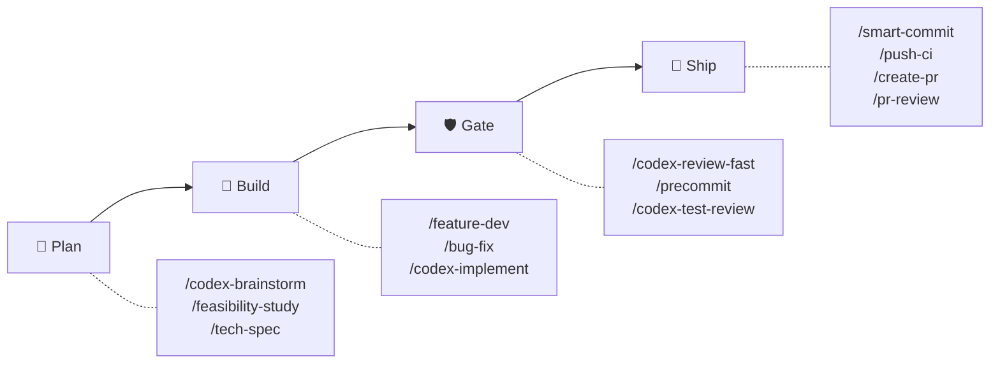
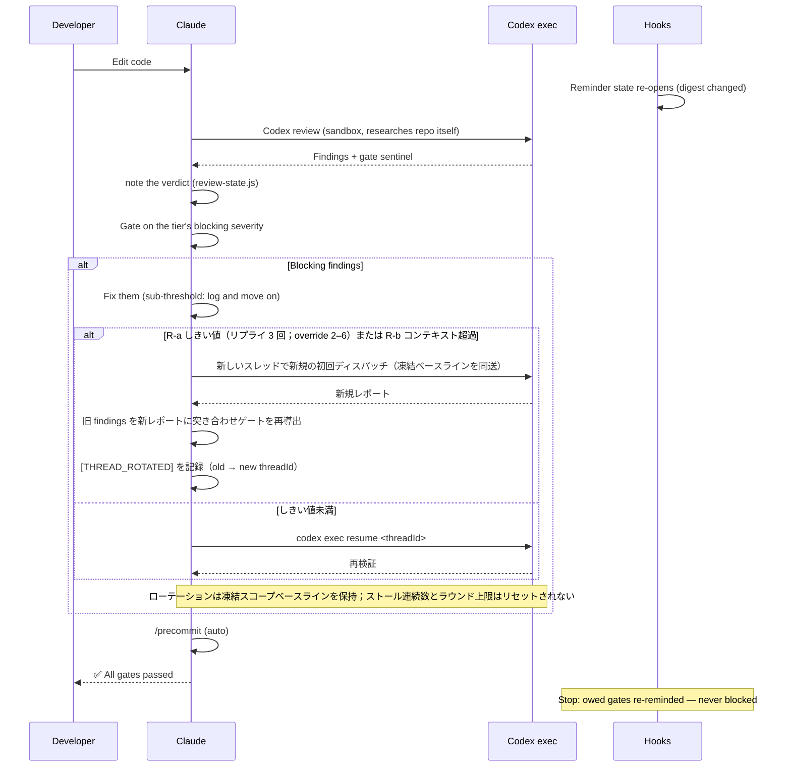

# sd0x-dev-flow


**言語**: [English](README.md) | [繁體中文](README.zh-TW.md) | [简体中文](README.zh-CN.md) | 日本語 | [한국어](README.ko.md) | [Español](README.es.md)

> Claude Code のための harness レイヤー。

**モデルに経路を選ばせる。「完了」は検証可能なままに。**

v4 は、テストで固定された閉じた Anchor セットの内側で Claude に裁量を与えます。フックは compaction をまたいで生き残る digest 束縛のリマインダーであり、Codex が独立してレビューします。

Claude Code ではフルコントロールプレーン。Codex CLI やその他の互換エージェントにはスキルのみを配布します。

<!-- BEGIN:HERO-COUNT -->
101 bundled · 101 public skills · 16 agents — Claude の context window のわずか ~4%
<!-- END:HERO-COUNT -->

[](LICENSE) [](https://www.npmjs.com/package/skills)

## クイックスタート

```text
# Claude Code — フルコントロールプレーン
/plugin marketplace add sd0xdev/sd0x-harness
/plugin install sd0x-dev-flow@sd0xdev-marketplace

# プロジェクトを設定
/project-setup
```

1つのコマンドでフレームワーク、パッケージマネージャー、データベース、エントリポイント、スクリプトを自動検出します。ルールとフックのサブセットをインストールします。完全なプラグインには 17 ルール + 7 フックが含まれます。`--lite` で CLAUDE.md のみ設定（ルール/フックをスキップ）。

```bash
# Codex CLI / Cursor / Windsurf / Aider — スキルのみ
npx skills add sd0xdev/sd0x-harness
```

続いて Codex CLI 内で AGENTS.md カーネルを生成し、`commit-msg` フックをインストールします。`pre-push` ゲートはオプトインです — 併せて入れる場合は `--with-push-gate` を付けてください：

```text
$codex-setup init
```

<!-- BEGIN:INSTALL-COVERAGE -->
| 方法 | 対応ツール | カバー範囲 |
|------|-----------|-----------|
| プラグインインストール | Claude Code | フル（101 bundled skills、フック、ルール、auto-loop） |
| `npx skills add` | Codex CLI、Cursor、Windsurf、Aider | スキルのみ（101 public skills） |
| `$codex-setup init` | Codex CLI | AGENTS.md カーネル + commit-msg フック（pre-push ゲートはオプトイン） |
<!-- END:INSTALL-COVERAGE -->

**必要環境**: Claude Code 2.1+ | Node.js 18+ | `jq`（`pre-edit-guard` と `post-edit-format` が hook のペイロードをこれで解析します — `jq` が無いと両者とも exit 0 するため、センシティブパスのガードと自動フォーマットが黙って無効になります）| [Codex CLI](https://github.com/openai/codex)（プラグインのインストールには不要です。`/codex-*` レビューゲートの既定のレビューアーであり、`codex_fail`（アダプタの `start` または `resume` の exit 1）のときだけ、コントラクトを理解するフォールバックレビューアーが同じ仕組みでゲートを引き継ぎ、ファミリーコントラクトに従ってフェイルクローズドで動作し `[REVIEWER_FALLBACK]` を記録します。アダプタが見つからない場合・設定エラー・実行が完了しない場合・`alloc` / `cleanup` の失敗では、フォールバックを起動せず、マーカーも記録せず、ゲートは開いたままです。すべての担い手が尽きたときにのみ、レビューは判定の代わりに `⚠️ Need Human` を出します）

### Codex exec のセットアップ

レビューループは小さなアダプタ経由で `codex exec` と通信します。**MCP サーバーの登録は不要です** —— 本プラグインは `codex mcp-server` 経由でディスパッチしなくなりました。

**1. シェルで** — Codex CLI（>= 0.149.0）をインストールしてサインインします:

```bash
codex --version
```

**2. Claude Code で** — トランスポートアダプタをプロジェクトに導入します。これはスラッシュコマンドで
あり、シェルコマンドではありません。ターミナルに入力すると絶対パスの実行として扱われます:

```text
/sd0x-dev-flow:install-scripts codex-exec.js
```

手順 2 は任意です。アダプタを必要とする最初のレビューが、`precommit-fast` がランナーに使うのと同じ三段階の探索で自動的にインストールします。インストールをレビューの最中に起こしたくない場合だけ、明示的に実行してください。

**モデルと推論の深さは、登録コマンドではなく Codex プロファイルで指定します。** `rules/auto-loop-project.md` に名前を書きます:

```markdown
## Codex Profile

review
```

この名前は `$CODEX_HOME/<name>.config.toml` に解決されます —— `codex exec -p` がベースのユーザー設定に重ねる profile-v2 形式です（`codex exec --help`:「Layer `$CODEX_HOME/<name>.config.toml` on top of the base user config」）。したがって `model_reasoning_effort = "high"` を持つ `review` プロファイルは、以前の `-c` 上書きと同じ深さをレビューループに与えつつ、対話的な Codex セッションには影響しません。`## Codex Profile` は空のままでも構いません。その場合アダプタは `-p` を渡さず、Codex は自身の既定設定を使います。

sandbox と approval policy はディスパッチごとにアダプタ自身が固定するため、どちらもセットアップ時の判断ではありません —— 契約の全文は `skills/codex-code-review/references/codex-transport.md` にあります。

## なぜ v4 なのか

フロンティアモデルはプランニング、バッチ処理、構造化された状態からの復帰ができるようになり、harness が次のコマンドを逐一指示する必要はなくなりました。v4 は**振り付け（choreography）から契約（contracts）へ**移行します：harness はモデルの動きを台本化するのをやめ、「作業が完了と宣言される時点で何が真でなければならないか」を定義するようになりました — 安全とレビューの Anchor は 1 つも緩めていません。

| 次元 | v3（choreography） | v4（contracts） |
|------|-------------------|----------------|
| Hook の役割 | 次に実行するコマンドを発行 | リマインダー + `[AUTO_LOOP_STATE]` のファクトを出力 — 変更クラス、プレーンごとの verdict 状態 |
| 完了 | 台本化されたステップ列（「修正 → 直ちに再レビュー」） | Terminal completion invariant：変更クラスが要求するすべてのゲートが、最後の編集の後にパスしている |
| ルールの拘束力 | 一律 — すべてのルールが必須として読める | 3 つの tier：**Anchor**（逸脱不可）、**Default**（シグナルを明示して逸脱可）、**Guidance**（助言） |
| レビュー深度 | デフォルトで最大 | リスクに応じた tier（`fast` / `standard` / `thorough`）。セキュリティとデータ整合性は常にエスカレーション |
| ストール検知 / ラウンド上限到達 | 人間へハンドオフ | 初回発火：構造化された自己診断 + 1 回の限定的な調整で再開 — ただし human exit（セキュリティ/データ整合性、アーキテクチャレベルの変更、要件の曖昧さ）が該当する場合を除く。同じ変更が診断後に再度上限へ到達した場合：常に人間へ |

交渉不可能なコアは、どのプロジェクトオーバーライドもダウングレードできない**閉じた Anchor Register**（`rules/discretion.md`）に収められています — 解決は Anchor-first で、Register のエントリが削除されるとテストスイートが設計どおり失敗します。その境界の内側では、所有権が明示されています：

| 所有者 | 所有するもの |
|-------|------|
| **モデル** | バッチ処理、タイミング、レビュー深度のエスカレーション、Default tier の逸脱（明示してから作業を続行） |
| **Harness** | digest に束縛されたリマインダー状態、git レベルのガード（`commit-msg` は `/codex-setup init` がインストール、`pre-push` はオプトイン）、閉じた Anchor セット |
| **人間** | 不可逆な承認（push、commit、merge）と列挙された exit ポイント |

モデルは経路を所有します。harness は証拠と交渉不可能な境界を所有します。人間は不可逆の権限を保持します。

## 4.4 の新機能

> **4.4.0** へのアップグレード後に review の品質低下——実際の欠陥の見逃し、あるいは収束が早すぎる——に気づいた場合は、[issue を開いて](https://github.com/sd0xdev/sd0x-harness/issues)ご報告ください。このリリースは review の**判断そのもの**を変えるため、実運用からの報告だけが検証手段です。

**平たく言うと**：これまで auto-loop は review を際限なく深掘りさせていました——reviewer がテストの弱さを指摘し、修正がより強いガードを追加し、次のラウンドがそのガードを攻撃する……という再帰です。実測した事例では、9 ラウンドの review のうち blocking な指摘 8 件中 7 件が**テストガード自体の強度**への攻撃で、納品物への指摘はゼロでした。4.4 は線を引きます：ある性質が実パス上で双方向に証明された後は、その性質へのさらなる強化は AC やセキュリティ不変量が要求しない限り非ブロッキングとして扱います。

| 変更点 | 以前 | 以後 |
|--------|------|------|
| Assurance の境界 | ガードには常に「ガードのガード」を要求できた | 拒否型テストが実パス上で双方向を証明——**代表的証明が境界**。それ以上の強化は AC やセキュリティ不変量が明示的に要求しない限り非ブロッキングの Nit |
| Prevention 欄 | 「修正のたびに防御物をもう一つ追加せよ」と読めた——スパイラルの種 | どの既存コントロールがこのクラスを捕捉するかの**説明**。通常は修正に同梱される回帰テスト |
| Review dispatch | 再ディスパッチが「次は X を攻撃」の指示を蓄積し、ラウンドごとに reviewer を深くへ誘導 | **固定三部構成の契約**：凍結タスク（タスク・baseline・AC・ユーザー指定 focus）＋現在の事実＋固定レビュー契約——攻撃リストは禁止パターン |
| Reviewer の姿勢 | 「問題を見つけることに集中」 | 「**実質的な欠陥**に集中」——assurance boundary を追加し、開放的な gap check を boundary check に置換 |
| 設計思考 | コードが存在した後の review 任せ | 書く時点でのナッジ：形が自明でないときは、選んだ最もシンプルな設計と理由を一言で——問いであってノルマではない |

**正しいと考える根拠**（それでも報告が必要な理由）：[IFScale](https://arxiv.org/abs/2507.11538) は同時指示数を 10 から 500 まで増やしたときのモデル別遵守度低下を測定し、[context rot](https://www.trychroma.com/research/context-rot) の研究はより長い context とトピックが近い撹乱コンテンツが信頼性を下げることを示し、[Vercel agent evals](https://vercel.com/blog/agents-md-outperforms-skills-in-our-agent-evals) は常駐のドキュメント索引が 100% を達成する一方、明示的なトリガー指示つきの skill は 79% にとどまることを測定しました——指示の負荷と不明瞭な契約には測定可能なコストがあります。auto-loop のコアは無変更です：terminal completion invariant、編集によるゲート再開、sub-threshold の規律、停滞診断、すべての安全 anchor はそのままです。

## この harness は何をするのか

> [Harness engineering](https://martinfowler.com/articles/exploring-gen-ai/harness-engineering.html) とは、モデル自体を学習させるのではなく、LLM の周辺にあるすべて（tool loop、context management、hooks、state machine、safety layer）を工学的に構築する分野です。Mitchell Hashimoto が 2026 年 2 月にこの用語を提唱し、[Anthropic engineering](https://www.anthropic.com/engineering/effective-harnesses-for-long-running-agents) と [Martin Fowler](https://martinfowler.com/articles/exploring-gen-ai/harness-engineering.html) が論考を発表、[arXiv 2603.05344](https://arxiv.org/html/2603.05344v1) が形式化しています。

sd0x-dev-flow は reference implementation です。以下の各行は、harness の典型的なサブ問題を実際に読める具体的なコードに対応づけています:

| # | Harness のサブ問題 | sd0x-dev-flow の実装 | コード証拠 |
|---|---------------------|------------------------------|---------------|
| 1 | **Tool loop control** | Terminal completion invariant — 変更クラスが要求するすべてのゲートが最後の編集の後にパスしていなければならない。いつ・どのように実行するかはモデルが選ぶ | [`rules/auto-loop.md`](rules/auto-loop.md) + [`scripts/review-state.js`](scripts/review-state.js) |
| 2 | **Digest-bound reminder state** | verdict はモデルが note し（`node scripts/review-state.js note <plane> <pass\|fail>`）、ツリーの digest に束縛される — 編集すると digest が変わるため、そのプレーンのリマインダーが再オープンする。ゲート sentinel（`✅ Ready` / `## Overall: ✅ PASS`）は動作レイヤーのシグナルのまま | [`scripts/review-state.js`](scripts/review-state.js) + [`rules/auto-loop.md`](rules/auto-loop.md) (§ Gate Sentinels, § Enforcement) |
| 3 | **Context recovery across compaction** | SessionStart(compact) 後に git ベースライン（ブランチ + 未コミットファイル）と未完了ゲートのリマインダーを再注入 | [`hooks/post-compact-auto-loop.sh`](hooks/post-compact-auto-loop.sh) |
| 4 | **Lifecycle interceptors** | 5 種類の hook event を 7 本のスクリプトへディスパッチ — 4 本の advisory リマインダーフック、1 本の自動フォーマッタ、2 本のブロックするガード（機密パスの編集、起動方法を誤った Codex dispatch）（SessionStart は追加で `scripts/namespace-hint.sh` を実行）: PreToolUse / PostToolUse / Stop / SessionStart / UserPromptSubmit | [`hooks/`](hooks/) (7 scripts) + [`.claude/settings.json`](.claude/settings.json) |
| 5 | **Capability-based tool gating** | Skill frontmatter の `allowed-tools` — 例: `/ask` には Edit/Write が無い | 101 個の公開 skill のうち 93 個が `allowed-tools` を宣言 |
| 6 | **Defense-in-depth safety** | インストール済みの git レベルのガードはハードなまま — commit-msg-guard は `/codex-setup init` でインストールした環境で有効になり（Claude プラグインと `/project-setup` ではインストールされません）、`/dev/tty` 経由の pre-push-gate はオプトインした場合に有効です。編集時の pre-edit-guard は機密パスへの編集を引き続きブロックし（セキュリティガードであり、ワークフロー強制ではない — `jq` が必要で、jq が無いとガードは作動しない）、Stop hook はリマインドする — 不可逆な操作をゲートする層は牙を残し、レビュー層は設計として advisory になった | [`scripts/pre-push-gate.sh`](scripts/pre-push-gate.sh) + [`scripts/commit-msg-guard.sh`](scripts/commit-msg-guard.sh) + [`hooks/stop-guard.sh`](hooks/stop-guard.sh) |
| 7 | **Generator-evaluator split** | Codex が Claude の書いたコードをレビュー。リポジトリを自力で調査し、結論を渡されて追認することはない | [`rules/codex-invocation.md`](rules/codex-invocation.md) + [`rules/auto-loop.md`](rules/auto-loop.md) (Review Dispatch) |
| 8 | **Incremental progress tracking** | 証拠にもとづくストール規律：finding を 1 つも閉じないレビューラウンドが 3 回続くと — モデルがレビューレポートから数えます — 構造化されたストール分類と 1 回の限定的な調整を起動します。Tier ごとのラウンド予算（デフォルト 6 / 15 / 30、3〜50 でオーバーライド可）は暴走用のバックストップに退き、初回の上限到達でも同じ診断を行い、列挙された human exit を備える | [`rules/auto-loop.md`](rules/auto-loop.md) (§ Stall Detection and Diagnosis; 詳細は `skills/codex-code-review/references/loop-diagnostics.md`) |
| 9 | **Human-in-the-loop safety gates** | すべての `/push-ci` push の前に `AskUserQuestion` で承認 — この承認は常に必要で、オプトインの `pre-push` フックが無い場合はそれ自体が承認になります。フックがある場合は、保護ブランチへの push で `/dev/tty` 確認が最終的な資格情報です（加えて non-fast-forward 検出） | [`scripts/pre-push-gate.sh`](scripts/pre-push-gate.sh) + [`skills/push-ci/SKILL.md`](skills/push-ci/SKILL.md) |
| 10 | **Self-improvement loop** | 是正 → lesson として記録 → 3 回以上の再発で rule に昇格 | [`rules/self-improvement.md`](rules/self-improvement.md) |

多くの harness プロジェクトはこれらのうち 2〜4 個しかカバーしません。sd0x-dev-flow は 10 個すべてをカバーしており、単なるツールではなく学習対象として読めるコードになっています。

## 仕組み



すべては 1 つのルール — **terminal completion invariant** — を中心に回ります：ある変更の作業は、その変更クラスが要求するすべてのゲートが*そのクラスの最後の編集の後に*パスして初めて完了と宣言できます。コード編集には独立したレビュー——既定では Codex、Codex が利用できないときは検証済みのコントラクト対応フォールバックレビュアー——とその後の `/precommit` が、`.md` ドキュメントには `/codex-review-doc` が必要です。いつ実行するか、編集をどうバッチするか、どれだけ深くレビューするかはモデルの判断です — invariant が制約するのは最終状態であって、手順の振り付けではありません。

フックは**命令ではなくファクト**を報告します：リマインダーと `[AUTO_LOOP_STATE]` のファクト行（変更クラス、プレーンごとの verdict 状態）を出力し、判断はモデルが持ちます。何が blocking かは tier が決めます（`fast` P0 · `standard` P0/P1 · `thorough` P0/P1/P2）。その閾値を下回る findings は記録され、追加のラウンドを開かずにループは先へ進みます。ストール — finding を 1 つも閉じないレビューラウンドが 3 回続くこと。モデルが数えます — あるいはバックストップとしてのラウンド上限到達により、自動ハンドオフではなく、構造化された自己診断（アーキテクチャの問題？ ドキュメントが長すぎる？ 注意の拡散？）と 1 回の限定的な調整を経てループが再開します。どの trigger で発火しても human exit は有効なままです（セキュリティとデータ整合性の変更は診断を完全にスキップして人間へ。アーキテクチャレベルまたは要件の曖昧さと診断されたストールも人間へ向かいます）。

強制モードは存在しません（hook-lightweighting、2026-08-13）：レビュー層のフックはすべて exit 0 で終了するリマインダーです。verdict を確立するのはレビュアーのレポートであり、モデルはそれを記録して（`node scripts/review-state.js note <plane> <pass|fail>`、digest に束縛 — 編集するとそのプレーンが再び開きます）リマインダーを閉じます。note されなかった verdict も有効なままで、リマインダーが鳴り続けるだけです。リマインダーを黙らせる正直な方法は、ゲートを実行して結果を note することです。レビュー層の外のガードは効力を保ちます：pre-edit-guard は機密パスへの編集を引き続きブロックし（`jq` がある場合。無いとガードは作動しない）、インストール済みの git レベルのガードはハードなままです（commit-msg-guard は `/codex-setup init` でインストール、pre-push-gate はオプトイン）。

2 人目のレビューアーは `/codex-review-branch --dual` から利用でき、デフォルトでは無効です。フックと依存関係の詳細は [docs/hooks.md](docs/hooks.md) を参照してください。

<details>
<summary>詳細：レビューループ シーケンス図</summary>



</details>

## 機能スポットライト：ティア別レビュー

レビューアーはデフォルトで Codex 1 人だけです。**tier** が、その変更にどれだけの厳格さを与えるか、そして findings がどれだけ重ければループを再開するかを決めます：

| Tier | 対象 | Blocking | ラウンド上限 |
|------|------|----------|-------------|
| `fast` | ドキュメント、設定、低リスクな小変更 | P0 | 6 |
| `standard` **（デフォルト）** | 通常の機能開発とバグ修正 | P0、P1 | 15 |
| `thorough` | セキュリティ、データ整合性、リリース、公開 API | P0、P1、P2 | 30 |

設定された tier は天井ではなくベースラインです — 変更がそれを正当化するなら、モデルはエスカレーションします。セキュリティまたはデータ整合性の変更は、何が設定されていようと常に `thorough` でレビューされます。

**80 点で合格です。** tier の blocking 閾値を下回る findings は記録され（`[NIT_DEFERRED]` — レビューレポート上の報告規約であり、何も永続化しません）、ループはそのまま `/precommit` へ進みます — 追加の修正パスも、追加のレビューラウンドもありません。これらは次に `/codex-review-branch` で深くレビューする際に拾われます。

上のラウンド上限は意図的に緩く設定されています。**上限は収束しているループと空転しているループを区別できない**からです — どちらも同じ数字で止まります。区別できるのは証拠です：finding を 1 つも閉じられないレビューラウンドが 3 回続くこと — モデルがレビューレポートから数え、通常は上限到達よりはるかに早く現れます — が下記の診断を起動します。上限は暴走用のバックストップとして残されています。

上のラウンド上限は tier のデフォルトです — プロジェクトの `## Max Rounds` オーバーライド（3〜50）が優先されます。上限到達は診断ポイントであって、自動的なハンドオフではありません：モデルがストールを分類し（アーキテクチャ、ドキュメントが長すぎる、注意の拡散、未検証の主張、tier の不一致、要件の曖昧さ）、1 回の限定的な調整を行って再開します。どの trigger で発火しても human exit は拘束力を持ち続けます：セキュリティ/データ整合性の変更は診断をスキップして直接人間へ、アーキテクチャレベルまたは要件の曖昧さと分類されたストールは人間への exit となり、同じ変更が診断後に 2 度目の上限へ達した場合は常に人間へ向かいます。（アーキテクチャレベルの変更、機能の削除、ユーザーによる停止要求は、上限とは無関係にいつでも人間への exit になります。）

2 人目のレビューアーは `/codex-review-branch --dual` から利用でき、**フラグを渡さない限り無効**です — トークンと実時間のコストが倍になるため、リリースやセキュリティレビューには見合っても、通常の修正には見合いません。`--dual` 使用時、findings は重要度正規化、重複排除（ファイル + issue キー、±5 行許容）、ソース帰属が行われます。

ゲート：`✅ Ready` または `⛔ Blocked` — モデルが行動の根拠にする動作レイヤーのシグナルであり、verdict はリマインダー状態へ note されます。

## 使用に適したケース

| 適している | 不向き |
|-----------|--------|
| Claude Code を使う個人・小規模チームのプロジェクト | Claude Code を全く使わないチーム |
| 自動レビューゲートが必要なプロジェクト | CI のないワンオフスクリプト |
| Codex CLI / Cursor / Windsurf ユーザー（skills サブセット） | カスタム LLM プロバイダーが必要なプロジェクト |
| 品質ゲートでリグレッションを防ぐリポジトリ | テストインフラがないリポジトリ |

## ワークフロートラック

| ワークフロー | コマンド | ゲート | 状態 |
|-------------|----------|------|-------------|
| 機能開発 | `/feature-dev` → `/verify` → `/codex-review-fast` → `/precommit` | ✅/⛔ | digest 束縛のリマインダー（note された verdict） |
| バグ修正 | `/issue-analyze` → `/bug-fix` → `/verify` → `/precommit` | ✅/⛔ | digest 束縛のリマインダー（note された verdict） |
| Auto-Loop | コード編集 → `/codex-review-fast` → `/precommit` | ✅/⛔ | digest 束縛のリマインダー（note された verdict） |
| ドキュメントレビュー | `.md` 編集 → `/codex-review-doc` | ✅/⛔ | digest 束縛のリマインダー（note された verdict） |
| プランニング | `/codex-brainstorm` → `/feasibility-study` → `/tech-spec` | — | — |
| オンボーディング | `/project-setup` → `/repo-intake` | — | — |

```mermaid
flowchart TD
    subgraph feat ["🔨 Feature Development"]
        F1["/feature-dev"] --> F2["Code + Tests"]
        F2 --> F3["/verify"]
        F3 --> F4["/codex-review-fast"]
        F4 --> F5["/precommit"]
        F5 --> F6["/update-docs"]
    end

    subgraph fix ["🐛 Bug Fix"]
        B1["/issue-analyze"] --> B2["/bug-fix"]
        B2 --> B3["Fix + Regression test"]
        B3 --> B4["/verify"]
        B4 --> B5["/codex-review-fast"]
        B5 --> B6["/precommit"]
    end

    subgraph docs ["📝 Docs Only"]
        D1["Edit .md"] --> D2["/codex-review-doc"]
        D2 --> D3["Done"]
    end

    subgraph plan ["🎯 Planning"]
        P1["/codex-brainstorm"] --> P2["/feasibility-study"]
        P2 --> P3["/tech-spec"]
        P3 --> P4["/codex-architect"]
        P4 --> P5["Implementation ready"]
    end

    subgraph ops ["⚙️ Operations"]
        O1["/project-setup"] --> O2["/repo-intake"]
        O2 --> O3["Develop"]
        O3 --> O4["/project-audit"]
        O3 --> O7["/best-practices"]
        O3 --> O5["/risk-assess"]
        O4 --> O6["/next-step --go"]
        O5 --> O6
        O7 --> O6
    end
```

<details>
<summary>ビジュアル：ワークフロー フローチャート</summary>



</details>

## クックブック

どのスキルをどの順番で組み合わせるかを示す、実践的なシナリオ集です。

| シナリオ | フロー | ドキュメント |
|----------|--------|------------|
| リポジトリ初日 | `/project-setup` → `/repo-intake` → `/next-step` | [→](docs/cookbook/first-day.md) |
| 新機能の実装 | `/feature-dev` → `/verify` → `/codex-test-review` → `/codex-review-fast` → `/precommit` | [→](docs/cookbook/new-feature.md) |
| PR レビューコメントの対応 | `/load-pr-review` → 修正 → `/codex-review-fast` → `/push-ci` | [→](docs/cookbook/pr-review-comments.md) |
| マージ前のセキュリティチェック | `/codex-security` → `/dep-audit` → `/risk-assess` → `/pre-pr-audit` | [→](docs/cookbook/security-pre-merge.md) |
| **注目コンボ：** 方向性の検証 | `/deep-research` → `/best-practices` → `/feasibility-study` → `/codex-brainstorm` | [→](docs/cookbook/validate-direction.md) |
| **注目コンボ：** 敵対的設計 | `/codex-brainstorm`（ナッシュ均衡ディベート）→ `/codex-architect` | [→](docs/cookbook/adversarial-design.md) |

[全 10 シナリオを見る →](docs/cookbook/)

## 同梱内容

<!-- BEGIN:WHATS-INCLUDED-COUNT -->
| カテゴリ | 数 | 例 |
|----------|-----|-----|
| スキル | 101 public (101 bundled) | `/project-setup`, `/codex-review-fast`, `/verify`, `/smart-commit`, `/deep-research` |
| エージェント | 16 | strict-reviewer, verify-app, coverage-analyst, architecture-designer |
| フック | 7 | pre-edit-guard, pre-bash-codex-launch-guard, auto-format, stop reminder, post-compact-auto-loop, post-skill-auto-loop, user-prompt-review-guard |
| ルール | 17 | auto-loop, auto-loop-project, codex-invocation, scope-discipline, security, testing, git-workflow, self-improvement, context-management |
| スクリプト | 25 | precommit runner, verify runner, review-state CLI, dep audit, namespace hint, skill runner, commit-msg guard, pre-push gate, protected-branch resolver, build-codex-artifacts, resolve-feature (node entrypoint + shell shim + CLI), classify-docs, detect-scope, migration-audit, migrate-hook-lightweighting, security-redact, readme-catalog, check-doc-links, resolve-review-profile, instruction-budget, codex-exec adapter |
<!-- END:WHATS-INCLUDED-COUNT -->

### 極小の Context 使用量

Claude の 200k context window のわずか ~4% — 96% はコードに使えます。

| コンポーネント | トークン数 | 200k に対する割合 |
|---------------|-----------|-----------------|
| ルール（常時読み込み） | 5.1k | 2.6% |
| スキル（オンデマンド） | 1.9k | 1.0% |
| エージェント | 791 | 0.4% |
| **合計** | **~8k** | **~4%** |

スキルはオンデマンドで読み込まれます。未使用のスキルはトークンを消費しません。

## スキルリファレンス

<!-- BEGIN:ESSENTIAL-SKILLS -->
| Skill | 使用場面 |
|-------|----------|
| `/project-setup` | プロジェクトの初回設定 |
| `/bug-fix` | バグ修正・Issue 解決 |
| `/feature-dev` | 機能のエンドツーエンド実装 |
| `/smart-commit` | スマートグループ化でコミット |
| `/push-ci` | プッシュ + CI モニタリング |
| `/create-pr` | GitHub PR を作成 |
| `/codex-review-fast` | クイックコードレビュー（diff のみ） |
| `/codex-review-doc` | ドキュメント変更のレビュー |
| `/codex-security` | OWASP Top 10 セキュリティ監査 |
| `/verify` | フル検証チェーンの実行 |
| `/precommit` | precommit 品質ゲート（lint + build + test） |
| `/precommit-fast` | 高速 precommit（lint + test、build なし） |
| `/codex-brainstorm` | 対立型ブレスト（ナッシュ均衡） |
| `/tech-spec` | 技術仕様書の作成 |
| `/pr-review` | マージ前の PR セルフレビュー |
<!-- END:ESSENTIAL-SKILLS -->

<!-- BEGIN:FULL-CATALOG -->
<details>
<summary>全 101 public skills</summary>

### 開発 (35)

| Skill | Description |
|-------|-------------|
| `/ask` | コンテキスト認識型 Q&A。自動的にコンテキスト情報を収集します。 |
| `/bug-fix` | Bug fix workflow. |
| `/bump-version` | Bump package and plugin version in sync. |
| `/code-explore` | Pure Claude code investigation. |
| `/code-investigate` | Dual-perspective code investigation. |
| `/codex-architect` | Codex architecture consulting. |
| `/codex-implement` | Implement features via Codex exec. |
| `/codex-setup` | Initialize sd0x-dev-flow infrastructure for Codex CLI and other non-Claude agents. |
| `/create-pr` | Create or update GitHub PR with gh CLI. |
| `/debug` | Interactive debugging workflow with hypothesis-driven probe loop. |
| `/deep-explore` | Multi-wave parallel code exploration orchestrator. |
| `/deploy-flow` | Run the release flow a project declares in rules/git-workflow-project.md § Deploy Workflow: its git merge steps, and ... |
| `/epic-merge` | スタックされた PR チェーンをエピックブランチへ順次スカッシュマージします。 |
| `/feature-dev` | Feature development workflow. |
| `/feature-verify` | Feature verification (READ-ONLY, P0-P5). |
| `/gh-stack` | Native stacked pull requests through the github/gh-stack extension. |
| `/git-investigate` | Git history investigation. |
| `/git-profile` | Git identity and GPG signing profile manager. |
| `/install-hooks` | Install plugin hooks into project .claude/ for persistent use without plugin loaded |
| `/install-rules` | Install plugin rules into project .claude/rules/ for persistent use without plugin loaded |
| `/install-scripts` | Install plugin runner scripts into project .claude/scripts/ for persistent use without plugin loaded |
| `/issue-analyze` | GitHub Issue and PR review thread deep analysis with Codex blind verdict. |
| `/jira` | Jira integration — view issues, generate branches, create tickets, transition status. |
| `/load-pr-review` | Load GitHub PR review comments into AI session — analyze, triage, plan. |
| `/merge-prep` | Pre-merge analysis and preparation. |
| `/next-step` | Change-aware next step advisor. |
| `/post-dev-test` | Post-development test completion. |
| `/pr-comment` | Post friendly review comments to a GitHub PR — prepare locally, preview, then submit as atomic review. |
| `/project-setup` | Project configuration initialization. |
| `/push-ci` | Push to remote and monitor CI. |
| `/remind` | Lightweight model correction with context-aware rule loading. |
| `/repo-intake` | Project initialization inventory (one-time). |
| `/smart-commit` | Smart batch commit. |
| `/smart-rebase` | Smart partial rebase for squash-merge repositories. |
| `/watch-ci` | Monitor GitHub Actions CI runs until completion. |

### レビュー (Codex exec) (15)

| Skill | Description | ループサポート |
|-------|-------------|--------------|
| `/codex-cli-review` | Code review via Codex CLI with full disk access. | - |
| `/codex-code-review` | Code review using Codex exec. | - |
| `/codex-explain` | Explain complex code via Codex exec. | - |
| `/codex-review` | Full second-opinion using Codex exec (with lint:fix + build). | `--continue <threadId>` |
| `/codex-review-branch` | Fully automated review of an entire feature branch using Codex exec | - |
| `/codex-review-doc` | Review documents using Codex exec. | `--continue <threadId>` |
| `/codex-review-fast` | Quick second-opinion using Codex exec (diff only, no tests). | `--continue <threadId>` |
| `/codex-security` | OWASP Top 10 security review using Codex exec. | `--continue <threadId>` |
| `/codex-test-gen` | Generate unit tests for specified functions using Codex exec | - |
| `/codex-test-review` | Review test case sufficiency using Codex exec, suggest additional edge cases. | `--continue <threadId>` |
| `/doc-review` | Document review via Codex exec. | - |
| `/plan-review` | Pre-ExitPlanMode adversarial plan review loop via Codex exec. | - |
| `/security-review` | Security review via Codex exec. | - |
| `/seek-verdict` | Independent second-opinion verification for any finding. | - |
| `/test-review` | Test coverage review via Codex exec. | - |

### 検証 (13)

| Skill | Description |
|-------|-------------|
| `/best-practices` | Industry best practices conformance audit with mandatory adversarial debate. |
| `/check-coverage` | Comprehensive assessment of Unit / Integration / E2E three-layer test coverage, identify gaps and provide actionable ... |
| `/dep-audit` | Audit dependency security risks |
| `/dev-security-audit` | Comprehensive developer workstation security audit — scans for exposed credentials, compromised application data, per... |
| `/necessity-audit` | Necessity audit for over-designed spec elements. |
| `/pre-pr-audit` | Pre-PR confidence audit with 5-dimension scoring. |
| `/precommit` | Pre-commit checks — lint:fix -> build -> test |
| `/precommit-fast` | Quick pre-commit checks — lint:fix -> test |
| `/project-audit` | Project health audit with deterministic scoring. |
| `/risk-assess` | Uncommitted code risk assessment with breaking change detection, blast radius analysis, and scope metrics. |
| `/test-deep` | Context-aware test orchestration. |
| `/test-health` | Holistic test coverage measurement. |
| `/verify` | Verification loop — lint -> typecheck -> unit -> integration -> e2e |

### 計画 (17)

| Skill | Description |
|-------|-------------|
| `/architecture` | Architecture design and documentation. |
| `/codex-brainstorm` | Adversarial brainstorming via Claude+Codex debate. |
| `/deep-analyze` | Deep-dive analysis of an initial proposal — research code implementation, produce an actionable roadmap and alternatives |
| `/deep-research` | Universal multi-source research orchestration. |
| `/feasibility-study` | Feasibility analysis from first principles. |
| `/fp-brief` | First-principles briefing from technical documents. |
| `/orchestrate` | Agent-driven workflow orchestration (v1 report-only). |
| `/post-dev-recap` | Post-development recap wrapper. |
| `/project-brief` | Convert a technical spec into a PM/CTO-readable executive summary. |
| `/recap-ask` | Interactive Q&A over an existing recap document. |
| `/recap-doc` | Post-development recap document generator. |
| `/req-analyze` | Requirements analysis — problem decomposition, stakeholder scan, requirement structuring. |
| `/request-tracking` | Request tracking knowledge base. |
| `/review-spec` | Review technical spec documents from completeness, feasibility, risk, and code consistency perspectives. |
| `/tech-brief` | Technical briefing for developer sharing. |
| `/tech-spec` | Tech spec generation and review. |
| `/ui-first-principles` | First-principles UI/IA reasoning: turns a `<scenario>` + API field set into JTBD analysis, principle-anchored field-p... |

### ドキュメント＆ツール (21)

| Skill | Description |
|-------|-------------|
| `/adr` | Write an Architecture Decision Record (ADR) for a feature — Context / Decision / Status / Consequences / Alternatives... |
| `/claude-health` | Claude Code config health check + plugin sync. |
| `/contract-decode` | EVM contract error and calldata decoder. |
| `/create-request` | Create, update, or scan per-task request tickets for progress tracking. |
| `/de-ai-flavor` | Remove AI artifacts from documents. |
| `/doc-refactor` | Refactor documents — simplify without losing information, visualize flows with sequenceDiagram. |
| `/generate-runner` | Generate a customized precommit runner for any ecosystem. |
| `/obsidian-cli` | Obsidian vault integration via official CLI. |
| `/op-session` | Initialize 1Password CLI session for Claude Code. |
| `/portfolio` | Portfolio system knowledge base. |
| `/pr-review` | PR self-review — review changes, produce checklist, update rules |
| `/pr-summary` | List open PRs, filter automation PRs, group by ticket ID, format as Markdown. |
| `/refactor` | Multi-target refactoring orchestrator. |
| `/runbook` | Generate/update feature release runbook |
| `/safe-remove` | Safely remove plugin assets (skill/agent/rule/script/hook) with dependency detection and reference cleanup. |
| `/sharingan` | Replicate knowledge from any source as sd0x-dev-flow skill definition. |
| `/simplify` | Wrap-up refactoring — simplify code, eliminate duplication, preserve behavior |
| `/skill-health-check` | Validate skill quality against routing, progressive loading, and verification criteria. |
| `/statusline-config` | Customize Claude Code statusline. |
| `/update-docs` | Research current code state then update corresponding docs, ensuring docs stay in sync with code. |
| `/zh-tw` | Rewrite the previous reply in Traditional Chinese |

</details>
<!-- END:FULL-CATALOG -->

## ルール & フック

17 ルール + 7 フック。ルールは tier 付きの契約です：`discretion.md` が、プラグイン管理の 13 のルールファイル内のすべての指示を Anchor / Default / Guidance のいずれかちょうど 1 つに解決し、ユーザー所有の 3 つのオーバーライドファイルは親ルールの下で Anchor-first に解決されます。フック構成は 4 本の advisory リマインダーフックに、自動フォーマッタ 1 本とブロックするガード 2 本を加えたものです。リマインダーの役割はフックごとに異なります：Stop と post-compact フックは digest 束縛の状態（`review-state.js`）から未完了ゲートのリマインダーを描画し、prompt フックは `[AUTO_LOOP_STATE]` の事実行を、post-skill フックは固定のゲート順序行を出力し、post-compact フックはさらに git ベースラインを再注入します。レビュー層は何もブロックしません — pre-edit-guard は機密パスへの編集を引き続きブロックし（セキュリティガード、`jq` 必須 — 無いと作動しない）、pre-bash-codex-launch-guard は進捗をタスクパネルから逸らす Codex dispatch の起動をブロックし、ハードなゲートは git レベルにあります（commit-msg-guard は `/codex-setup init` でインストール、pre-push-gate はオプトイン）。

> **カスタマイズ**：`auto-loop-project.md` を編集してプロジェクトの auto-loop 動作をオーバーライドできます。プラグイン更新と競合しません — [Rule Override Pattern](docs/features/rule-override-pattern/2-tech-spec.md) 参照。

ルール、フック、環境変数の完全なリファレンスは [docs/rules.md](docs/rules.md) と [docs/hooks.md](docs/hooks.md) をご覧ください。

## カスタマイズ

`/project-setup` ですべてのプレースホルダーを自動検出・設定するか、`.claude/CLAUDE.md` を直接編集してください：

| プレースホルダー | 説明 | 例 |
|------------------|------|----|
| `{PROJECT_NAME}` | プロジェクト名 | my-app |
| `{FRAMEWORK}` | フレームワーク | MidwayJS 3.x, NestJS, Express |
| `{CONFIG_FILE}` | メイン設定ファイル | src/configuration.ts |
| `{BOOTSTRAP_FILE}` | ブートストラップエントリ | bootstrap.js, main.ts |
| `{DATABASE}` | データベース | MongoDB, PostgreSQL |
| `{TEST_COMMAND}` | テストコマンド | yarn test:unit |
| `{LINT_FIX_COMMAND}` | Lint 自動修正 | yarn lint:fix |
| `{BUILD_COMMAND}` | ビルドコマンド | yarn build |
| `{TYPECHECK_COMMAND}` | 型チェック | yarn typecheck |

オーバーライドは **Anchor-first** で解決されます：ユーザー所有のオーバーライドファイル（`auto-loop-project.md`、`testing-project.md`、`git-workflow-project.md`）がカスタマイズできるのは Default tier と Guidance tier の動作のみです — どのプロジェクトオーバーライドも Anchor Register のエントリをダウングレードできず、その試みは黙って受け入れられるのではなく競合として報告されます。

## ショーケース：マルチエージェントリサーチ

`/deep-research` を実行すると、2-3 の並列リサーチエージェントが Web ソース、コードベース、コミュニティ知識を横断して調査します — claim registry による統合と条件付き敵対的ディベートを備えています。

| 特徴 | 内容 |
|------|------|
| エージェント | 2-3 並列（web + code + community） |
| 統合 | Claim registry による合意検出 |
| 検証 | 条件付き /codex-brainstorm ディベート |
| スコアリング | 4 シグナル完全性モデル |

[詳細ドキュメント](docs/features/deep-research/)

## アーキテクチャ

6 つの層があり、それぞれが 1 つの関心事を所有します：

| 層 | 所有するもの |
|-------|------|
| **スキル** | オンデマンドで読み込まれる能力 — 動詞（`/feature-dev`、`/codex-review-fast`、…） |
| **モデル** | 経路：バッチ処理、タイミング、レビュー深度のエスカレーション、Default tier の逸脱 |
| **ルール** | 毎セッション読み込まれる tier 付きの契約（Anchor / Default / Guidance） |
| **フック + 状態** | リマインダー + `[AUTO_LOOP_STATE]` のファクト、digest に束縛された verdict の note、compaction をまたぐ復帰 |
| **Codex** | 独立レビュー — リポジトリを自力で調査し、結論を渡されることはない |
| **スクリプト + エージェント** | 決定論的チェック（precommit、ガード）と隔離されたサブエージェント |

高度なアーキテクチャの詳細（agentic control stack、制御ループ理論、サンドボックスルール）は [docs/architecture.md](docs/architecture.md) を参照してください — ただし、その一部は v4 以前に書かれ、いまだ v3 の choreography を記述しています。現在の source of truth は `rules/auto-loop.md` と `rules/discretion.md` です。

## コントリビュート

PR を歓迎します。お願い事項：

1. 既存の命名規約に従う（kebab-case）
2. スキルに `When to Use` / `When NOT to Use` を含める
3. 危険な操作には `disable-model-invocation: true` を付与
4. 提出前に Claude Code でテスト

## ライセンス

MIT

## Star History

<a href="https://www.star-history.com/?repos=sd0xdev%2Fsd0x-harness&type=date&legend=top-left">
 <picture>
   <source media="(prefers-color-scheme: dark)" srcset="https://api.star-history.com/image?repos=sd0xdev/sd0x-harness&type=date&theme=dark&legend=top-left" />
   <source media="(prefers-color-scheme: light)" srcset="https://api.star-history.com/image?repos=sd0xdev/sd0x-harness&type=date&legend=top-left" />
   
 </picture>
</a>
