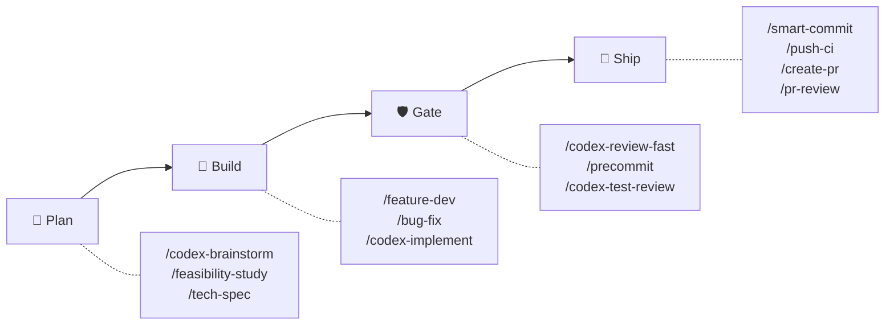

# sd0x-dev-flow


**언어**: [English](README.md) | [繁體中文](README.zh-TW.md) | [简体中文](README.zh-CN.md) | [日本語](README.ja.md) | 한국어 | [Español](README.es.md)

> Claude Code를 위한 harness 레이어.

**모델이 경로를 선택하게 하고, "완료"는 검증 가능하게 유지합니다.**

Claude는 테스트로 고정된 닫힌 anchor 집합 안에서 재량을 가집니다. v5부터는 시작 시 작은 규칙 핵심만 로드하고, 세부 절차는 해당 상황이 되었을 때 읽습니다. hook은 compaction 이후에도 유지되는 digest 기반 reminder이고, Codex는 독립적으로 리뷰합니다.

Claude Code에서는 전체 control plane을 제공합니다. Codex CLI와 기타 호환 에이전트에는 skills-only 배포를 제공합니다.

<!-- BEGIN:HERO-COUNT -->
101 bundled · 101 public skills · 16 agents — 세부 절차는 필요할 때 로드
<!-- END:HERO-COUNT -->

[](LICENSE) [](https://www.npmjs.com/package/skills)

## 빠른 시작

```text
# Claude Code — 전체 control plane
/plugin marketplace add sd0xdev/sd0x-harness
/plugin install sd0x-dev-flow@sd0xdev-marketplace

# 프로젝트 설정
/project-setup
```

하나의 명령어로 프레임워크, 패키지 매니저, 데이터베이스, 엔트리포인트, 스크립트를 자동 감지합니다. Rules와 Hooks의 서브셋을 설치하며, 전체 플러그인에는 16개 Rules + 7개 Hooks가 포함됩니다. `--lite`를 사용하면 CLAUDE.md만 설정합니다 (Rules/Hooks 스킵).

```bash
# Codex CLI / Cursor / Windsurf / Aider — skills만
npx skills add sd0xdev/sd0x-harness
```

이어서 Codex CLI 안에서 AGENTS.md 커널을 생성하고 `commit-msg` hook을 설치합니다. `pre-push` 게이트는 opt-in이며, 함께 설치하려면 `--with-push-gate`를 붙이세요:

```text
$codex-setup init
```

<!-- BEGIN:INSTALL-COVERAGE -->
| 방법 | 지원 도구 | 커버리지 |
|------|----------|---------|
| 플러그인 설치 | Claude Code | 전체 (101 bundled skills, hooks, rules, auto-loop) |
| `npx skills add` | Codex CLI, Cursor, Windsurf, Aider | Skills만 (101 public skills) |
| `$codex-setup init` | Codex CLI | AGENTS.md 커널 + commit-msg hook (pre-push 게이트는 opt-in) |
<!-- END:INSTALL-COVERAGE -->

**요구 사항**: Claude Code 2.1+ | Node.js 18+ | `jq`(`pre-edit-guard`와 `post-edit-format`이 hook 페이로드를 이것으로 파싱합니다 — `jq`가 없으면 둘 다 exit 0 하므로, 민감 경로 가드와 자동 포매팅이 조용히 꺼집니다) | [Codex CLI](https://github.com/openai/codex)(플러그인 설치에는 선택 사항입니다. `/codex-*` 리뷰 게이트의 기본 리뷰어이며, `codex_fail`(어댑터의 `start` 또는 `resume` exit 1)일 때만 컨트랙트를 인지하는 폴백 리뷰어가 같은 메커니즘으로 게이트를 이어받아 패밀리 컨트랙트에 따라 fail-closed로 동작하고 `[REVIEWER_FALLBACK]`을 기록합니다. 어댑터를 찾지 못했거나 설정 오류이거나 실행이 끝나지 않았거나 `alloc`/`cleanup`이 실패한 경우에는 폴백을 보내지 않고, 마커도 기록하지 않으며, 게이트를 열어 둡니다. 모든 대체 리뷰어가 유효한 판정을 내리지 못한 경우에만 리뷰가 판정 대신 `⚠️ Need Human`을 냅니다)

### Codex exec 설정

리뷰 루프는 작은 어댑터를 통해 `codex exec` 와 통신합니다. **등록할 MCP 서버는 없습니다** —— 이 플러그인은 더 이상 `codex mcp-server` 를 거쳐 디스패치하지 않습니다.

**1. 셸에서** — Codex CLI(>= 0.149.0)를 설치하고 로그인합니다:

```bash
codex --version
```

**2. Claude Code에서** — 트랜스포트 어댑터를 프로젝트에 설치합니다. 셸 명령이 아니라 슬래시 명령이며,
터미널에 입력하면 절대 경로를 실행하려고 합니다:

```text
/sd0x-dev-flow:install-scripts codex-exec.js
```

2단계는 선택 사항입니다. 어댑터가 필요한 첫 리뷰가 `precommit-fast` 가 러너에 사용하는 것과 같은 3단계 조회로 자동 설치합니다. 설치가 리뷰 도중에 일어나지 않기를 원할 때만 직접 실행하세요.

**모델과 추론 강도는 이제 등록 명령이 아니라 Codex 프로필에 있습니다.** `rules/auto-loop-project.md` 에 이름을 지정합니다:

```markdown
## Codex Profile

review
```

이 이름은 `$CODEX_HOME/<name>.config.toml` 로 해석됩니다 —— `codex exec -p` 가 기본 사용자 설정 위에 얹는 profile-v2 형식입니다(`codex exec --help`: "Layer `$CODEX_HOME/<name>.config.toml` on top of the base user config"). 따라서 `model_reasoning_effort = "high"` 를 담은 `review` 프로필은 이전 `-c` 재정의와 같은 깊이를 리뷰 루프에 주면서, 대화형 Codex 세션에는 영향을 주지 않습니다. `## Codex Profile` 을 비워 두어도 됩니다. 그러면 어댑터는 `-p` 를 전달하지 않고 Codex 가 자체 기본 설정을 사용합니다.

sandbox 와 approval policy 는 디스패치마다 어댑터가 직접 고정하므로 설정 단계의 결정이 아닙니다 —— 전체 계약은 `skills/codex-code-review/references/codex-transport.md` 를 보세요.

## 왜 v4인가

프론티어 모델은 이제 계획하고, 배치하고, 구조화된 상태로부터 복구할 수 있습니다 — 더 이상 harness가 다음 명령어 하나하나를 지시할 필요가 없습니다. v4는 **choreography에서 contracts로** 이동합니다: harness는 모델의 행동을 스크립트하는 것을 멈추고, 작업이 완료로 선언될 때 무엇이 참이어야 하는지를 정의하기 시작했습니다 — 단 하나의 안전·리뷰 anchor도 완화하지 않은 채로요.

| 차원 | v3 (choreography) | v4 (contracts) |
|------|-------------------|----------------|
| Hook의 역할 | 다음에 실행할 명령어를 내보냄 | Reminder + `[AUTO_LOOP_STATE]` 사실을 출력 — 변경 클래스, plane별 verdict 상태 |
| 완료 | 스크립트된 단계 시퀀스 ("수정 → 즉시 재리뷰") | 종결 완료 불변식(terminal completion invariant): 변경 클래스가 요구하는 모든 gate가 마지막 편집 이후 통과했어야 함 |
| 규칙의 강제력 | 균일 — 모든 규칙이 의무로 읽힘 | 3개 tier: **Anchor** (절대 이탈 불가), **Default** (신호를 명시하고 이탈 가능), **Guidance** (권고) |
| 리뷰 깊이 | 기본적으로 최대 | 위험도에 비례하는 tier (`fast` / `standard` / `thorough`); 보안과 데이터 무결성은 항상 상향 |
| 정체 감지 / 라운드 상한 도달 | 사람에게 인계 | 첫 발화: 구조화된 자가 진단 + 한 번의 제한된 조정 후 재개 — 단, human exit가 적용되는 경우는 예외 (보안/데이터 무결성, 아키텍처 수준 변경, 요구사항 모호성); 진단 이후 같은 변경이 다시 상한에 도달하면: 항상 사람에게 |

양보할 수 없는 핵심은 **닫힌 Anchor Register**(`rules/discretion.md`)에 있으며, 어떤 프로젝트 오버라이드도 이를 다운그레이드할 수 없습니다 — 해석은 Anchor 우선이고, Register 항목이 제거되면 테스트 스위트가 의도적으로 실패합니다. 그 경계 안에서 소유권은 명시적입니다:

| 소유자 | 소유 범위 |
|--------|-----------|
| **모델** | 배치, 타이밍, 리뷰 깊이 상향, Default tier 이탈 (명시한 뒤 계속 작업) |
| **Harness** | Digest 기반 reminder 상태, git 레벨 가드 (`commit-msg`는 `/codex-setup init`이 설치, `pre-push`는 opt-in), 닫힌 anchor 집합 |
| **사람** | 되돌릴 수 없는 승인 (push, commit, merge)과 열거된 exit 지점 |

모델은 경로를 소유합니다. Harness는 증거와 양보할 수 없는 경계를 소유합니다. 사람은 되돌릴 수 없는 권한을 보유합니다.

## 왜 v5인가

**권장 모델: Claude Opus 5.5 이상.** 3.x 계열은 지원 중단(deprecated)되었으며 Claude Opus 4.8 이전 모델에만 적합합니다.

v4가 바꾼 것은 *누가 경로를 고르는가*입니다. 모델은 닫힌 anchor 집합 안에서 스스로 경로를 정합니다. v5가 바꾸는 것은 *절차적 지시가 언제 context에 들어오는가*입니다. 세션이 시작부터 지니는 모든 내용은 작업과 주의를 다투므로, 5.0은 작업이 무엇인지 알기 전부터 성립해야 하는 것 — Anchor Register, 게이트, tier, contract 색인 — 만 시작 시 남기고, 단계별 절차는 해당 상황이 되었을 때 읽는 contract로 옮겼습니다.

| 로드 경로 | 로드되는 것 | 시점 |
|-----------|-------------|------|
| **시작 시 핵심** | `CLAUDE.md`와 `paths:` frontmatter가 없는 플러그인 규칙 9개, 그리고 경로가 지정되지 않은 `*-project.md` 오버라이드 | 매 세션 시작 시 |
| **경로 지정 규칙** | `testing.md`, `docs-writing.md`, `docs-numbering.md`, `override-contract.md`, `testing-project.md` | Claude가 일치하는 파일을 읽거나 편집할 때 |
| **Contract** | `skills/*/references/` 아래의 세부 절차: 리뷰 루프, 범위, push 승인, 테스트, 문서 | 상황을 인식하고 해당 contract를 읽을 때. `CLAUDE.md`의 § Contract Triggers 표가 8가지 상황을 각 contract에 대응시킵니다 |

- **읽기에 실패하면 그 contract가 관할하는 작업은 멈춥니다.** 기억에 의존해 진행하지 않습니다. contract는 플러그인과 함께 배포되므로, 플러그인 없이 프로젝트에 규칙만 복사하면 읽을 것이 없습니다.
- **경로 일치는 자동이지만 contract는 그렇지 않습니다.** 트리거 표, 상주 규칙의 안내, 작업을 실행하는 skill, 또는 reminder 사실에 담긴 참고용 `procedure_hint`를 통해 읽힙니다.
- **예산은 측정된 값입니다.** 새 설치를 프로젝트 값으로 렌더링했을 때 플러그인이 관리하는 시작 시 핵심은 5.0.0에서 49,614자 / 582줄이며, `test/rules/residency-budget.test.js`가 50,000 / 600 이하로 유지합니다. 이는 상주 텍스트가 줄었다는 뜻이며, 모델의 준수 정도가 측정상 달라졌다고 주장하지는 않습니다.

각 Anchor가 금지하거나 허용하는 내용은 바뀌지 않았고, 리뷰·`/precommit`·문서 리뷰도 이전과 같은 시점에 실행됩니다.

**설치된 프로젝트 업그레이드**: 플러그인을 업데이트하고 `/install-rules --all`을 실행한 뒤, 플러그인의 `CLAUDE.template.md`에 있는 § Contract Triggers를 `.claude/CLAUDE.md`에 복사하세요. `*-project.md`는 수정할 필요가 없습니다. 블록별 4.x → 5.0 대응과 전후 측정값은 [CHANGELOG.md](CHANGELOG.md#500--rules-load-on-demand)에 있습니다.

## 4.4의 새로운 변화

> **4.4.0**으로 업그레이드한 후 review 품질 저하——실제 결함이 통과하거나, 수렴이 지나치게 빨라지는 현상——를 발견하면 [issue를 열어](https://github.com/sd0xdev/sd0x-harness/issues) 알려주세요. 이 릴리스는 review의 **판단 방식** 자체를 바꾸므로, 실사용 보고만이 검증 수단입니다.

**쉽게 말하면**: 지금까지 auto-loop는 review가 한없이 깊게 파고들도록 허용했습니다——reviewer가 약한 테스트를 지적하면, 수정이 더 강한 가드를 추가하고, 다음 라운드가 그 가드를 공격하는 재귀였습니다. 실측 사례: 9라운드 review에서 blocking 지적 8건 중 7건이 **테스트 가드 자체의 강도**에 대한 것이었고, 납품된 변경에 대한 지적은 없었습니다. 4.4는 선을 긋습니다: 어떤 성질이 실제 경로에서 양방향으로 증명된 뒤에는, 그 성질에 대한 추가 강화를 AC나 보안 불변식이 요구하지 않는 한 비차단으로 취급합니다.

| 변경 | 이전 | 이후 |
|------|------|------|
| Assurance 경계 | 가드에는 언제나 '가드의 가드'를 요구할 수 있었음 | 거부형 테스트가 실제 경로에서 양방향을 증명——**대표적 증명이 경계**. 그 이상의 강화는 AC나 보안 불변식이 명시적으로 요구하지 않는 한 비차단 Nit |
| Prevention 필드 | '수정마다 방어물을 하나 더 추가하라'로 읽힘——나선의 씨앗 | 어떤 기존 컨트롤이 이 클래스를 잡는지에 대한 **설명**. 보통은 수정에 동봉되는 회귀 테스트 |
| Review dispatch | 재파견이 '다음엔 X를 공격' 지시를 누적하며 라운드마다 reviewer를 더 깊이 유도 | **고정 3부 계약**: 동결된 작업(작업·baseline·AC·사용자 지정 focus) + 현재 사실 + 고정 리뷰 계약——공격 리스트는 금지 패턴 |
| Reviewer 프레이밍 | '문제 찾기에 집중' | '**실질적 결함**에 집중'——assurance boundary 추가, 개방형 gap check를 boundary check로 교체 |
| 설계 사고 | 코드가 존재한 뒤 review에 위임 | 작성 시점의 넛지: 형태가 자명하지 않으면 선택한 가장 단순한 설계와 이유를 한 줄로——질문이지 할당량이 아님 |

**옳다고 믿는 근거** (그럼에도 보고가 필요한 이유): [IFScale](https://arxiv.org/abs/2507.11538)은 동시 지시 수를 10에서 500까지 늘렸을 때의 모델별 준수도 저하를 측정했고, [context rot](https://www.trychroma.com/research/context-rot) 연구는 더 긴 context와 주제가 유사한 방해 콘텐츠가 신뢰성을 낮춘다는 것을 밝혔으며, [Vercel agent evals](https://vercel.com/blog/agents-md-outperforms-skills-in-our-agent-evals)는 상시 로드되는 문서 색인이 100%를 기록한 반면 명시적 트리거 지시가 붙은 skill은 79%에 그쳤음을 측정했습니다——지시 부하와 불명확한 계약에는 측정 가능한 비용이 있습니다. auto-loop 코어는 그대로입니다: terminal completion invariant, 편집 시 게이트 재개방, sub-threshold 규율, 정체 진단, 모든 안전 anchor가 원형 그대로 유지됩니다.

## 이 harness가 하는 일

> [Harness engineering](https://martinfowler.com/articles/exploring-gen-ai/harness-engineering.html)은 LLM 모델 자체를 학습시키는 것이 아니라, LLM 주변의 모든 것 — tool loop, context 관리, hook, 상태 머신, 안전 레이어 — 을 엔지니어링하는 분야입니다. Mitchell Hashimoto가 2026년 2월에 이 용어를 만들었고, [Anthropic engineering](https://www.anthropic.com/engineering/effective-harnesses-for-long-running-agents)과 [Martin Fowler](https://martinfowler.com/articles/exploring-gen-ai/harness-engineering.html)가 이를 주제로 글을 발표했으며, [arXiv 2603.05344](https://arxiv.org/html/2603.05344v1)가 이를 형식화합니다.

sd0x-dev-flow는 그 reference implementation입니다. 아래 각 행은 harness의 표준 하위 문제를 실제로 연구할 수 있는 코드에 매핑합니다:

| # | Harness 하위 문제 | sd0x-dev-flow 구현 | 코드 근거 |
|---|-------------------|---------------------|-----------|
| 1 | **Tool loop 제어** | 종결 완료 불변식 — 변경 클래스가 요구하는 모든 gate는 마지막 편집 이후 통과해야 하며, 언제 어떻게 실행할지는 모델이 선택 | [`rules/auto-loop.md`](rules/auto-loop.md) + [`scripts/review-state.js`](scripts/review-state.js) |
| 2 | **Digest 기반 reminder 상태** | Verdict는 모델이 기록하고(`node scripts/review-state.js note <plane> <pass\|fail>`) tree digest에 바인딩됩니다 — 편집하면 digest가 바뀌므로 해당 plane의 reminder가 다시 열립니다; gate sentinel(`✅ Ready` / `## Overall: ✅ PASS`)은 동작 레이어 신호로 유지 | [`scripts/review-state.js`](scripts/review-state.js) + [`rules/auto-loop.md`](rules/auto-loop.md) (§ Gate Sentinels, § Enforcement) |
| 3 | **Context 압축 후 복구** | SessionStart(compact) 이후 git baseline(브랜치 + 미커밋 파일)과 미완료 gate reminder를 재주입 | [`hooks/post-compact-auto-loop.sh`](hooks/post-compact-auto-loop.sh) |
| 4 | **Lifecycle interceptor** | 5가지 hook event type을 7개 스크립트로 디스패치 — 4개의 권고형 reminder hook, 1개의 자동 포매터, 2개의 차단형 가드(민감 경로 편집, 잘못 실행된 Codex dispatch)(SessionStart는 추가로 `scripts/namespace-hint.sh`를 실행): PreToolUse / PostToolUse / Stop / SessionStart / UserPromptSubmit | [`hooks/`](hooks/) (7개 스크립트) + [`.claude/settings.json`](.claude/settings.json) |
| 5 | **Capability 기반 tool gating** | Skill frontmatter의 `allowed-tools` — 예: `/ask`는 Edit/Write 없음 | 공개된 101개 skill 중 93개가 `allowed-tools`를 선언 |
| 6 | **Defense-in-depth 안전장치** | 설치된 git 레벨 가드는 그대로 강제됩니다 — commit-msg-guard는 `/codex-setup init`으로 설치한 곳에서 작동하고(Claude 플러그인과 `/project-setup`으로는 설치되지 않음), `/dev/tty`를 통한 pre-push-gate는 opt-in한 경우에 작동합니다; 편집 시점의 pre-edit-guard는 민감 경로 편집을 여전히 차단하고(보안 가드이며 워크플로 강제가 아님 — `jq`가 필요하며, jq가 없으면 가드가 작동하지 않음), Stop hook은 reminder를 출력합니다 — 되돌릴 수 없는 동작을 막는 레이어는 강제력을 유지하고, 리뷰 레이어는 의도적으로 권고형이 되었습니다 | [`scripts/pre-push-gate.sh`](scripts/pre-push-gate.sh) + [`scripts/commit-msg-guard.sh`](scripts/commit-msg-guard.sh) + [`hooks/stop-guard.sh`](hooks/stop-guard.sh) |
| 7 | **Generator-evaluator 분리** | Codex가 Claude의 결과물을 리뷰하며 저장소를 직접 조사 — 결론을 건네받아 승인만 하는 일은 없음 | [`rules/codex-invocation.md`](rules/codex-invocation.md) + [`rules/auto-loop.md`](rules/auto-loop.md) (Review Dispatch) |
| 8 | **점진적 진행 추적** | 증거 기반 정체 규율: finding을 하나도 닫지 못한 리뷰 라운드가 3회 연속되면 — 모델이 리뷰 리포트로부터 직접 셉니다 — 구조화된 정체(stall) 분류와 한 번의 제한된 조정을 트리거합니다. Tier별 라운드 예산 (기본 6 / 15 / 30, 3–50으로 오버라이드 가능) 은 폭주 방지용 백스톱으로 물러나며, 첫 상한 도달 시에도 같은 진단을 수행하고, human exit는 열거되어 있음 | [`rules/auto-loop.md`](rules/auto-loop.md) (§ Stall Detection and Diagnosis; 자세한 내용은 `skills/codex-code-review/references/loop-diagnostics.md`) |
| 9 | **Human-in-the-loop 안전 게이트** | 모든 `/push-ci` push 전 `AskUserQuestion` 승인 — 이 승인은 항상 필요하며, opt-in인 `pre-push` hook이 없거나 hook이 묻지 않는 경우에는 그것이 인가의 전부입니다. hook이 설치되어 있으면 두 경우에 `/dev/tty`로 묻습니다: 보호 브랜치로의 push, 그리고 다른 사람이 가지고 있을 수 있는 ref를 다시 쓰는 push(unshared 확인). lease 없는 non-fast-forward push는 그 둘보다 먼저 거부됩니다 | [`scripts/pre-push-gate.sh`](scripts/pre-push-gate.sh) + [`authorization-contract.md`](skills/push-ci/references/authorization-contract.md) |
| 10 | **자기 개선 루프** | 지적 → lesson 기록 → 3회 이상 재발 시 rule로 승격 | [`rules/self-improvement.md`](rules/self-improvement.md) |
| 11 | **Instruction residency** | 측정된 시작 시 핵심(Anchor Register, 게이트, tier, contract 색인)과, 해당 상황에서 읽는 contract에 둔 세부 절차. 읽기에 실패하면 관할하는 작업이 멈춥니다([왜 v5인가](#왜-v5인가)) | [`residency-manifest.json`](docs/features/rules-residency/residency-manifest.json) + [`residency-budget.test.js`](test/rules/residency-budget.test.js) + [`CLAUDE.template.md`](CLAUDE.template.md) (§ Contract Triggers) |

각 행은 그것을 구현한 코드로 연결되므로, 이 저장소는 단순한 도구가 아니라 연구 대상으로도 활용할 수 있습니다.

## 작동 원리



모든 것은 하나의 규칙을 중심으로 돌아갑니다 — **종결 완료 불변식(terminal completion invariant)**: 어떤 변경에 대한 작업은, 해당 변경 클래스가 요구하는 모든 gate가 *그 클래스의 마지막 편집 이후* 통과했을 때에만 완료로 선언될 수 있습니다. 코드 편집은 독립적인 리뷰 — 기본은 Codex, Codex를 사용할 수 없으면 검증된 컨트랙트 인지 폴백 리뷰어 — 후 `/precommit`을 요구하고, `.md` 문서는 `/codex-review-doc`을 요구합니다. 언제 실행할지, 편집을 어떻게 배치할지, 얼마나 깊이 리뷰할지는 모델의 판단입니다 — 불변식은 choreography가 아니라 최종 상태를 제약합니다.

Hooks는 **명령이 아니라 사실**을 보고합니다: reminder와 `[AUTO_LOOP_STATE]` 사실 라인(변경 클래스, plane별 verdict 상태)을 출력하고, 결정은 모델이 소유합니다. 무엇이 blocking인지는 tier가 결정합니다(`fast` P0 · `standard` P0/P1 · `thorough` P0/P1/P2). 그 기준 아래의 findings는 기록만 하고 루프는 새 라운드를 여는 대신 그대로 진행합니다. 정체 — 아무것도 닫지 못한 리뷰 라운드 3회 연속, 모델이 직접 셉니다 — 또는 백스톱으로서의 라운드 상한 도달이 구조화된 자가 진단(아키텍처 문제인가? 문서가 너무 긴가? 주의 분산인가?)과 한 번의 제한된 조정을 촉발하고, 그 뒤 루프가 재개됩니다 — 자동으로 사람에게 인계하는 것이 아닙니다. 어느 trigger로 발화했든 human exit는 그대로 유효합니다 (보안과 데이터 무결성 변경은 진단을 아예 건너뛰고, 아키텍처 수준이나 요구사항 모호성으로 진단된 정체는 사람에게 갑니다).

강제(enforcement) 모드는 없습니다 (hook-lightweighting, 2026-08-13): 모든 리뷰 레이어 hook은 exit 0으로 끝나는 reminder입니다. Verdict를 확립하는 것은 리뷰어의 리포트이며, 모델은 그것을 기록하여(`node scripts/review-state.js note <plane> <pass|fail>`, digest 바인딩 — 편집하면 해당 plane이 다시 열립니다) reminder를 닫습니다. 기록되지 않은 verdict도 여전히 유효하며, 단지 reminder가 계속 울릴 뿐입니다. reminder를 정직하게 잠재우는 방법은 gate를 실행하고 결과를 기록하는 것입니다. 리뷰 레이어 밖의 가드는 여전히 유효합니다: pre-edit-guard는 민감 경로 편집을 여전히 차단하고(`jq`가 있을 때 — 없으면 가드가 작동하지 않음), 설치된 git 레벨 가드는 그대로 강제됩니다(commit-msg-guard는 `/codex-setup init`으로 설치, pre-push-gate는 opt-in).

두 번째 리뷰어는 `/codex-review-branch --dual`로 쓸 수 있고 기본값은 비활성입니다. Hook과 의존성에 대한 자세한 내용은 [docs/hooks.md](docs/hooks.md)를 참조하세요.

<details>
<summary>상세: 리뷰 루프 시퀀스 다이어그램</summary>

```mermaid
sequenceDiagram
    participant D as Developer
    participant C as Claude
    participant X as Codex exec
    participant H as Hooks

    D->>C: Edit code
    H->>H: Reminder state re-opens (digest changed)
    C->>X: Codex review (sandbox, researches repo itself)
    X-->>C: Findings + gate sentinel
    C->>C: note the verdict (review-state.js)
    C->>C: Gate on the tier's blocking severity

    alt Blocking findings
        C->>C: Fix them (sub-threshold: log and move on)
        alt R-a 임계값(리플라이 3회; override 2–6) 또는 R-b 컨텍스트 초과
            C->>X: 새 스레드에서 새 첫 디스패치(동결 baseline 동반)
            X-->>C: 새 리포트
            C->>C: 이전 findings를 새 리포트에 대조하고 gate 재도출
            C->>C: [THREAD_ROTATED] 기록(old → new threadId)
        else 임계값 미만
            C->>X: codex exec resume <threadId>
            X-->>C: 재검증
        end
        Note over C,X: 로테이션은 동결된 scope baseline을 유지; 스톨 연속 카운트와 라운드 상한은 리셋되지 않음
    end

    C->>C: /precommit (auto)
    C-->>D: ✅ All gates passed

    Note over H: Stop: owed gates re-reminded — never blocked
```

</details>

## 기능 하이라이트: 티어별 리뷰

기본 리뷰어는 어디서나 Codex 하나뿐입니다. **tier**가 해당 변경에 얼마만큼의 엄격함을 적용할지, 그리고 finding이 얼마나 심각해야 루프를 다시 여는지를 결정합니다:

| Tier | 대상 | Blocking | 라운드 상한 |
|------|------|----------|------------|
| `fast` | 문서, 설정, 위험이 낮은 소규모 편집 | P0 | 6 |
| `standard` **(기본값)** | 일반적인 기능 개발과 버그 수정 | P0, P1 | 15 |
| `thorough` | 보안, 데이터 무결성, 릴리스, 공개 API | P0, P1, P2 | 30 |

설정된 tier는 상한선이 아니라 기준선(baseline)입니다 — 변경이 그럴 만하면 모델이 상향하고, 보안이나 데이터 무결성 변경은 무엇이 설정되어 있든 항상 `thorough`로 리뷰됩니다.

**80점이면 합격입니다.** tier의 blocking 기준 아래 findings는 기록되고(`[NIT_DEFERRED]` — 리뷰 리포트 안의 보고 규약일 뿐, 아무것도 이를 저장하지 않습니다) 루프는 곧바로 `/precommit`으로 진행합니다. 추가 수정 패스도, 추가 리뷰 라운드도 없습니다. 이 항목들은 다음에 `/codex-review-branch`로 깊이 리뷰할 때 다시 다뤄집니다.

위의 라운드 상한은 의도적으로 느슨합니다. **상한은 수렴 중인 루프와 헛도는 루프를 구별하지 못하기** 때문입니다 — 둘 다 같은 숫자에서 멈춥니다. 구별해 주는 것은 증거입니다: 아무 finding도 닫지 못한 리뷰 라운드가 3회 연속되면 — 모델이 리뷰 리포트로부터 직접 세며, 보통 상한 도달보다 훨씬 이릅니다 — 아래의 진단이 촉발됩니다. 상한은 폭주 방지용 백스톱으로 남습니다.

위의 라운드 상한은 tier 기본값입니다 — 프로젝트의 `## Max Rounds` 오버라이드(3–50)가 우선합니다. 상한 도달은 자동 인계가 아니라 진단 시점입니다: 모델이 정체를 분류하고(아키텍처, 문서 과다 길이, 주의 분산, 미검증 주장, tier 불일치, 요구사항 모호성), 한 번의 제한된 조정을 한 뒤 재개합니다. 어느 trigger로 발화했든 human exit는 그대로 구속력이 있습니다: 보안/데이터 무결성 변경은 진단을 건너뛰고 곧바로 사람에게 가고, 아키텍처 수준이나 요구사항 모호성으로 분류된 정체는 사람에게 exit하며, 진단 이후 같은 변경이 두 번째로 상한에 도달하면 항상 사람에게 갑니다. (아키텍처 수준 변경, 기능 제거, 사용자의 중단 요청은 상한과 무관하게 언제든 사람에게 exit합니다.)

두 번째 리뷰어는 `/codex-review-branch --dual`로 쓸 수 있고 **플래그를 넘기지 않으면 비활성**입니다 — 토큰과 실제 소요 시간이 두 배가 되므로 릴리스나 보안 리뷰에는 값어치를 하지만 일상적인 수정에는 그렇지 않습니다. `--dual`에서는 findings에 심각도 정규화, 중복 제거(파일 + 이슈 키, ±5줄 허용), 소스 귀속이 적용됩니다.

Gate: `✅ Ready` 또는 `⛔ Blocked` — 모델이 따라 행동하는 동작 레이어 신호이며, verdict는 reminder 상태에 기록됩니다.

## 사용 시나리오

| 적합 | 부적합 |
|------|--------|
| Claude Code를 사용하는 개인/소규모 팀 프로젝트 | Claude Code를 전혀 사용하지 않는 팀 |
| 자동화된 리뷰 게이트가 필요한 프로젝트 | CI가 없는 일회성 스크립트 |
| Codex CLI / Cursor / Windsurf 사용자 (skills 서브셋) | 커스텀 LLM 프로바이더가 필요한 프로젝트 |
| 품질 게이트로 리그레션을 방지하는 리포지토리 | 테스트 인프라가 없는 리포지토리 |

## 워크플로 트랙

| 워크플로 | 명령어 | Gate | 상태 |
|----------|--------|------|------|
| 기능 개발 | `/feature-dev` → `/verify` → `/codex-review-fast` → `/precommit` | ✅/⛔ | Digest 기반 reminder (verdict 기록) |
| 버그 수정 | `/issue-analyze` → `/bug-fix` → `/verify` → `/precommit` | ✅/⛔ | Digest 기반 reminder (verdict 기록) |
| Auto-Loop | 코드 편집 → `/codex-review-fast` → `/precommit` | ✅/⛔ | Digest 기반 reminder (verdict 기록) |
| 문서 리뷰 | `.md` 편집 → `/codex-review-doc` | ✅/⛔ | Digest 기반 reminder (verdict 기록) |
| 기획 | `/codex-brainstorm` → `/feasibility-study` → `/tech-spec` | — | — |
| 온보딩 | `/project-setup` → `/repo-intake` | — | — |

```mermaid
flowchart TD
    subgraph feat ["🔨 Feature Development"]
        F1["/feature-dev"] --> F2["Code + Tests"]
        F2 --> F3["/verify"]
        F3 --> F4["/codex-review-fast"]
        F4 --> F5["/precommit"]
        F5 --> F6["/update-docs"]
    end

    subgraph fix ["🐛 Bug Fix"]
        B1["/issue-analyze"] --> B2["/bug-fix"]
        B2 --> B3["Fix + Regression test"]
        B3 --> B4["/verify"]
        B4 --> B5["/codex-review-fast"]
        B5 --> B6["/precommit"]
    end

    subgraph docs ["📝 Docs Only"]
        D1["Edit .md"] --> D2["/codex-review-doc"]
        D2 --> D3["Done"]
    end

    subgraph plan ["🎯 Planning"]
        P1["/codex-brainstorm"] --> P2["/feasibility-study"]
        P2 --> P3["/tech-spec"]
        P3 --> P4["/codex-architect"]
        P4 --> P5["Implementation ready"]
    end

    subgraph ops ["⚙️ Operations"]
        O1["/project-setup"] --> O2["/repo-intake"]
        O2 --> O3["Develop"]
        O3 --> O4["/project-audit"]
        O3 --> O7["/best-practices"]
        O3 --> O5["/risk-assess"]
        O4 --> O6["/next-step --go"]
        O5 --> O6
        O7 --> O6
    end
```

<details>
<summary>시각화: 워크플로 플로차트</summary>



</details>

## 쿡북

어떤 스킬을 어떤 순서로 조합하면 좋은지 보여주는 실전 시나리오입니다.

| 시나리오 | 흐름 | 문서 |
|----------|------|------|
| 레포지토리 온보딩 첫날 | `/project-setup` → `/repo-intake` → `/next-step` | [→](docs/cookbook/first-day.md) |
| 새 기능 구현 | `/feature-dev` → `/verify` → `/codex-test-review` → `/codex-review-fast` → `/precommit` | [→](docs/cookbook/new-feature.md) |
| PR 리뷰 코멘트 반영 | `/load-pr-review` → 수정 → `/codex-review-fast` → `/push-ci` | [→](docs/cookbook/pr-review-comments.md) |
| 머지 전 보안 점검 | `/codex-security` → `/dep-audit` → `/risk-assess` → `/pre-pr-audit` | [→](docs/cookbook/security-pre-merge.md) |
| **주요 콤보:** 방향성 검증 | `/deep-research` → `/best-practices` → `/feasibility-study` → `/codex-brainstorm` | [→](docs/cookbook/validate-direction.md) |
| **주요 콤보:** 적대적 설계 | `/codex-brainstorm` (내쉬 균형 토론) → `/codex-architect` | [→](docs/cookbook/adversarial-design.md) |

[전체 10개 시나리오 →](docs/cookbook/)

## 포함 내용

<!-- BEGIN:WHATS-INCLUDED-COUNT -->
| 카테고리 | 수량 | 예시 |
|----------|------|------|
| Skills | 101 public (101 bundled) | `/project-setup`, `/codex-review-fast`, `/verify`, `/smart-commit`, `/deep-research` |
| Agents | 16 | strict-reviewer, verify-app, coverage-analyst, architecture-designer |
| Hooks | 7 | pre-edit-guard, pre-bash-codex-launch-guard, auto-format, stop reminder, post-compact-auto-loop, post-skill-auto-loop, user-prompt-review-guard |
| Rules | 16 | auto-loop, auto-loop-project, codex-invocation, scope-discipline, security, testing, git-workflow, self-improvement, context-management |
| Scripts | 25 | precommit runner, verify runner, review-state CLI, dep audit, namespace hint, skill runner, commit-msg guard, pre-push gate, protected-branch resolver, build-codex-artifacts, resolve-feature (node entrypoint + shell shim + CLI), classify-docs, detect-scope, migration-audit, migrate-hook-lightweighting, security-redact, readme-catalog, check-doc-links, resolve-review-profile, instruction-budget, codex-exec adapter |
<!-- END:WHATS-INCLUDED-COUNT -->

### 최소한의 Context 사용량

새 설치를 프로젝트 값으로 렌더링했을 때 플러그인이 관리하는 시작 시 핵심은 5.0.0에서 **49,614자 / 582줄**로 측정되며, `test/rules/residency-budget.test.js`가 50,000 / 600 이하로 유지합니다. 무엇이 들어 있는지는 [왜 v5인가](#왜-v5인가)를 참고하세요. 경로 지정 규칙, contract, skill 본문, agent는 사용될 때만 로드됩니다.

자신의 프로젝트(여러분의 `CLAUDE.md`, 오버라이드, 플러그인 몫의 합계)를 측정하려면 `/claude-health --scope budget`을 실행하세요. Claude Code의 시작 시 계산 방식(2.1.281에서 측정)을 문자 수로 재현하며, 비교하는 한도는 모델에 따라 달라지는 추정값이지 실시간 토큰 수가 아닙니다.

## 스킬 레퍼런스

<!-- BEGIN:ESSENTIAL-SKILLS -->
| Skill | 사용 시기 |
|-------|----------|
| `/project-setup` | 프로젝트 최초 설정 시 |
| `/bug-fix` | 버그 수정 및 이슈 해결 시 |
| `/feature-dev` | 기능을 처음부터 끝까지 구현할 때 |
| `/smart-commit` | 스마트 그룹핑으로 커밋할 때 |
| `/push-ci` | 코드 푸시 및 CI 모니터링 시 |
| `/create-pr` | GitHub Pull Request 생성 시 |
| `/codex-review-fast` | 빠른 코드 리뷰 (diff만) |
| `/codex-review-doc` | 문서 변경 리뷰 시 |
| `/codex-security` | OWASP Top 10 보안 감사 시 |
| `/verify` | 전체 테스트 검증 체인 실행 시 |
| `/precommit` | Pre-commit 품질 게이트 (lint + build + test) |
| `/precommit-fast` | 빠른 pre-commit (lint + test, 빌드 제외) |
| `/codex-brainstorm` | 대립형 브레인스토밍 (내시 균형) |
| `/tech-spec` | 기술 스펙 작성 시 |
| `/pr-review` | 머지 전 PR 셀프 리뷰 시 |
<!-- END:ESSENTIAL-SKILLS -->

<!-- BEGIN:FULL-CATALOG -->
<details>
<summary>전체 101개 public skills</summary>

### 개발 (35)

| Skill | Description |
|-------|-------------|
| `/ask` | 컨텍스트 인식 Q&A. 자동으로 컨텍스트 정보를 수집합니다. |
| `/bug-fix` | Bug fix workflow. |
| `/bump-version` | Bump package and plugin version in sync. |
| `/code-explore` | Pure Claude code investigation. |
| `/code-investigate` | Dual-perspective code investigation. |
| `/codex-architect` | Codex architecture consulting. |
| `/codex-implement` | Implement features via Codex exec. |
| `/codex-setup` | Initialize sd0x-dev-flow infrastructure for Codex CLI and other non-Claude agents. |
| `/create-pr` | Create or update GitHub PR with gh CLI. |
| `/debug` | Interactive debugging workflow with hypothesis-driven probe loop. |
| `/deep-explore` | Multi-wave parallel code exploration orchestrator. |
| `/deploy-flow` | Run the release flow a project declares in rules/git-workflow-project.md § Deploy Workflow: its git merge steps, and ... |
| `/epic-merge` | stacked PR chain을 epic branch로 순차 squash-merge합니다. |
| `/feature-dev` | Feature development workflow. |
| `/feature-verify` | Feature verification (READ-ONLY, P0-P5). |
| `/gh-stack` | Native stacked pull requests through the github/gh-stack extension. |
| `/git-investigate` | Git history investigation. |
| `/git-profile` | Git identity and GPG signing profile manager. |
| `/install-hooks` | Install plugin hooks into project .claude/ for persistent use without plugin loaded |
| `/install-rules` | Install plugin rules into project .claude/rules/ for persistent use without plugin loaded |
| `/install-scripts` | Install plugin runner scripts into project .claude/scripts/ for persistent use without plugin loaded |
| `/issue-analyze` | GitHub Issue and PR review thread deep analysis with Codex blind verdict. |
| `/jira` | Jira integration — view issues, generate branches, create tickets, transition status. |
| `/load-pr-review` | Load GitHub PR review comments into AI session — analyze, triage, plan. |
| `/merge-prep` | Pre-merge analysis and preparation. |
| `/next-step` | Change-aware next step advisor. |
| `/post-dev-test` | Post-development test completion. |
| `/pr-comment` | Post friendly review comments to a GitHub PR — prepare locally, preview, then submit as atomic review. |
| `/project-setup` | Project configuration initialization. |
| `/push-ci` | Push to remote and monitor CI. |
| `/remind` | Lightweight model correction with context-aware rule loading. |
| `/repo-intake` | Project initialization inventory (one-time). |
| `/smart-commit` | Smart batch commit. |
| `/smart-rebase` | Smart partial rebase for squash-merge repositories. |
| `/watch-ci` | Monitor GitHub Actions CI runs until completion. |

### 리뷰 (Codex exec) (15)

| Skill | Description | 루프 지원 |
|-------|-------------|----------|
| `/codex-cli-review` | Code review via Codex CLI with full disk access. | - |
| `/codex-code-review` | Code review using Codex exec. | - |
| `/codex-explain` | Explain complex code via Codex exec. | - |
| `/codex-review` | Full second-opinion using Codex exec (with lint:fix + build). | `--continue <threadId>` |
| `/codex-review-branch` | Fully automated review of an entire feature branch using Codex exec | - |
| `/codex-review-doc` | Review documents using Codex exec. | `--continue <threadId>` |
| `/codex-review-fast` | Quick second-opinion using Codex exec (diff only, no tests). | `--continue <threadId>` |
| `/codex-security` | OWASP Top 10 security review using Codex exec. | `--continue <threadId>` |
| `/codex-test-gen` | Generate unit tests for specified functions using Codex exec | - |
| `/codex-test-review` | Review test case sufficiency using Codex exec, suggest additional edge cases. | `--continue <threadId>` |
| `/doc-review` | Document review via Codex exec. | - |
| `/plan-review` | Pre-ExitPlanMode adversarial plan review loop via Codex exec. | - |
| `/security-review` | Security review via Codex exec. | - |
| `/seek-verdict` | Independent second-opinion verification for any finding. | - |
| `/test-review` | Test coverage review via Codex exec. | - |

### 검증 (13)

| Skill | Description |
|-------|-------------|
| `/best-practices` | Industry best practices conformance audit with mandatory adversarial debate. |
| `/check-coverage` | Comprehensive assessment of Unit / Integration / E2E three-layer test coverage, identify gaps and provide actionable ... |
| `/dep-audit` | Audit dependency security risks |
| `/dev-security-audit` | Comprehensive developer workstation security audit — scans for exposed credentials, compromised application data, per... |
| `/necessity-audit` | Necessity audit for over-designed spec elements. |
| `/pre-pr-audit` | Pre-PR confidence audit with 5-dimension scoring. |
| `/precommit` | Pre-commit checks — lint:fix -> build -> test |
| `/precommit-fast` | Quick pre-commit checks — lint:fix -> test |
| `/project-audit` | Project health audit with deterministic scoring. |
| `/risk-assess` | Uncommitted code risk assessment with breaking change detection, blast radius analysis, and scope metrics. |
| `/test-deep` | Context-aware test orchestration. |
| `/test-health` | Holistic test coverage measurement. |
| `/verify` | Verification loop — lint -> typecheck -> unit -> integration -> e2e |

### 기획 (17)

| Skill | Description |
|-------|-------------|
| `/architecture` | Architecture design and documentation. |
| `/codex-brainstorm` | Adversarial brainstorming via Claude+Codex debate. |
| `/deep-analyze` | Deep-dive analysis of an initial proposal — research code implementation, produce an actionable roadmap and alternatives |
| `/deep-research` | Universal multi-source research orchestration. |
| `/feasibility-study` | Feasibility analysis from first principles. |
| `/fp-brief` | First-principles briefing from technical documents. |
| `/orchestrate` | Agent-driven workflow orchestration (v1 report-only). |
| `/post-dev-recap` | Post-development recap wrapper. |
| `/project-brief` | Convert a technical spec into a PM/CTO-readable executive summary. |
| `/recap-ask` | Interactive Q&A over an existing recap document. |
| `/recap-doc` | Post-development recap document generator. |
| `/req-analyze` | Requirements analysis — problem decomposition, stakeholder scan, requirement structuring. |
| `/request-tracking` | Request tracking knowledge base. |
| `/review-spec` | Review technical spec documents from completeness, feasibility, risk, and code consistency perspectives. |
| `/tech-brief` | Technical briefing for developer sharing. |
| `/tech-spec` | Tech spec generation and review. |
| `/ui-first-principles` | First-principles UI/IA reasoning: turns a `<scenario>` + API field set into JTBD analysis, principle-anchored field-p... |

### 문서 및 도구 (21)

| Skill | Description |
|-------|-------------|
| `/adr` | Write an Architecture Decision Record (ADR) for a feature — Context / Decision / Status / Consequences / Alternatives... |
| `/claude-health` | Claude Code config health check + plugin sync. |
| `/contract-decode` | EVM contract error and calldata decoder. |
| `/create-request` | Create, update, or scan per-task request tickets for progress tracking. |
| `/de-ai-flavor` | Remove AI artifacts from documents. |
| `/doc-refactor` | Refactor documents — simplify without losing information, visualize flows with sequenceDiagram. |
| `/generate-runner` | Generate a customized precommit runner for any ecosystem. |
| `/obsidian-cli` | Obsidian vault integration via official CLI. |
| `/op-session` | Initialize 1Password CLI session for Claude Code. |
| `/portfolio` | Portfolio system knowledge base. |
| `/pr-review` | PR self-review — review changes, produce checklist, update rules |
| `/pr-summary` | List open PRs, filter automation PRs, group by ticket ID, format as Markdown. |
| `/refactor` | Multi-target refactoring orchestrator. |
| `/runbook` | Generate/update feature release runbook |
| `/safe-remove` | Safely remove plugin assets (skill/agent/rule/script/hook) with dependency detection and reference cleanup. |
| `/sharingan` | Replicate knowledge from any source as sd0x-dev-flow skill definition. |
| `/simplify` | Wrap-up refactoring — simplify code, eliminate duplication, preserve behavior |
| `/skill-health-check` | Validate skill quality against routing, progressive loading, and verification criteria. |
| `/statusline-config` | Customize Claude Code statusline. |
| `/update-docs` | Research current code state then update corresponding docs, ensuring docs stay in sync with code. |
| `/zh-tw` | Rewrite the previous reply in Traditional Chinese |

</details>
<!-- END:FULL-CATALOG -->

## 규칙 & Hook

16개 규칙 + 7개 Hook. 규칙은 tier화된 계약입니다: 플러그인이 관리하는 규칙 파일 13개 중 `discretion.md`가 나머지 12개의 모든 지시를 Anchor / Default / Guidance 중 정확히 하나로 해석하고, 사용자 소유의 오버라이드 파일 3개는 상위 규칙 아래에서 Anchor 우선으로 해석됩니다. 플러그인 규칙 중 9개는 시작 시, 4개는 일치하는 파일을 읽을 때 로드되며, 세부 절차는 필요할 때 읽는 contract에 있습니다([왜 v5인가](#왜-v5인가), [docs/rules.md](docs/rules.md)). Hook 구성은 4개의 권고형 reminder hook에 자동 포매터 1개와 차단형 가드 2개를 더한 것입니다. reminder 역할은 hook마다 다릅니다: Stop과 post-compact hook은 digest 기반 상태(`review-state.js`)로부터 미완료 gate reminder를 렌더링하고, prompt hook은 `[AUTO_LOOP_STATE]` 사실 라인을, post-skill hook은 고정된 gate 순서 라인을 출력하며, post-compact hook은 추가로 git baseline을 재주입합니다. 리뷰 레이어는 아무것도 차단하지 않습니다 — pre-edit-guard는 민감 경로 편집을 여전히 차단하고(보안 가드, `jq` 필요 — 없으면 작동하지 않음), pre-bash-codex-launch-guard는 진행 상황을 작업 패널 밖으로 돌리는 Codex dispatch 실행을 차단하며, 강제 gate는 git 레벨에 있습니다 (commit-msg-guard는 `/codex-setup init`으로 설치, pre-push-gate는 opt-in).

> **커스터마이징**: `auto-loop-project.md`를 편집하여 프로젝트별 auto-loop 동작을 오버라이드할 수 있습니다. 플러그인 업데이트와 충돌하지 않습니다 — [Rule Override Pattern](docs/features/rule-override-pattern/2-tech-spec.md) 참조.

전체 규칙, Hook, 환경 변수 레퍼런스는 [docs/rules.md](docs/rules.md)와 [docs/hooks.md](docs/hooks.md)를 참조하세요.

## 커스터마이즈

`/project-setup`으로 모든 placeholder를 자동 감지/설정하거나, `.claude/CLAUDE.md`를 직접 편집하세요:

| Placeholder | 설명 | 예시 |
|-------------|------|------|
| `{PROJECT_NAME}` | 프로젝트 이름 | my-app |
| `{FRAMEWORK}` | 프레임워크 | MidwayJS 3.x, NestJS, Express |
| `{CONFIG_FILE}` | 메인 설정 파일 | src/configuration.ts |
| `{BOOTSTRAP_FILE}` | 부트스트랩 엔트리 | bootstrap.js, main.ts |
| `{DATABASE}` | 데이터베이스 | MongoDB, PostgreSQL |
| `{TEST_COMMAND}` | 테스트 명령어 | yarn test:unit |
| `{LINT_FIX_COMMAND}` | Lint 자동 수정 | yarn lint:fix |
| `{BUILD_COMMAND}` | 빌드 명령어 | yarn build |
| `{TYPECHECK_COMMAND}` | 타입 체크 | yarn typecheck |

오버라이드는 **Anchor 우선**으로 해석됩니다: 사용자 소유의 오버라이드 파일(`auto-loop-project.md`, `testing-project.md`, `git-workflow-project.md`)은 Default·Guidance tier 동작만 커스터마이즈합니다 — 어떤 프로젝트 오버라이드도 Anchor Register의 항목을 다운그레이드할 수 없으며, 시도하면 승인되지 않고 충돌로 보고됩니다.

## 쇼케이스: 멀티 에이전트 리서치

`/deep-research`를 실행하면 2-3개의 병렬 리서치 에이전트가 웹 소스, 코드베이스, 커뮤니티 지식을 횡단 조사합니다 — claim registry 통합과 조건부 적대적 디베이트를 지원합니다.

| 특징 | 내용 |
|------|------|
| 에이전트 | 2-3 병렬 (web + code + community) |
| 통합 | Claim registry 합의 탐지 |
| 검증 | 조건부 /codex-brainstorm 디베이트 |
| 스코어링 | 4-시그널 완전성 모델 |

[전체 문서](docs/features/deep-research/)

## 아키텍처

각각 하나의 관심사를 소유하는 6개 레이어:

| 레이어 | 소유 범위 |
|--------|-----------|
| **Skills** | 온디맨드로 로드되는 capability — 동사 역할 (`/feature-dev`, `/codex-review-fast`, …) |
| **Model** | 경로: 배치, 타이밍, 리뷰 깊이 상향, Default tier 이탈 |
| **Rules** | tier화된 계약 (Anchor / Default / Guidance): 작은 핵심은 매 세션 로드되고, 경로 지정 규칙은 일치하는 파일에서 로드되며, 세부 절차는 필요할 때 읽는 contract에 있습니다([왜 v5인가](#왜-v5인가)) |
| **Hooks + state** | Reminder + `[AUTO_LOOP_STATE]` 사실, digest 기반 verdict 기록, compaction을 넘어서는 복구 |
| **Codex** | 독립 리뷰 — 저장소를 직접 조사하며, 결론을 건네받지 않음 |
| **Scripts + agents** | 결정론적 검사 (precommit, guard)와 격리된 서브에이전트 |

고급 아키텍처에 대한 자세한 내용(agentic control stack, context 아키텍처, 제어 루프의 실패 모드, 샌드박스 규칙)은 [docs/architecture.md](docs/architecture.md)를 참고하세요. source of truth는 여전히 `rules/auto-loop.md`와 `rules/discretion.md`입니다.

## 기여

PR 환영합니다. 다음 사항을 지켜주세요:

1. 기존 네이밍 컨벤션 준수 (kebab-case)
2. 스킬에 `When to Use` / `When NOT to Use` 포함
3. 위험한 작업에는 `disable-model-invocation: true` 추가
4. 제출 전 Claude Code로 테스트

## 라이선스

MIT

## Star History

<a href="https://www.star-history.com/?repos=sd0xdev%2Fsd0x-harness&type=date&legend=top-left">
 <picture>
   <source media="(prefers-color-scheme: dark)" srcset="https://api.star-history.com/image?repos=sd0xdev/sd0x-harness&type=date&theme=dark&legend=top-left" />
   <source media="(prefers-color-scheme: light)" srcset="https://api.star-history.com/image?repos=sd0xdev/sd0x-harness&type=date&legend=top-left" />
   
 </picture>
</a>
