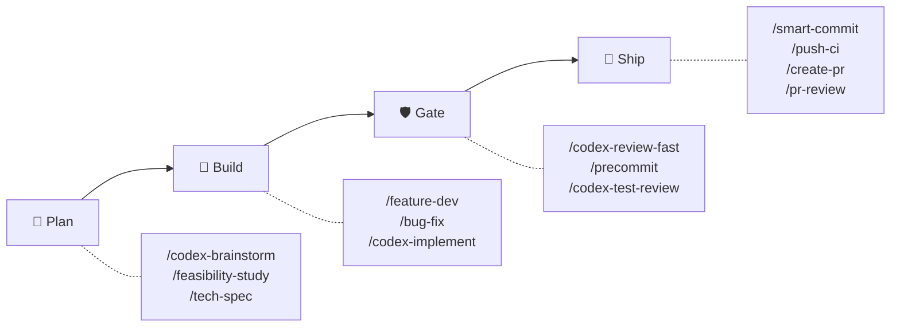

# sd0x-dev-flow


**Language**: English | [繁體中文](README.zh-TW.md) | [简体中文](README.zh-CN.md) | [日本語](README.ja.md) | [한국어](README.ko.md) | [Español](README.es.md)

> The harness layer for Claude Code.

**Let the model choose the path. Keep "done" verifiable.**

v4 gives Claude discretion inside a closed, test-pinned anchor set; hooks are digest-bound reminders that survive compaction, and Codex reviews independently.

Full control plane on Claude Code. Skills-only distribution for Codex CLI and other compatible agents.

<!-- BEGIN:HERO-COUNT -->
101 bundled · 101 public skills · 16 agents — ~4% of Claude's context window
<!-- END:HERO-COUNT -->

[](LICENSE) [](https://www.npmjs.com/package/skills)

## Quick Start

```text
# Claude Code — full control plane
/plugin marketplace add sd0xdev/sd0x-harness
/plugin install sd0x-dev-flow@sd0xdev-marketplace

# Configure your project
/project-setup
```

One command auto-detects framework, package manager, database, entrypoints, and scripts. Installs a subset of rules and hooks; the full plugin bundles 16 rules + 7 hooks. Use `--lite` to only configure CLAUDE.md (skip rules/hooks).

```bash
# Codex CLI / Cursor / Windsurf / Aider — skills only
npx skills add sd0xdev/sd0x-harness
```

Then, inside Codex CLI, generate the AGENTS.md kernel and install the `commit-msg` hook. The `pre-push` gate is opt-in — add `--with-push-gate` to install it too:

```text
$codex-setup init
```

<!-- BEGIN:INSTALL-COVERAGE -->
| Method | Tools | Coverage |
|--------|-------|----------|
| Plugin install | Claude Code | Full (101 bundled skills, hooks, rules, auto-loop) |
| `npx skills add` | Codex CLI, Cursor, Windsurf, Aider | Skills only (101 public skills) |
| `$codex-setup init` | Codex CLI | AGENTS.md kernel + commit-msg hook (pre-push gate opt-in) |
<!-- END:INSTALL-COVERAGE -->

**Requirements**: Claude Code 2.1+ | Node.js 18+ | `jq` (`pre-edit-guard` and `post-edit-format` parse their hook payload with it — without `jq` both exit 0, so the sensitive-path guard and auto-formatting are silently off) | [Codex CLI](https://github.com/openai/codex) (optional to install the plugin; the default reviewer for the `/codex-*` review gates — on `codex_fail` — the adapter's `start` or `resume` exiting 1, and nothing else — the gate is carried by a contract-aware fallback reviewer under the same mechanism, fail-closed per family contract with `[REVIEWER_FALLBACK]` recorded; a missing adapter, a configuration error, an unfinished run, or an `alloc`/`cleanup` failure dispatches no fallback, records no marker and leaves the gate open, and only when every carrier is exhausted does the review surface `⚠️ Need Human` instead of a verdict)

### Codex exec setup

The review loop talks to Codex through `codex exec`, driven by a small adapter. There is no MCP
server to register: this plugin no longer dispatches through `codex mcp-server`.

**1. In a shell** — install the Codex CLI (>= 0.149.0) and sign in:

```bash
codex --version
```

**2. In Claude Code** — install the transport adapter into this project. This is a slash command,
not a shell command; typed into a terminal it would try to run an absolute path:

```text
/sd0x-dev-flow:install-scripts codex-exec.js
```

Step 2 is optional: the first review that needs the adapter auto-installs it, using the same
three-level lookup `precommit-fast` uses for its runner. Run it explicitly when you would rather the
install not happen inside a review.

**Model and reasoning effort now live in a Codex profile, not on a registration command.** Name one
in `rules/auto-loop-project.md`:

```markdown
## Codex Profile

review
```

That name resolves to `$CODEX_HOME/<name>.config.toml` — the profile-v2 form `codex exec -p` layers
on top of your base user config (`codex exec --help`: "Layer `$CODEX_HOME/<name>.config.toml` on top
of the base user config"). So a `review` profile holding `model_reasoning_effort = "high"` gives the
review loop the depth the old `-c` override gave it, and leaves your interactive Codex sessions
alone. Leaving `## Codex Profile` empty is fine: the adapter then passes no `-p` and Codex uses its
own default configuration.

The adapter pins the sandbox and the approval policy itself for every dispatch, so neither is a
setup decision — see `skills/codex-code-review/references/codex-transport.md` for the full contract.

## Why v4

Frontier models can plan, batch, and recover from structured state — they no longer need the harness to dictate every next command. v4 moves from **choreography to contracts**: the harness stopped scripting the model's moves and started defining what must be true when the work is declared done, without relaxing a single safety or review anchor.

| Dimension | v3 (choreography) | v4 (contracts) |
|-----------|-------------------|----------------|
| Hook role | Emit the next command to run | Print reminders + `[AUTO_LOOP_STATE]` facts — change class, per-plane verdict state |
| Completion | Scripted step sequence ("fix → immediately re-review") | Terminal completion invariant: every gate the change class requires has passed after the last edit |
| Rule force | Uniform — every rule reads as mandatory | Three tiers: **Anchor** (never), **Default** (deviate with a stated signal), **Guidance** (advisory) |
| Review depth | Maximum by default | Risk-scaled tiers (`fast` / `standard` / `thorough`); security and data integrity always escalate |
| Stall detected / round cap hit | Hand off to the human | First hit: structured self-diagnosis + one bounded adjustment, then resume — unless a human exit applies (security/data-integrity, architecture-level change, requirement ambiguity); the same change hitting the cap again after its diagnosis: always human |

The non-negotiable core lives in a **closed Anchor Register** (`rules/discretion.md`) that no project override can downgrade — resolution is Anchor-first, and a test suite fails by design if a Register entry is removed. Inside that boundary, ownership is explicit:

| Owner | Owns |
|-------|------|
| **Model** | Batching, timing, review depth escalation, Default-tier deviations (stated, then keep working) |
| **Harness** | Digest-bound reminder state, git-level guards (`commit-msg` installed by `/codex-setup init`, `pre-push` opt-in), the closed anchor set |
| **Human** | Irreversible approvals (push, commit, merge) and the enumerated exit points |

The model owns the path. The harness owns the evidence and non-negotiable boundaries. The human retains irreversible authority.

## What's New in 5.0

**Recommended models: Claude Opus 5.5 or later.** The 3.x line is deprecated and suitable only for models before Claude Opus 4.8.

5.0 shrinks what every session loads up front. Each resident rule keeps a compact core; the detailed procedures moved into contracts that are read when their situation arises.

| | 4.x | 5.0 |
|---|-----|-----|
| Plugin-managed resident rules (fresh `/project-setup` install) | 78,378 chars / 721 lines | 49,614 chars / 582 lines — a test holds it at ≤ 50,000 chars and 600 lines |
| Detailed procedures — push authorization, review loop, scope, testing, docs, overrides | Always loaded | Read on demand, pointed to by the § Contract Triggers table in `CLAUDE.md` |
| Anchors and gates | — | Unchanged: the same prohibitions, and review, `/precommit` and doc review run exactly when they did |

If a contract cannot be read, the action it governs stops rather than proceeding from memory.

**Upgrading an installed project**: update the plugin, run `/install-rules --all`, and copy § Contract Triggers from the plugin's `CLAUDE.template.md` into `.claude/CLAUDE.md`. No `*-project.md` edit is required. The full 4.x → 5.0 mapping is in [CHANGELOG.md](CHANGELOG.md#500--rules-load-on-demand).

## What's New in 4.4

> If you notice review quality drop after upgrading to **4.4.0** — real defects slipping through, or reviews converging too eagerly — please
> [open an issue](https://github.com/sd0xdev/sd0x-harness/issues). This release changes review
> *judgment*, and field reports are the only way to validate it.

**The plain-language version**: the auto-loop used to let reviews dig ever deeper — a reviewer
would flag a weak test, the fix added a stronger guard, the next round attacked that guard, and so
on. We measured a real case: 9 review rounds where 7 of 8 blocking findings were about the *test
guards' own strength*, and none were about the delivered change. 4.4 draws a line: once a property is
demonstrated in both directions on its real path, further hardening of that property is
non-blocking unless an AC or security invariant requires it.

| What changed | Before | After |
|--------------|--------|-------|
| Where assurance stops | A guard could always be asked to guard the guard | A refusing test proves both directions on the actual path — that **representative proof is the boundary**; deeper hardening is a non-blocking Nit unless an AC or security invariant demands it |
| The "Prevention" field | Read as "every fix must add another guard artifact" — the seed of the spiral | An **explanation** of which existing control catches the class; usually the regression test the fix already ships |
| Review dispatch | Re-dispatches could accumulate "attack X next" directions, anchoring reviewers deeper each round | A **fixed three-part contract**: frozen task (task, baseline, ACs, user-supplied focus), current facts, fixed review contract — attack lists are a prohibited pattern |
| Reviewer framing | "Focus on finding issues" | "Focus on **material defects**" — plus an assurance boundary and a boundary check replacing the open-ended gap check |
| Design thinking | Left to review, after the code exists | Nudged at write time: when the shape is non-obvious, name the simplest design chosen and why — questions, not quotas |

**Why we believe this is right** (and why we still want your reports):
[IFScale](https://arxiv.org/abs/2507.11538) measures model-specific adherence degradation as
instruction density rises from 10 to 500 simultaneous instructions;
[context-rot](https://www.trychroma.com/research/context-rot) research finds longer contexts and
topically related distractors reduce reliability; and
[Vercel's agent evals](https://vercel.com/blog/agents-md-outperforms-skills-in-our-agent-evals)
found an always-present documentation index scored 100% where a skill with explicit trigger
instructions scored 79% — instruction load and unclear contracts have measurable costs.
The auto-loop core is untouched: the terminal completion invariant, edit-reopens-gate, sub-threshold
discipline, stall diagnosis, and every safety anchor remain exactly as they were.

## What This Harness Does

> [Harness engineering](https://martinfowler.com/articles/exploring-gen-ai/harness-engineering.html) is the discipline of engineering everything around the LLM — tool loops, context management, hooks, state machines, safety layers — as opposed to training the model itself. Mitchell Hashimoto coined the term in Feb 2026; [Anthropic engineering](https://www.anthropic.com/engineering/effective-harnesses-for-long-running-agents) and [Martin Fowler](https://martinfowler.com/articles/exploring-gen-ai/harness-engineering.html) have published on it; [arXiv 2603.05344](https://arxiv.org/html/2603.05344v1) formalizes it.

sd0x-dev-flow is a reference implementation. Each row below maps a canonical harness sub-problem to concrete code you can study:

| # | Harness sub-problem | sd0x-dev-flow implementation | Code evidence |
|---|---------------------|------------------------------|---------------|
| 1 | **Tool loop control** | Terminal completion invariant — every gate a change class requires must pass after the last edit; the model chooses when and how to run them | [`rules/auto-loop.md`](rules/auto-loop.md) + [`scripts/review-state.js`](scripts/review-state.js) |
| 2 | **Digest-bound reminder state** | Verdicts are noted by the model (`node scripts/review-state.js note <plane> <pass\|fail>`) and bound to the tree digest — an edit re-opens its plane's reminder because the digest changed; gate sentinels (`✅ Ready` / `## Overall: ✅ PASS`) stay behaviour-layer signals | [`scripts/review-state.js`](scripts/review-state.js) + [`rules/auto-loop.md`](rules/auto-loop.md) (§ Gate Sentinels, § Enforcement) |
| 3 | **Context recovery across compaction** | Git baseline (branch + uncommitted files) and owed-gate reminders re-injected after SessionStart(compact) | [`hooks/post-compact-auto-loop.sh`](hooks/post-compact-auto-loop.sh) |
| 4 | **Lifecycle interceptors** | 5 hook event types dispatched to 7 scripts — 4 advisory reminder hooks, an auto-formatter, and two blocking guards (sensitive-path edits; a mis-launched Codex dispatch) (SessionStart additionally runs `scripts/namespace-hint.sh`): PreToolUse / PostToolUse / Stop / SessionStart / UserPromptSubmit | [`hooks/`](hooks/) (7 scripts) + [`.claude/settings.json`](.claude/settings.json) |
| 5 | **Capability-based tool gating** | Skill frontmatter `allowed-tools` — e.g., `/ask` has no Edit/Write | 93 of 101 public skills declare `allowed-tools` |
| 6 | **Defense-in-depth safety** | Git-level guards stay hard where they are installed — commit-msg-guard wherever `/codex-setup init` installed it (the Claude plugin plus `/project-setup` does not), pre-push-gate over `/dev/tty` when opted in; edit-time pre-edit-guard still blocks sensitive-path edits (a security guard, not workflow enforcement — it needs `jq`, and without it the guard does not fire); the Stop hook reminds — the layers that gate irreversible actions and secrets kept their teeth, the review layer became advisory by design | [`scripts/pre-push-gate.sh`](scripts/pre-push-gate.sh) + [`scripts/commit-msg-guard.sh`](scripts/commit-msg-guard.sh) + [`hooks/stop-guard.sh`](hooks/stop-guard.sh) |
| 7 | **Generator-evaluator split** | Codex reviews what Claude wrote, researching the repo independently — never handed a conclusion to confirm | [`rules/codex-invocation.md`](rules/codex-invocation.md) + [`rules/auto-loop.md`](rules/auto-loop.md) (Review Dispatch) |
| 8 | **Incremental progress tracking** | Evidence-based stall discipline: three review rounds that close no findings — counted by the model from the review reports — trigger a structured classification plus one bounded adjustment. The per-tier round budget (default 6 / 15 / 30, overridable 3–50) is the runaway backstop and runs the same diagnosis on its first hit, with enumerated human exits | [`rules/auto-loop.md`](rules/auto-loop.md) (§ Stall Detection and Diagnosis; details in `skills/codex-code-review/references/loop-diagnostics.md`) |
| 9 | **Human-in-the-loop safety gates** | `AskUserQuestion` approval before every `/push-ci` push — always required, and the authorization itself where the opt-in `pre-push` hook is absent; with the hook installed, `/dev/tty` confirmation is the terminal credential for protected-branch pushes (plus non-fast-forward detection) | [`scripts/pre-push-gate.sh`](scripts/pre-push-gate.sh) + [`skills/push-ci/SKILL.md`](skills/push-ci/SKILL.md) |
| 10 | **Self-improvement loop** | Correction → record lesson → promote to rule after 3+ recurrences | [`rules/self-improvement.md`](rules/self-improvement.md) |

Most harness projects cover 2–4 of these. sd0x-dev-flow covers all 10 — which makes the code useful as a study target, not just a tool.

## How It Works



Everything orbits one rule — the **terminal completion invariant**: work on a change may be declared complete only when every gate its change class requires has passed *after the last edit in that class*. Code edits require an independent review — Codex by default, or a validated contract-aware fallback reviewer when Codex is unavailable — then `/precommit`; `.md` docs require `/codex-review-doc`. When to run them, how to batch edits, and how deep to review are the model's calls — the invariant constrains the end state, not the choreography.

Hooks report **facts, not orders**: they print reminders and an `[AUTO_LOOP_STATE]` fact line (change class, per-plane verdict state) and the model owns the decision. What blocks comes from the tier (`fast` P0 · `standard` P0/P1 · `thorough` P0/P1/P2); findings below that line are logged and the loop proceeds rather than opening another round. A stall — three review rounds that close nothing, counted by the model — or, as a backstop, hitting the round cap triggers a structured self-diagnosis (architecture problem? doc too long? attention diffusion?) and one bounded adjustment before the loop resumes, rather than an automatic hand-off; the human exits stay in force whichever trigger fired (security and data-integrity changes skip the diagnosis entirely; a stall diagnosed as architecture-level or requirement ambiguity goes to the human).

There is no enforcement mode (hook-lightweighting, 2026-08-13): every review-layer hook is a reminder that exits 0. The reviewer's report is what establishes the verdict; the model then records it (`node scripts/review-state.js note <plane> <pass|fail>`, digest-bound — an edit re-opens its plane) to retire the reminder. A verdict never noted still stands — it just keeps its reminder alive — and the honest way to silence a reminder is to run the gate and note the outcome. The guards outside the review layer keep their teeth: pre-edit-guard still blocks sensitive-path edits (when `jq` is available; without it the guard does not fire), and the git-level guards remain hard where installed (commit-msg-guard via `/codex-setup init`, pre-push-gate opt-in).

A second reviewer is available via `/codex-review-branch --dual` and is off by default. See [docs/hooks.md](docs/hooks.md) for hook and dependency details.

<details>
<summary>Detailed: Review Loop Sequence Diagram</summary>

```mermaid
sequenceDiagram
    participant D as Developer
    participant C as Claude
    participant X as Codex exec
    participant H as Hooks

    D->>C: Edit code
    H->>H: Reminder state re-opens (digest changed)
    C->>X: Codex review (sandbox, researches repo itself)
    X-->>C: Findings + gate sentinel
    C->>C: note the verdict (review-state.js)
    C->>C: Gate on the tier's blocking severity

    alt Blocking findings
        C->>C: Fix them (sub-threshold: log and move on)
        alt R-a threshold (3 replies; override 2–6) or R-b context overrun
            C->>X: Fresh first dispatch on a new thread (frozen baseline rides along)
            X-->>C: Fresh report
            C->>C: Reconcile old findings onto the fresh report, re-derive the gate
            C->>C: Record [THREAD_ROTATED] (old → new threadId)
        else Under threshold
            C->>X: codex exec resume <threadId>
            X-->>C: Re-verify
        end
        Note over C,X: Rotation keeps the frozen scope baseline; stall streaks and round caps continue unreset
    end

    C->>C: /precommit (auto)
    C-->>D: ✅ All gates passed

    Note over H: Stop: owed gates re-reminded — never blocked
```

</details>

## Feature Spotlight: Tiered Review

One reviewer — Codex — runs everywhere by default. The **tier** decides how much rigour a change gets, and what a reviewer finding has to be before it re-opens the loop:

| Tier | Use for | Blocks on | Round cap |
|------|---------|-----------|-----------|
| `fast` | Docs, config, small low-risk edits | P0 | 6 |
| `standard` **(default)** | Ordinary features and bug fixes | P0, P1 | 15 |
| `thorough` | Security, data integrity, releases, public API | P0, P1, P2 | 30 |

The configured tier is a baseline, not a ceiling — the model escalates when the change warrants it, and security or data-integrity changes are always reviewed at `thorough` whatever is configured.

**80 is a passing grade.** Findings below the tier's blocking severity are logged (`[NIT_DEFERRED]` — a reporting convention in the review report; nothing persists it) and the loop proceeds to `/precommit` — no extra fix pass, no extra review round. `/codex-review-branch` picks them up when the change is next reviewed at depth.

The round caps above are deliberately loose, because **a cap cannot tell a converging loop from a churning one** — it stops both at the same number. What tells them apart is the evidence: three consecutive review rounds that close no findings — counted by the model from the review reports, normally many rounds before the cap — trigger the diagnosis below. The cap is left as the runaway backstop.

The round caps above are the tier defaults — a project `## Max Rounds` override (3–50) takes precedence. Hitting the cap is a diagnosis point, not an automatic hand-off: the model classifies the stall (architecture, doc too long, attention diffusion, unverified claims, tier mismatch, requirement ambiguity), makes one bounded adjustment, and resumes. The human exits stay binding whichever trigger fired: security/data-integrity changes skip the diagnosis and go straight to the human, a stall classified as architecture-level or requirement ambiguity exits to the human, and the same change hitting the cap a second time after its diagnosis always does. (Architecture-level changes, feature removal, or a user request to stop exit to the human at any point — cap or no cap.)

A second reviewer is available via `/codex-review-branch --dual` and is **off unless the flag is passed** — worth its doubled token and wall-clock cost on a release or a security review, not on a typical fix. Under `--dual`, findings are severity-normalized, deduplicated (file + issue key, ±5 line tolerance) and source-attributed.

Gate: `✅ Ready` or `⛔ Blocked` — behaviour-layer signals the model acts on; the verdict is noted into the reminder state.

## When to Use

| Good Fit | Not Ideal |
|----------|-----------|
| Solo or small-team projects with Claude Code | Teams not using Claude Code |
| Projects needing automated review gates | One-off scripts with no CI |
| Codex CLI / Cursor / Windsurf users (skills subset) | Projects requiring custom LLM providers |
| Repos where quality gates prevent regressions | Repos with no test infrastructure |

## Workflow Tracks

| Workflow | Commands | Gate | State |
|----------|----------|------|-------|
| Feature | `/feature-dev` → `/verify` → `/codex-review-fast` → `/precommit` | ✅/⛔ | Digest-bound reminder (noted verdicts) |
| Bug Fix | `/issue-analyze` → `/bug-fix` → `/verify` → `/precommit` | ✅/⛔ | Digest-bound reminder (noted verdicts) |
| Auto-Loop | Code edit → `/codex-review-fast` → `/precommit` | ✅/⛔ | Digest-bound reminder (noted verdicts) |
| Doc Review | `.md` edit → `/codex-review-doc` | ✅/⛔ | Digest-bound reminder (noted verdicts) |
| Planning | `/codex-brainstorm` → `/feasibility-study` → `/tech-spec` | — | — |
| Onboarding | `/project-setup` → `/repo-intake` | — | — |

```mermaid
flowchart TD
    subgraph feat ["🔨 Feature Development"]
        F1["/feature-dev"] --> F2["Code + Tests"]
        F2 --> F3["/verify"]
        F3 --> F4["/codex-review-fast"]
        F4 --> F5["/precommit"]
        F5 --> F6["/update-docs"]
    end

    subgraph fix ["🐛 Bug Fix"]
        B1["/issue-analyze"] --> B2["/bug-fix"]
        B2 --> B3["Fix + Regression test"]
        B3 --> B4["/verify"]
        B4 --> B5["/codex-review-fast"]
        B5 --> B6["/precommit"]
    end

    subgraph docs ["📝 Docs Only"]
        D1["Edit .md"] --> D2["/codex-review-doc"]
        D2 --> D3["Done"]
    end

    subgraph plan ["🎯 Planning"]
        P1["/codex-brainstorm"] --> P2["/feasibility-study"]
        P2 --> P3["/tech-spec"]
        P3 --> P4["/codex-architect"]
        P4 --> P5["Implementation ready"]
    end

    subgraph ops ["⚙️ Operations"]
        O1["/project-setup"] --> O2["/repo-intake"]
        O2 --> O3["Develop"]
        O3 --> O4["/project-audit"]
        O3 --> O7["/best-practices"]
        O3 --> O5["/risk-assess"]
        O4 --> O6["/next-step --go"]
        O5 --> O6
        O7 --> O6
    end
```

<details>
<summary>Visual: Workflow Flowcharts</summary>



</details>

## Cookbook

Real-world scenarios showing which skills to combine and in what order.

| Scenario | Flow | Docs |
|----------|------|------|
| First day in a repo | `/project-setup` → `/repo-intake` → `/next-step` | [→](docs/cookbook/first-day.md) |
| Implement a new feature | `/feature-dev` → `/verify` → `/codex-test-review` → `/codex-review-fast` → `/precommit` | [→](docs/cookbook/new-feature.md) |
| Resolve PR review comments | `/load-pr-review` → fix → `/codex-review-fast` → `/push-ci` | [→](docs/cookbook/pr-review-comments.md) |
| Security pre-merge pass | `/codex-security` → `/dep-audit` → `/risk-assess` → `/pre-pr-audit` | [→](docs/cookbook/security-pre-merge.md) |
| **Showcase:** Validate direction | `/deep-research` → `/best-practices` → `/feasibility-study` → `/codex-brainstorm` | [→](docs/cookbook/validate-direction.md) |
| **Showcase:** Adversarial design | `/codex-brainstorm` (Nash equilibrium debate) → `/codex-architect` | [→](docs/cookbook/adversarial-design.md) |

[All 10 scenarios →](docs/cookbook/)

## What's Included

<!-- BEGIN:WHATS-INCLUDED-COUNT -->
| Category | Count | Examples |
|----------|-------|---------|
| Skills | 101 public (101 bundled) | `/project-setup`, `/codex-review-fast`, `/verify`, `/smart-commit`, `/deep-research` |
| Agents | 16 | strict-reviewer, verify-app, coverage-analyst, architecture-designer |
| Hooks | 7 | pre-edit-guard, pre-bash-codex-launch-guard, auto-format, stop reminder, post-compact-auto-loop, post-skill-auto-loop, user-prompt-review-guard |
| Rules | 16 | auto-loop, auto-loop-project, codex-invocation, scope-discipline, security, testing, git-workflow, self-improvement, context-management |
| Scripts | 25 | precommit runner, verify runner, review-state CLI, dep audit, namespace hint, skill runner, commit-msg guard, pre-push gate, protected-branch resolver, build-codex-artifacts, resolve-feature (node entrypoint + shell shim + CLI), classify-docs, detect-scope, migration-audit, migrate-hook-lightweighting, security-redact, readme-catalog, check-doc-links, resolve-review-profile, instruction-budget, codex-exec adapter |
<!-- END:WHATS-INCLUDED-COUNT -->

### Minimal Context Footprint

~4% of Claude's 200k context window — 96% remains for your code.

| Component | Tokens | % of 200k |
|-----------|--------|-----------|
| Rules (always loaded) | 5.1k | 2.6% |
| Skills (on-demand) | 1.9k | 1.0% |
| Agents | 791 | 0.4% |
| **Total** | **~8k** | **~4%** |

Skills load on-demand. Idle skills cost zero tokens.

## Skill Reference

<!-- BEGIN:ESSENTIAL-SKILLS -->
| Skill | Use when |
|-------|----------|
| `/project-setup` | First-time project configuration |
| `/bug-fix` | Fixing bugs and resolving issues |
| `/feature-dev` | Implementing new features end-to-end |
| `/smart-commit` | Committing changes with smart grouping |
| `/push-ci` | Pushing code and monitoring CI |
| `/create-pr` | Creating GitHub pull requests, including stacked PR chains (--stack) |
| `/codex-review-fast` | Quick code review (diff only) |
| `/codex-review-doc` | Reviewing documentation changes |
| `/codex-security` | OWASP Top 10 security audit |
| `/verify` | Running full test verification chain |
| `/precommit` | Pre-commit quality gate (lint + build + test) |
| `/precommit-fast` | Quick pre-commit (lint + test, no build) |
| `/codex-brainstorm` | Adversarial brainstorming (Nash equilibrium) |
| `/tech-spec` | Writing technical specifications |
| `/pr-review` | PR self-review before merge |
<!-- END:ESSENTIAL-SKILLS -->

<!-- BEGIN:FULL-CATALOG -->
<details>
<summary>All 101 public skills</summary>

### Development (35)

| Skill | Description |
|-------|-------------|
| `/ask` | Context-aware Q&A with auto context gathering. |
| `/bug-fix` | Bug fix workflow. |
| `/bump-version` | Bump package and plugin version in sync. |
| `/code-explore` | Pure Claude code investigation. |
| `/code-investigate` | Dual-perspective code investigation. |
| `/codex-architect` | Codex architecture consulting. |
| `/codex-implement` | Implement features via Codex exec. |
| `/codex-setup` | Initialize sd0x-dev-flow infrastructure for Codex CLI and other non-Claude agents. |
| `/create-pr` | Create or update GitHub PR with gh CLI. |
| `/debug` | Interactive debugging workflow with hypothesis-driven probe loop. |
| `/deep-explore` | Multi-wave parallel code exploration orchestrator. |
| `/deploy-flow` | Run the release flow a project declares in rules/git-workflow-project.md § Deploy Workflow: its git merge steps, and ... |
| `/epic-merge` | Sequential squash-merge of stacked PR chains into an epic branch. |
| `/feature-dev` | Feature development workflow. |
| `/feature-verify` | Feature verification (READ-ONLY, P0-P5). |
| `/gh-stack` | Native stacked pull requests through the github/gh-stack extension. |
| `/git-investigate` | Git history investigation. |
| `/git-profile` | Git identity and GPG signing profile manager. |
| `/install-hooks` | Install plugin hooks into project .claude/ for persistent use without plugin loaded |
| `/install-rules` | Install plugin rules into project .claude/rules/ for persistent use without plugin loaded |
| `/install-scripts` | Install plugin runner scripts into project .claude/scripts/ for persistent use without plugin loaded |
| `/issue-analyze` | GitHub Issue and PR review thread deep analysis with Codex blind verdict. |
| `/jira` | Jira integration — view issues, generate branches, create tickets, transition status. |
| `/load-pr-review` | Load GitHub PR review comments into AI session — analyze, triage, plan. |
| `/merge-prep` | Pre-merge analysis and preparation. |
| `/next-step` | Change-aware next step advisor. |
| `/post-dev-test` | Post-development test completion. |
| `/pr-comment` | Post friendly review comments to a GitHub PR — prepare locally, preview, then submit as atomic review. |
| `/project-setup` | Project configuration initialization. |
| `/push-ci` | Push to remote and monitor CI. |
| `/remind` | Lightweight model correction with context-aware rule loading. |
| `/repo-intake` | Project initialization inventory (one-time). |
| `/smart-commit` | Smart batch commit. |
| `/smart-rebase` | Smart partial rebase for squash-merge repositories. |
| `/watch-ci` | Monitor GitHub Actions CI runs until completion. |

### Review (Codex exec) (15)

| Skill | Description | Loop Support |
|-------|-------------|--------------|
| `/codex-cli-review` | Code review via Codex CLI with full disk access. | - |
| `/codex-code-review` | Code review using Codex exec. | - |
| `/codex-explain` | Explain complex code via Codex exec. | - |
| `/codex-review` | Full second-opinion using Codex exec (with lint:fix + build). | `--continue <threadId>` |
| `/codex-review-branch` | Fully automated review of an entire feature branch using Codex exec | - |
| `/codex-review-doc` | Review documents using Codex exec. | `--continue <threadId>` |
| `/codex-review-fast` | Quick second-opinion using Codex exec (diff only, no tests). | `--continue <threadId>` |
| `/codex-security` | OWASP Top 10 security review using Codex exec. | `--continue <threadId>` |
| `/codex-test-gen` | Generate unit tests for specified functions using Codex exec | - |
| `/codex-test-review` | Review test case sufficiency using Codex exec, suggest additional edge cases. | `--continue <threadId>` |
| `/doc-review` | Document review via Codex exec. | - |
| `/plan-review` | Pre-ExitPlanMode adversarial plan review loop via Codex exec. | - |
| `/security-review` | Security review via Codex exec. | - |
| `/seek-verdict` | Independent second-opinion verification for any finding. | - |
| `/test-review` | Test coverage review via Codex exec. | - |

### Verification (13)

| Skill | Description |
|-------|-------------|
| `/best-practices` | Industry best practices conformance audit with mandatory adversarial debate. |
| `/check-coverage` | Comprehensive assessment of Unit / Integration / E2E three-layer test coverage, identify gaps and provide actionable ... |
| `/dep-audit` | Audit dependency security risks |
| `/dev-security-audit` | Comprehensive developer workstation security audit — scans for exposed credentials, compromised application data, per... |
| `/necessity-audit` | Necessity audit for over-designed spec elements. |
| `/pre-pr-audit` | Pre-PR confidence audit with 5-dimension scoring. |
| `/precommit` | Pre-commit checks — lint:fix -> build -> test |
| `/precommit-fast` | Quick pre-commit checks — lint:fix -> test |
| `/project-audit` | Project health audit with deterministic scoring. |
| `/risk-assess` | Uncommitted code risk assessment with breaking change detection, blast radius analysis, and scope metrics. |
| `/test-deep` | Context-aware test orchestration. |
| `/test-health` | Holistic test coverage measurement. |
| `/verify` | Verification loop — lint -> typecheck -> unit -> integration -> e2e |

### Planning (17)

| Skill | Description |
|-------|-------------|
| `/architecture` | Architecture design and documentation. |
| `/codex-brainstorm` | Adversarial brainstorming via Claude+Codex debate. |
| `/deep-analyze` | Deep-dive analysis of an initial proposal — research code implementation, produce an actionable roadmap and alternatives |
| `/deep-research` | Universal multi-source research orchestration. |
| `/feasibility-study` | Feasibility analysis from first principles. |
| `/fp-brief` | First-principles briefing from technical documents. |
| `/orchestrate` | Agent-driven workflow orchestration (v1 report-only). |
| `/post-dev-recap` | Post-development recap wrapper. |
| `/project-brief` | Convert a technical spec into a PM/CTO-readable executive summary. |
| `/recap-ask` | Interactive Q&A over an existing recap document. |
| `/recap-doc` | Post-development recap document generator. |
| `/req-analyze` | Requirements analysis — problem decomposition, stakeholder scan, requirement structuring. |
| `/request-tracking` | Request tracking knowledge base. |
| `/review-spec` | Review technical spec documents from completeness, feasibility, risk, and code consistency perspectives. |
| `/tech-brief` | Technical briefing for developer sharing. |
| `/tech-spec` | Tech spec generation and review. |
| `/ui-first-principles` | First-principles UI/IA reasoning: turns a `<scenario>` + API field set into JTBD analysis, principle-anchored field-p... |

### Documentation & Tooling (21)

| Skill | Description |
|-------|-------------|
| `/adr` | Write an Architecture Decision Record (ADR) for a feature — Context / Decision / Status / Consequences / Alternatives... |
| `/claude-health` | Claude Code config health check + plugin sync. |
| `/contract-decode` | EVM contract error and calldata decoder. |
| `/create-request` | Create, update, or scan per-task request tickets for progress tracking. |
| `/de-ai-flavor` | Remove AI artifacts from documents. |
| `/doc-refactor` | Refactor documents — simplify without losing information, visualize flows with sequenceDiagram. |
| `/generate-runner` | Generate a customized precommit runner for any ecosystem. |
| `/obsidian-cli` | Obsidian vault integration via official CLI. |
| `/op-session` | Initialize 1Password CLI session for Claude Code. |
| `/portfolio` | Portfolio system knowledge base. |
| `/pr-review` | PR self-review — review changes, produce checklist, update rules |
| `/pr-summary` | List open PRs, filter automation PRs, group by ticket ID, format as Markdown. |
| `/refactor` | Multi-target refactoring orchestrator. |
| `/runbook` | Generate/update feature release runbook |
| `/safe-remove` | Safely remove plugin assets (skill/agent/rule/script/hook) with dependency detection and reference cleanup. |
| `/sharingan` | Replicate knowledge from any source as sd0x-dev-flow skill definition. |
| `/simplify` | Wrap-up refactoring — simplify code, eliminate duplication, preserve behavior |
| `/skill-health-check` | Validate skill quality against routing, progressive loading, and verification criteria. |
| `/statusline-config` | Customize Claude Code statusline. |
| `/update-docs` | Research current code state then update corresponding docs, ensuring docs stay in sync with code. |
| `/zh-tw` | Rewrite the previous reply in Traditional Chinese |

</details>
<!-- END:FULL-CATALOG -->

## Rules & Hooks

16 rules + 7 hooks. The rules are tiered contracts: `discretion.md` resolves every instruction in the 12 plugin-managed rule files to exactly one of Anchor / Default / Guidance, and the 3 user-owned override files resolve Anchor-first under their parent rules. The hook set is 4 advisory reminder hooks plus an auto-formatter and two blocking guards. The reminder roles differ per hook: the Stop and post-compact hooks render owed-gate reminders from the digest-bound state (`review-state.js`), the prompt hook prints the `[AUTO_LOOP_STATE]` fact line, the post-skill hook prints a static gate-order line, and the post-compact hook also re-injects the git baseline; the review layer never blocks — pre-edit-guard still blocks sensitive-path edits (a security guard; it needs `jq` and does not fire without it), pre-bash-codex-launch-guard blocks a Codex dispatch launched with its progress redirected away from the task panel, and the hard gates live at the git level (commit-msg-guard, installed by `/codex-setup init`; pre-push-gate, opt-in).

> **Customization**: Edit `auto-loop-project.md` to override auto-loop behavior per project. Plugin updates won't conflict — see [Rule Override Pattern](docs/features/rule-override-pattern/2-tech-spec.md).

For full rules, hooks, and environment variable reference, see [docs/rules.md](docs/rules.md) and [docs/hooks.md](docs/hooks.md).

## Customization

Run `/project-setup` to auto-detect and configure all placeholders, or manually edit `.claude/CLAUDE.md`:

| Placeholder | Description | Example |
|-------------|-------------|---------|
| `{PROJECT_NAME}` | Your project name | my-app |
| `{FRAMEWORK}` | Your framework | MidwayJS 3.x, NestJS, Express |
| `{CONFIG_FILE}` | Main config file | src/configuration.ts |
| `{BOOTSTRAP_FILE}` | Bootstrap entry | bootstrap.js, main.ts |
| `{DATABASE}` | Database | MongoDB, PostgreSQL |
| `{TEST_COMMAND}` | Test command | yarn test:unit |
| `{LINT_FIX_COMMAND}` | Lint auto-fix | yarn lint:fix |
| `{BUILD_COMMAND}` | Build command | yarn build |
| `{TYPECHECK_COMMAND}` | Type checking | yarn typecheck |

Overrides resolve **Anchor-first**: user-owned override files (`auto-loop-project.md`, `testing-project.md`, `git-workflow-project.md`) customize Default- and Guidance-tier behavior only — no project override can downgrade an entry in the Anchor Register, and an attempt is reported as a conflict rather than honoured.

## Showcase: Multi-Agent Research

Run `/deep-research` to orchestrate 2-3 parallel researcher agents across web sources, codebase, and community knowledge — with claim registry synthesis and conditional adversarial debate.

| Feature | Details |
|---------|---------|
| Agents | 2-3 parallel (web + code + community) |
| Synthesis | Claim registry with consensus detection |
| Validation | Conditional /codex-brainstorm debate |
| Scoring | 4-signal completeness model |

[Full documentation](docs/features/deep-research/)

## Architecture

Six layers, each owning one concern:

| Layer | Owns |
|-------|------|
| **Skills** | Capabilities loaded on demand — the verbs (`/feature-dev`, `/codex-review-fast`, …) |
| **Model** | The route: batching, timing, review depth escalation, Default-tier deviations |
| **Rules** | Tiered contracts (Anchor / Default / Guidance) loaded every session |
| **Hooks + state** | Reminders + `[AUTO_LOOP_STATE]` facts, digest-bound verdict notes, recovery across compaction |
| **Codex** | Independent review — researches the repo itself, never handed a conclusion |
| **Scripts + agents** | Deterministic checks (precommit, guards) and isolated subagents |

For advanced architecture details (agentic control stack, control loop theory, sandbox rules), see [docs/architecture.md](docs/architecture.md) — note that parts of it predate v4 and still describe the v3 choreography; `rules/auto-loop.md` and `rules/discretion.md` are the current source of truth.

## Contributing

PRs welcome. Please:

1. Follow existing naming conventions (kebab-case)
2. Include `When to Use` / `When NOT to Use` in skills
3. Add `disable-model-invocation: true` for dangerous operations
4. Test with Claude Code before submitting

## License

MIT

## Star History

<a href="https://www.star-history.com/?repos=sd0xdev%2Fsd0x-harness&type=date&legend=top-left">
 <picture>
   <source media="(prefers-color-scheme: dark)" srcset="https://api.star-history.com/image?repos=sd0xdev/sd0x-harness&type=date&theme=dark&legend=top-left" />
   <source media="(prefers-color-scheme: light)" srcset="https://api.star-history.com/image?repos=sd0xdev/sd0x-harness&type=date&legend=top-left" />
   
 </picture>
</a>
