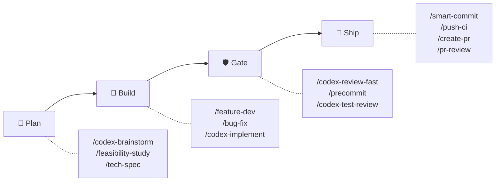
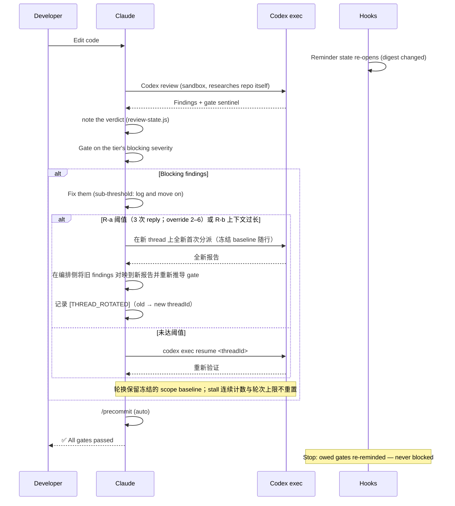

# sd0x-dev-flow


**语言**: [English](README.md) | [繁體中文](README.zh-TW.md) | 简体中文 | [日本語](README.ja.md) | [한국어](README.ko.md) | [Español](README.es.md)

> 给 Claude Code 的 harness 层。

**让模型自己选路径。让「完成」可验证。**

v4 在一个封闭、由测试钉住的 anchor 集合之内给予 Claude 自由裁量权；hooks 是与 digest 绑定、可跨 compaction 存续的提醒（reminders），Codex 独立审查。

完整控制平面运行在 Claude Code 上。对 Codex CLI 与其他兼容 agent 提供 skills-only 分发。

<!-- BEGIN:HERO-COUNT -->
100 bundled · 100 public skills · 16 agents — 仅占 Claude context window 的 ~4%
<!-- END:HERO-COUNT -->

[](LICENSE) [](https://www.npmjs.com/package/skills)

## 快速开始

```text
# Claude Code — 完整控制平面
/plugin marketplace add sd0xdev/sd0x-harness
/plugin install sd0x-dev-flow@sd0xdev-marketplace

# 配置项目
/project-setup
```

一个命令自动检测框架、包管理器、数据库、入口文件和脚本命令。安装部分 rules 和 hooks；完整插件包含 16 条 rules + 6 个 hooks。使用 `--lite` 仅配置 CLAUDE.md（跳过 rules/hooks）。

```bash
# Codex CLI / Cursor / Windsurf / Aider — 仅 skills
npx skills add sd0xdev/sd0x-harness
```

接着在 Codex CLI 中生成 AGENTS.md kernel 并安装 `commit-msg` hook。`pre-push` 守卫为 opt-in——要一并安装请加上 `--with-push-gate`：

```text
$codex-setup init
```

<!-- BEGIN:INSTALL-COVERAGE -->
| 方式 | 适用工具 | 覆盖范围 |
|------|---------|---------|
| 插件安装 | Claude Code | 完整（100 bundled skills、hooks、rules、auto-loop） |
| `npx skills add` | Codex CLI、Cursor、Windsurf、Aider | 仅 Skills（100 public skills） |
| `$codex-setup init` | Codex CLI | AGENTS.md kernel + commit-msg hook（pre-push 守卫为 opt-in） |
<!-- END:INSTALL-COVERAGE -->

**环境要求**：Claude Code 2.1+ | Node.js 18+ | `jq`（`pre-edit-guard` 与 `post-edit-format` 用它解析 hook payload——没有 `jq` 时两者都直接 exit 0，敏感路径防护与自动格式化等于悄悄关闭）| [Codex CLI](https://github.com/openai/codex)（安装 plugin 可不装；它是 `/codex-*` review gate 的默认 reviewer——仅在 `codex_fail`（adapter 的 `start` 或 `resume` exit 1）时，由契约感知的 fallback reviewer 以同一机制承接 gate，按 family contract fail-closed 并记录 `[REVIEWER_FALLBACK]`；找不到 adapter、配置错误、执行未完成或 `alloc`/`cleanup` 失败都不会派发 fallback，也不会记录任何标记，gate 保持开启；只有当所有备用 reviewer 均无法给出有效判定时，review 才输出 `⚠️ Need Human` 而非 verdict）

### Codex exec 配置

审查循环通过 `codex exec` 与 Codex 通信，由一个小型 adapter 驱动。**无需注册 MCP server** —— 本 plugin 不再经由 `codex mcp-server` 派发。

**1. 在 shell 中** —— 安装 Codex CLI（>= 0.149.0）并登录：

```bash
codex --version
```

**2. 在 Claude Code 中** —— 将传输 adapter 安装到项目中。这是 slash command，不是 shell 命令；在终端
里输入会被当成执行一个绝对路径：

```text
/sd0x-dev-flow:install-scripts codex-exec.js
```

第 2 步是可选的：第一次需要用到 adapter 的审查会自动安装它，使用的是 `precommit-fast` 为其 runner 采用的同一套三层查找。如果你不希望安装发生在审查过程中，就先手动执行。

**模型与推理强度现在写在 Codex profile 里，而不是注册命令上。** 在 `rules/auto-loop-project.md` 指定一个：

```markdown
## Codex Profile

review
```

这个名称会解析到 `$CODEX_HOME/<name>.config.toml` —— 也就是 `codex exec -p` 叠加在你的基础用户配置之上的 profile-v2 形式（`codex exec --help`：“Layer `$CODEX_HOME/<name>.config.toml` on top of the base user config”）。所以一个包含 `model_reasoning_effort = "high"` 的 `review` profile，能给审查循环与旧的 `-c` 覆盖相同的深度，同时不影响你自己的交互式 Codex 会话。`## Codex Profile` 留空也可以：adapter 就不传 `-p`，Codex 使用它自己的默认配置。

sandbox 与 approval policy 由 adapter 为每次派发自行固定，因此都不是配置阶段的决定 —— 完整契约见 `skills/codex-code-review/references/codex-transport.md`。

## 为什么是 v4

前沿模型已经能规划、批处理，并从结构化状态中自行恢复——它们不再需要 harness 来指挥每一步下一条命令。v4 从**编排（choreography）走向契约（contracts）**：harness 不再为模型编排动作脚本，而是定义「宣告完成时必须为真的事」，且不放松任何一条安全或审查 anchor。

| 维度 | v3（choreography） | v4（contracts） |
|------|--------------------|-----------------|
| Hook 角色 | 发出下一条要执行的命令 | 打印提醒 + `[AUTO_LOOP_STATE]` 事实——change class、各 plane 的 verdict 状态 |
| 完成判定 | 脚本化的步骤序列（「修复 → 立即重新审查」） | 终态完成不变量：change class 所要求的每一道 gate 都在最后一次编辑之后通过 |
| 规则效力 | 一刀切——每条规则读起来都是强制的 | 三个层级：**Anchor**（绝不偏离）、**Default**（声明信号后可偏离）、**Guidance**（建议性） |
| 审查深度 | 默认拉满 | 按风险分档（`fast` / `standard` / `thorough`）；安全与数据完整性一律升档 |
| 检测到卡壳／触发轮次上限 | 移交人类 | 首次触发：结构化自我诊断 + 一次有边界的调整，然后继续——除非命中人类出口（安全/数据完整性、架构级变更、需求歧义）；同一改动在诊断后再次触发上限：一律交给人类 |

不可协商的核心放在一个**封闭的 Anchor Register**（`rules/discretion.md`）里，任何项目 override 都无法将其降级——解析以 Anchor 优先，且移除任何 Register 条目会让测试套件按设计失败。在这个边界之内，所有权是明确的：

| 所有者 | 拥有 |
|--------|------|
| **模型** | 批处理、时机、审查深度升档、Default 层级的偏离（声明后继续工作） |
| **Harness** | 与 digest 绑定的提醒状态、git 层守卫（`commit-msg` 默认安装、`pre-push` 为 opt-in）、封闭的 anchor 集合 |
| **人类** | 不可逆的批准（push、commit、merge）与列举出的出口点 |

模型拥有路径。Harness 拥有证据与不可协商的边界。人类保留不可逆的决定权。

## 4.4 的新变化

> 升级到 **4.4.0** 后若发现 review 质量下降——真缺陷漏网、或收敛得太急——请[提 issue](https://github.com/sd0xdev/sd0x-harness/issues)反馈。这个版本改的是 review 的**判断方式**，只有实际使用反馈能验证它。

**白话版**：过去 auto-loop 允许 review 无限往深挖——reviewer 指出测试太弱、修复加了更强的守卫、下一轮攻击那个守卫……如此递归。我们测到一个真实案例：9 轮 review 里 8 个 blocking 发现有 7 个在攻击**测试守卫本身的强度**，没有一个关于交付的变更。4.4 划下界线：一个性质在实际路径上完成双向证明后，对它的进一步加固即为非阻断，除非 AC 或安全不变量明文要求。

| 变更 | 之前 | 之后 |
|------|------|------|
| Assurance 边界 | 守卫永远可以被要求再加守卫 | 拒绝型测试在实际路径上双向证明——**代表性证明即为边界**；更深的加固降为非阻断 Nit，除非 AC 或安全不变量明文要求 |
| Prevention 字段 | 被读成「每次修复都要再加一个防护物」——螺旋的种子 | 是**说明**：哪个既有控制会拦住这类问题，通常就是这次修复附带的回归测试 |
| Review dispatch | 重派可以累积「下轮攻击 X」的指示，逐轮锚定 reviewer 越挖越深 | **固定三段式契约**：冻结任务（任务、baseline、AC、用户提供的 focus）＋当前事实＋固定审核契约——攻击清单列为禁止模式 |
| Reviewer 框架 | 「专注找问题」 | 「专注**实质缺陷**」——加上 assurance boundary，开放式 gap check 换成 boundary check |
| 设计思维 | 留给 review，在代码已存在之后 | 在动笔时提示：形状不明显时，说出所选的最简设计与理由——是问句，不是配额 |

**为什么我们相信这是对的**（也为什么仍需要你的反馈）：[IFScale](https://arxiv.org/abs/2507.11538) 测量了指令密度从 10 条升到 500 条时各模型的遵循度衰退曲线；[context rot](https://www.trychroma.com/research/context-rot) 研究发现更长的 context 与主题相关的干扰内容会降低可靠性；[Vercel agent evals](https://vercel.com/blog/agents-md-outperforms-skills-in-our-agent-evals) 则测到常驻的文档索引达成 100%，而带明确触发指示的 skill 只有 79%——指令负载与模糊契约都有可测量的成本。auto-loop 核心完全未动：terminal completion invariant、编辑重开闸门、sub-threshold 纪律、停滞诊断与所有安全 anchor 原样保留。

## 这个 harness 做了什么

> [Harness engineering](https://martinfowler.com/articles/exploring-gen-ai/harness-engineering.html) 是一门专注于工程化 LLM 周边一切的学科 — tool loops、context management、hooks、state machines、safety layers — 而不是训练模型本身。Mitchell Hashimoto 在 2026 年 2 月首次提出这个词；[Anthropic engineering](https://www.anthropic.com/engineering/effective-harnesses-for-long-running-agents) 与 [Martin Fowler](https://martinfowler.com/articles/exploring-gen-ai/harness-engineering.html) 都已发表相关文章；[arXiv 2603.05344](https://arxiv.org/html/2603.05344v1) 则对其做了形式化定义。

sd0x-dev-flow 是一个 reference implementation。下表的每一行都把一个典型的 harness 子问题映射到可供研究的具体代码：

| # | Harness 子问题 | sd0x-dev-flow 实现 | 代码证据 |
|---|----------------|---------------------|----------|
| 1 | **Tool loop control** | 终态完成不变量——change class 所要求的每一道 gate 都必须在最后一次编辑之后通过；何时、如何执行由模型决定 | [`rules/auto-loop.md`](rules/auto-loop.md) + [`scripts/review-state.js`](scripts/review-state.js) |
| 2 | **Digest-bound reminder state** | Verdict 由模型记录（`node scripts/review-state.js note <plane> <pass\|fail>`）并与 tree digest 绑定——一次编辑会因 digest 变化而重新打开其 plane 的提醒；gate sentinel（`✅ Ready` / `## Overall: ✅ PASS`）保持为行为层信号 | [`scripts/review-state.js`](scripts/review-state.js) + [`rules/auto-loop.md`](rules/auto-loop.md) (§ Gate Sentinels, § Enforcement) |
| 3 | **Context recovery across compaction** | SessionStart(compact) 之后重新注入 git 基线（分支 + 未提交文件）与待偿 gate 提醒 | [`hooks/post-compact-auto-loop.sh`](hooks/post-compact-auto-loop.sh) |
| 4 | **Lifecycle interceptors** | 5 类 hook 事件分派到 6 个脚本——4 个建议性提醒 hook、1 个自动格式化、1 个会阻断的安全守卫（SessionStart 另外执行 `scripts/namespace-hint.sh`）：PreToolUse / PostToolUse / Stop / SessionStart / UserPromptSubmit | [`hooks/`](hooks/) (6 个脚本) + [`.claude/settings.json`](.claude/settings.json) |
| 5 | **Capability-based tool gating** | Skill frontmatter 的 `allowed-tools` — 例如 `/ask` 不具备 Edit/Write 权限 | 100 个公开 skills 中有 92 个声明了 `allowed-tools` |
| 6 | **Defense-in-depth safety** | 已安装的 git 层守卫保持硬性——commit-msg-guard 始终安装，走 `/dev/tty` 的 pre-push-gate 则在 opt-in 后生效；编辑期的 pre-edit-guard 仍会阻断敏感路径编辑（安全守卫，非工作流强制——需要 `jq`，缺 jq 时守卫不会启动）；Stop hook 只做提醒——把守不可逆操作的那几层保留了牙齿，审查层则按设计转为建议性 | [`scripts/pre-push-gate.sh`](scripts/pre-push-gate.sh) + [`scripts/commit-msg-guard.sh`](scripts/commit-msg-guard.sh) + [`hooks/stop-guard.sh`](hooks/stop-guard.sh) |
| 7 | **Generator-evaluator split** | Codex 审查 Claude 写的东西，自行研究 repo——绝不喂结论让它确认 | [`rules/codex-invocation.md`](rules/codex-invocation.md) + [`rules/auto-loop.md`](rules/auto-loop.md) (Review Dispatch) |
| 8 | **Incremental progress tracking** | 证据驱动的卡壳纪律：连续三轮 review 都没关掉任何 finding——由模型根据 review 报告自行计数——触发结构化的停滞分类与一次有边界的调整。按 tier 的轮次预算（默认 6 / 15 / 30，可覆写为 3–50）退居 runaway backstop，首次触发上限时跑同一套诊断，并保留列举出的人类出口 | [`rules/auto-loop.md`](rules/auto-loop.md) (§ Stall Detection and Diagnosis；详见 `skills/codex-code-review/references/loop-diagnostics.md`) |
| 9 | **Human-in-the-loop safety gates** | 每次 `/push-ci` push 之前的 `AskUserQuestion` 批准——该批准始终必要，且在未安装 opt-in 的 `pre-push` hook 时就是授权本身；已安装时，`/dev/tty` 确认才是保护分支 push 的最终凭证（外加非 fast-forward 检测） | [`scripts/pre-push-gate.sh`](scripts/pre-push-gate.sh) + [`skills/push-ci/SKILL.md`](skills/push-ci/SKILL.md) |
| 10 | **Self-improvement loop** | 纠正 → 记录 lesson → 累计 3 次以上后晋升为 rule | [`rules/self-improvement.md`](rules/self-improvement.md) |

多数 harness 项目只覆盖其中 2 – 4 项。sd0x-dev-flow 覆盖全部 10 项 — 这让它的代码不只是工具，更是值得研读的学习素材。

## 工作原理



一切都围绕一条规则——**终态完成不变量**：一项改动只有在其 change class 所要求的每一道 gate 都于*该类的最后一次编辑之后*通过时，才可以宣告完成。代码编辑需要一次独立的 review——默认由 Codex 执行，Codex 不可用时由通过验证的契约感知 fallback reviewer 承接——再加 `/precommit`；`.md` 文档需要 `/codex-review-doc`。何时执行、如何批处理编辑、审查多深，都是模型的决定——不变量约束的是终态，不是编排。

Hooks 报告的是**事实，不是命令**：它们打印提醒和一行 `[AUTO_LOOP_STATE]` 事实（change class、各 plane 的 verdict 状态），决策权归模型。什么算 blocking 由 tier 决定（`fast` P0 · `standard` P0/P1 · `thorough` P0/P1/P2）；低于该门槛的 findings 只记录下来，loop 继续往前，不再多开一轮。卡壳——连续三轮 review 没有关掉任何 finding，由模型自行计数——或作为兜底，触发轮次上限——会启动一次结构化自我诊断（架构问题？文档过长？注意力发散？）与一次有边界的调整，然后 loop 继续，而不是自动移交；无论由哪个 trigger 发动，人类出口都仍然有效（安全与数据完整性改动完全跳过诊断；被诊断为架构级或需求歧义的停滞交给人类）。

不存在强制执行模式（hook-lightweighting，2026-08-13）：每个审查层 hook 都是以 exit 0 结束的提醒。建立 verdict 的是 reviewer 的报告；模型再记录它（`node scripts/review-state.js note <plane> <pass|fail>`，与 digest 绑定——一次编辑会重新打开其 plane）让提醒退场。未被记录的 verdict 依然成立——只是提醒会一直响——而让提醒安静下来的诚实方式是把 gate 跑完并记录结果。审查层之外的守卫仍然保有约束力：pre-edit-guard 仍会阻断敏感路径编辑（需要 `jq`，缺 jq 时守卫不会启动），而已安装的 git 层守卫仍然是硬性的（commit-msg-guard 默认安装、pre-push-gate 为 opt-in）。

第二位 reviewer 走 `/codex-review-branch --dual`，默认不启用。Hook 与依赖详情见 [docs/hooks.md](docs/hooks.md)。

<details>
<summary>详细：Review Loop 时序图</summary>



</details>

## 功能亮点：分档 Review

默认只有一位 reviewer——Codex——在所有场景运行。**tier** 决定一项改动要多严格，以及一个 finding 要多严重才会重开 loop：

| Tier | 适用 | Blocking | 轮次上限 |
|------|------|----------|----------|
| `fast` | 文档、配置、低风险小改 | P0 | 6 |
| `standard` **（默认）** | 一般功能与 bug fix | P0、P1 | 15 |
| `thorough` | 安全性、数据完整性、release、public API | P0、P1、P2 | 30 |

配置的 tier 是底线，不是上限——当改动值得时模型会升档，而安全或数据完整性改动无论配置为何，一律以 `thorough` 审查。

**80 分就是及格。** 低于该 tier blocking 门槛的 findings 会被记录（`[NIT_DEFERRED]`——review 报告中的一种报告惯例；没有任何东西会持久化它），loop 直接进 `/precommit`——不多一次修正、不多一轮 review。这些项目会在 `/codex-review-branch` 做深度审查时被捡回来。

上面的轮次上限是刻意放宽的，因为**上限分不出正在收敛的循环和空转的循环**——两者都停在同一个数字。能分出来的是证据：连续三轮 review 都没有关掉任何 finding——由模型根据 review 报告自行计数，通常比触发上限早很多轮——触发下面这套诊断。上限退居 runaway backstop。

上面的轮次上限是各 tier 的默认值——项目的 `## Max Rounds` 覆写（3–50）优先。触发上限是一个诊断点，不是自动移交：模型对停滞做分类（架构、文档过长、注意力发散、未验证的断言、tier 不匹配、需求歧义），做一次有边界的调整，然后继续。无论由哪个 trigger 发动，人类出口都仍然有约束力：安全/数据完整性改动跳过诊断直接交给人类，被归类为架构级或需求歧义的停滞退出交给人类，同一改动在诊断后第二次触发上限也一律如此。（架构级变更、功能移除或用户要求停止，在任何时点都会退出交给人类——无论是否触发上限。）

第二位 reviewer 走 `/codex-review-branch --dual`，**不加标志就不启用**——它让每轮的 token 与时间成本翻倍，值得花在 release 或安全审查上，不值得花在日常修正。启用 `--dual` 时，findings 会做严重度正规化、去重（file + issue key，±5 行容差）与来源标记。

Gate：`✅ Ready` 或 `⛔ Blocked` — 由模型据以行动的行为层信号；verdict 会被记录进提醒状态。

## 适用场景

| 适合 | 不太适合 |
|------|----------|
| 使用 Claude Code 的个人或小团队项目 | 完全不使用 Claude Code 的团队 |
| 需要自动化审查关卡的项目 | 没有 CI 的一次性脚本 |
| Codex CLI / Cursor / Windsurf 用户（skills 子集） | 需要自定义 LLM provider 的项目 |
| 质量关卡可防止 regression 的仓库 | 没有测试基础设施的仓库 |

## 工作流路径

| 工作流 | 命令 | Gate | 状态 |
|--------|------|------|------|
| 功能开发 | `/feature-dev` → `/verify` → `/codex-review-fast` → `/precommit` | ✅/⛔ | 与 digest 绑定的提醒（记录 verdict） |
| 缺陷修复 | `/issue-analyze` → `/bug-fix` → `/verify` → `/precommit` | ✅/⛔ | 与 digest 绑定的提醒（记录 verdict） |
| Auto-Loop | 代码编辑 → `/codex-review-fast` → `/precommit` | ✅/⛔ | 与 digest 绑定的提醒（记录 verdict） |
| 文档审查 | `.md` 编辑 → `/codex-review-doc` | ✅/⛔ | 与 digest 绑定的提醒（记录 verdict） |
| 规划 | `/codex-brainstorm` → `/feasibility-study` → `/tech-spec` | — | — |
| 入门引导 | `/project-setup` → `/repo-intake` | — | — |

```mermaid
flowchart TD
    subgraph feat ["🔨 Feature Development"]
        F1["/feature-dev"] --> F2["Code + Tests"]
        F2 --> F3["/verify"]
        F3 --> F4["/codex-review-fast"]
        F4 --> F5["/precommit"]
        F5 --> F6["/update-docs"]
    end

    subgraph fix ["🐛 Bug Fix"]
        B1["/issue-analyze"] --> B2["/bug-fix"]
        B2 --> B3["Fix + Regression test"]
        B3 --> B4["/verify"]
        B4 --> B5["/codex-review-fast"]
        B5 --> B6["/precommit"]
    end

    subgraph docs ["📝 Docs Only"]
        D1["Edit .md"] --> D2["/codex-review-doc"]
        D2 --> D3["Done"]
    end

    subgraph plan ["🎯 Planning"]
        P1["/codex-brainstorm"] --> P2["/feasibility-study"]
        P2 --> P3["/tech-spec"]
        P3 --> P4["/codex-architect"]
        P4 --> P5["Implementation ready"]
    end

    subgraph ops ["⚙️ Operations"]
        O1["/project-setup"] --> O2["/repo-intake"]
        O2 --> O3["Develop"]
        O3 --> O4["/project-audit"]
        O3 --> O7["/best-practices"]
        O3 --> O5["/risk-assess"]
        O4 --> O6["/next-step --go"]
        O5 --> O6
        O7 --> O6
    end
```

<details>
<summary>可视化：工作流程图</summary>



</details>

## 实战指南（Cookbook）

展示真实场景下如何组合使用各技能及其执行顺序。

| 场景 | 流程 | 文档 |
|------|------|------|
| 第一天上手新仓库 | `/project-setup` → `/repo-intake` → `/next-step` | [→](docs/cookbook/first-day.md) |
| 实现新功能 | `/feature-dev` → `/verify` → `/codex-test-review` → `/codex-review-fast` → `/precommit` | [→](docs/cookbook/new-feature.md) |
| 处理 PR 审查意见 | `/load-pr-review` → 修复 → `/codex-review-fast` → `/push-ci` | [→](docs/cookbook/pr-review-comments.md) |
| 合并前安全检查 | `/codex-security` → `/dep-audit` → `/risk-assess` → `/pre-pr-audit` | [→](docs/cookbook/security-pre-merge.md) |
| **精选组合：** 验证方向 | `/deep-research` → `/best-practices` → `/feasibility-study` → `/codex-brainstorm` | [→](docs/cookbook/validate-direction.md) |
| **精选组合：** 对抗式设计 | `/codex-brainstorm`（纳什均衡式辩论）→ `/codex-architect` | [→](docs/cookbook/adversarial-design.md) |

[全部 10 个场景 →](docs/cookbook/)

## 包含内容

<!-- BEGIN:WHATS-INCLUDED-COUNT -->
| 类别 | 数量 | 示例 |
|------|------|------|
| Skills | 100 public (100 bundled) | `/project-setup`, `/codex-review-fast`, `/verify`, `/smart-commit`, `/deep-research` |
| 代理 | 16 | strict-reviewer, verify-app, coverage-analyst, architecture-designer |
| 钩子 | 6 | pre-edit-guard, auto-format, stop reminder, post-compact-auto-loop, post-skill-auto-loop, user-prompt-review-guard |
| 规则 | 16 | auto-loop, auto-loop-project, codex-invocation, scope-discipline, security, testing, git-workflow, self-improvement, context-management |
| 脚本 | 23 | precommit runner, verify runner, review-state CLI, dep audit, namespace hint, skill runner, commit-msg guard, pre-push gate, build-codex-artifacts, resolve-feature (node entrypoint + shell shim + CLI), classify-docs, detect-scope, migration-audit, migrate-hook-lightweighting, security-redact, readme-catalog, check-doc-links, resolve-review-profile, codex-exec adapter |
<!-- END:WHATS-INCLUDED-COUNT -->

### 极小的 Context 占用

~4% 的 Claude 200k context window——96% 留给你的代码。

| 组件 | Tokens | 占 200k 比例 |
|------|--------|-------------|
| Rules（常驻加载） | 5.1k | 2.6% |
| Skills（按需加载） | 1.9k | 1.0% |
| Agents | 791 | 0.4% |
| **合计** | **~8k** | **~4%** |

Skills 按需加载。闲置 Skill 不占用任何 Token。

## 技能参考

<!-- BEGIN:ESSENTIAL-SKILLS -->
| Skill | 使用场景 |
|-------|----------|
| `/project-setup` | 首次项目配置 |
| `/bug-fix` | 修复缺陷与解决问题 |
| `/feature-dev` | 端到端实现新功能 |
| `/smart-commit` | 智能分组提交变更 |
| `/push-ci` | 推送代码并监控 CI |
| `/create-pr` | 创建 GitHub Pull Request |
| `/codex-review-fast` | 快速代码审查（仅 diff） |
| `/codex-review-doc` | 审查文档变更 |
| `/codex-security` | OWASP Top 10 安全审计 |
| `/verify` | 运行完整验证链 |
| `/precommit` | 提交前质量关卡（lint + build + test） |
| `/precommit-fast` | 快速提交前检查（lint + test，跳过 build） |
| `/codex-brainstorm` | 对抗式头脑风暴（纳什均衡） |
| `/tech-spec` | 编写技术规格书 |
| `/pr-review` | 合并前 PR 自查 |
<!-- END:ESSENTIAL-SKILLS -->

<!-- BEGIN:FULL-CATALOG -->
<details>
<summary>全部 100 个 public skills</summary>

### 开发 (34)

| Skill | Description |
|-------|-------------|
| `/ask` | 具备上下文感知的 Q&A，自动收集上下文信息。 |
| `/bug-fix` | Bug fix workflow. |
| `/bump-version` | Bump package and plugin version in sync. |
| `/code-explore` | Pure Claude code investigation. |
| `/code-investigate` | Dual-perspective code investigation. |
| `/codex-architect` | Codex architecture consulting. |
| `/codex-implement` | Implement features via Codex exec. |
| `/codex-setup` | Initialize sd0x-dev-flow infrastructure for Codex CLI and other non-Claude agents. |
| `/create-pr` | Create or update GitHub PR with gh CLI. |
| `/debug` | Interactive debugging workflow with hypothesis-driven probe loop. |
| `/deep-explore` | Multi-wave parallel code exploration orchestrator. |
| `/epic-merge` | 将堆叠的 PR 链顺序 squash-merge 合并到 epic 分支。 |
| `/feature-dev` | Feature development workflow. |
| `/feature-verify` | Feature verification (READ-ONLY, P0-P5). |
| `/gh-stack` | Native stacked pull requests through the github/gh-stack extension. |
| `/git-investigate` | Git history investigation. |
| `/git-profile` | Git identity and GPG signing profile manager. |
| `/install-hooks` | Install plugin hooks into project .claude/ for persistent use without plugin loaded |
| `/install-rules` | Install plugin rules into project .claude/rules/ for persistent use without plugin loaded |
| `/install-scripts` | Install plugin runner scripts into project .claude/scripts/ for persistent use without plugin loaded |
| `/issue-analyze` | GitHub Issue and PR review thread deep analysis with Codex blind verdict. |
| `/jira` | Jira integration — view issues, generate branches, create tickets, transition status. |
| `/load-pr-review` | Load GitHub PR review comments into AI session — analyze, triage, plan. |
| `/merge-prep` | Pre-merge analysis and preparation. |
| `/next-step` | Change-aware next step advisor. |
| `/post-dev-test` | Post-development test completion. |
| `/pr-comment` | Post friendly review comments to a GitHub PR — prepare locally, preview, then submit as atomic review. |
| `/project-setup` | Project configuration initialization. |
| `/push-ci` | Push to remote and monitor CI. |
| `/remind` | Lightweight model correction with context-aware rule loading. |
| `/repo-intake` | Project initialization inventory (one-time). |
| `/smart-commit` | Smart batch commit. |
| `/smart-rebase` | Smart partial rebase for squash-merge repositories. |
| `/watch-ci` | Monitor GitHub Actions CI runs until completion. |

### 审查 (Codex exec) (15)

| Skill | Description | 循环支持 |
|-------|-------------|----------|
| `/codex-cli-review` | Code review via Codex CLI with full disk access. | - |
| `/codex-code-review` | Code review using Codex exec. | - |
| `/codex-explain` | Explain complex code via Codex exec. | - |
| `/codex-review` | Full second-opinion using Codex exec (with lint:fix + build). | `--continue <threadId>` |
| `/codex-review-branch` | Fully automated review of an entire feature branch using Codex exec | - |
| `/codex-review-doc` | Review documents using Codex exec. | `--continue <threadId>` |
| `/codex-review-fast` | Quick second-opinion using Codex exec (diff only, no tests). | `--continue <threadId>` |
| `/codex-security` | OWASP Top 10 security review using Codex exec. | `--continue <threadId>` |
| `/codex-test-gen` | Generate unit tests for specified functions using Codex exec | - |
| `/codex-test-review` | Review test case sufficiency using Codex exec, suggest additional edge cases. | `--continue <threadId>` |
| `/doc-review` | Document review via Codex exec. | - |
| `/plan-review` | Pre-ExitPlanMode adversarial plan review loop via Codex exec. | - |
| `/security-review` | Security review via Codex exec. | - |
| `/seek-verdict` | Independent second-opinion verification for any finding. | - |
| `/test-review` | Test coverage review via Codex exec. | - |

### 验证 (13)

| Skill | Description |
|-------|-------------|
| `/best-practices` | Industry best practices conformance audit with mandatory adversarial debate. |
| `/check-coverage` | Comprehensive assessment of Unit / Integration / E2E three-layer test coverage, identify gaps and provide actionable ... |
| `/dep-audit` | Audit dependency security risks |
| `/dev-security-audit` | Comprehensive developer workstation security audit — scans for exposed credentials, compromised application data, per... |
| `/necessity-audit` | Necessity audit for over-designed spec elements. |
| `/pre-pr-audit` | Pre-PR confidence audit with 5-dimension scoring. |
| `/precommit` | Pre-commit checks — lint:fix -> build -> test |
| `/precommit-fast` | Quick pre-commit checks — lint:fix -> test |
| `/project-audit` | Project health audit with deterministic scoring. |
| `/risk-assess` | Uncommitted code risk assessment with breaking change detection, blast radius analysis, and scope metrics. |
| `/test-deep` | Context-aware test orchestration. |
| `/test-health` | Holistic test coverage measurement. |
| `/verify` | Verification loop — lint -> typecheck -> unit -> integration -> e2e |

### 规划 (17)

| Skill | Description |
|-------|-------------|
| `/architecture` | Architecture design and documentation. |
| `/codex-brainstorm` | Adversarial brainstorming via Claude+Codex debate. |
| `/deep-analyze` | Deep-dive analysis of an initial proposal — research code implementation, produce an actionable roadmap and alternatives |
| `/deep-research` | Universal multi-source research orchestration. |
| `/feasibility-study` | Feasibility analysis from first principles. |
| `/fp-brief` | First-principles briefing from technical documents. |
| `/orchestrate` | Agent-driven workflow orchestration (v1 report-only). |
| `/post-dev-recap` | Post-development recap wrapper. |
| `/project-brief` | Convert a technical spec into a PM/CTO-readable executive summary. |
| `/recap-ask` | Interactive Q&A over an existing recap document. |
| `/recap-doc` | Post-development recap document generator. |
| `/req-analyze` | Requirements analysis — problem decomposition, stakeholder scan, requirement structuring. |
| `/request-tracking` | Request tracking knowledge base. |
| `/review-spec` | Review technical spec documents from completeness, feasibility, risk, and code consistency perspectives. |
| `/tech-brief` | Technical briefing for developer sharing. |
| `/tech-spec` | Tech spec generation and review. |
| `/ui-first-principles` | First-principles UI/IA reasoning: turns a `<scenario>` + API field set into JTBD analysis, principle-anchored field-p... |

### 文档与工具 (21)

| Skill | Description |
|-------|-------------|
| `/adr` | Write an Architecture Decision Record (ADR) for a feature — Context / Decision / Status / Consequences / Alternatives... |
| `/claude-health` | Claude Code config health check + plugin sync. |
| `/contract-decode` | EVM contract error and calldata decoder. |
| `/create-request` | Create, update, or scan per-task request tickets for progress tracking. |
| `/de-ai-flavor` | Remove AI artifacts from documents. |
| `/doc-refactor` | Refactor documents — simplify without losing information, visualize flows with sequenceDiagram. |
| `/generate-runner` | Generate a customized precommit runner for any ecosystem. |
| `/obsidian-cli` | Obsidian vault integration via official CLI. |
| `/op-session` | Initialize 1Password CLI session for Claude Code. |
| `/portfolio` | Portfolio system knowledge base. |
| `/pr-review` | PR self-review — review changes, produce checklist, update rules |
| `/pr-summary` | List open PRs, filter automation PRs, group by ticket ID, format as Markdown. |
| `/refactor` | Multi-target refactoring orchestrator. |
| `/runbook` | Generate/update feature release runbook |
| `/safe-remove` | Safely remove plugin assets (skill/agent/rule/script/hook) with dependency detection and reference cleanup. |
| `/sharingan` | Replicate knowledge from any source as sd0x-dev-flow skill definition. |
| `/simplify` | Wrap-up refactoring — simplify code, eliminate duplication, preserve behavior |
| `/skill-health-check` | Validate skill quality against routing, progressive loading, and verification criteria. |
| `/statusline-config` | Customize Claude Code statusline. |
| `/update-docs` | Research current code state then update corresponding docs, ensuring docs stay in sync with code. |
| `/zh-tw` | Rewrite the previous reply in Traditional Chinese |

</details>
<!-- END:FULL-CATALOG -->

## 规则与钩子

16 条规则 + 6 个钩子。规则是分层级的契约：`discretion.md` 把 13 个由插件管理的 rule 文件中的每条指令解析为 Anchor / Default / Guidance 三者中的确切一个，2 个用户自有的 override 文件则在其父规则之下以 Anchor 优先的方式解析。Hook 的组成是 4 个建议性提醒 hook，加上 1 个自动格式化与 1 个会阻断的安全守卫。提醒角色各不相同：Stop 与 post-compact hook 从与 digest 绑定的状态（`review-state.js`）打印待偿 gate 提醒，prompt hook 打印 `[AUTO_LOOP_STATE]` 事实行，post-skill hook 打印固定的 gate 顺序行，post-compact hook 另外重新注入 git 基线；审查层永不阻断——pre-edit-guard 仍会阻断敏感路径编辑（安全守卫，需要 `jq`，缺 jq 时不会启动），硬性 gate 位于 git 层（commit-msg-guard 默认安装；pre-push-gate 为 opt-in）。

> **定制化**：编辑 `auto-loop-project.md` 可覆写项目的 auto-loop 行为。插件更新不会冲突 — 详见 [Rule Override Pattern](docs/features/rule-override-pattern/2-tech-spec.md)。

完整的规则、钩子与环境变量参考，请见 [docs/rules.md](docs/rules.md) 与 [docs/hooks.md](docs/hooks.md)。

## 自定义配置

运行 `/project-setup` 自动检测并配置所有占位符，或手动编辑 `.claude/CLAUDE.md`：

| 占位符 | 说明 | 示例 |
|--------|------|------|
| `{PROJECT_NAME}` | 项目名称 | my-app |
| `{FRAMEWORK}` | 框架 | MidwayJS 3.x, NestJS, Express |
| `{CONFIG_FILE}` | 主配置文件 | src/configuration.ts |
| `{BOOTSTRAP_FILE}` | 启动入口 | bootstrap.js, main.ts |
| `{DATABASE}` | 数据库 | MongoDB, PostgreSQL |
| `{TEST_COMMAND}` | 测试命令 | yarn test:unit |
| `{LINT_FIX_COMMAND}` | Lint 自动修复 | yarn lint:fix |
| `{BUILD_COMMAND}` | 构建命令 | yarn build |
| `{TYPECHECK_COMMAND}` | 类型检查 | yarn typecheck |

Override 以 **Anchor 优先**解析：用户自有的 override 文件（`auto-loop-project.md`、`testing-project.md`）只能定制 Default 与 Guidance 层级的行为——任何项目 override 都无法降级 Anchor Register 中的条目，尝试这样做会被报告为冲突，而不是被采纳。

## 展示：多 Agent 研究

执行 `/deep-research` 可调度 2-3 个并行研究 agent，跨越网络来源、代码库与社区知识 — 搭配 claim registry 综合与条件式对抗辩论。

| 特性 | 内容 |
|------|------|
| Agents | 2-3 个并行（web + code + community） |
| 综合 | Claim registry 共识检测 |
| 验证 | 条件式 /codex-brainstorm 辩论 |
| 评分 | 4 信号完整度模型 |

[完整文档](docs/features/deep-research/)

## 架构

六个层，每层只负责一件事：

| 层 | 拥有 |
|----|------|
| **Skills** | 按需加载的能力——那些动词（`/feature-dev`、`/codex-review-fast`……） |
| **模型** | 路径：批处理、时机、审查深度升档、Default 层级的偏离 |
| **Rules** | 每个 session 都会加载的分层契约（Anchor / Default / Guidance） |
| **Hooks + 状态** | 提醒 + `[AUTO_LOOP_STATE]` 事实、与 digest 绑定的 verdict 记录、跨 compaction 的恢复 |
| **Codex** | 独立审查——自行研究 repo，绝不被喂结论 |
| **Scripts + 代理** | 确定性检查（precommit、guards）与隔离的子代理 |

高级架构详情（agentic control stack、控制回路理论、沙箱规则）参见 [docs/architecture.md](docs/architecture.md)——注意其中部分内容早于 v4，仍在描述 v3 的 choreography；当前的事实来源是 `rules/auto-loop.md` 与 `rules/discretion.md`。

## 贡献

欢迎 PR。请：

1. 遵循现有命名规范（kebab-case）
2. 在技能中包含 `When to Use` / `When NOT to Use`
3. 对危险操作添加 `disable-model-invocation: true`
4. 提交前用 Claude Code 测试

## 许可证

MIT

## Star History

<a href="https://www.star-history.com/?repos=sd0xdev%2Fsd0x-harness&type=date&legend=top-left">
 <picture>
   <source media="(prefers-color-scheme: dark)" srcset="https://api.star-history.com/image?repos=sd0xdev/sd0x-harness&type=date&theme=dark&legend=top-left" />
   <source media="(prefers-color-scheme: light)" srcset="https://api.star-history.com/image?repos=sd0xdev/sd0x-harness&type=date&legend=top-left" />
   
 </picture>
</a>
