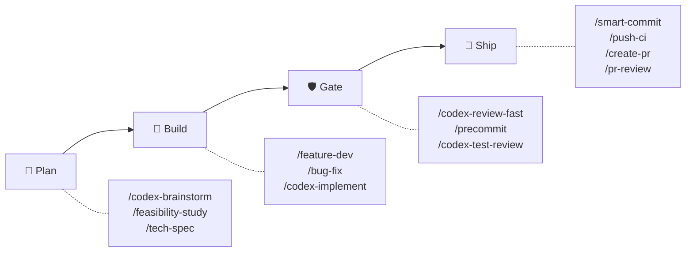
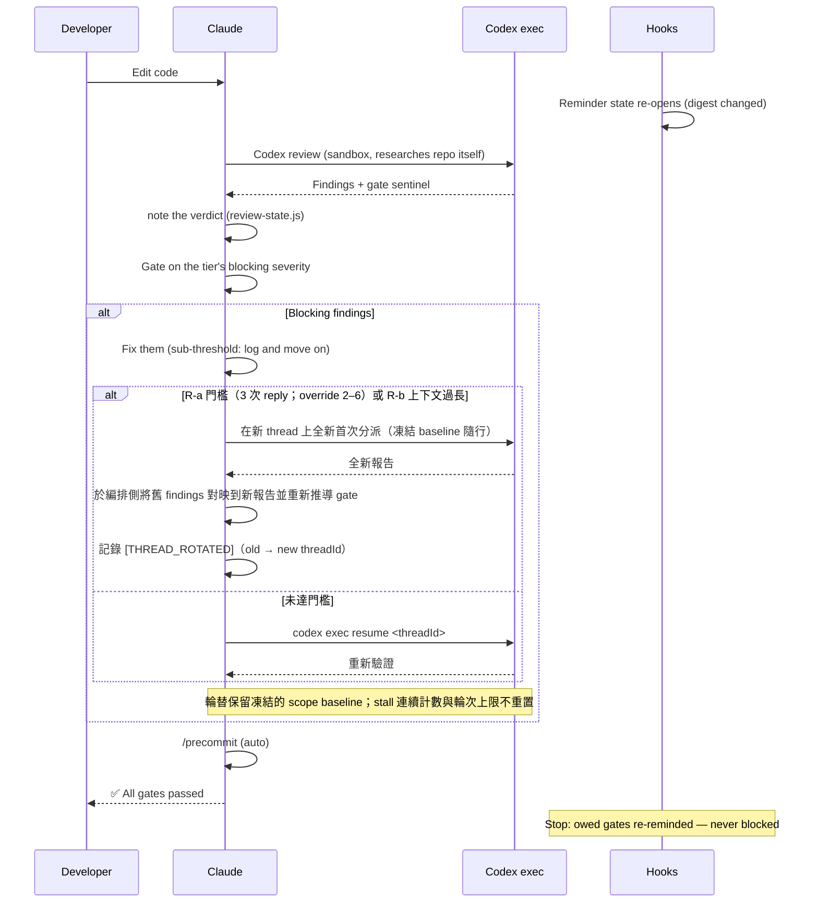

# sd0x-dev-flow


**語言**: [English](README.md) | 繁體中文 | [简体中文](README.zh-CN.md) | [日本語](README.ja.md) | [한국어](README.ko.md) | [Español](README.es.md)

> 給 Claude Code 的 harness 層。

**讓模型自己選路，讓「完成」可被驗證。**

v4 讓 Claude 在一組封閉、由測試釘死的 anchor 集合內擁有裁量權；hooks 是綁定 digest、跨 compaction 仍然有效的提醒，Codex 則獨立進行 review。

在 Claude Code 上提供完整 control plane；對 Codex CLI 與其他相容 agent 則以 skills-only 形式發佈。

<!-- BEGIN:HERO-COUNT -->
101 bundled · 101 public skills · 16 agents — 僅佔 Claude context window 的 ~4%
<!-- END:HERO-COUNT -->

[](LICENSE) [](https://www.npmjs.com/package/skills)

## 快速開始

```text
# Claude Code — 完整 control plane
/plugin marketplace add sd0xdev/sd0x-harness
/plugin install sd0x-dev-flow@sd0xdev-marketplace

# 設定你的專案
/project-setup
```

一個指令自動偵測 framework、package manager、資料庫、entry point 和 script 指令。安裝部分 rules 與 hooks；完整 plugin 包含 17 條 rules + 7 個 hooks。使用 `--lite` 僅設定 CLAUDE.md（跳過 rules/hooks）。

```bash
# Codex CLI / Cursor / Windsurf / Aider — 僅 skills
npx skills add sd0xdev/sd0x-harness
```

接著在 Codex CLI 內產生 AGENTS.md kernel 並安裝 `commit-msg` hook。`pre-push` 護欄採 opt-in——要一併安裝請加上 `--with-push-gate`：

```text
$codex-setup init
```

<!-- BEGIN:INSTALL-COVERAGE -->
| 方式 | 適用工具 | 涵蓋範圍 |
|------|---------|---------|
| Plugin 安裝 | Claude Code | 完整（101 bundled skills、hooks、rules、auto-loop） |
| `npx skills add` | Codex CLI、Cursor、Windsurf、Aider | 僅 Skills（101 public skills） |
| `$codex-setup init` | Codex CLI | AGENTS.md kernel + commit-msg hook（pre-push 護欄為 opt-in） |
<!-- END:INSTALL-COVERAGE -->

**需求**：Claude Code 2.1+ | Node.js 18+ | `jq`（`pre-edit-guard` 與 `post-edit-format` 用它解析 hook payload——沒有 `jq` 時兩者都直接 exit 0，敏感路徑防護與自動格式化等於默默關閉）| [Codex CLI](https://github.com/openai/codex)（安裝 plugin 可不裝；它是 `/codex-*` review gate 的預設 reviewer——僅在 `codex_fail`（adapter 的 `start` 或 `resume` exit 1）時，由契約感知的 fallback reviewer 以同一機制承接 gate，依 family contract fail-closed 並記錄 `[REVIEWER_FALLBACK]`；找不到 adapter、設定錯誤、執行未完成或 `alloc`/`cleanup` 失敗都不會派發 fallback，也不會記錄任何標記，gate 保持開啟；唯有所有備援 reviewer 都無法產生有效判定時，review 才輸出 `⚠️ Need Human` 而非 verdict）

### Codex exec 設定

審查迴圈透過 `codex exec` 與 Codex 溝通，由一個小型 adapter 驅動。**不需要註冊 MCP server** —— 本 plugin 不再經由 `codex mcp-server` 派發。

**1. 在 shell 中** —— 安裝 Codex CLI（>= 0.149.0）並登入：

```bash
codex --version
```

**2. 在 Claude Code 中** —— 把傳輸 adapter 安裝到專案中。這是 slash command，不是 shell 指令；在終端機
輸入會被當成執行一個絕對路徑：

```text
/sd0x-dev-flow:install-scripts codex-exec.js
```

第 2 步是選用的：第一次需要用到 adapter 的審查會自動安裝它，走的是 `precommit-fast` 為它的 runner 使用的同一套三層查找。如果你不希望安裝動作發生在審查過程中，就先手動執行。

**模型與推理強度現在寫在 Codex profile 裡，而不是註冊指令上。** 在 `rules/auto-loop-project.md` 指定一個：

```markdown
## Codex Profile

review
```

這個名稱會解析到 `$CODEX_HOME/<name>.config.toml` —— 也就是 `codex exec -p` 疊加在你的基礎使用者設定之上的 profile-v2 形式（`codex exec --help`：「Layer `$CODEX_HOME/<name>.config.toml` on top of the base user config」）。所以一個內含 `model_reasoning_effort = "high"` 的 `review` profile，能給審查迴圈與舊的 `-c` 覆寫相同的深度，同時不影響你自己的互動式 Codex 工作階段。`## Codex Profile` 留空也可以：adapter 就不傳 `-p`，Codex 使用它自己的預設設定。

sandbox 與 approval policy 由 adapter 為每次派送自行釘定，因此都不是設定階段的決定 —— 完整契約見 `skills/codex-code-review/references/codex-transport.md`。

## 為什麼是 v4

前沿模型已經能規劃、批次處理，並從結構化狀態中復原——它們不再需要 harness 指定下一步要執行哪個指令。v4 從**編排（choreography）走向契約（contracts）**：harness 不再替模型編排每一步動作，而是定義「宣告完成」時必須為真的條件，同時不放鬆任何一條安全或 review anchor。

| 面向 | v3（choreography） | v4（contracts） |
|------|-------------------|----------------|
| Hook 角色 | 直接發出下一個要執行的指令 | 印出提醒 + `[AUTO_LOOP_STATE]` 事實——change class、各 plane 的 verdict 狀態 |
| 完成定義 | 腳本化的步驟序列（「修正 → 立即重新 review」） | Terminal completion invariant：change class 所需的每個 gate 都在最後一次編輯之後通過 |
| 規則強度 | 一律相同——每條規則讀起來都是強制 | 三個層級：**Anchor**（絕不偏離）、**Default**（陳述訊號後可偏離）、**Guidance**（建議性） |
| Review 深度 | 預設就是最深 | 依風險分級的 tier（`fast` / `standard` / `thorough`）；安全性與資料完整性一律升級 |
| 偵測到卡關／輪次上限觸頂 | 交還給人類 | 第一次觸發：結構化自我診斷 + 一次有界調整後繼續——除非命中人類出口（安全性／資料完整性、架構層級變更、需求歧義）；同一改動在診斷後再次觸頂：一律交給人類 |

不可協商的核心放在一個**封閉的 Anchor Register**（`rules/discretion.md`）裡，任何專案覆寫都無法將其降級——解析採 Anchor-first，而且移除任何一條 Register 條目都會讓測試套件刻意失敗。在這個邊界之內，所有權是明確的：

| 擁有者 | 擁有的範圍 |
|--------|-----------|
| **模型** | 批次、時機、review 深度升級、Default 層級的偏離（陳述後繼續工作） |
| **Harness** | 綁定 digest 的提醒狀態、git 層級的護欄（`commit-msg` 由 `/codex-setup init` 安裝、`pre-push` 為 opt-in）、封閉的 anchor 集合 |
| **人類** | 不可逆的核准（push、commit、merge）與列舉的出口點 |

模型擁有路徑。Harness 擁有證據與不可協商的邊界。人類保留不可逆的權力。

## 4.4 的新變化

> 升級到 **4.4.0** 後若察覺 review 品質下降——真缺陷漏網、或收斂得太急——請[開 issue](https://github.com/sd0xdev/sd0x-harness/issues)回報。這個版本改的是 review 的**判斷方式**，只有實際使用回報能驗證它。

**白話版**：過去 auto-loop 允許 review 無限往深挖——reviewer 指出測試太弱、修復加了更強的守衛、下一輪攻擊那個守衛……如此遞歸。我們量到一個真實案例：9 輪 review 裡 8 個 blocking 發現有 7 個在攻擊**測試守衛本身的強度**，沒有一個關於交付的變更。4.4 畫下界線：一個性質在實際路徑上完成雙向證明後，對它的進一步加固即為非阻斷，除非 AC 或安全不變量明文要求。

| 異動 | 之前 | 之後 |
|------|------|------|
| Assurance 止點 | 守衛永遠可以被要求再加守衛 | 拒絕型測試在實際路徑上雙向證明——**代表性證明即為邊界**；更深的加固降為非阻斷 Nit，除非 AC 或安全不變量明文要求 |
| Prevention 欄位 | 被讀成「每次修復都要再加一個防護物」——螺旋的種子 | 是**說明**：哪個既有控制會攔住這類問題，通常就是這次修復附帶的回歸測試 |
| Review dispatch | 重派可以累積「下輪攻擊 X」的指示，逐輪錨定 reviewer 越挖越深 | **固定三段式契約**：凍結任務（任務、baseline、AC、使用者提供的 focus）＋當前事實＋固定審核契約——攻擊清單列為禁止模式 |
| Reviewer 框架 | 「專注找問題」 | 「專注**實質缺陷**」——加上 assurance boundary，開放式 gap check 換成 boundary check |
| 設計思維 | 留給 review，在程式碼已存在之後 | 在動筆時提示：形狀不顯然時，說出所選的最簡設計與理由——是問句，不是配額 |

**為什麼我們相信這是對的**（也為什麼仍需要你的回報）：[IFScale](https://arxiv.org/abs/2507.11538) 量測了指令密度從 10 條升到 500 條時各模型的遵循度衰退曲線；[context rot](https://www.trychroma.com/research/context-rot) 研究發現更長的 context 與主題相關的干擾內容會降低可靠性；[Vercel agent evals](https://vercel.com/blog/agents-md-outperforms-skills-in-our-agent-evals) 則量到常駐的文件索引達成 100%，而帶明確觸發指示的 skill 只有 79%——指令負載與模糊契約都有可量測的成本。auto-loop 核心完全未動：terminal completion invariant、編輯重開閘門、sub-threshold 紀律、停滯診斷與所有安全 anchor 原樣保留。

## 這個 harness 做了什麼

> [Harness engineering](https://martinfowler.com/articles/exploring-gen-ai/harness-engineering.html) 是一門工程學科,處理 LLM 周圍的所有東西 — tool loops、context management、hooks、state machines、safety layers — 而不是訓練模型本身。Mitchell Hashimoto 在 2026 年 2 月提出這個名詞;[Anthropic engineering](https://www.anthropic.com/engineering/effective-harnesses-for-long-running-agents) 與 [Martin Fowler](https://martinfowler.com/articles/exploring-gen-ai/harness-engineering.html) 都發表過相關文章;[arXiv 2603.05344](https://arxiv.org/html/2603.05344v1) 則將其形式化。

sd0x-dev-flow 是一個 reference implementation。下表每一列都將一個經典的 harness 子問題對應到你可以實際研究的程式碼:

| # | Harness 子問題 | sd0x-dev-flow 實作 | 程式碼佐證 |
|---|---------------|-------------------|-----------|
| 1 | **Tool loop control** | Terminal completion invariant——change class 所需的每個 gate 都必須在最後一次編輯之後通過；何時、如何執行由模型決定 | [`rules/auto-loop.md`](rules/auto-loop.md) + [`scripts/review-state.js`](scripts/review-state.js) |
| 2 | **Digest-bound reminder state** | Verdict 由模型記錄（`node scripts/review-state.js note <plane> <pass\|fail>`）並綁定 tree digest——一次編輯就會因 digest 改變而重新打開該 plane 的提醒；gate sentinel（`✅ Ready` / `## Overall: ✅ PASS`）仍是行為層的訊號 | [`scripts/review-state.js`](scripts/review-state.js) + [`rules/auto-loop.md`](rules/auto-loop.md)（§ Gate Sentinels、§ Enforcement） |
| 3 | **Context recovery across compaction** | SessionStart(compact) 後重新注入 git baseline（分支 + 未提交檔案）與欠著的 gate 提醒 | [`hooks/post-compact-auto-loop.sh`](hooks/post-compact-auto-loop.sh) |
| 4 | **Lifecycle interceptors** | 5 種 hook 事件分派到 7 支腳本——4 支建議性提醒 hook、1 支自動格式化、2 支會阻擋的護欄（敏感路徑編輯；啟動方式錯誤的 Codex dispatch）（SessionStart 另外執行 `scripts/namespace-hint.sh`）:PreToolUse / PostToolUse / Stop / SessionStart / UserPromptSubmit | [`hooks/`](hooks/)(7 支腳本)+ [`.claude/settings.json`](.claude/settings.json) |
| 5 | **Capability-based tool gating** | Skill frontmatter 的 `allowed-tools` — 例如 `/ask` 不具備 Edit/Write | 101 個公開 skill 中有 93 個宣告 `allowed-tools` |
| 6 | **Defense-in-depth safety** | 已安裝的 git 層級護欄維持硬性——commit-msg-guard 在 `/codex-setup init` 安裝過的地方生效（Claude plugin 加 `/project-setup` 不會安裝它），走 `/dev/tty` 的 pre-push-gate 則在 opt-in 後生效；編輯期的 pre-edit-guard 仍會阻擋敏感路徑編輯（安全護欄，非工作流強制——需要 `jq`，缺 jq 時護欄不會啟動）；Stop hook 只做提醒——把關不可逆動作的層保留了強制力，review 層則刻意改為建議性 | [`scripts/pre-push-gate.sh`](scripts/pre-push-gate.sh) + [`scripts/commit-msg-guard.sh`](scripts/commit-msg-guard.sh) + [`hooks/stop-guard.sh`](hooks/stop-guard.sh) |
| 7 | **Generator-evaluator split** | Codex 審查 Claude 寫的東西,自行研究 repo——絕不餵結論要它確認 | [`rules/codex-invocation.md`](rules/codex-invocation.md) + [`rules/auto-loop.md`](rules/auto-loop.md)(Review Dispatch) |
| 8 | **Incremental progress tracking** | 證據驅動的卡關紀律：連續三輪 review 都沒關掉任何 finding——由模型從 review 報告中自行計數——就觸發結構化的停滯分類與一次有界調整。每個 tier 的輪次預算（預設 6 / 15 / 30，可覆寫為 3–50）退居 runaway backstop，第一次觸頂跑同一套診斷，並保留列舉的人類出口 | [`rules/auto-loop.md`](rules/auto-loop.md)（§ Stall Detection and Diagnosis；細節見 `skills/codex-code-review/references/loop-diagnostics.md`） |
| 9 | **Human-in-the-loop safety gates** | 每次 `/push-ci` push 前都需 `AskUserQuestion` 核准——此核准一律必要，且在未安裝 opt-in 的 `pre-push` hook 時即為授權本身；已安裝時，`/dev/tty` 確認才是保護分支 push 的最終憑證（外加 non-fast-forward 偵測） | [`scripts/pre-push-gate.sh`](scripts/pre-push-gate.sh) + [`skills/push-ci/SKILL.md`](skills/push-ci/SKILL.md) |
| 10 | **Self-improvement loop** | 被糾正 → 記錄 lesson → 重複 3 次以上後提升為 rule | [`rules/self-improvement.md`](rules/self-improvement.md) |

大多數 harness 專案只涵蓋其中的 2–4 項,sd0x-dev-flow 把 10 項全部做齊 — 這也是為什麼它的程式碼不只是工具,更值得當成學習對象。

## 運作方式



一切繞著一條規則運轉——**terminal completion invariant**：唯有當某項改動的 change class 所需的每個 gate，都在*該 class 的最後一次編輯之後*通過，這項改動才能被宣告完成。程式碼編輯需要一次獨立的 review——預設由 Codex 執行，Codex 不可用時由通過驗證的契約感知 fallback reviewer 承接——接著 `/precommit`；`.md` 文件需要 `/codex-review-doc`。何時執行、如何批次編輯、review 要多深，都是模型的決定——invariant 約束的是終點狀態，不是編排過程。

Hooks 回報的是**事實，不是命令**：它們印出提醒與一行 `[AUTO_LOOP_STATE]` 事實（change class、各 plane 的 verdict 狀態），決定權在模型。什麼算 blocking 由 tier 決定（`fast` P0 · `standard` P0/P1 · `thorough` P0/P1/P2）；低於該門檻的 findings 只記錄下來，loop 繼續往前，不再多開一輪。卡關——連續三輪 review 都沒關掉任何 finding，由模型自行計數——或作為最後防線的輪次上限觸頂，會觸發結構化的自我診斷（架構問題？文件太長？注意力發散？）與一次有界調整，然後 loop 繼續，而不是自動交接；無論由哪一個 trigger 發動，人類出口都仍然有效（安全性與資料完整性改動完全跳過診斷；被診斷為架構層級或需求歧義的停滯則交給人類）。

沒有強制執行模式（hook-lightweighting，2026-08-13）：每個 review 層 hook 都是以 exit 0 結束的提醒。建立 verdict 的是 reviewer 的報告；模型再記錄它（`node scripts/review-state.js note <plane> <pass|fail>`，綁定 digest——一次編輯就會重新打開該 plane）讓提醒退場。沒被記錄的 verdict 依然成立——只是提醒會一直響——而讓提醒安靜下來的誠實做法，是真的跑完 gate 並記下結果。review 層以外的護欄仍然保有牙齒：pre-edit-guard 仍會阻擋敏感路徑編輯（需要 `jq`，缺 jq 時護欄不會啟動），而已安裝的 git 層級護欄維持硬性（commit-msg-guard 由 `/codex-setup init` 安裝、pre-push-gate 為 opt-in）。

第二位 reviewer 走 `/codex-review-branch --dual`，預設不啟用。Hook 與相依細節詳見 [docs/hooks.md](docs/hooks.md)。

<details>
<summary>詳細：Review Loop 時序圖</summary>



</details>

## 功能亮點：分檔 Review

預設只有一位 reviewer——Codex。**tier** 決定一項改動要多嚴格，以及一個 finding 要多嚴重才會重開 loop：

| Tier | 適用 | Blocking | 輪次上限 |
|------|------|----------|----------|
| `fast` | 文件、設定、低風險小改 | P0 | 6 |
| `standard` **（預設）** | 一般功能與 bug fix | P0、P1 | 15 |
| `thorough` | 安全性、資料完整性、release、public API | P0、P1、P2 | 30 |

設定的 tier 是底線，不是天花板——當改動的性質需要時，模型會往上升級；而安全性或資料完整性改動無論設定為何，一律以 `thorough` 進行 review。

**80 分就是及格。** 低於該 tier blocking 門檻的 findings 會被記錄（`[NIT_DEFERRED]`——review 報告中的一種書寫慣例，沒有任何東西會把它持久化），loop 直接進 `/precommit`——不多一次修正、不多一輪 review。這些項目會在 `/codex-review-branch` 做深度審查時被撿回來。

上表的輪次上限刻意放寬，因為**上限分不出收斂中的迴圈與空轉的迴圈**——兩者都停在同一個數字。分得出來的是證據：連續三輪 review 都沒有關掉任何 finding——由模型從 review 報告中自行計數，通常比觸頂早了許多輪——就會觸發下面那套診斷。上限退居 runaway backstop。

上表的輪次上限是各 tier 的預設值——專案的 `## Max Rounds` 覆寫（3–50）優先。觸頂是一個診斷點，不是自動交接：模型會分類停滯原因（架構、文件太長、注意力發散、未驗證的宣稱、tier 不匹配、需求歧義），做一次有界調整後繼續。無論由哪一個 trigger 發動，人類出口都仍然具約束力：安全性／資料完整性改動跳過診斷直接交給人類；被分類為架構層級或需求歧義的停滯會退出交給人類；同一改動在診斷後第二次觸頂也一律交給人類。（架構層級變更、功能移除、或使用者要求停止，在任何時點都會退出交給人類——無論是否觸頂。）

第二位 reviewer 走 `/codex-review-branch --dual`，**不加旗標就不啟用**——它讓每輪的 token 與時間成本翻倍，值得花在 release 或安全審查上，不值得花在日常修正。啟用 `--dual` 時，findings 會做嚴重度正規化、去重（file + issue key，±5 行容差）與來源標記。

Gate：`✅ Ready` 或 `⛔ Blocked` — 由模型據以行動的行為層訊號；verdict 會被記入提醒狀態。

## 適用場景

| 適合 | 不太適合 |
|------|----------|
| 使用 Claude Code 的個人或小團隊專案 | 完全不使用 Claude Code 的團隊 |
| 需要自動化 review 關卡的專案 | 沒有 CI 的一次性腳本 |
| Codex CLI / Cursor / Windsurf 使用者（skills 子集） | 需要自訂 LLM provider 的專案 |
| 品質關卡可防止 regression 的 repo | 沒有測試基礎建設的 repo |

## Workflow Tracks

| Workflow | 指令 | Gate | 狀態 |
|----------|------|------|------|
| 功能開發 | `/feature-dev` → `/verify` → `/codex-review-fast` → `/precommit` | ✅/⛔ | 綁定 digest 的提醒（記錄 verdict） |
| Bug 修正 | `/issue-analyze` → `/bug-fix` → `/verify` → `/precommit` | ✅/⛔ | 綁定 digest 的提醒（記錄 verdict） |
| Auto-Loop | Code 編輯 → `/codex-review-fast` → `/precommit` | ✅/⛔ | 綁定 digest 的提醒（記錄 verdict） |
| 文件 Review | `.md` 編輯 → `/codex-review-doc` | ✅/⛔ | 綁定 digest 的提醒（記錄 verdict） |
| 規劃 | `/codex-brainstorm` → `/feasibility-study` → `/tech-spec` | — | — |
| 上手流程 | `/project-setup` → `/repo-intake` | — | — |

```mermaid
flowchart TD
    subgraph feat ["🔨 Feature Development"]
        F1["/feature-dev"] --> F2["Code + Tests"]
        F2 --> F3["/verify"]
        F3 --> F4["/codex-review-fast"]
        F4 --> F5["/precommit"]
        F5 --> F6["/update-docs"]
    end

    subgraph fix ["🐛 Bug Fix"]
        B1["/issue-analyze"] --> B2["/bug-fix"]
        B2 --> B3["Fix + Regression test"]
        B3 --> B4["/verify"]
        B4 --> B5["/codex-review-fast"]
        B5 --> B6["/precommit"]
    end

    subgraph docs ["📝 Docs Only"]
        D1["Edit .md"] --> D2["/codex-review-doc"]
        D2 --> D3["Done"]
    end

    subgraph plan ["🎯 Planning"]
        P1["/codex-brainstorm"] --> P2["/feasibility-study"]
        P2 --> P3["/tech-spec"]
        P3 --> P4["/codex-architect"]
        P4 --> P5["Implementation ready"]
    end

    subgraph ops ["⚙️ Operations"]
        O1["/project-setup"] --> O2["/repo-intake"]
        O2 --> O3["Develop"]
        O3 --> O4["/project-audit"]
        O3 --> O7["/best-practices"]
        O3 --> O5["/risk-assess"]
        O4 --> O6["/next-step --go"]
        O5 --> O6
        O7 --> O6
    end
```

<details>
<summary>視覺化：工作流程圖</summary>



</details>

## 實戰指南（Cookbook）

真實情境示範——哪些技能要搭配使用、按什麼順序執行。

| 情境 | 流程 | 說明 |
|------|------|------|
| 第一天進入新 repo | `/project-setup` → `/repo-intake` → `/next-step` | [→](docs/cookbook/first-day.md) |
| 實作新功能 | `/feature-dev` → `/verify` → `/codex-test-review` → `/codex-review-fast` → `/precommit` | [→](docs/cookbook/new-feature.md) |
| 處理 PR 審查意見 | `/load-pr-review` → 修正 → `/codex-review-fast` → `/push-ci` | [→](docs/cookbook/pr-review-comments.md) |
| 合併前安全審查 | `/codex-security` → `/dep-audit` → `/risk-assess` → `/pre-pr-audit` | [→](docs/cookbook/security-pre-merge.md) |
| **精選組合：** 驗證方向 | `/deep-research` → `/best-practices` → `/feasibility-study` → `/codex-brainstorm` | [→](docs/cookbook/validate-direction.md) |
| **精選組合：** 對抗式設計 | `/codex-brainstorm`（Nash 均衡辯論）→ `/codex-architect` | [→](docs/cookbook/adversarial-design.md) |

[全部 10 個情境 →](docs/cookbook/)

## 包含內容

<!-- BEGIN:WHATS-INCLUDED-COUNT -->
| 類別 | 數量 | 範例 |
|------|------|------|
| Skills | 101 public (101 bundled) | `/project-setup`, `/codex-review-fast`, `/verify`, `/smart-commit`, `/deep-research` |
| Agents | 16 | strict-reviewer, verify-app, coverage-analyst, architecture-designer |
| Hooks | 7 | pre-edit-guard, pre-bash-codex-launch-guard, auto-format, stop reminder, post-compact-auto-loop, post-skill-auto-loop, user-prompt-review-guard |
| Rules | 17 | auto-loop, auto-loop-project, codex-invocation, scope-discipline, security, testing, git-workflow, self-improvement, context-management |
| Scripts | 25 | precommit runner, verify runner, review-state CLI, dep audit, namespace hint, skill runner, commit-msg guard, pre-push gate, protected-branch resolver, build-codex-artifacts, resolve-feature (node entrypoint + shell shim + CLI), classify-docs, detect-scope, migration-audit, migrate-hook-lightweighting, security-redact, readme-catalog, check-doc-links, resolve-review-profile, instruction-budget, codex-exec adapter |
<!-- END:WHATS-INCLUDED-COUNT -->

### 極小的 Context 佔用

~4% 的 Claude 200k context window——96% 留給你的程式碼。

| 組件 | Tokens | 佔 200k 比例 |
|------|--------|-------------|
| Rules（常駐載入） | 5.1k | 2.6% |
| Skills（按需載入） | 1.9k | 1.0% |
| Agents | 791 | 0.4% |
| **合計** | **~8k** | **~4%** |

Skills 按需載入。閒置 Skill 不佔用任何 Token。

## 技能參考

<!-- BEGIN:ESSENTIAL-SKILLS -->
| Skill | 使用時機 |
|-------|----------|
| `/project-setup` | 首次設定專案 |
| `/bug-fix` | 修正 bug 與解決問題 |
| `/feature-dev` | 端到端實作新功能 |
| `/smart-commit` | 智慧分組提交變更 |
| `/push-ci` | 推送程式碼並監控 CI |
| `/create-pr` | 建立 GitHub pull request |
| `/codex-review-fast` | 快速 code review（僅 diff） |
| `/codex-review-doc` | 審查文件變更 |
| `/codex-security` | OWASP Top 10 安全稽核 |
| `/verify` | 執行完整測試驗證鏈 |
| `/precommit` | Pre-commit 品質關卡（lint + build + test） |
| `/precommit-fast` | 快速 pre-commit（lint + test，跳過 build） |
| `/codex-brainstorm` | 對抗式 brainstorming（Nash 均衡） |
| `/tech-spec` | 撰寫技術規格 |
| `/pr-review` | 合併前 PR self-review |
<!-- END:ESSENTIAL-SKILLS -->

<!-- BEGIN:FULL-CATALOG -->
<details>
<summary>全部 101 個 public skills</summary>

### 開發 (35)

| Skill | Description |
|-------|-------------|
| `/ask` | 具備上下文感知的 Q&A，自動收集上下文資訊。 |
| `/bug-fix` | Bug fix workflow. |
| `/bump-version` | Bump package and plugin version in sync. |
| `/code-explore` | Pure Claude code investigation. |
| `/code-investigate` | Dual-perspective code investigation. |
| `/codex-architect` | Codex architecture consulting. |
| `/codex-implement` | Implement features via Codex exec. |
| `/codex-setup` | Initialize sd0x-dev-flow infrastructure for Codex CLI and other non-Claude agents. |
| `/create-pr` | Create or update GitHub PR with gh CLI. |
| `/debug` | Interactive debugging workflow with hypothesis-driven probe loop. |
| `/deep-explore` | Multi-wave parallel code exploration orchestrator. |
| `/deploy-flow` | Run the release flow a project declares in rules/git-workflow-project.md § Deploy Workflow: its git merge steps, and ... |
| `/epic-merge` | 將 stacked PR chain 依序 squash-merge 進 epic branch。 |
| `/feature-dev` | Feature development workflow. |
| `/feature-verify` | Feature verification (READ-ONLY, P0-P5). |
| `/gh-stack` | Native stacked pull requests through the github/gh-stack extension. |
| `/git-investigate` | Git history investigation. |
| `/git-profile` | Git identity and GPG signing profile manager. |
| `/install-hooks` | Install plugin hooks into project .claude/ for persistent use without plugin loaded |
| `/install-rules` | Install plugin rules into project .claude/rules/ for persistent use without plugin loaded |
| `/install-scripts` | Install plugin runner scripts into project .claude/scripts/ for persistent use without plugin loaded |
| `/issue-analyze` | GitHub Issue and PR review thread deep analysis with Codex blind verdict. |
| `/jira` | Jira integration — view issues, generate branches, create tickets, transition status. |
| `/load-pr-review` | Load GitHub PR review comments into AI session — analyze, triage, plan. |
| `/merge-prep` | Pre-merge analysis and preparation. |
| `/next-step` | Change-aware next step advisor. |
| `/post-dev-test` | Post-development test completion. |
| `/pr-comment` | Post friendly review comments to a GitHub PR — prepare locally, preview, then submit as atomic review. |
| `/project-setup` | Project configuration initialization. |
| `/push-ci` | Push to remote and monitor CI. |
| `/remind` | Lightweight model correction with context-aware rule loading. |
| `/repo-intake` | Project initialization inventory (one-time). |
| `/smart-commit` | Smart batch commit. |
| `/smart-rebase` | Smart partial rebase for squash-merge repositories. |
| `/watch-ci` | Monitor GitHub Actions CI runs until completion. |

### 審查 (Codex exec) (15)

| Skill | Description | 循環支援 |
|-------|-------------|----------|
| `/codex-cli-review` | Code review via Codex CLI with full disk access. | - |
| `/codex-code-review` | Code review using Codex exec. | - |
| `/codex-explain` | Explain complex code via Codex exec. | - |
| `/codex-review` | Full second-opinion using Codex exec (with lint:fix + build). | `--continue <threadId>` |
| `/codex-review-branch` | Fully automated review of an entire feature branch using Codex exec | - |
| `/codex-review-doc` | Review documents using Codex exec. | `--continue <threadId>` |
| `/codex-review-fast` | Quick second-opinion using Codex exec (diff only, no tests). | `--continue <threadId>` |
| `/codex-security` | OWASP Top 10 security review using Codex exec. | `--continue <threadId>` |
| `/codex-test-gen` | Generate unit tests for specified functions using Codex exec | - |
| `/codex-test-review` | Review test case sufficiency using Codex exec, suggest additional edge cases. | `--continue <threadId>` |
| `/doc-review` | Document review via Codex exec. | - |
| `/plan-review` | Pre-ExitPlanMode adversarial plan review loop via Codex exec. | - |
| `/security-review` | Security review via Codex exec. | - |
| `/seek-verdict` | Independent second-opinion verification for any finding. | - |
| `/test-review` | Test coverage review via Codex exec. | - |

### 驗證 (13)

| Skill | Description |
|-------|-------------|
| `/best-practices` | Industry best practices conformance audit with mandatory adversarial debate. |
| `/check-coverage` | Comprehensive assessment of Unit / Integration / E2E three-layer test coverage, identify gaps and provide actionable ... |
| `/dep-audit` | Audit dependency security risks |
| `/dev-security-audit` | Comprehensive developer workstation security audit — scans for exposed credentials, compromised application data, per... |
| `/necessity-audit` | Necessity audit for over-designed spec elements. |
| `/pre-pr-audit` | Pre-PR confidence audit with 5-dimension scoring. |
| `/precommit` | Pre-commit checks — lint:fix -> build -> test |
| `/precommit-fast` | Quick pre-commit checks — lint:fix -> test |
| `/project-audit` | Project health audit with deterministic scoring. |
| `/risk-assess` | Uncommitted code risk assessment with breaking change detection, blast radius analysis, and scope metrics. |
| `/test-deep` | Context-aware test orchestration. |
| `/test-health` | Holistic test coverage measurement. |
| `/verify` | Verification loop — lint -> typecheck -> unit -> integration -> e2e |

### 規劃 (17)

| Skill | Description |
|-------|-------------|
| `/architecture` | Architecture design and documentation. |
| `/codex-brainstorm` | Adversarial brainstorming via Claude+Codex debate. |
| `/deep-analyze` | Deep-dive analysis of an initial proposal — research code implementation, produce an actionable roadmap and alternatives |
| `/deep-research` | Universal multi-source research orchestration. |
| `/feasibility-study` | Feasibility analysis from first principles. |
| `/fp-brief` | First-principles briefing from technical documents. |
| `/orchestrate` | Agent-driven workflow orchestration (v1 report-only). |
| `/post-dev-recap` | Post-development recap wrapper. |
| `/project-brief` | Convert a technical spec into a PM/CTO-readable executive summary. |
| `/recap-ask` | Interactive Q&A over an existing recap document. |
| `/recap-doc` | Post-development recap document generator. |
| `/req-analyze` | Requirements analysis — problem decomposition, stakeholder scan, requirement structuring. |
| `/request-tracking` | Request tracking knowledge base. |
| `/review-spec` | Review technical spec documents from completeness, feasibility, risk, and code consistency perspectives. |
| `/tech-brief` | Technical briefing for developer sharing. |
| `/tech-spec` | Tech spec generation and review. |
| `/ui-first-principles` | First-principles UI/IA reasoning: turns a `<scenario>` + API field set into JTBD analysis, principle-anchored field-p... |

### 文件與工具 (21)

| Skill | Description |
|-------|-------------|
| `/adr` | Write an Architecture Decision Record (ADR) for a feature — Context / Decision / Status / Consequences / Alternatives... |
| `/claude-health` | Claude Code config health check + plugin sync. |
| `/contract-decode` | EVM contract error and calldata decoder. |
| `/create-request` | Create, update, or scan per-task request tickets for progress tracking. |
| `/de-ai-flavor` | Remove AI artifacts from documents. |
| `/doc-refactor` | Refactor documents — simplify without losing information, visualize flows with sequenceDiagram. |
| `/generate-runner` | Generate a customized precommit runner for any ecosystem. |
| `/obsidian-cli` | Obsidian vault integration via official CLI. |
| `/op-session` | Initialize 1Password CLI session for Claude Code. |
| `/portfolio` | Portfolio system knowledge base. |
| `/pr-review` | PR self-review — review changes, produce checklist, update rules |
| `/pr-summary` | List open PRs, filter automation PRs, group by ticket ID, format as Markdown. |
| `/refactor` | Multi-target refactoring orchestrator. |
| `/runbook` | Generate/update feature release runbook |
| `/safe-remove` | Safely remove plugin assets (skill/agent/rule/script/hook) with dependency detection and reference cleanup. |
| `/sharingan` | Replicate knowledge from any source as sd0x-dev-flow skill definition. |
| `/simplify` | Wrap-up refactoring — simplify code, eliminate duplication, preserve behavior |
| `/skill-health-check` | Validate skill quality against routing, progressive loading, and verification criteria. |
| `/statusline-config` | Customize Claude Code statusline. |
| `/update-docs` | Research current code state then update corresponding docs, ensuring docs stay in sync with code. |
| `/zh-tw` | Rewrite the previous reply in Traditional Chinese |

</details>
<!-- END:FULL-CATALOG -->

## Rules & Hooks

17 條 rules + 7 個 hooks。Rules 是分層的契約：`discretion.md` 把 13 個 plugin 管理的 rule 檔中的每一條指示解析為 Anchor / Default / Guidance 三者之一，3 個使用者擁有的 override 檔則在其父規則之下以 Anchor-first 解析。Hook 組成是 4 支建議性提醒 hook，加上 1 支自動格式化與 2 支會阻擋的護欄。提醒角色各不相同：Stop 與 post-compact hook 依據綁定 digest 的狀態（`review-state.js`）印出欠著的 gate 提醒，prompt hook 印出 `[AUTO_LOOP_STATE]` 事實行，post-skill hook 印出固定的閘門順序行，post-compact hook 另外重新注入 git baseline；review 層永不阻擋——pre-edit-guard 仍會阻擋敏感路徑編輯（安全護欄，需要 `jq`，缺 jq 時不會啟動），pre-bash-codex-launch-guard 會阻擋把進度導離任務面板的 Codex dispatch 啟動指令，硬性關卡則位於 git 層級（commit-msg-guard 由 `/codex-setup init` 安裝；pre-push-gate 為 opt-in）。

> **客製化**：編輯 `auto-loop-project.md` 可覆寫專案的 auto-loop 行為。Plugin 更新不會衝突 — 詳見 [Rule Override Pattern](docs/features/rule-override-pattern/2-tech-spec.md)。

完整的 rules、hooks 與環境變數參考，請見 [docs/rules.md](docs/rules.md) 與 [docs/hooks.md](docs/hooks.md)。

## 自訂設定

執行 `/project-setup` 自動偵測並設定所有 placeholder，或手動編輯 `.claude/CLAUDE.md`：

| Placeholder | 說明 | 範例 |
|-------------|------|------|
| `{PROJECT_NAME}` | 你的專案名稱 | my-app |
| `{FRAMEWORK}` | 你的 framework | MidwayJS 3.x, NestJS, Express |
| `{CONFIG_FILE}` | 主設定檔 | src/configuration.ts |
| `{BOOTSTRAP_FILE}` | Bootstrap entry | bootstrap.js, main.ts |
| `{DATABASE}` | 資料庫 | MongoDB, PostgreSQL |
| `{TEST_COMMAND}` | 測試指令 | yarn test:unit |
| `{LINT_FIX_COMMAND}` | Lint 自動修正 | yarn lint:fix |
| `{BUILD_COMMAND}` | Build 指令 | yarn build |
| `{TYPECHECK_COMMAND}` | Type check | yarn typecheck |

覆寫採 **Anchor-first** 解析：使用者擁有的 override 檔（`auto-loop-project.md`、`testing-project.md`、`git-workflow-project.md`）只能客製 Default 與 Guidance 層級的行為——任何專案覆寫都無法降級 Anchor Register 中的條目，嘗試這麼做會被回報為衝突，而不是被接受。

## 展示：多 Agent 研究

執行 `/deep-research` 可調度 2-3 個並行研究 agent，跨越網路來源、程式碼庫與社群知識 — 搭配 claim registry 綜合與條件式對抗辯論。

| 特色 | 內容 |
|------|------|
| Agents | 2-3 個並行（web + code + community） |
| 綜合 | Claim registry 共識偵測 |
| 驗證 | 條件式 /codex-brainstorm 辯論 |
| 評分 | 4 訊號完整度模型 |

[完整文件](docs/features/deep-research/)

## 架構

六個層，每層各自擁有一項關注點：

| 層 | 擁有的範圍 |
|----|-----------|
| **Skills** | 按需載入的能力——動詞（`/feature-dev`、`/codex-review-fast`、…） |
| **Model** | 路徑：批次、時機、review 深度升級、Default 層級的偏離 |
| **Rules** | 每個 session 都載入的分層契約（Anchor / Default / Guidance） |
| **Hooks + state** | 提醒 + `[AUTO_LOOP_STATE]` 事實、綁定 digest 的 verdict 記錄、跨 compaction 的復原 |
| **Codex** | 獨立 review——自行研究 repo，絕不被餵結論 |
| **Scripts + agents** | 確定性的檢查（precommit、guards）與隔離的 subagent |

進階架構細節（agentic control stack、控制迴圈理論、sandbox 規則）請參閱 [docs/architecture.md](docs/architecture.md)——注意其中部分內容早於 v4，仍在描述 v3 的 choreography；`rules/auto-loop.md` 與 `rules/discretion.md` 才是目前的 source of truth。

## 貢獻

歡迎 PR。請：

1. 遵循現有命名慣例（kebab-case）
2. 在 skill 中包含 `When to Use` / `When NOT to Use`
3. 對危險操作加上 `disable-model-invocation: true`
4. 提交前用 Claude Code 測試

## License

MIT

## Star History

<a href="https://www.star-history.com/?repos=sd0xdev%2Fsd0x-harness&type=date&legend=top-left">
 <picture>
   <source media="(prefers-color-scheme: dark)" srcset="https://api.star-history.com/image?repos=sd0xdev/sd0x-harness&type=date&theme=dark&legend=top-left" />
   <source media="(prefers-color-scheme: light)" srcset="https://api.star-history.com/image?repos=sd0xdev/sd0x-harness&type=date&legend=top-left" />
   
 </picture>
</a>
