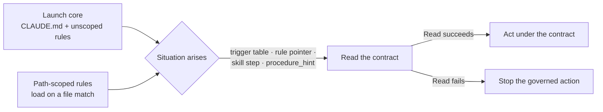

# Architecture Deep Dive

> This document covers advanced architectural details. For general usage, see [README.md](../README.md).

## Agentic Control Stack

This plugin implements a complete agentic control loop architecture. Each layer maps to specific plugin components:

| Layer | sd0x-dev-flow Implementation | Key Files |
|-------|------------------------------|-----------|
| **Feedforward Gate** | Blocking guards on sensitive-path edits and on mis-launched Codex dispatches; the `/precommit` runner (lint:fix → build → test) | `hooks/pre-edit-guard.sh`, `hooks/pre-bash-codex-launch-guard.sh`, `skills/precommit/SKILL.md` |
| **Feedback Loop (MAPE)** | Independent review (`/codex-review-fast`) → fix → re-review until no blocking finding remains, then `/precommit` — after the last edit in the change class (terminal completion invariant) | `rules/auto-loop.md` |
| **Hierarchical Loops** | Inner (hooks: reminders and guards on each tool call) → Mid (review + precommit per change) → Outer (PR review, branch review, lessons promoted to rules) | `hooks/` → `skills/` → `rules/` |
| **Sensors** | `audit.js`, `analyze.js`, `risk-analyze.js`, `skill-lint.js` | `skills/*/scripts/*.js` |
| **Effectors** | Edit/Write tools, allowed-tools whitelist, diff budget | `skills/*/SKILL.md` frontmatter |
| **Human Governance** | The closed Anchor Register, knowledge curation in `rules/`, and the enumerated `⚠️ Need Human` exits | `rules/discretion.md`, `rules/auto-loop.md` |

### Control Loop Pathology & Mitigation

| Failure Mode | Symptom | Mitigation in sd0x-dev-flow |
|--------------|---------|----------------------------|
| **Oscillation** | Fix test1 breaks test2, revert loops | Stall detection: three review rounds that close no finding trigger a diagnosis and one bounded adjustment; a second cap hit or a fourth stall goes to the human (`rules/auto-loop.md` § Stall Detection and Diagnosis) |
| **Local Minimum** | Tests pass via hacks (deleted assertions) | Independent Codex review (never feed conclusions) as second sensor |
| **Divergence** | Diff grows unbounded, unrelated changes | A frozen scope baseline with recorded exits for out-of-scope findings (`rules/scope-discipline.md`); git operations that publish or rewrite history run only through the approval workflows the Anchor Register enumerates |

## Context Architecture (5.0)

Instructions reach the model through three paths. 5.0 moved most detailed procedures out of the launch core into contracts under `skills/*/references/`, and the override resolution rules into the path-scoped `rules/override-contract.md` ([README § Why v5](../README.md#why-v5)):

| Element | Role | Key files |
|---------|------|-----------|
| Launch core | What must hold before the task is known: the Anchor Register, gates, tiers and the contract index | `CLAUDE.template.md`, the `rules/*.md` without `paths:` frontmatter |
| Residency budget | Holds the plugin-managed launch core of a rendered fresh install to ≤ 50,000 characters / 600 lines; every block is listed in a manifest | `docs/features/rules-residency/residency-manifest.json`, `test/rules/residency-budget.test.js` |
| Contract triggers | Map eight situations to the contract to Read first | `CLAUDE.template.md` § Contract Triggers |
| Plugin root | Printed at SessionStart so the `skills/…` contract paths resolve | `scripts/namespace-hint.sh` |
| Procedure hints | Advisory facts in the reminder state — repeated failed rounds, an edited override file, a long feature doc — naming the contract that applies | `scripts/review-state.js` |
| Fail-closed Read | A contract that cannot be Read stops the action it governs | the Read-first pointer in each rule that names a contract |

The tests establish that the routes exist and the budget holds (`test/rules/contract-routing.test.js`, `test/rules/residency-budget.test.js`); they do not establish that every session recognizes every situation.

## Command Template Sandbox Rules

When writing `!` backtick context checks in command templates, be aware of Claude Code sandbox restrictions:

| Problem | Solution |
|---------|----------|
| `ls`/`find` on home-dir paths blocked in `!` context checks | Use `bash -c 'test -f "$HOME/..." && echo ok \|\| echo missing' 2>/dev/null \|\| echo "unknown (sandbox)"` |
| `allowed-tools` pattern must match `!` check commands | If `allowed-tools: Bash(bash:*)`, wrap all `!` checks in `bash -c '...'` |
| `${CLAUDE_PLUGIN_ROOT}` unavailable in command `.md` | Cannot narrow `allowed-tools` to specific script paths; keep `Bash(bash:*)` until [#9354](https://github.com/anthropics/claude-code/issues/9354) resolved |

## Script Fallback Pattern

Verification commands (`/precommit`, `/verify`, `/dep-audit`) use a **Try → Fallback** pattern:

1. **Try**: If a runner script is installed in the project (`.claude/scripts/precommit-runner.js`, etc. — `/install-scripts` copies them), use it for fast, deterministic execution.
2. **Fallback**: If no script is found, Claude detects the project ecosystem (Node.js, Python, Rust, Go, Java) and runs the appropriate commands directly.

The fallback works out of the box with no setup required. The runner scripts ship with the plugin, but skills look for the installed copy under `.claude/scripts/` because of a [Claude Code limitation](https://github.com/anthropics/claude-code/issues/9354) (`${CLAUDE_PLUGIN_ROOT}` is unavailable in command markdown).
