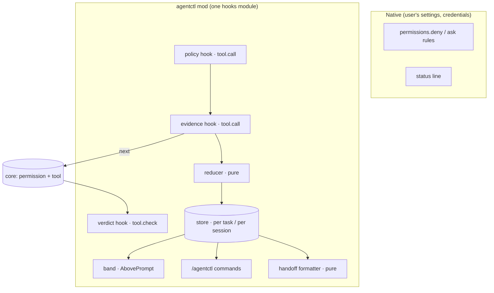

# Agent Control Plane Mod — Technical Spec

> **Doc class**: Lifecycle — Phase 2 technical spec (per `@rules/docs-numbering.md`).
> **Created**: 2026-10-03
> **Requirements**: [1-requirements.md](./1-requirements.md) · **Feasibility**: [0-feasibility-study.md](./0-feasibility-study.md) (Option A, § 6 rules) · **Intent**: [intent-agent-control-plane-mod.md](./intent-agent-control-plane-mod.md)
> **Host**: Claude Code 2.1.288; every API named here is in the type declarations the host writes beside a mod. The mod's code lives in `mods/agentctl/` of this repository, on no path the sd0x-dev-flow plugin loads or packages (intent Non-goals, re-decided 2026-10-04); users install it through the `/agentctl-setup` skill (the `agentctl` entry in this marketplace) or load it per session with `--plugin-dir mods/agentctl`.

## 1. Requirement Summary

- **Problem**: supervise one delegated Claude Code session without reading its transcript (requirements § 1).
- **Goals**: one band and `/agentctl` text that show task, state, evidence and intervention reasons with source and time; task-scoped refusal that never weakens a deny; evidence bound to tree readings; a model-free hand-over; stop with honest reporting.
- **Scope (v1)**: one interactive session on one Mac; FR-1..FR-10, FR-12..FR-19, FR-23..FR-26. **Out**: pause (FR-11), multi-session (FR-20), off-machine notices (FR-21), model summary (FR-22), any sidecar service.
- **Hard boundaries are not this mod's job**: production read-only stays with credentials and target IAM/RBAC; named dangerous invocations stay in the user's own `permissions.deny` settings. The mod adds task scope on top.

## 2. Existing Code Analysis

| Source | Reused for | Note |
|---|---|---|
| Spike `sd0x-gate-band` (`hooks/register.js`, `hooks/summarize.js`) | Band rendering beside other bands, `$.command.register`, gate reading via `review-state.js check --format=json` | Presentation patterns and the `unknown` rendering tests carry over |
| Spike `acp-verify` (`hooks/register.js`, `tests/verify.test.ts`) | The `.catch` pattern (`called` → replay, else deny) and the § 3.4 verdict table | 8 tests pass under `claude plugin test` |
| `scripts/review-state.js` | Gate slots (read only, `check` never `note`) | Located installed-copy first, as the spike does |
| `scripts/precommit-runner.js`, `scripts/verify-runner.js` | Not started by the mod | They note verdicts; starting them would make the mod a verdict producer (FR-19) |

The mod changes none of sd0x-dev-flow's hooks, gates or verdict producers; its only additions are the opt-in setup skill and the marketplace entry (§ 3.5).

## 3. Technical Solution

### 3.1 Architecture



Modules (plain ES modules; no Node APIs, no dynamic import — create page § static analysis):

| File | Responsibility | Side effects |
|---|---|---|
| `hooks/register.js` | Wiring only: registers hooks and commands, calls the modules below | `$` calls |
| `lib/policy.js` | `classify(task, call) → {outcome, rule}` — pure | None |
| `lib/adapters.js` | Per-command argv grammars for observational commands | None |
| `lib/verdict.js` | `combine(outcome, downstream, surfaceVerified) → decision` (§ 3.4) | None |
| `lib/fingerprint.js` | Builds `git` argv lists and folds their output into a fingerprint | None; `register.js` runs them |
| `lib/reducer.js` | `reduce(state, observation) → state` over the four dimensions (FR-4) | None |
| `lib/sanitize.js` | Redacts command text, URLs, paths, errors (NFR-9) | None |
| `lib/handoff.js` | `handoff(state, task) → markdown` answering the eight questions | None |
| `lib/view.js` | Band, `/agentctl` and policy text from state; the `AbovePrompt` element is built in the `ui.render` hook of `register.js` | None |
| `lib/notices.js` | Notice de-duplication and task-notification parsing (FR-24, V5) | None |
| `lib/store.js` | Store keys, task scoping, the per-session write chain, retention | `$.store` through `register.js` |

Keeping every decision in pure modules is what makes `claude plugin test` cover them without a session.

### 3.2 Data Model (`$.store`, 4 MiB total)

| Key | Value | Writer |
|---|---|---|
| `task/<scope>` | `{ id, goal, worktree, allow: [classes], editRoots: [paths], forbid: [classes], executors: [{argv, check: bool}], needsUser: [argv], tools: [names], acceptance: [text], policyVersion, result, confirmedAt }` | `/agentctl task` from a **composer** origin only (FR-25) |
| `binding/<worktreeKey>` | `taskId` | same |
| `session/<sessionId>` | `{ taskId: <scope> or null, surface, interactive, startedAt, state, decisions: [PolicyDecision ≤ 50], evidence: {checkKey → Evidence}, notices: {reason → {at, severity, active}}, health }`; `state` is the reducer's `{ phase, runtime, interventions: {reason → {since, detail, severity}}, result, ops: {tool_use_id → Operation}, background, lastEventAt }` | hooks of this session only |
| `checkpoint/<scope>/<sessionId>` | `{ savedAt, taskId, markdown }` — the last hand-over | this session's `/agentctl handoff` and `/agentctl stop`; nothing is saved automatically at session end |

- `<scope>` is `<worktreeKey>:<taskId>` (`taskScope` in `lib/store.js`): task ids are chosen at the prompt and not unique across worktrees, so the same id in two worktrees names two separate tasks and hand-overs. A binding whose record is missing resolves to a task that refuses everything but reads in the worktree. A record or checkpoint written before scoping (`task/<taskId>`, `checkpoint/<taskId>/…`) is read only when that legacy record names the current worktree.
- `Operation`: `{ requested (sanitized), startedAt, endedAt?, outcome: 'refused'|'error'|'ok'|'backgrounded'|'unresolved', backgroundId? }`, capped at 200 per session, oldest resolved first.
- `Evidence`: `{ checkKey, requested, outcome, before: Fingerprint, after?: Fingerprint, coverage, at }`; freshness is computed on read against the current fingerprint (FR-5).
- Writes are **serialized per session** through one promise chain in `register.js`. Every key a hook writes carries the session id (`session/*`, `checkpoint/<scope>/<sessionId>`), so no two sessions write one record; `task/*` and `binding/*` are written only by a composer command (feasibility § 7, store race). Resume shows the checkpoint with the newest `savedAt` among the scoped task's sessions.
- Retention: at `session.start`, session records older than 7 days, and all but the 5 newest sessions and checkpoints per task, are deleted; text fields are capped (requested command 500 chars, reasons 300, hand-over 16 KiB); evidence keeps the latest record per check. A failed store write sets `health: store-error`, which the band and `/agentctl` show.
- Sources stay apart (FR-25): `task/*` is user-confirmed; Claude's claims are never stored as facts; `ops` and `evidence` are tool-observed.

### 3.3 Commands (`$.command.register` with `immediate: true`, answered without a model call)

| Command | Reply |
|---|---|
| `/agentctl` | Status text: the band's fields with source and age (FR-2, FR-3, FR-17) |
| `/agentctl task show` · `task set <json>` · `task clear` | Show, set or clear the task; `set`/`clear` refused unless `e.origin.kind === 'composer'`. `set` validates the input (bounded `id`, array fields, no credential-like policy value), then stores only an allowlisted record with `goal` and `acceptance` redacted |
| `/agentctl policy` | Effective classes, executors, the policy version, and the disclosed limits (host skips, other mods, text-matching native rules) |
| `/agentctl events [n]` | Last `n` operations and decisions, sanitized |
| `/agentctl handoff` | The hand-over markdown from records and the last tree reading — no process, model or network call; also saved to `checkpoint/<scope>/<sessionId>` |
| `/agentctl stop` | § 3.4 stop |

### 3.4 Core Logic

**Policy at `tool.call`** (FR-7, FR-10):

```js
on('tool.call', ($, e, next) => {
  const v = classify(task, e)            // pure; throws → .catch
  if (v.outcome === 'deny' || v.outcome === 'unknown') return { deny: refusal(v) }
  return next(e)                          // evidence hook beneath records the call
}).catch(($, e, next) => (next.called ? next(e) : { deny: 'agentctl: policy check failed; refused' }))
```

`classify` order — **deny takes precedence over every pass**:

1. No bound task → pass-through (the mod observes only).
2. Bash: split on `|` only between adapter commands; any other operator, substitution, redirection or unparseable quoting → `unknown`.
3. **Forbidden first**: the built-in hard classes (production write: `kubectl apply|delete|patch|rollout|scale|edit`, `helm install|upgrade|uninstall|rollback`, `gcloud … deploy|delete|update`; remote git write: `git push`, `gh pr merge`) and every `task.forbid` class are matched against **each** pipeline segment → `deny`, before any adapter or executor is consulted. An authorized executor that also matches a forbidden class is denied, and `/agentctl task set` rejects a task whose executors or needs-user entries overlap its forbidden classes.
4. Exact argv prefix in `task.needsUser` → `needs-user`.
5. First word → adapter grammar (`git` read forms, `ls`, `cat`, `head`, `tail`, `wc`, `rg`/`grep` without exec/pre/config options) → `pass`.
6. Exact argv prefix in `task.executors` → `pass` (authorized, effects unclassified).
7. Anything else → `unknown`.

Non-Bash: `Read` → pass inside the worktree; `Write`/`Edit`/`NotebookEdit` → pass only when the task allows edits and the path is inside an allowed root, else deny; the host-internal `AskUserQuestion`, `TodoWrite`, `GetTask` and `ToolSearch` → pass (they change nothing outside the session, and refusing them would break supervision itself); MCP and every other tool → `unknown` unless the task names it.

**Registration** (2.1.288 refuses a second unmatched registration of one event in a module, measured): the policy hook is the module's unmatched `tool.call`, registered first and therefore outermost; it also records start and end for allowed non-Bash calls. The evidence hook is `tool.call` with the `{ tool: 'Bash' }` matcher, nested beneath it; a third, `{ tool: 'GetTask' }`, observes terminal background results. Main-loop turns only: `turn.start`/`turn.complete` carrying an `agentId` are ignored, and a completion clears the held turn only when its `turnId` matches.

**Verdict at `tool.check`** — never weaken a deny (feasibility § 6):

| Downstream | Outcome | Result |
|---|---|---|
| any | deny / unknown | `deny` |
| `deny` | other | `deny` unchanged |
| `allow`/`ask` | pass | downstream unchanged |
| `allow`/`ask` | needs-user, surface verified | `ask` |
| `allow`/`ask` | needs-user, otherwise | `deny` + recorded |

"Surface verified" means the interactive terminal under the `default`, `acceptEdits` or `auto` permission mode — the only combinations where a host dialog was recorded (T8). The mode is read from classic hook inputs (`permission_mode` on `classic.UserPromptSubmit`, `classic.PostToolUse`, `classic.PermissionRequest`); an unknown mode, `-p`, `dontAsk`, `plan`, `bypassPermissions` and every other surface keep needs-user refused. The mod never creates an `allow`: `allow` leaves this hook only as an unchanged downstream `allow` on a pass-through call, and no downstream verdict is ever upgraded.

**Evidence** (FR-5, FR-6): the evidence hook runs beneath the policy hook. For a call whose argv matches an executor marked `check`, it reads a fingerprint before `next(e)` and after the result settles; the record is keyed by an opaque `check-<digest>` of the executor argv, through `$.process.run` with `timeoutMs` on each command:
`git --no-optional-locks -c core.fsmonitor=false rev-parse HEAD` · `… ls-files -s -z` · `… status --porcelain=v2 -z --untracked-files=all` · `git hash-object --no-filters --stdin-paths` for changed and untracked paths, at most 500 (`MAX_HASHED_PATHS`; more reads as partial). `assume-unchanged`/`skip-worktree` entries, conflicts, submodules, an unreadable path or a timeout set `coverage: partial`. A read where every git command failed records `evidence unavailable`; it never refuses. While evidence exists, the tree is re-read every 30 s and at each turn end, so a later edit shows the result stale within 30 s; the gate reading is refreshed on the same tick and the band shows its age and a stale marker. A `backgroundTaskId` result records `backgrounded`; only an observed terminal status closes it — a `GetTask` result, or the host's task notification (a `prompt.submit` whose origin is `task-notification`, carrying `<task-id>` and `<status>`; measured on 2.1.288). A prompt of any other origin closes nothing.

**State** (FR-4): the reducer folds `turn.start`, `turn.complete`, `tool.call` results, `classic.PermissionRequest`, `classic.Stop` (`background_tasks` → "in flight as of T"), `session.measure` and refusals into the four dimensions. "Suspected stall" requires: no turn or tool event for the idle threshold **and** no tool running **and** no background task in flight; it is always labelled unconfirmed.

**Notices** (FR-24): one `$.ui.toast` per intervention reason; repeated only when the reason clears and returns, or its severity rises; cool-down 10 min.

**Stop** (FR-12): `/agentctl stop` saves the hand-over first, then calls `$.turn.abort({ turnId })` for the turn held from `turn.start`; a rejection is reported as "cancellation request failed; turn outcome unconfirmed" with the sanitized reason, and "turn ended" appears only after a `turn.complete` or `turn.abort` for that id is observed; each tracked operation is listed with its observed state; the text never says "all stopped".

**Resume** (FR-13, FR-16): on `session.start` the mod re-binds the task by worktree key, writes the whole newest checkpoint to the transcript with `$.ui.log` (not sent to the model; `-p` receives it as `ui_log`) before any work, marks it in the band, and replays nothing; `/agentctl` returns the stored checkpoint read-only. The mod holds no approvals, so none carries over.

**Sanitize** (NFR-9): before every store write and every reply, strip URL userinfo, query and fragment, `KEY=value` assignments whose key matches `/token|secret|pass|key|auth|cookie/i`, bearer headers, and values of `--token`-style flags. Paths are not shortened: a path is shown as given, after these redactions.

### 3.5 Distribution and Setup

The mod is a second, optional plugin in this repository's marketplace (`agentctl`, source
`./mods/agentctl`); the sd0x-dev-flow plugin never loads or packages it. `/agentctl-setup` is the
opt-in, and its deterministic half is `skills/agentctl-setup/scripts/agentctl-setup.js`:

| Subcommand | Does | Writes |
|---|---|---|
| `doctor` | Claude Code ≥ 2.1.288, `git`, the mod's manifest, `disableAllHooks` in user/project settings, install state from `claude plugin list --json` (`false` not installed, `null` unreadable, `{ id, enabled }`) | Nothing |
| `alloc` | Creates a 0600 answers file in a fresh 0700 temporary directory and prints its path; the skill writes the free-text answers there with the Write tool, so they never pass through a shell | That temporary file |
| `task-line --input <file>` | Reads the answers once and deletes their directory; builds `/agentctl task set {...}`; runs the mod's own `validateTask`, then `classify` on every check (must pass) and needs-user command (must ask) | Nothing persistent (removes its input) |
| `deny-rules` | Lists, or with `--write` merges, recommended native `permissions.deny` rules into the settings file the user picked, keeping every other key; never offers `git push`, which `/push-ci` needs | The chosen settings file, atomically |

The skill asks before each install, enable, settings write and uninstall, and never sends the task
line: the mod accepts it only from the user's own prompt. `mods/agentctl/package.json` declares the
ES-module format so `task-line` loads the mod's validator on Node versions without syntax detection.

## 4. Risks and Dependencies

| Risk | Mitigation |
|---|---|
| Mods API changes between releases | Version-pinned README; `claude plugin validate` inventory checked in tests; fallback is the native baseline (feasibility § 4 Option 0) |
| Adapter grammar too narrow for real work | Authorized executors per task; `/agentctl policy` names what was refused and why |
| Adapter grammar too wide | Unknown options are refused; ambient channels (`core.fsmonitor`, textconv, `RIPGREP_CONFIG_PATH`) declared per adapter and refused when set by the command |
| Host skips the hook (worker crash), another mod weakens a verdict | Disclosed in `/agentctl policy` and the hand-over; hard classes stay in native rules |
| Store race or 4 MiB cap | Per-session keys, one write chain, bounded records |
| Fingerprint cost on large dirty trees | Per-command timeouts → partial; measured in V8 before targets are fixed |

Dependencies: Claude Code ≥ 2.1.288 with mods enabled (V1 passed: no managed settings on this machine), `git` on `PATH`.

## 5. Work Breakdown

| # | Task | Requirements | Done when |
|---|---|---|---|
| 1 | Scaffold the mod repository; `sanitize`, `reducer`, store write chain | FR-3, FR-4, NFR-1, NFR-9 | Unit tests for every reducer transition and every redaction example pass |
| 2 | `policy` + `adapters` | FR-7, FR-8, FR-25 | Pass/deny/needs-user/unknown table tests, including the evasions in feasibility § 6 and an authorized prefix that overlaps a forbidden class |
| 3 | `tool.call` / `tool.check` wiring with `.catch` and the § 3.4 table | FR-7, FR-9, FR-10, NFR-3 | Signals 5, 6, 10 as tests |
| 4 | Evidence hook + fingerprint | FR-5, FR-6 | Signals 3, 4 as tests with `process.run` stubs; partial coverage cases |
| 5 | Band + `/agentctl`, `policy`, `events` | FR-2, FR-3, FR-17, FR-23 | Signal 2; band coexists with other bands |
| 6 | Task command, binding, resume, hand-over | FR-1, FR-13, FR-15, FR-16, FR-25 | Signals 1, 8 |
| 7 | Stop + notices | FR-12, FR-18, FR-24 | Signals 7, 11 |
| 8 | Live verification V3–V10, README with tested version, removal check | FR-26, NFR-4, NFR-7 | Results recorded; Signal 12 |
| 9 | `/agentctl-setup` skill, marketplace entry, setup helper | FR-26, NFR-7 | Helper tests pass; a real install from the marketplace loads the mod and its removal restores settings |

## 6. Testing Strategy

| Layer | Tool | Covers |
|---|---|---|
| Unit | `claude plugin test` on pure modules | classifier tables, verdict table, reducer, sanitizer, hand-over text |
| Hook | `claude plugin test` with `on('tool.call'/'tool.check'/'process.run')` stubs | refusal before core, `.catch` both branches, evidence brackets, `unknown` rendering |
| Inventory | `claude plugin validate` | Hooks and `$` calls: no `$.model.*`, `$.http.*`, `$.tool.register`, prompt writes (Signal 9) |
| Live | A scratch repository and a dev-mod load, never production | V3–V10 |

Acceptance follows requirements § 8 Signals 1–12; each request ticket names the signals it closes.

## 7. Open Questions

- [ ] V3: what Desktop, VS Code, mobile, `plan` and `bypassPermissions` do with `ask` — until answered, needs-user is denied there (the interactive terminal under `default`, `acceptEdits` and `auto` is verified, T8).
- [ ] V5: does `GetTask` accept a Bash `backgroundTaskId`; until answered, background checks stay "completion unobserved" unless a terminal result is seen.
- [x] Mod location: `mods/agentctl/` in this repository (2026-10-04, user decision). T1–T8 were built in a separate local repository first; the agentctl-mod commit IDs the tickets cite are from that history, which was not imported.
