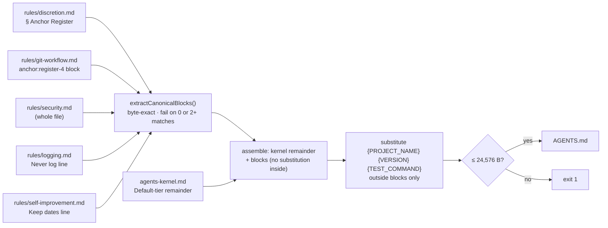

# Claude Code 2.1.288 Compatibility — Technical Spec

> **Current behavior authority**: Yes
> **Doc role**: Current authority
> **Intent**: [intent-claude-code-2-1-288-compat.md](./intent-claude-code-2-1-288-compat.md)
> **Origin**: `/deep-research` (3 shards: official docs + local changelog, this repo, community)
> and `/codex-brainstorm` equilibrium, 2026-10-03 (thread `01a0ff77-7037-7752-a7e6-df87324ad45c`,
> 3 rounds). The research record is the conversation; the decisions are restated here.

> Claude Code moved under the plugin between 2.1.277 and 2.1.288. This spec adapts sd0x-dev-flow
> to the host as it now behaves — compatibility first — and records what was deliberately **not**
> adopted. No Anchor, gate or resident rule changes.

## 1. Requirement Summary

- **Problem**: five host changes interact with shipped behaviour.
  (a) `AGENTS.md` is read natively (2.1.277; alone when no `CLAUDE.md`, or beside it under
  `claude-md-and-agents-md`) — the kernel `/codex-setup` generates is 2 KB, lists two precommit
  sentinels where `rules/auto-loop.md` defines four, carries no git prohibition, and the premise
  NG-1 of `docs/features/harness-engineering-adoption/2-tech-spec.md` ("Claude Code only reads
  CLAUDE.md") is false. (b) 2.1.286 tells Claude to run a skill named `verify` before commits;
  ours runs lint→typecheck→unit→integration→e2e and prints `## Overall: ✅ PASS` — the precommit
  sentinel — so a verify run can be misread as the precommit gate. (c) Mods (2.1.287, on by
  default) run before plugin `hooks.json` PreToolUse hooks and can answer a tool call without
  reaching them; mods fail open and may approve what an `ask` rule would prompt for. (d) A
  critical-path `rm` waits two minutes in `auto`/`bypassPermissions` then is denied (2.1.281);
  `/epic-merge` removes a directory bound from `git rev-parse --git-path` in the same fence.
  (e) Send-now (Ctrl+Enter) backgrounds running tools (2.1.281); `/push-ci` documents that a
  backgrounded push on a gated repo hangs on `/dev/tty`.
- **Goals**: (1) `AGENTS.md` is safe for Claude to load alone or beside `CLAUDE.md`: every
  Anchor it carries is byte-identical to the plugin's `rules/`; (2) `/verify` cannot be mistaken
  for, or substitute, `/precommit`; (3) run-owned cleanup and backgrounded pushes are reconciled,
  not retried blindly; (4) maintenance entry points for Prompt Audit, instruction-file coexistence,
  plugin-copy origins and Directory submission; (5) a recorded, isolated assessment of Mods.
- **Scope — in**: `scripts/build-codex-artifacts.js`, `skills/codex-setup/` (kernel, `doctor`),
  `scripts/verify-runner.js`, `skills/verify/SKILL.md`, `skills/epic-merge/SKILL.md` cleanup
  fence, `skills/push-ci/SKILL.md` § When the push runs where nobody can answer,
  `skills/claude-health/SKILL.md`, `docs/hooks.md`, README wrap-up note, a new record under
  `docs/features/harness-engineering-adoption/requests/`.
- **Scope — out** (intent Non-goals): mods as credential/enforcement, YSK in review dispatch,
  Sonnet for gate agents, resident-text additions, contract copies in `.sd0x/`, guard fail-open
  policy, the `rm` timeout opt-out. The Mods spike lives in a separate companion repository;
  this repo keeps only its assessment record.

## 2. Existing Code Analysis

| Module | Today | Change |
|--------|-------|--------|
| `scripts/build-codex-artifacts.js` | Reads `skills/codex-setup/references/agents-kernel.md` (`findKernelTemplate`), substitutes `{PROJECT_NAME}` `{VERSION}` `{TEST_COMMAND}`, enforces `BYTE_LIMIT` 24,576 | Assemble canonical blocks before substitution; new failure modes |
| `skills/codex-setup/references/agents-kernel.md` | 2,106 B; "fix every issue"; two sentinels; `.sd0x/scripts/…` runner paths; no Anchor text | Becomes the Default-tier remainder plus block placeholders |
| `skills/codex-setup/SKILL.md` § init Phase 2 / § doctor | Generates, hashes into `.sd0x/install-state.json`, `doctor` detects drift | `doctor` gains an instruction-file coexistence row |
| `rules/discretion.md` § Anchor Register, `rules/git-workflow.md` `anchor:register-4` markers, `rules/security.md`, `rules/logging.md` "Never log" line, `rules/self-improvement.md` "Keep dates…" line | Canonical Anchor carriers; the first two byte-pinned by `test/rules/discretion-tiers.test.js`, every resident unit digest-pinned by `test/rules/kernel-digests.test.js` | Read-only sources for extraction |
| `scripts/verify-runner.js` summary writer; `skills/verify/SKILL.md` output templates | `## Overall: ✅ PASS / ❌ FAIL`; `verify-runner.test.js` pins PASS when every step is skipped | `## Verify:` prefix; commit-context branch |
| `scripts/review-state.js check --format=json` | Per-plane `{noted, dirty, digest_match, verdict, rounds, passed, owed}` | Consumed by `/verify` commit context (`precommit.passed`) |
| `skills/epic-merge/SKILL.md` § Remove manifest files | `MANIFEST_DIR=$(… git rev-parse --git-path epic-merge)` then `/bin/rm -rf "$MANIFEST_DIR"` in one fence | Measured against the host's critical-path table; rewritten only if flagged |
| `skills/create-pr/SKILL.md` guarded block | `rm -rf -- '<literal mktemp path>'` | Test only: operand is a literal |
| `skills/push-ci/SKILL.md` § When the push runs where nobody can answer | "Never background a push on a gated repo"; refusal vs hang | Add reconcile-before-retry |
| `skills/claude-health/SKILL.md` Hygiene C1–C7, Sync S1–S3, Budget B1–B3 | No instruction-content audit; no plugin-origin inventory | Manual Prompt Audit pointer; origin inventory row |
| `docs/hooks.md`, `README.md` | — | Host fail-closed sentence; wrap-up note |
| Tests | `test/scripts/build-codex-artifacts.test.js`, `test/skills/codex-setup.test.js`, `test/scripts/verify-runner.test.js`, `test/skills/claude-health.test.js`, `test/skills/epic-merge.test.js`, `test/skills/push-ci.test.js` | Extended per § 6 |

## 3. Technical Solution

### 3.1 Architecture

The generator is the only writer of Anchor text outside `rules/`; a maintainer never edits the
Anchor portion of `AGENTS.md` by hand, and `/codex-setup doctor` compares the installed file's
hash as it does today.

### 3.2 Kernel assembly model

| Block id | Source | Boundary | Bytes (5.0.0) |
|----------|--------|----------|---------------|
| `anchor-register` | `rules/discretion.md` | from the `## Anchor Register` heading to the next `## ` heading | 3,326 |
| `register-4` | `rules/git-workflow.md` | between `<!-- anchor:register-4:begin -->` and `<!-- anchor:register-4:end -->`, marker lines and the boundary line breaks excluded | 2,655 |
| `security` | `rules/security.md` | whole file, frontmatter stripped if present | 1,063 |
| `never-log` | `rules/logging.md` | the single line starting `Never log:` | ~110 |
| `redaction` | `rules/self-improvement.md` | the single line starting `Keep dates,` | ~230 |

Rules: a boundary that matches zero or more than one region fails generation (exit 1, naming
the block); no placeholder substitution runs inside a block; blocks are emitted under one
`## Anchors (verbatim from sd0x-dev-flow rules)` heading in the order above, each introduced by a
one-line source citation (`rules/<file>` § heading); the assembled output is ~9.3 KB.

The remainder of `agents-kernel.md` is rewritten to agree with the resident rules at Default tier:
four precommit sentinels (`✅ PASS`, `⛔ FAIL`, `❌ FAIL`, `⚠️ NO CHECKS RUN`); "fix every issue"
replaced by the owed-finding rule (mandatory at or above the tier's blocking severity, admitted
findings, recorded scope exits); verification distinguished from precommit; the 5.0 Read rule —
procedures live in the sd0x-dev-flow plugin, stop the governed action when a referenced contract
cannot be read — with a plugin-root locator only when `/codex-setup` resolved one. A grant named in
the Register (`/push-ci`, `/smart-commit --execute`) is not evidence the workflow is installed;
the kernel says so.

### 3.3 Generator and doctor interface

| Surface | Change |
|---------|--------|
| `build-codex-artifacts.js` | New `--rules-dir <dir>` (default: the plugin's own `rules/` beside the script); exit 1 with `Error: canonical block <id> …` on a boundary failure; existing flags unchanged |
| `/codex-setup init` Phase 2 | Unchanged call; the sync hash now covers the assembled file |
| `/codex-setup doctor` | Two new rows. **Instruction files**: which of `CLAUDE.md` / `.claude/CLAUDE.md` / `CLAUDE.local.md` / `AGENTS.md` exist in the working directory and its ancestors, the effective `instructionFiles` mode read from user or managed settings (project settings are ignored by the host; unreadable → "default assumed"), and what therefore loads: under `claude-md-or-agents-md` (default) AGENTS.md loads only when no CLAUDE.md variant — `CLAUDE.local.md` included — exists in the tree; under `claude-md-and-agents-md` both load, CLAUDE.md first, and a local file suppresses nothing; under `claude-md` and `managed-only` AGENTS.md never loads. **AGENTS.md freshness**: the installed file compared with freshly generated expected content, so an upgraded plugin with an untouched old kernel reports drift (today the hash check only catches hand edits) |

### 3.4 Core logic per batch

**Batch 1 — kernel and coexistence (P0).** § 3.2–3.3 above, plus a dated record
`docs/features/harness-engineering-adoption/requests/2026-10-<dd>-ng1-agents-md-native.md` stating
that NG-1's premise ended with Claude Code 2.1.277 and that the generator is now a first-class
entry point; the original spec row is not edited.

**Batch 2 — workflow compatibility (P1).**
- `verify-runner.js` writes `## Verify: ✅ PASS / ❌ FAIL`; both templates in `skills/verify/SKILL.md`
  follow. `rules/auto-loop.md` § Gate Sentinels keeps `## Overall:` for precommit alone.
- `skills/verify/SKILL.md` gains § Commit context: when reached through the host's pre-commit
  guidance, read `review-state.js check --format=json`; if `precommit.passed === true`, report
  "Precommit already passed at the current code digest; no new checks executed" and stop — no
  sentinel, no note; otherwise, or when the check is unreadable or malformed, run `/precommit`.
  Ordinary `/verify` is unchanged.
- `/epic-merge`: run the cleanup fence's exact shape against the host in `auto` mode on a fixture
  and record the classification. If flagged: resolve and validate the manifest path in one Bash
  call, read it, remove the **literal** path in the next call; a fresh Bash call does not carry
  the first call's variable, so the literal must be re-read, never re-derived; a target that is a
  critical path stays refused. `/create-pr`: a test that the removal operand is the literal
  `mktemp -d` result.
- `/push-ci` § When the push runs where nobody can answer: a backgrounded push may be pending,
  hung, failed or already published — inspect the task and `git ls-remote` the branch before any
  retry; a new user message is not a push credential (Register #4 unchanged).

**Batch 3 — maintenance and distribution (P2).**
- `/claude-health`: a manual **Prompt Audit** step naming `/doctor prompt-audit [path]`
  (report-only; plugin-shipped content is report-only; Anchor pins reject any proposed edit to
  pinned text), and an S4-style **plugin copies** row listing local `.claude/`, marketplace and
  `~/.claude/skills/synced/` origins with versions.
- Directory preflight checklist (`docs/features/claude-code-2-1-288-compat/checklist-directory.md`):
  hook commands already use `${CLAUDE_PLUGIN_ROOT}` paths; README discloses that review skills
  shell out to the Codex CLI and that `gh` reaches GitHub; the 944 tracked files (>512) and the
  three non-image files over 256 KiB (`banner.jpg` is the fourth tracked file over the size but images
  are exempt from that check) are accepted holds — nothing is pruned to pass review.
- `README.md` § Why v5 or § Rules & Hooks: one paragraph on the wrap-up allowance — it helps reach
  a stopping point, does not close a gate, and Stop hooks may not fire during it.
- `docs/hooks.md`: one sentence that 2.1.288 blocks a PreToolUse/PermissionRequest hook whose
  matcher or input fails to evaluate — host behaviour, documented not tested — and that the
  plugin's guards keep their documented fail-open on missing `jq`/`node`.

**Parallel — Mods assessment (separate repository).** Presentation-only companion mod loaded with
`--plugin-dir`: a band showing `review-state.js check --format=json` via `$.process.run`. Five
questions, recorded as a report in this repo's `requests/` when the time box ends: correctness of
facts across valid/stale/missing/failed state; presentation-only (no verdict writes, permission
decisions, approval controls, prompt rewrites, model routing); lifecycle (hot reload, disable,
`/clear`, worktree change, worker crash); behaviour where mod UI is not drawn (VS Code, `-p`,
cloud); cost. Not incorporated while the mods types header says the surface may change without
notice, and then only by a separate decision.

## 4. Risks and Dependencies

| Risk | Mitigation |
|------|-----------|
| Canonical source missing or ambiguous at generation time | Fail generation; never fall back to handwritten Anchor text (INV-001) |
| Installed `AGENTS.md` stale after a plugin upgrade | Today `doctor` compares the installed file with the hash recorded at install time, which catches hand edits but not an upgrade; task 3 adds a comparison against freshly generated expected content (upgrade fixture), and the version-mismatch warning plus `/codex-setup sync` remain the remedy |
| Dual loading raises Claude's launch context by ~9 KB | Measure the `claude-md-and-agents-md` configuration separately; the residency budget test does not cover it |
| `/verify` reuse mis-attributed | Reuse keyed only on `precommit.passed === true`; no new sentinel, no note (INV-003) |
| Codex-only project has grants but no workflows | Kernel states the Read-fails-stop rule and that a grant is not an installation (INV-004) |
| Backgrounded push retried blindly | Reconcile task + remote first (INV-005) |
| Cleanup rewrite loses path provenance | Literal re-read across calls; critical targets stay refused (INV-006) |
| Shell tests mistaken for host evidence | Label host behaviour as documented (INV-007) |
| Directory review holds | Accepted and recorded; no pruning |
| Mods spike grows into a migration | Time box, separate repo, five-question deliverable |

Dependencies: Claude Code ≥ 2.1.277 for native `AGENTS.md`, ≥ 2.1.286 for the `verify` guidance,
≥ 2.1.288 for the hook fail-closed note; none of the changes requires a minimum version to install.

## 5. Work Breakdown

| # | Task | Batch | Files | Depends on |
|---|------|-------|-------|------------|
| 1 | `extractCanonicalBlocks()` + assembly + `--rules-dir`; failure modes | 1 | `scripts/build-codex-artifacts.js`, `test/scripts/build-codex-artifacts.test.js` | — |
| 2 | Rewrite the kernel remainder; four sentinels; owed-finding rule; Read-fails-stop rule | 1 | `skills/codex-setup/references/agents-kernel.md`, `test/skills/codex-setup.test.js` | 1 |
| 3 | `doctor` instruction-files row + AGENTS.md freshness row (upgrade fixture) | 1 | `skills/codex-setup/SKILL.md`, `test/skills/codex-setup.test.js` | — |
| 4 | NG-1 superseded record | 1 | `docs/features/harness-engineering-adoption/requests/…` | — |
| 5 | `## Verify:` summary + templates | 2 | `scripts/verify-runner.js`, `skills/verify/SKILL.md`, `test/scripts/verify-runner.test.js` | — |
| 6 | `/verify` § Commit context | 2 | `skills/verify/SKILL.md`, `test/skills/verify.test.js` (new) | 5 |
| 7 | `/epic-merge` cleanup shape measured; rewrite if flagged; `/create-pr` literal-operand test | 2 | `skills/epic-merge/SKILL.md`, `test/skills/epic-merge.test.js`, `test/skills/create-pr.test.js` | — |
| 8 | `/push-ci` reconcile-before-retry | 2 | `skills/push-ci/SKILL.md`, `test/skills/push-ci.test.js` | — |
| 9 | `/claude-health` Prompt Audit step + plugin-copies row | 3 | `skills/claude-health/SKILL.md`, `test/skills/claude-health.test.js` | — |
| 10 | Directory preflight checklist + README disclosure | 3 | `checklist-directory.md`, `README*.md` | — |
| 11 | Wrap-up note; hooks.md host sentence | 3 | `README*.md`, `docs/hooks.md` | — |
| 12 | Mods assessment record | parallel | `requests/…-mods-assessment.md` (report only) | separate repo |

Each task is one request ticket under `./requests/`; code tasks run `/codex-review-fast` →
`/precommit`, doc tasks `/codex-review-doc`. Tasks 1–2 land in one PR because the generator and
the template are tested together.

## 6. Testing Strategy

| Area | Tests |
|------|-------|
| Extraction | Byte equality of each block against its source; zero-match and two-match sources fail with the block id; substitution does not touch block bytes; output under 24,576 B on the repo fixture and refused above it |
| Kernel content | Generated file contains all four sentinels and no `fix every issue`; negative control: a kernel template with a paraphrased Register line fails a "no Anchor paraphrase outside blocks" check keyed on Register item prefixes |
| Doctor | Fixtures per mode × layout: `claude-md-or-agents-md` with AGENTS-only, CLAUDE-only, both, `CLAUDE.local.md` present, and a CLAUDE.md in an ancestor; `claude-md-and-agents-md` with both and with a local file; `claude-md`; `managed-only`; unreadable settings → "default assumed". Freshness: an upgrade fixture whose installed kernel matches the install-time hash but not the regenerated content reports drift |
| Verify | Runner prints `## Verify:` and never `## Overall:`; all-skipped still PASS; commit context reuses only `passed === true` (stale digest, missing slot, malformed JSON → delegate) |
| Cleanup | `/create-pr` operand literal; `/epic-merge` shape recorded with the measured host classification; if rewritten, the literal is re-read in the removing call |
| Pins | `discretion-tiers`, `kernel-digests`, `residency-budget`, `plugin-manifest`, `hooks-json-registry` unchanged and green |
| Host behaviour | Not asserted; `docs/hooks.md` and the epic-merge record say "documented" or "measured on <version>" |

## 7. Open Questions

- Does the host classify `/epic-merge`'s same-fence `$(git rev-parse --git-path …)` assignment as a
  critical-path removal? Decides whether task 7 rewrites or only records.
- Does the Plugin Directory accept plugins whose `hooks.json` carries `modules`? Not stated
  officially; irrelevant until the spike concludes.
- The wrap-up allowance's size and whether Stop hooks fire during it — documentation only until
  published.
- `/codex-setup doctor` cannot read user-level settings on every platform; when
  `pluginConfigs["agents-md@builtin"]` is unreadable, the row reports the default mode as assumed.
