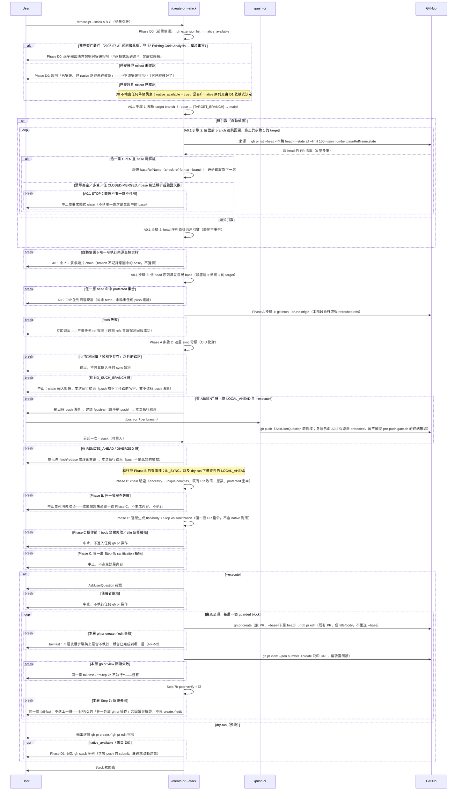

# create-pr Stacked PR Mode Technical Spec

> **Doc class**: Lifecycle — Phase 2 tech spec (per `@rules/docs-numbering.md`)
> **Created**: 2026-07-31
> **Requirements**: [1-requirements.md](../1-requirements.md)
>
> **Size disposition（2026-08-20 round 16 記入，2026-08-21 執行切分）**：切分的依據是
> `@rules/docs-numbering.md` § Size Limit **對 tech spec 的明文處置**——該節 `:51` 自陳它針對的正是
> 「the tech spec or requirements doc」，`:91` 給的切分形狀本身就是 `2-tech-spec/` 資料夾，`:97` 進一步
> 說明 `doc-classifier.js` 如何在該形狀下判定 `is_canonical`。§ Exempt 表列的是**功能性文件**
> （`skills/**`、`agents/`、`commands/`、`rules/`、模板與 fixture），其中沒有 design record。
>
> **與記錄豁免的關係，請不要簡化成任一邊**。同節 `:76`「Records are exempt from all three」逐字列的是
> request ticket／review log／ADR，理由是它們「states a point in time」；`resolveDocRole()` 另外回報本檔
> 為 `Design record`。這兩套分類回答的是**不同問題**：`resolveDocRole()` 決定的是**審查 profile 與編輯
> 政策**（漂移不算 finding、不得就地改寫），§ Size Limit 決定的是**長度政策**。本次切分的意圖只有**搬移**：
> canonical 檔名保留、入向與內部連結雙向修復，未新增論點也未改寫任何一節的主張，所以它不觸犯編輯政策；
> 而長度政策明文以 tech spec 為對象，所以它也不是在豁免範圍內硬做。
>
> ⚠️ **「純搬移」只描述切分那一步，不描述整批變更；本檔不主張後者。** 這一點 2026-08-21 round 18
> doc review 指出，量測後接受：以 `git show HEAD:docs/features/create-pr-stacked/2-tech-spec.md`（301 行）
> 為前身逐行比對，**有 31 行非空白內容在現行任何 `.md` 都找不到逐字相符者**。抽驗其中三行後，性質是
> **更早輪次的就地更正與擴寫**，不是切分造成的刪除：R6 那列現行版多了可複現的 509 行推導、`git push
> origin -- 'b1' 'b2' 'b3'` 那行現行版帶著 round 16 的安全更正、push-ci 那列現行版補上 protected-head
> 檢查的來源。也就是**資訊變多而非變少**，但「未改寫任何一節的主張」對整批而言不成立，故不再這麼寫。
>
> **可查核的只有一件**（2026-08-21 round 20 doc review 指出，量測後接受）：**前身完整保存在 `HEAD`**，
> 指令即上方那條。另一件——「切分那一步本身只搬移」——**是本檔的自述，不是可複核的主張**，前一版把兩者
> 並列為「仍然為真且可查核」是錯的。理由是保留下來的工件不足以支撐它：切分產物至今 untracked
> （`git log --all -- docs/features/create-pr-stacked/2-tech-spec/` 為空、`git status` 回 `??`），
> 切分**前**那一刻的工作樹沒有留下任何快照，`git log --all` 對前身也只有一個 commit（`187b0aa`）。
> 因此 `HEAD` 對現況的比對能重現 31 行的**總量**，卻無法證實那句話的**時序**成分——「這些改動全都
> 發生在後來那個純搬移步驟之前」。上方三行也只是 31 行中的**抽驗三筆**，不是逐行判定。
> 設計記錄的就地更正在本檔一律以日期註記形式留痕（§ Size disposition 各段、R6 列、Phase A 各處皆是），
> 設計記錄的就地更正在本檔一律以日期註記形式留痕（§ Size disposition 各段、R6 列、Phase A 各處皆是），
> 那是本 repo 對 design record 認可的更正形式；位元組層級的同一性要等這批進版控後才有工件可核。
>
> 若讀者認為 `:76` 的「Records」應涵蓋 design record，那就是**規則自身兩處敘述相衝突**（`:51`／`:91`
> 對 `:76`），該由規則層釐清，不該由本檔單方面斷言其中一側。此處記錄的是切分實際依據與其限度。
>
> 依規則順序處置：
>
> | 順序 | 做了什麼 |
> | ---- | ------------ |
> | 1 prune | round 16 已執行兩處：§ 7 底下 12 條與 stacked PR 無關的第 50–61 輪審查歷程，移入 [review-log-rounds-38-61.md](../review-log-stacked-pr-mode-r2/review-log-rounds-38-61.md)（資訊零淨損）；R6 中描述一個**已於第 54 輪撤除**之行數上限的逐輪增減歷程，屬死文字，已刪除，保留仍成立的結構結論 |
> | 2 merge | 無可併——各節主題互不重疊 |
> | 3 split | **2026-08-21 已執行**。§ 3.4 Core Logic 是 § Size Limit 所說的「dominates 的那一節」，`###` 邊界就是天然切點。切出為 [`1-core-logic.md`](./1-core-logic.md)，主檔維持 canonical 檔名並移入 `2-tech-spec/` 資料夾（資料夾保留 lifecycle prefix，子檔編號自 1 起算，皆為 § Size Limit 明列的形狀）|
>
> **行數不寫定**：主檔每輪 doc review 都在追加更正，寫死的值下一輪就被自己的推導指令推翻（round 18
> 就是這樣抓到 311 已變成 317）。現值一律以 `wc -l docs/features/create-pr-stacked/2-tech-spec/*.md`
> 現場推導；判準是兩檔都要留在 § Size Limit 的 ≤ 400「Fine」區間。
> **切分當下的中間值不記**：那一刻的 working tree 沒有留下工件，寫下的任何行數都只有本檔自己作證。
> **節號未變**：`1-core-logic.md` 的標題仍是 `3.4 Core Logic`，因為 `scripts/run-skill.sh`、
> `scripts/commit-msg-guard.sh`、`skills/create-pr/scripts/sanitize-pr-content.sh` 與
> `skills/smart-commit/references/git-environment.md` 的註解以「§3.4 items N」引用其編號條目；改節號
> 會讓那些引用全部失效。**§ Size Limit 的不切豁免只認一種理由**：說明「為何本檔不切更好讀」。排程理由
> （本輪是修正輪、搬遷太大）不在其列，所以切分沒有被推遲的空間。

## 1. Requirement Summary

- **Problem**: 多 Agent 開發下大功能需要拆成相依 PR 鏈；現行 `/create-pr` 只有 body 註記 `Stacked on #N` 與 Multi-PR Mode，GitHub 端不理解依賴。GitHub 原生 Stacked PR（2026-07-30 public preview）提供正式建模，但其 CLI（`gh stack submit/rebase/push`）內含 branch push、rebase、force-with-lease——全部落在 Anchor Register #4 禁止清單。
- **Goals**: 在**不修改 Anchor #4 例外清單**的前提下，用既有授權工作流組合出 stacked PR 工作流：branch push → `/push-ci`，PR create/edit → `/create-pr` 既有 `--execute` 契約（SKILL.md Step 5a、Steps 6-7），`gh stack` 系列 → dry-run 輸出由使用者自行執行。
- **Scope**: In — `/create-pr` 新增 `--stack` 模式（chain 驗證、逐層 PR 建立/更新、狀態表、環境偵測與降級）、`/push-ci` 多 branch 支援評估、配套測試。Out — 自動執行任何 `gh stack` 指令、cascading rebase 的自動傳遞、auto-merge/merge queue 整合、cross-fork。

本 spec 同時**裁決** `1-requirements.md` § Open Questions 之首：v1 採組合方案（`/push-ci` + `/create-pr`），不啟動 Anchor-level 變更。

## 2. Existing Code Analysis

| Module | 現況 | 與本功能的關係 |
|--------|------|----------------|
| `skills/create-pr/SKILL.md` | create/update/dry-run/execute 矩陣；Step 4b sanitization、Step 7b post-verify；Multi-PR Mode 與 `Stacked on #N` 註記（§ Stacked PR Mode 一節） | 主要修改點：新增 `--stack` 模式，重用 Steps 2-4（title/body 生成）、4b、5a、7b |
| `skills/push-ci/SKILL.md` | 推**當前 branch**，AskUserQuestion + `pre-push-gate.sh`（opt-in）。**stack 的每一層都是 feature branch，不是 protected branch——這由 §3.4 Phase A0 的 protected-head 檢查強制（早於任何 push 建議），不是自然成立，且該檢查目前只在本 spec 生效、出貨實作尚未同步（見 R7）**；而 `/dev/tty` 終端確認只發生在 protected branch 上 —— 故通過該檢查的 chain，其 push 一律由 AskUserQuestion 授權，hook 裝了也一樣（non-fast-forward 是 policy 阻擋而非確認，且授權的 lease 契約會直接放行）；成功後委派 `/watch-ci` | stack 的 branch push 授權路徑；限制：單次單 branch（§3.4 Phase A、§7） |
| `skills/epic-merge/SKILL.md` | linear chain 驗證（Phase 0）、backup tags、逐 PR squash-merge | chain 驗證邏輯可對齊重用；合併端維持其職責，本功能不重疊 |
| `skills/pr-summary/SKILL.md` § Workflow → 1. Run Script（`Detect` 列） | 以「base 非 main/master/develop」啟發式偵測 stacked PR | 消費端；`--stack` 產生的 chained-base PR 天然可被其偵測 |
| `test/skills/create-pr-sanitization.test.js` | Step 4b/7b 的 regression 測試 | 全數保留；新測試另立 `test/skills/create-pr.test.js` |
| `scripts/commit-msg-guard.sh` | forbidden pattern 唯一來源 | 逐層 PR title/body 沿用 |

**環境事實**（2026-07-31 實測）：`gh` 2.95.0 已安裝；`gh-stack` extension 未安裝；repo 是否被 preview rollout 涵蓋未驗證。

> **版本記載衝突，未解決（2026-08-21 補記）**：同檔 § Phase A0 與 `1-core-logic.md` 另記 2.97.0。
> **這兩個數字不能用現地 `gh --version` 裁決**——它現回 `gh version 2.97.0 (2026-07-31)`，但括號內是
> **該 binary 的發行日**，不是「2026-07-31 這台機器上裝的是哪一版」的證據；兩者恰好同日，極易誤讀。
> 倉庫端也無佐證：`git log -S'2.97.0' -- docs/features/create-pr-stacked/` 在本檔任何已提交版本中皆查無
> 2.97。故此處維持 2.95.0 這個**當日寫下的觀測值**，衝突僅記錄不消解；要消解需要一件有日期的倉庫工件
> （當時的 lockfile、CI log 或 commit），目前沒有。

## 3. Technical Solution

### 3.1 Architecture Design

授權分層是本設計的骨架——三類操作、三條既有路徑，皆不觸碰 Anchor #4 例外清單：

| 操作類別 | 執行者 | 授權依據 |
|----------|--------|----------|
| `gh pr create` / `gh pr edit` | `/create-pr --stack --execute` | 既有 Step 5a / Steps 6-7 契約（AskUserQuestion per run） |
| `git push`（各層 branch，非 force） | `/push-ci`（逐 branch 或 §7 的 `--branches` 擴充） | Anchor #4 既有例外：AskUserQuestion —— 對 feature branch 而言**它就是授權本身**，因為 `pre-push-gate.sh` 即使安裝也不會對非 protected branch 提示（`rules/git-workflow.md` § Push safety）。此推論以 §3.4 Phase A0 的 protected-head 檢查為前提，該檢查失效、被移到 push 建議之後、或如 R7 所述尚未在出貨實作中存在時，本列皆不成立 |
| `gh stack init/add/submit/rebase/push/modify` | **使用者本人**（skill 僅輸出指令） | 不在 Claude 執行範圍，無需授權 |



> ⟨見 § Phase A0 的 **ERRATUM E1**⟩ **上圖已於 2026-08-20 round 16 改寫**：原本畫有「來源二：查詢
> native stack metadata」分支，該來源沒有可執行的查詢契約（Q5），留在圖上會讓讀者實作出第二套
> A0.1 流程，故已自圖中移除——清單為空與「關係不唯一」併入同一條 STOP 路徑。被移除的原始畫法
> 逐字保存於 § Phase A0 的 ERRATUM E1 對照表，本節不再重述。

### 3.2 Data Model

Stack chain 為記憶體內的有序結構，不落地任何狀態檔（Phase B 以 GitHub 查詢重建狀態、Phase C 據以可重入分流）。欄位分兩批取值，界線就是 A0：**`head` 與 `base` 在 A0.1 解析時即已定案**——`head` 序列在顯式引數模式下原樣沿用引數、在自動偵測模式下由**既有 PR base 關係**唯讀回溯產生（**這是唯一可執行的來源**；native stack metadata 不是合法來源——原條件寫的是「Q5 有答案前」，而 Q5 已於 2026-09-18 結案且行為不變，限制改以 § 7 Q5 結案段所要求的同步票為條件，見 §3.4「自動偵測」段與 § Phase A0 的 ERRATUM E1）。**三類值取得即以 `git check-ref-format --branch` 驗**：`{TARGET_BRANCH}`／`--base`、每個顯式 head、每個回傳的 `baseRefName`——失敗即中止並指名該層；`base` 則**兩種模式都要填**，最底層走 `--base` → `{TARGET_BRANCH}` → `main`。兩個欄位提前的理由**不同**，混為一談會直接推翻 A0.2 的規則：**`head` 提前是因為 A0.2 要比對它**（純詞法，不需要任何 remote 事實）；**`base` 提前不是為了被比對**——A0.2 明確不驗最底層的 base（它正常就是 protected 的 `main`，見 §3.4）——而是因為它是 layer 輸出契約的一部分：自動偵測靠它定義回溯的終止點，Phase B 的 ancestry 與 commit range 也整段以它為輸入。自動偵測另會在 A0.1 產出 **`discovery_relation`**——那一跳所依據的 PR 關係，**只用來建構 chain，不作政策判斷**，且不被 Phase B 沿用（見 Phase Contract 表）。**其餘欄位**（OID、sync 分類、commit range，以及 Phase B 重新查詢的 `pr` 政策狀態）才在 `git fetch --prune origin` 之後取值（`--prune` 確保已刪除的 remote branch 不會以 stale ref 混入），一律以 **remote refs** 為準：

```
chain := [ layer_1, ..., layer_N ]   # 底層在前；宣告的 base 關係須通過 Phase B ancestry 驗證，非僅列表順序
layer := {
  head:       branch name,
  base:       layer_1 為解析後的 target branch（`--base` → `{TARGET_BRANCH}` → `main`），其餘為 layer_{i-1}.head,
  local_oid:  git rev-parse 'refs/heads/<head>'（本地存在時）,
  remote_oid: git rev-parse 'refs/remotes/origin/<head>'（fetch 後）,
  sync:       NO_SUCH_BRANCH | ABSENT | IN_SYNC | LOCAL_AHEAD | REMOTE_AHEAD | DIVERGED,   # 由兩個 OID + merge-base 分類
  discovery_relation: { number, baseRefName, state } | null,   # A0.1 自動偵測時該跳所依據的關係；建構用，非政策用；Phase B 不沿用
  pr:         { number, baseRefName, state } | null,           # Phase B 於 fetch 後重新查詢（兩次查詢間隔一次 fetch，狀態可能已變）
              # 查詢：gh pr list --head <head> --state all --limit 100 --json number,baseRefName,state
              # （gh pr list 預設僅回 OPEN，必須帶 --state all 才能看到 CLOSED/MERGED 與異 base 的 PR）
  commits:    git log 'refs/remotes/origin/<base>..refs/remotes/origin/<head>' --oneline 計數   # 內容生成一律取自 remote 快照
}
```

### 3.3 CLI Surface

```
/create-pr --stack <branch...>        # 顯式指定 chain（底層在前）；dry-run 預設
/create-pr --stack                    # 自動偵測：從當前 branch 沿 base 關係回溯至解析後的 target branch
/create-pr --stack --execute          # 逐層 gh pr create/edit（AskUserQuestion 確認）
/create-pr --stack --update           # 既有 stack 逐層更新 title/body（重用 Step 5a）
```

與既有旗標的互動：`--base` 僅作用於最底層（未給時依 `{TARGET_BRANCH}` → `main` 解析，非寫死 `main`）；`--title` 在 stack 模式禁用（逐層自動生成，避免同名）；`--head` 與 `--stack` 互斥。

### 3.4 Core Logic

本節已切出為 [`1-core-logic.md`](./1-core-logic.md)（2026-08-21，`@rules/docs-numbering.md` § Size Limit
的 split 遺留項）。**節號仍是 `3.4`**，外部以「§3.4 items N」形式的引用因此仍然成立，只是檔案路徑多了
一層 `2-tech-spec/`。內容涵蓋 Phase Contract 表、Phase A0／A／B／C／D0／D1 的逐階段契約，以及編號
條目 1–40 的實作約束。

## 4. Risks and Dependencies

> **R2／R5 的狀態更正（2026-08-20 round 16 記入，2026-08-21 重新推導）**：前一版把這兩列寫成
> 「已解除／自 2026-08-16 起」，**在授權面上是實質錯誤**——「已寫進工作樹」與「已生效」不是
> 同一件事。機械查核（2026-08-21 執行）：
>
> ```bash
> git log --oneline --since=2026-08-15 -- rules/discretion.md rules/git-workflow.md \
>   skills/push-ci/SKILL.md scripts/pre-push-gate.sh
> #=> bb4f020 feat(rules): Add the scope-discipline rule and wire its governance tiers
> git show HEAD:rules/discretion.md | grep -c ALLOW_FORCE_WITH_LEASE   #=> 0
> grep -c ALLOW_FORCE_WITH_LEASE rules/discretion.md                   #=> 1
> ```
>
> 該期間**確實有一筆 commit**（`bb4f020`）動到清單中的 `rules/discretion.md`，但它加的是
> scope-discipline 規則，與 force-with-lease 授權無關——**前一版寫「回傳空集合」是錯的**，正確的
> 陳述是「該期間唯一命中的 commit 不含本授權」。授權本身只存在於未提交的工作樹：`git diff --stat
> HEAD` 對同四個路徑顯示 283 insertions / 53 deletions。因此 R2／R5 **維持開啟**，狀態為「決議
> 已定、實作在工作樹、尚未提交」。生效的條件是三件事都完成：使用者核可、必要 gate 通過、以及一個
> **確實含有該規則與 skill 變更的 commit**。在那之前不得以「已授權」為前提設計任何流程。

| # | 風險/依賴 | 影響 | 緩解 |
|---|-----------|------|------|
| R1 | `/push-ci` 單次僅推當前 branch，N 層 chain 需 N 次 checkout+invoke，體驗差 | 中 | §7 Q1：評估 `--branches` 擴充；v1 先以「輸出手動 push 指令」為主路徑 |
| R2 | ~~`skills/push-ci/SKILL.md` § Authorization 表標 `--force-with-lease` Forbidden，但 Arguments/Phase 2/Examples 均支援——既有文件內部矛盾~~ **提案解除中，尚未生效（決議 2026-08-16，push-gate-optin r5）** | 低（不阻擋本功能；v1 無 force push） | 矩陣列已改為「僅在呼叫端明確傳入 `--force-with-lease` 且核可文字指明 force 形式時執行」，並同步 `rules/git-workflow.md` 與 Anchor Register #4（Anchor 級變更，經使用者核可）。裸 `--force` 仍全域禁止 |
| R3 | Public preview API/CLI 行為變動；rollout 偵測方式未定 | 中 | Phase D0 偵測失敗一律降級為非 native 路徑；降級說明由 **D0** 輸出（D1 於該狀態不輸出任何東西）；native 對照輸出標註 preview |
| R4 | 手動 `gh pr create` 產生的 chained-base PR 是否被 GitHub 識別為 native stack 物件——依現有文件推定**否** | 中（使用者期待落差） | 輸出中明示兩條路徑的差異（§3.4 Phase D1）；不宣稱 native 等價 |
| R5 | cascading rebase 後多層 force-with-lease push 的授權路徑：**單層的解除方案已寫好但尚未生效**——`/push-ci --force-with-lease` 成為列名工作流是 2026-08-16 的**決議**，實作僅在 2026-08-20 工作樹；剩下的是**多層迭代**，仍受 R1 的「單次僅推當前 branch」限制 | v1 無影響（rebase 由使用者執行） | 逐層 checkout + `/push-ci --force-with-lease`，每層各自取得核可；v2 若要一次核可傳遞多層，那才是 Anchor-level 議題 |
| R7 | **spec 與出貨實作不一致（2026-08-20 起，2026-08-21 補第三處），共三處**：(a) **Phase A0**——本 spec 定義 A0（chain 解析 + protected-head 拒絕，先於一切遠端建議），出貨的 `skills/create-pr/SKILL.md`、`references/stack-mode.md`、`test/skills/create-pr.test.js` 仍是「Phase A runs first」、無 A0、對 `ABSENT` 照樣輸出 push 補救。(b) **Phase D 拆為 D0／D1**——本 spec 把環境偵測提前為 D0 前置步驟（`1-requirements.md` FR-4／NFR-5 字面要求「前置偵測步驟」），出貨的 `SKILL.md:458` 仍是單一 Phase D 排在最後。**輸出條件已逐態對齊，分歧在階段的拆法**：出貨的 rollout 表分三態，本 spec 逐態對應——`stack-mode.md:329`（已確認）↔ D1 的 dry-run native 序列；`:331`（缺件）↔ D0 的逐字缺件訊息＋安裝指令，兩模式皆到達；`:330`（已安裝但 rollout 未確認）↔ D0 說明該狀態而不印安裝指令。**這一態同時解掉出貨文件內部一處既存不一致**：`SKILL.md:458` 要求「Installed but rollout unconfirmed … **say so**」，而其 reference `stack-mode.md:330` 只寫「**may** mention」；本 spec 站在 SKILL.md 這一邊，因此不是對出貨的單向收緊，而是在兩份出貨文件的歧異中選定頂層 skill 為準——連同 A0/D0 一起記入本列的同步票（同一個 Phase D0 擁有者，不另開票）。(c) **自動偵測的合法來源**（2026-08-21 記入）——本 spec §3.2 寫「**這是唯一可執行的來源**；native stack metadata 在 Q5 有答案前不是合法來源」，出貨的 `references/stack-mode.md` § Auto-detection 仍寫 `existing PR base relations, or native stack metadata when available`，`SKILL.md` § Rejections 亦同。兩者在 Q5 未決前是實質分歧，不是措辭差異：spec 認為 native metadata 不得作為回溯來源，出貨實作允許它。與 (a)(b) 同一張同步票，不另開票。此處曾寫成「rollout 未確認即視同缺件」，會讓已安裝的使用者收到一句「未安裝，請執行 `gh extension install`」；`SKILL.md:458` 的「exactly as if the extension were absent」講的是**路徑**而非訊息。另需更正一項本欄曾有的事實錯誤：該態並非「今日唯一實際存在的狀態」——`gh extension list` 實測回空，今日是**缺件**態（§1 環境事實，2026-07-31） | 中：讀 spec 的人會以為保護已生效；實際上受保護分支仍靠 `/push-ci` 自身的授權層兜底 | §3.4 已就地標註實作尚未同步。同步工作記為 `[OUT_OF_SCOPE_DEFERRED] skills/create-pr/SKILL.md:455 \| Phase A0 + Phase D0 尚未實作於出貨 skill（含 references/stack-mode.md:45、test/skills/create-pr.test.js） \| 開票同步 create-pr stacked A0/D0 \| 2026-08-20`——完整反面證據：三檔皆不在本次 baseline 且本身無 diff；**一跳呼叫路徑為負，理由是實際查核而非「diff 僅含 docs」**——本次變更含 **14** 個非 `.md` 檔（**計數更正，2026-08-21**：前一版寫 11，係在 § 3.4 拆檔後才把 `scripts/commit-msg-guard.sh`、`scripts/run-skill.sh`、`skills/create-pr/scripts/sanitize-pr-content.sh` 三支腳本的路徑註解一併更新，它們因而進入變更集；重新推導：`{ git diff --name-only HEAD; git ls-files --others --exclude-standard; } \| sort -u \| grep -v '\.md$' \| wc -l` → 14）。逐檔全文掃描 `create-pr` / `stack-mode` **不再是零命中**（**證據更正，2026-08-21**：前一版的「零命中」在該三支腳本更新後已不成立），命中三檔，即前述三支腳本（`xargs grep -ln 'create-pr\|stack-mode'`）。但**本列的結論不變，且理由更強而非更弱**：命中的每一行**都是註解**——指向本 spec 的來源註解，或提及姊妹腳本檔名的說明；沒有一行是對 create-pr stack 實作的呼叫。驗證方式為逐一讀出命中行、判定其為註解，非僅計數。（掃描樣式須維持 `create-pr` / `stack-mode` 兩詞：若擴充為含 `2-tech-spec`，`test/rules/override-contract.test.js` 會被掃進來，但它讀的是 `rule-override-pattern/2-tech-spec.md`——另一個 feature，與本列無關。）故仍無任何變更的程式檔直接呼叫或引用 create-pr 的 stack 實作；非本 branch 引入（`git show HEAD:skills/create-pr/references/stack-mode.md` 第 45 行已是現行措辭，`git blame` 歸屬既有 commit `187b0aa`） |
| R6 | SKILL.md 行數：實作前 294。**「實作後 481」是 review 迴圈中的中途快照，不是落地結果**（2026-08-20 round 16 更正——477／481／507 三個數字皆為當時輪次的中途值，無法由任何 commit 複現）。可複現的落地結果是 **509**：`git show 187b0aa:skills/create-pr/SKILL.md \| wc -l` → 509，與現值 `wc -l skills/create-pr/SKILL.md` → 509 一致。**該上限已於第 54 輪撤除**——`@rules/docs-numbering.md` § Size Limit 明文豁免功能性文件，`test/skills/create-pr.test.js` 的行數斷言（連同其餘 10 個 skill 測試檔的同類斷言）已移除，故本列的風險本身已消失。（在該上限下逐輪增減的歷程屬審查歷程，已於 2026-08-20 round 16 prune——上限撤除後它描述的是一個不再存在的約束；留下的是仍然成立的結構結論，見右欄。） | 中 | stack 模式細節已放 `skills/create-pr/references/stack-mode.md`（351 行），SKILL.md 僅留摘要與入口。當時超標採 `@rules/docs-writing.md` 的第一原則處理——把 Step 7b 的驗證循環與 § Stacked PR Mode 的六段散文改寫為表格，資訊不減而行數下降；可執行 fence 全數留在 SKILL.md，因為全域 fence 掃描與 canonical block 測試以它為輸入 |

## 5. Work Breakdown

| # | 任務 | 產出 | 規模 | 依賴 |
|---|------|------|------|------|
| W1 | `/create-pr` SKILL.md 新增 `--stack` 模式（Phase A-D、CLI surface、與既有旗標互動、降級訊息） | `skills/create-pr/SKILL.md` + `references/stack-mode.md` | M | — |
| W2 | 新測試：chain 驗證、可重入、降級、拒絕、sanitization 逐層套用 | `test/skills/create-pr.test.js`（新） | M | W1 |
| W2a | sanitization 由散文改為可執行實作（Step 4b/7b 共用），樣式仍以 `commit-msg-guard.sh` 為唯一來源 | `skills/create-pr/scripts/sanitize-pr-content.sh`（新）、`test/scripts/sanitize-pr-content.test.js`（新） | S | W2 |
| W3 | `/push-ci --branches` 擴充評估與（若採納）實作 | `skills/push-ci/SKILL.md` + 測試 | S | §7 Q1 裁決 |
| W4 | Doc sync：`1-requirements.md`（Open Question 裁決記錄與需求修訂）、`docs/skill-catalog.yml` create-pr 條目、`README.md` skill catalog 條目 | docs | S | W1 |

## 6. Testing Strategy

依 `@rules/testing.md`（skill 測試慣例同 `test/skills/create-pr-sanitization.test.js`：對 SKILL.md 內容做契約斷言）：

| 層 | 涵蓋 | 案例 |
|----|------|------|
| Unit（SKILL.md 契約） | `--stack` 章節存在性與關鍵契約字串：不執行 push 的聲明、fail-fast + 各層狀態、可重入 update 偵測、`merge-base --is-ancestor` ancestry 驗證、`--state all` PR 查詢、OID sync 分類、single-quote escaping 要求、依賴標記三模式、降級訊息、`--title` 禁用 | happy path + 邊界（空 chain、單層中止、>5 層警告、全新三層 dry-run 用 branch 標記） |
| Unit（契約細節） | PR 政策拒絕案例：CLOSED / MERGED / base 不符 / 多筆符合；sync 案例：`ABSENT` 中止於 PR 規劃前、`LOCAL_AHEAD` dry-run 警告 execute 拒絕、`REMOTE_AHEAD`/`DIVERGED` 中止；自動偵測無權威來源 → STOP；hostile 案例：ref 含 `;`、`$( )`、`&`、引號之 escaping 斷言、CLI 引數 `--` 分隔 | 新增於 `test/skills/create-pr.test.js` |
| Unit（regression） | 既有 sanitization 測試全數通過無刪減 | `create-pr-sanitization.test.js` |
| Unit（sanitization 實作） | sanitization 由 `skills/create-pr/scripts/sanitize-pr-content.sh` **執行**而非以散文描述：`title`（偵測，exit 3，永不改寫）／`body`（剝除結果送 stdout，供預覽）／`body-inplace`（原子寫回檔案本身——`… body file > file` 會在讀取前清空輸入檔，故工作流用的是這個模式）／`scan`（已發布內容偵測，exit 4）。三條樣式於執行期自 `scripts/commit-msg-guard.sh` 讀出，腳本本身不得複製樣式（有測試釘住）。**fail-closed 七路徑各有測試**：樣式來源缺失、讀到 0 條樣式、讀到的條數少於宣告條數（只執行部分政策，從呼叫端看與執行全部政策完全相同）、陣列中出現本 parser 不認得但 bash 合法的條目（`"雙引號"`／`$'ANSI-C'`——只數「認得的行」會讓 parsed 與 declared 一致，而該樣式已悄悄停止生效）、`grep` 回傳 ≥2（無效 ERE／讀取失敗——先前被當成「無匹配」，是 fail-open）、以及 `awk`／`cat`／`mv` 等輔助工具失敗（一律正規化為 2；讓 `set -e` 帶出工具自身的 1 會撞上腳本已賦予意義的狀態碼）、以及**呼叫端 locale 下的位元組失效**（`LC_ALL=C grep`——UTF-8 locale 中 BSD grep 對含無效位元組的行回傳 1，而 1 正是「乾淨」分支；一個 latin-1 位元組即可讓真實 trailer 四種模式全數 exit 0）。另有測試釘住**沒有專為切換樣式來源而設的環境變數**——`AI_PATTERN_SOURCE` 這類旁路已移除。來源解析**不讀任何環境變數**——`PLUGIN_ROOT` 已刻意不再參考（它能讓呼叫者把執行點指向宣告三條永不匹配樣式的 guard），改由本檔案自身位置解析並先走完 symlink chain。殘留邊界是「路徑不等於本檔案真實位置」的呼叫：copy 或 hardlink 進被植入的 tree——shell 拿不到自己的 inode 真相，屬構造上的殘留；正式入口 `scripts/run-skill.sh` 以自身 `BASH_SOURCE` 組出絕對 `TARGET`，該路徑因而封閉，而非本腳本另開的後門 | `test/scripts/sanitize-pr-content.test.js` |
| Unit（診斷不外洩機密） | 診斷只輸出 `line <n> matched pattern <k>`，**不回顯匹配到的整行**：PR body 是可被外部影響的文字，`Generated by GPT-4; token=…` 這類行會把憑證寫進 command／session log（`rules/security.md`、Anchor Register #2）。測試以帶假 token 的 body 斷言 stdout/stderr 皆不含該字串，且仍報出位置 | 同上 |
| Unit（sanitization 逐層行為） | 三層 chain 以**未經處理的敵意 body** 起始，逐層跑 shipped `body-inplace` 後執行 shipped 逐層 block，由 stub `gh` 錄下實際收到的 bytes；敵意標題則斷言 `gh` **完全未被呼叫**；Step 7b 完整循環以 shipped capture fence（`gh pr view … > '<PR_BODY_DIR>/published.txt'`，stub `gh pr view` 供料）產生待掃描檔案後，偵測 → remediate → 重新驗證亦實際執行。**測試不得自行補上 shipped 工作流缺少的步驟**：先前版本由測試 `writeFileSync()` 寫回 sanitized stdout、並自行建立 `published.txt`，於是即使 shipped 路徑根本沒有持久化與擷取步驟，測試依然全綠——兩份 review 各自獨立指出同一根因 | `test/skills/create-pr.test.js` |
| Unit（shell 契約，實作後新增） | heredoc **禁用**斷言（取代初版的 delimiter regression）；canonical guarded block 唯一性與骨架比對；以及**實際執行** shipped block 的 runtime 驗證。各案的 shell 涵蓋範圍不一致，逐案列出以免概括失真：基本 `errexit` block 與呼叫端 `readonly STATUS` 為 `bash`；敵意 `IFS` 為 `bash`/`sh`/`zsh`；cleanup 狀態優先與 teardown 狀態傳遞為 `bash`/`sh`/`zsh`/`dash`；Phase A 兩道 fence 為 `sh`/`bash`/`zsh`，且置於會停用 `errexit` 的 status-tested 呼叫脈絡（POSIX 行為，`bash`／`sh`／`zsh`／`dash` 皆同，非 zsh 特有）。**這些案例需要可寫入的暫存目錄**，在唯讀沙箱中會以 `EPERM` 失敗於 `mkdtemp`，而非顯示為 skip | `test/skills/create-pr.test.js` |
| Unit（授權邊界） | **document-wide sweep**：兩份文件每個 bash fence 的每個指令，皆須命中 exact-form allowlist；可變更操作僅 `gh pr create` / `gh pr edit`，且須通過共用的旗標文法（raw 拼寫比對、canonical literal 值、`--base` 僅限 guarded 形式，且**既有 PR 的 `gh pr edit` 不得帶 `--base`**——Phase B 只放行「已是宣告 base」的 PR，重送唯一能觸及的狀態是有人在驗證與執行之間手動改了 base，重送會靜默還原該變更）。`git push` / `git rebase` / `gh stack *` 一旦成為可執行即測試失敗——Anchor Register #4 的測試化。另有 fence 分類：capture fence（`gh pr view` + 導向固定檔名，唯讀且只寫進驗證目錄）自成一類，導向目標以固定檔名釘住，不得被改指向 body 檔——覆寫輸入正是 `body-inplace` 要避免的截斷風險 | 同上 |
| Unit（ref 名稱敵意案例，round 16 新增） | **A0.1 取得即驗**：`{TARGET_BRANCH}`／`--base`、每個顯式 head、每個自動偵測回傳的 `baseRefName`，各以 `git check-ref-format --branch` 驗證且**失敗即中止並指名該層**。必測的 revision-expression 案例：`main^{commit}`、`main~0`、`main@{0}`——三者 `check-ref-format --branch` 皆 REJECT 而 `rev-parse 'refs/heads/<輸入>'` 皆解析成功（同一 commit），故只靠 `rev-parse` 的分類會漏。**負向控制**：合法名 `main`、`feat/x` 必須通過，否則這道驗證只是把所有輸入都擋掉 | — |
| Unit（push 運算元為完整 refspec，round 16 新增） | §3.4 **Phase A — Sync 分類與 push 委派** 的可複製 push 指令（2026-08-21 更正：前一版寫 `§ Phase D`，本檔並無該節，`D0`／`D1` 也不輸出這條指令），每個運算元須為 `refs/heads/<name>:refs/heads/<name>` 形式且加引號。必測：`+main`（`check-ref-format --branch` **退出 0**，故通得過 A0.2 的詞法比對；若以裸名輸出則 `--` 之後被讀成 force refspec 而強制更新 `main`）、`--all`、`-x` 等選項／refspec 形狀名稱。**負向控制**：普通名 `feat/a` 輸出的完整 refspec 仍須是可直接執行的合法指令 | — |
| Manual（`/feature-verify`） | 實際三層 chain dry-run；`gh-stack` 未安裝降級；`--execute` 於測試 repo 逐層建立 + 模擬第二層失敗後重入 | 對應 Signals 1、2、7 |

安全/資料完整性相關 AC（不執行 push/rebase、sanitization 逐層）不設 manual exception（testing.md ❌ Never 列）。

**`@rules/testing.md` 慣例的已知偏離**：部分契約測試以迴圈跑 shell／狀態矩陣（例如同一 teardown fence 跨 `bash`/`sh`/`zsh`/`dash` × 三種狀態組合），單一 `test()` 內的斷言數超過慣例的 ≤7。維持現狀的理由：這些迴圈驗證的是**同一條契約在多個環境下的一致性**，拆成 N 個案例會把「四個 shell 表現一致」這個真正的斷言拆散成四個各自為政的案例，反而更難看出退化；命名亦採敘述句而非 `<unit> <condition> → <expected>` 樣板。此為 Default-tier 慣例的自覺偏離，記錄於此而非默默違反。

## 7. Open Questions

- [ ] **Q1**：`/push-ci --branches b1 b2 b3`（多 branch、非 force、單次 AskUserQuestion 列出全部）是否屬於 Anchor #4 既有例外「`/push-ci` (push)」的範圍內擴充？本 spec 的讀法是**是**（工作流未變，僅引數面擴大），但因觸及 Anchor 所指名的工作流，採納前需人工確認。v1 不阻塞於此：主路徑為輸出手動 push 指令。

  這題的授權面比本節原先寫的窄。`pre-push-gate.sh` 是 **opt-in** 的（`/codex-setup init|sync --with-push-gate`；`/install-scripts` 只複製腳本、不掛 hook），且**只在一種情況下真的攔**：ref set 含 protected branch 且 `ALLOW_PUSH_PROTECTED` 未設。所以「逐 push 把關」與「雙層 gate」不是可以假定的前提——多數 branch 的多 branch push 一個 `/dev/tty` 提示都不會出現，`/push-ci` 的 AskUserQuestion **就是**那次授權本身，而非備援層。契約全文見 `@rules/git-workflow.md` § Push safety 與 `@rules/discretion.md` § Efficacy Boundary。
- [x] **Q2（2026-09-18 結案，改由 `gh-stack-native` 承接；2026-09-23 更正）**：不再需要「事前確認 rollout」。extension 本身就是訊號：它的子命令有型別化的 exit status（`4` API 失敗、`9` 此 repository 未開放 Stacks……），而 GitHub 以 REST 端點 `repos/{owner}/{repo}/stacks?pull_request=<n>` 回答「哪個 Stack 持有這個 PR」。作法：**執行前**先探測 Stacks 可用性（`/gh-stack` Phase 2），`404` 即 STOP 並退回 Multi-PR——此時什麼都還沒動，而 `404` 分不出「未開放」與「token 看不到」，只有在這個時間點兩者的處置才相同。通過探測才在核准下送出原生操作，再以該端點驗證，結果分三態、並與 exit 一起讀：exit `0` 且 `confirmed`、且每項核准的 PR 變更都讀回如核准，即原生成功（讀回不符是 partial，STOP——extension 改 base、改 auto-merge、轉 ready 失敗時只警告）；非 0 且 `confirmed` 是對既有 Stack 執行失敗，**STOP**；非 0 且 `confirmed absent`（每層都查過，且沒有任何一層有 PR，或每個 per-PR 回答都是 HTTP 200 空清單）才退回 Multi-PR，且退回前重新查詢各層既有 PR；`unverifiable` 一律 **STOP**、不退回——執行後的任何 `404`、其他錯誤、成員或順序不符，以及 **`link` 以 `0` 結束卻查得空清單**（它只在 Stack 建好後回報成功，這個矛盾優先於一般的空清單規則）都在此列。Stack 可能存在時退回，會讓每層被改兩次。執行前的解析錯誤同樣是 STOP（`skills/gh-stack/SKILL.md` § Phase 2）。`skills/create-pr/references/stack-mode.md` § Phase D 的政策於 2026-09-18 翻轉為原生優先，路徑委派 `/gh-stack`。詳見 [`gh-stack-native` 2-tech-spec](../../gh-stack-native/2-tech-spec.md)。

  **2026-09-23 更正**：原結案文字以 `gh stack view --json` 為查詢契約，並寫「送出之後讀不到或被拒的狀態一律退回 Multi-PR」。兩者皆錯。讀 extension v0.1.1 原始碼可知 `view` 依**目前分支**讀本地 tracking，而 `gh stack link` 不寫本地 tracking，且 `view` 讀完會回寫 `.git/gh-stack`；「讀不到」與「確認不存在」也必須分開，否則會在一個存在的 Stack 上再跑一次 Multi-PR。
- [ ] **Q3**：R4 的推定（手動 chained-base PR ≠ native stack 物件）待 rollout 後實測確認。
- [ ] **Q4**：`stack metadata`（`github.event.pull_request.stack.*`）欄位實測後，本 repo CI 是否需要分層策略——延續 `1-requirements.md` 的 open question，不在 v1。
- [x] **Q5（2026-08-20 round 15 新開，由 § Phase A0 的 ERRATUM E1 提出；round 16 補入本節；2026-09-18 結案）**：
  native stack 探索的**查詢契約**尚不存在，需回答三件事——(a) **查詢指令**為何；(b) **回應 schema**
  為何；(c)「查無資料／查詢失敗／權限不足」三種**失敗語意**各自的後果為何（三者後果不同，不可合併）。
  實測依據：`gh pr view --json` 與 `gh pr list --json` 的欄位清單，**於 2026-08-20 在現地 `gh 2.97.0` 上實測**（不是 2026-07-31 的環境——當日記載為 2.95.0，見 § 環境事實的未解決衝突註記）
  **皆無任何 stack 相關欄位**，故目前連「怎麼問」都不存在。
  **這不是 Q3**——Q3 問的是「手動 chained-base PR 是否算 native stack 物件」（分類問題）；Q5 問的是
  查詢契約本身（介面問題）。
  **阻擋後果**：在 Q5 有答案之前，A0.1 **不得**把「native stack metadata」當成可用的探索來源；
  清單為空即走 STOP，與「關係不唯一」同一條路徑。

  **2026-09-18 結案**：查詢契約存在，只是在 **extension 裡**而不在 `gh pr view --json`——當日量測的兩個指令確實都沒有 stack 欄位，那筆記載沒有錯，錯的是由此推論「契約不存在」。(a) `gh stack view --json`、(b) 其 JSON 輸出、(c) exit `2`（不在 stack）/`4`（API 失敗）/`6`（多重歸屬）/`7`（rebase 進行中）/`8`（被鎖）——三問俱答，且 `4` 明確不得讀成「沒有 stack」。Q5 的**阻擋條件因此解除**——但本次只是結案註記，A0.1 的來源敘述沒有跟著改，而且不能只改這裡：§ 3.2 的 A0.1 欄位契約與 [1-core-logic.md](./1-core-logic.md) § 自動偵測 都仍寫著既有 PR base 關係是**唯一**來源，ERRATUM E1 也已把「來源二」從 A0.1 的序列圖裡拿掉。要真的開放 `gh stack view --json` 當第二來源，得同步這三處、另立同步票；在那之前 A0.1 的行為不變（清單為空即 STOP）。

  **2026-09-23 更正**：上段 (a)(b) 答錯了介面。`gh stack view --json` 讀的是本地 tracking、只回答**目前分支**所屬的 stack，且會回寫 `.git/gh-stack`（`cmd/view.go` 的 `SaveNonBlocking`，v0.1.1）——它不是唯讀查詢，也驗證不了 `gh stack link` 建立的 Stack。可用的契約有兩個，各答一件事：本地 tracking 直接讀 `.git/gh-stack`（JSON，`schemaVersion` 1，`internal/stack/stack.go`）；遠端 Stack 用 `GET repos/{owner}/{repo}/stacks?pull_request=<n>`（`internal/github/github.go`）。(c) 的失敗語意改以 extension 的 exit status（`cmd/utils.go`，含 `9`）與該端點的 HTTP 狀態（`404` 表示未開放，不是空結果）為準。回應形狀是從 extension 的 decoder 讀出的，尚未對實際 repository 實測。上段「另立同步票」的條件不變，只是那張票要開放的第二來源是 `.git/gh-stack`，不是 `gh stack view --json`。

> **§ 7 曾附有 12 條第 50–61 輪的通用教訓**（`/install-scripts` hook 路徑解析、F6b shell 分析器），
> 主題與 stacked PR 無關且非開放問題，已於 2026-08-20 round 16 移入
> [review-log-rounds-38-61.md](../review-log-stacked-pr-mode-r2/review-log-rounds-38-61.md) § 第 50–61 輪的通用教訓。

## References

- [Requirements](../1-requirements.md) — FR/NFR/constraints 編號的定義來源
- `skills/create-pr/SKILL.md`、`skills/push-ci/SKILL.md`、`skills/epic-merge/SKILL.md`
- `rules/discretion.md` § Anchor Register #4
- [GitHub Changelog — Stacked PRs public preview](https://github.blog/changelog/2026-07-30-stacked-pull-requests-are-now-in-public-preview/)
