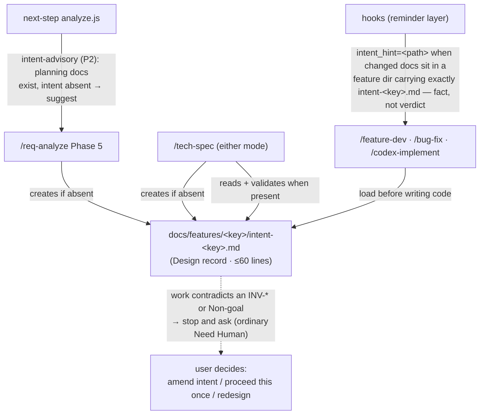

# Intent Artifact — Technical Spec

> **Current behavior authority**: Yes
> **Doc role**: Current authority

> Add a per-feature `intent-<feature>.md` — the designer-readable statement of *what is wanted,
> why, and under which constraints* — produced by the planning skills, read by the implementing
> skills, surfaced by the hook and `next-step`; work that contradicts it stops and asks. Origin: `/deep-research` 2026-08-29 (3 shards, 91/100; the Anthropic
> AI-Native SDLC playbook's intent→spec→plan chain, adapted to this repo's taxonomy and
> reminder-layer architecture). Four decisions fixed by the maintainer 2026-08-29: filename
> `intent-<feature>.md` accompanying `/req-analyze` or `/tech-spec`; hook reminder; `next-step`
> advisory in the same ticket; deviation → Need Human.

## 1. Requirement Summary

- **Problem**: The repo's doc lifecycle jumps from problem analysis (`1-requirements.md`, present
  in 11/89 features) to solution (`2-tech-spec.md`, 66/89). Nothing carries the *intent* — north
  star, non-goals, invariants — in a form a designer skims in two minutes and an agent can check
  work against. Research confirmed the two-tier split (resident "how the agent works" vs.
  task-scoped "why this work exists") is the industry-convergent architecture, and that its
  weakest link is load reliability: on-demand content is missed in 56% of eval cases unless the
  resident side carries a described index and the implementing skills each load it themselves
  (GitHub spec-kit's `/implement` famously loads 7 artifacts but never its constitution).
- **Goals**: (1) `intent-<feature>.md` exists for every feature that passes through `/req-analyze`
  or `/tech-spec` from now on; (2) implementing skills load it before writing code and treat a
  conflict as a Need-Human exit; (3) the hook reminds when a change maps to a feature carrying an
  intent file; (4) `next-step` advises creating one where planning docs exist without it;
  (5) zero classifier mis-typing, zero resident-budget growth, and no guard machinery
  beyond cheap executable checks — the mechanism stays simple enough to trust the model with.
- **Non-goals**: backfilling existing features — all **89** lack `intent-*.md` today, and 78 of
  them lack even a requirements doc, so a backfilled intent would be post-hoc guesswork with no
  planning phase to project from (a feature that later passes through `/req-analyze` or
  `/tech-spec` gains one then, § 3.4); making intent
  mandatory for single-file fixes or work that never touches a feature (research: mandatory
  ceremony measured ~10× slower with no quality gain); any change to Anchor-tier policy.

## 2. Existing Code Analysis

Measured against `main` (originally at `888fea4`; re-verified at `491b277` — counts
unchanged: 89 features, 11 requirements docs, 66 tech specs, zero intent files. `feature-dev` /
`bug-fix` gained design-nudge sections at `5e75683`, which do not touch the load-step graft
points below):

| Component | Fact | Consequence |
|---|---|---|
| `scripts/config/doc-taxonomy.json` | 13 `types[]`, first-match by `semantic_pattern` at step 4; `adr` carries unanchored `decision`, and `fp-brief`/`tech-brief` match anywhere in the name | New `intent` type must be inserted **before every other ancillary type** — `intent-fp-brief.md` and `intent-tech-brief.md` are live-key names that otherwise classify as briefs |
| `scripts/lib/doc-classifier.js:53-61` | Step-5 prefix fallback: any `^[0-4]-` name inherits that phase's type | `1-intent.md` mis-types as requirements (measured). A Prohibited row must ban numbered intent names |
| `scripts/lib/doc-metadata.js` + `path_defaults` | Role axis is separate; unmatched stems fall to `Current authority`, which puts a doc in `/update-docs`' rewrite path | Intent needs a `path_defaults` entry → **Design record**, or every code change rewrites the intent it should be checked against |
| `skills/req-analyze/SKILL.md` Phase 1/5 | 5-Why root problem, Goals/Non-Goals already produced; single-file upsert of `1-requirements.md` | Intent content is a projection of Phase 1 output — the write step grafts onto Phase 5 |
| `skills/tech-spec/SKILL.md` | Grants `Read, Grep, Glob, Bash(git:*), Write` — no `Bash(node:*)`; discovery is its own Glob cascade | Intent read/create needs a fourth lookup inline on the SKILL.md surface, not the shared resolver |
| `hooks/user-prompt-review-guard.sh` + `scripts/review-state.js` | Hook prints `[AUTO_LOOP_STATE]` fact line; `procedure_hint` extension already planned (rules-residency § 3.3 path 3, task 5) | The intent reminder rides that mechanism — mechanical facts only, never a decision |
| `skills/next-step/scripts/analyze.js:566` | `requirements-advisory` finding already exists; `featureCtx.docs_path` is available | Intent advisory clones that shape with a `readdirSync` + exact-name check — **no** resolver-payload/`context-shape.js` change |
| `docs/features/rules-residency/2-tech-spec.md` § 3.5 | Placement rule: new policy lands on-demand by default; resident budget ≤350 lines ∧ ≤40KB | Intent routing gets **no new resident row**; the existing trigger-table row "Feature-document work → documentation contract" covers it |

## 3. Technical Solution

### 3.1 Architecture



### 3.2 The artifact

**Name**: `intent-<feature>.md`, in the feature directory beside the lifecycle docs. Semantic
prefix (ancillary), never a phase number. **Template** (shipped as
`skills/req-analyze/references/intent-template.md`):

```markdown
# Intent — <feature>
> **Doc class**: Intent (ancillary — Design record). Written by the planner, checked by the
> implementer. Work that contradicts an Invariant or Non-goal stops and asks — amending this
> file is a re-decision, not a sync.

## North star        ← 1-2 sentences: why this exists
## Non-goals         ← what is deliberately out of scope (least reconstructible from code)
## Invariants        ← 3-7, each with a grep-able ID: `INV-001: …`
## Acceptance sketch ← one end-to-end verification the feature must pass
```

Hard cap **60 lines**: a designer skims it in two minutes, and the dedup test is absolute —
*anything an agent could infer by reading the diff does not belong here*. Non-goals and
invariants pass that test; restated requirements do not.

**Authorship arrow (one-way)**: `/req-analyze` creates it (Phase 5, projected from Phase 1's
5-Why root problem + Goals/Non-Goals); `/tech-spec` creates it when absent **in either mode**
(create mode distilling from the requirement clarification step; update mode projecting from
`1-requirements.md` §§ 1–2 when present, else the spec's requirement summary) and otherwise
**reads and validates** — it never rewrites intent to match a spec. Amending intent is an
explicit human re-decision recorded by editing the file, exactly the Design-record contract.

### 3.3 Taxonomy and roles (decision 1)

- `scripts/config/doc-taxonomy.json`: new `types[]` entry `{id: "intent", namespace: "ancillary",
  semantic_pattern: "^intent-", …}` inserted **before every other ancillary type** (first-match
  ordering, § 2 — `fp-brief`/`tech-brief` patterns are unanchored and match inside a name).
- `path_defaults`: `{name: "intent-records", role: "Design record", scope: "relpath",
  pattern: "^(docs/features/[^/]+/)?intent-[^/]+\\.md$"}` placed **first** — intent never enters
  `/update-docs`' rewrite path and reviews at `record-diff` depth. The scoping is load-bearing
  (two review rounds found the failure modes of every simpler form): segment rules cannot
  express "the artifact directly in a feature directory", so a feature legally named `requests`,
  `adr-skill` (live) or `4-implementation` would hand its intent artifact to whichever
  segment rule matches the *directory* name; and a basename rule would claim
  `skills/**/intent-*.md` instruction references (live: `intent-template.md`,
  `intent-patterns.md`). The `relpath` scope (added to `roleFromPath` for this rule) tests the
  whole normalized path in either caller form — root-relative or feature-relative — while
  nested `requests/intent-*.md`, `skills/**` references, and directories named `intent-<x>.md`
  all fall through to the later rules. The same rule goes into `BUILTIN_ROLE_CONFIG`
  (`scripts/lib/doc-metadata.js`); metadata tests cover both config paths and all
  counter-examples.
- `rules/docs-numbering.md`: Ancillary table gains `Intent | intent-<feature>.md` — the basename
  is **exactly** `intent-<key>.md` for the feature directory it sits in; consumers resolve that
  exact name, and a `Glob intent-*.md` is used only to detect strays or ambiguity (two+ hits, or
  a hit not matching the key → surface it, don't pick). Prohibited table gains `[0-4]-intent.md`
  (every numbered form mis-types via prefix fallback) and bare `intent.md` (unclassifiable
  appendix).
- **Untouched**: `canonical_roles`, `context-shape.js`, `feature-resolver.js` — ancillary docs
  never enter `canonical_docs`, which is what keeps this an order of magnitude cheaper than a
  lifecycle phase.

### 3.4 Producers (decision 1)

- `skills/req-analyze/SKILL.md` Phase 5: after writing `1-requirements.md`, write
  `intent-<key>.md` from the template **if absent**; if present, diff Phase 1 output against its
  invariants and Non-goals and report (never silently rewrite). § Relationship tables in both
  `req-analyze` and `create-request` gain the intent row (audience: *both* designer and
  implementer — the discriminator vs. `1-requirements.md` is **content class**: constraints-only,
  no analysis).
- `skills/tech-spec/SKILL.md`: fourth lookup, stated on the always-loaded SKILL.md surface
  beside the mode table, resolving exactly `intent-<key>.md`; a separate `intent-*.md` scan only
  surfaces strays or wrong-key files (surfaced, never picked). **Both modes create intent when
  absent** — create mode from the requirement clarification step; update mode projecting from
  `1-requirements.md` §§ 1–2 when present, else the spec's requirement summary (what lets the
  `next-step` advisory converge on pre-mechanism features). When present, update mode reads it:
  every spec section that contradicts an `INV-*` or Non-goal is a conflict to surface, not to
  paper over.

### 3.5 Consumers: loading, reminding, advising (decisions 2-3)

- **Implementing skills each load it themselves** (`/feature-dev`, `/bug-fix`,
  `/codex-implement`): one plainly-written step early in each SKILL.md — "identify the feature
  this work belongs to (from the task, the spec/requirements being followed, or the paths being
  changed) and read `docs/features/<key>/intent-<key>.md` if it exists; it overrides your default
  approach. No identifiable feature → nothing to load; proceed." **Deliberately no resolver
  machinery**, and the trade-off stated plainly: feature identification is best-effort model
  judgment, and a wrong or missed identification can **silently skip the intent** — an accepted
  adherence risk under the simplicity directive, not a caught error. The reminders are narrower
  than a safety net: `intent_hint` fires only when *feature docs themselves* changed, and the
  `next-step` advisory detects an *absent* artifact, never an existing one a skill failed to
  load. Per-skill redundancy is the one hard requirement (spec-kit's `/implement` gap is the
  named counter-example).
- **Described index, not a bare pointer**: `skills/update-docs/SKILL.md` § Step 1.5's role table
  is a **closed four-role table** (one row per role; later prose counts "the three record rows"),
  so intent gets no fifth row — instead the existing **Design record** row's description gains
  `intent-*` and its purpose (planner-written constraints the implementer checks work against).
  If rules-residency r2 later creates a documentation contract, the mention moves with the table.
  There is no separate "intent contract" file — the template header and the per-skill steps are
  the whole contract. No resident-layer growth.
- **Hook reminder (decision 2)**: `[AUTO_LOOP_STATE]` gains `intent_hint=<path>` when changed
  paths sit under a `docs/features/<key>/` that contains **exactly `intent-<key>.md`** — a stray
  `intent-<other>.md` produces no hint. That one mapping only — no branch-name matching, no
  code-file→feature inference (semantic; hooks never decide). Facts only, absent when no mapping
  exists, nothing parses it — and it exists only on the **state-backed** fact line
  (`source=state`): the hook's checker-unavailable fallback (`source=git_status`) stays
  change-class-only and never carries the hint, mapping or not. Rides `procedure_hint`
  (rules-residency task 5) or lands first with the same contract.
- **next-step advisory (decision 3)**: `analyze.js` gains `intent-advisory` (P2, advisory) —
  fires when `featureCtx.docs_path` exists, planning docs exist (`has_tech_spec ||
  has_requirements`), and a `readdirSync` finds no exact `intent-<key>.md` (a stray wildcard hit
  is not presence; it is reported as a stray). Suggestion: `/req-analyze <key>` (or
  `/tech-spec <key>` when requirements are absent). Direct read, not a resolver-payload field —
  avoids the `context-shape.js` schema change entirely.

### 3.6 Deviation gate (decision 4)

**No new machinery.** A conflict between planned work and a loaded intent is a **skill-workflow
gate**, the kind consuming skills already define for themselves (`/tech-spec`'s "two+ canonical
hits → Need Human" is the live precedent) — it lives in the per-skill load steps and the template
header, **not** in the auto-loop's enumerated human exits. It is deliberately *not*
`REQUIREMENT_AMBIGUITY`: that class is a **cap/stall diagnostic** — `rules/discretion.md` states
it applies at the round cap and that ordinary requirement uncertainty before the cap does not
trigger it, and `test/rules/discretion-tiers.test.js` pins that condition — so an intent conflict
discovered before or during implementation cannot reuse it, and this spec does not amend that
contract. Nor does CLAUDE.md's "uncertainty is not a reason to stop" apply: a cited contradiction
between two instructions the user gave (the task and the intent file) is a conflict, not
uncertainty, and asking which one governs is baseline behavior no closed list restricts. This
section adds one sentence to the intent template's header ("work that contradicts an Invariant or
Non-goal stops and asks — amending this file is a re-decision, not a sync") and nothing else.

- **Trigger**: the planned work contradicts a specific `INV-*` or Non-goal. Cite it; vague
  misalignment is not a trigger.
- **Ask**: surface the conflict to the user and wait — via AskUserQuestion where the skill has
  it, or plainly in the reply where it does not (no frontmatter changes; stopping to ask needs no
  tool). Natural outcomes: amend the intent (a re-decision; edit the file), proceed anyway this
  once (say so in conversation; no new record convention), or step back and redesign. The model
  words this itself; no fixed option template.
- **Not**: a new auto-loop exit class, a new `[BRACKET]` convention, a CLAUDE.md closed-list
  amendment, or an Anchor. Presence in context does not guarantee compliance, and no review skill
  loads the intent today (§ 7 defers that) — the acceptance sketch's value is narrower and real:
  it hands the implementing model, or a human reading the diff, one checkable end-to-end
  statement. Compliance remains best-effort, observed in use.

## 4. Risks and Dependencies

| Risk | Mitigation |
|---|---|
| Routing not honored (56% miss rate for undescribed on-demand content) | Three redundant paths: per-skill load steps, described index line, hook `intent_hint` — noting their limits (§ 3.5: the hint fires only on feature-doc changes; the advisory only on absence), and acceptance that a silent miss is possible and is measured in use, not proven by tests |
| Intent rot (24% init-fossilization in the wild; this repo's 0/89 README precedent) | Intent is *born from* planning skills that already run, not a separate ceremony; `next-step` advisory keeps the gap visible; Design-record role means no sync obligation to rot against |
| Classifier mis-typing via prefix fallback | Prohibited rows + executable classifier tests for `intent-x.md`, `1-intent.md` (negative), `intent-decision-x.md` (ordering control vs. `adr`) |
| Deviation gate becomes noise (every minor tension → Need Human) | Trigger requires a cited `INV-*` or exact Non-goal line, plus the violating element; invariants capped at 7 per file |
| `/tech-spec` inline intent-lookup drift (an exact-name/wildcard lookup maintained beside the skill's own discovery cascade) | Accepted as an untested prose-level risk (§ 6 deliberately pins no skill prose) — the cost of the skill's deliberate `Bash(node:*)` absence |
| Dependency: `procedure_hint` mechanism (rules-residency task 5) | Landed 2026-09-25 as a separate optional field on the same `[AUTO_LOOP_STATE]` line, after `intent_hint=`; the two share the fact-only contract |

## 5. Work Breakdown

| # | Task | Size | Depends on |
|---|---|---|---|
| 1 | Taxonomy + roles: `intent` type (ordered), `path_defaults` row, docs-numbering tables, classifier/metadata tests with negative controls | S | — |
| 2 | Template + producers: `intent-template.md`, `/req-analyze` Phase 5 step, `/tech-spec` cascade + create/read/validate steps, § Relationship rows in both mirrors | M | 1 |
| 3 | Consumers: load steps in `/feature-dev`, `/bug-fix`, `/codex-implement`; described-index line; the deviation sentence in the template header | M | 1, 2 |
| 4 | Hook `intent_hint` in `review-state.js check` (doc-path mapping, exact `intent-<key>.md` only) + hook output test | S | 1 |
| 5 | `next-step` `intent-advisory` finding + test (`readdirSync` + exact-name filter — Node ≥18, no `fs.glob`); update `skills/next-step/SKILL.md`'s heuristic table/count | S | 1 |

Suggested tickets: one for 1+2+3 (the artifact and its readers), one for 4+5 (the reminders).
Each independently green.

## 6. Testing Strategy

Deliberately light — the mechanism is a document plus prose steps, and the rules-residency rounds
showed that guard machinery outgrowing its subject is its own failure mode:

- **Classifier** (executable, cheap): `classifyByPath`/`roleFromPath` on `intent-x.md` (intent /
  Design record), `1-intent.md` (negative: mis-types, hence Prohibited), `intent-decision-x.md`
  (ordering control vs. `adr`), and `intent-fp-brief.md` + `intent-tech-brief.md` (ordering
  controls vs. the unanchored brief patterns — the two live-key collisions that motivated
  inserting intent first, § 2).
- **Hook**: fixture with `docs/features/x/intent-x.md` — mapped change → hint with correct path;
  no mapping → field absent; no intent file → no hint; stray `intent-y.md` only → no hint
  (exact-name contract, § 3.5).
- **next-step**: spec-without-intent → advisory present; exact `intent-<key>.md` present →
  absent; stray `intent-<other>.md` only → advisory still present (plus the stray surfaced); no
  planning docs → absent.
- **Skill prose** (the load steps, the producer behavior, the deviation sentence): doc review
  covers it. **Deliberately untested** — no producer contract tests, no deviation fixtures, no
  string-pin battery. This is the maintainer's explicit trade-off (2026-08-29: "不要過度設計，
  信任模型的能力"), stated here so a reviewer reads it as a decision, not a gap. The falsifiers
  are split honestly: real-session observation falsifies loading and deviation behavior; the
  `next-step` advisory falsifies only producer absence (it cannot see a skipped load).
- **Adherence**: not unit-testable. The acceptance sketch is the checkable surface, at review
  time.

## 7. Open Questions

1. Should `/codex-review-branch` (deep review) also check the diff against intent invariants as
   a review dimension? Natural extension, deferred — not in the four fixed decisions.
2. When `/tech-spec` runs on a feature whose intent is absent AND `1-requirements.md` exists,
   should it still create intent (projecting from requirements §1-2) or defer to `/req-analyze`?
   Current answer: create (decision 1 says intent accompanies *either* skill); revisit if the
   two projections drift.
