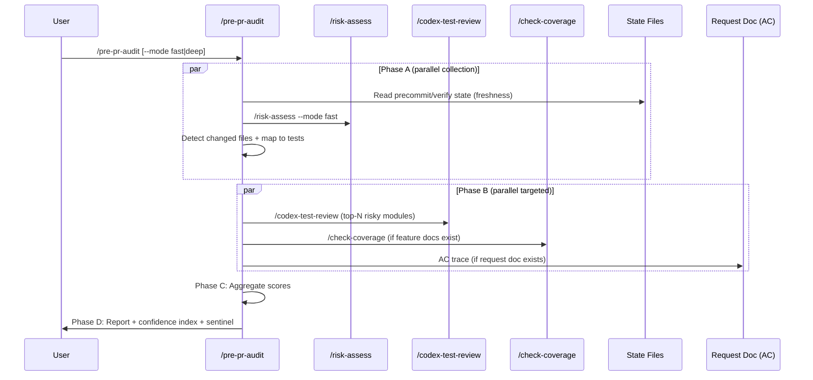

# Pre-PR Audit — Technical Spec

## 1. Requirement Summary

- **Problem**: Auto-loop 確保 code review + precommit 通過，但無法量化「這組變更準備好開 PR 了嗎？」。現有 `/pr-review` 是手動 checklist，`/risk-assess` 只看 blast radius。缺少一個聚合型 skill 在 PR 前給出量化信心指數。
- **Goals**: 建立 `/pre-pr-audit` — pre-deploy 終極驗證 skill，聚合 5 個維度的 test quality + risk + coverage + AC traceability，輸出 0-100 信心指數。
- **Scope**: v1 — orchestrator pattern + 5-dimension scoring + 3-tier gate。v2 — calibration、per-ecosystem adapters、strict hook enforcement。
- **Source**: `/best-practices` audit + `/codex-brainstorm` Nash Equilibrium (threadId: `019cff6f-2340-7b30-aec7-256b10a90f93`)
- **Positioning**: 補充 `/feature-verify`（post-deploy runtime）；此 skill = pre-deploy static + semantic

## 2. Existing Code Analysis

### Related Modules

| Module | 關聯 | 可重用 |
|--------|------|--------|
| `skills/project-audit/` | 5-dimension 確定性評分模型 | Scoring model (pass/partial/fail/N/A) |
| `skills/risk-assess/` | 3-dimension weighted risk score | Risk dimension data source |
| `skills/test-review/` | 5-dimension test sufficiency | Test Quality dimension |
| `commands/check-coverage.md` | 3-layer coverage analysis | Coverage Adequacy dimension |
| `commands/pr-review.md` | Pre-PR checklist (orchestrates risk-assess) | Positioning reference |
| `skills/feature-verify/` | Confidence cap model (L1-L4) | Evidence confidence pattern |
| `rules/testing.md` | Evidence model + exception rules | Evidence Governance baseline |
| `skills/risk-assess/scripts/risk-analyze.js` | Deterministic risk script | Script pattern reference |

### Reusable Patterns

| Pattern | Source | Reuse |
|---------|--------|-------|
| Deterministic scoring (pass/partial/fail/N/A) | `project-audit/SKILL.md:37` | 直接複製 |
| Dimension confidence = applicable/total | `project-audit/SKILL.md:40` | 直接複製 |
| Status determination (Blocked/Needs Work/Healthy) | `project-audit/SKILL.md:44` | 對映 3-tier gate |
| Confidence cap (resource-based) | `feature-verify/SKILL.md` | Evidence confidence cap |
| Parallel skill dispatch | `codex-code-review/SKILL.md` dual dispatch | Phase A/B parallel |

## 3. Technical Solution

### 3.1 Architecture



### 3.2 5 Dimensions + Weights

| # | Dimension | Weight | Data Source | Checks |
|---|-----------|--------|-------------|--------|
| 1 | Execution Integrity | 25% | Precommit/verify state, runner logs | All tests pass, no flaky indicators, lint clean, freshness (HEAD match) |
| 2 | Coverage Adequacy | 25% | `/check-coverage` or test file mapping | Unit/Integration/E2E pyramid balance, per-module gap analysis |
| 3 | Test Quality | 20% | `/codex-test-review` (top-N modules) | AAA compliance, naming, assertion depth, edge cases (per `@rules/testing.md`) |
| 4 | Risk-to-Test Alignment | 20% | `/risk-assess` + changed files ↔ test mapping | High-risk files have corresponding tests, risk level ↔ test depth proportional |
| 5 | Evidence Governance | 10% | AC from request docs, `@rules/testing.md` | AC traceability, exception policy compliance, exception expiry |

### 3.3 Scoring Model

Reuse `project-audit` pattern：

| Level | Value |
|-------|-------|
| Pass | 1.0 |
| Partial | 0.5 |
| Fail | 0.0 |
| N/A | Excluded from calculation |

- **Dimension score** = `applicable_sum / applicable_count × 100`
- **Dimension confidence** = `applicable_checks / total_checks × 100`
- **Raw score** = weighted average of applicable dimension scores (N/A dimensions excluded, weights renormalized to sum to 100). Formula: `raw = Σ(score_i × weight_i) / Σ(weight_i)` for all dimensions where score ≠ N/A. If all dimensions are N/A, raw = 0 and gate = `⛔ PR-Blocked`.
- **Evidence confidence cap** (from feature-verify pattern):

| Evidence Level | Cap |
|---------------|-----|
| Full (all dimensions have data) | 1.0 |
| Partial (1 dimension N/A) | 0.9 |
| Limited (2+ dimensions N/A) | 0.75 |
| Static-only (no test execution data) | 0.6 |

- **Final index** = `round(raw × cap)`

### 3.4 Gate + Threshold

**User-facing gate (3-tier)**:

| Gate | Score | Sentinel | Action |
|------|-------|----------|--------|
| ✅ Ready | >=85 | `✅ PR-Ready` | Proceed to commit/push |
| ⚠️ Needs attention | 60-84 | `⚠️ PR-Caution` | Review gaps, decide |
| ⛔ Not ready | <60 | `⛔ PR-Blocked` | Fix before proceeding |

**Diagnostic detail (4-tier, in report body)**:

| Diagnostic | Score |
|-----------|-------|
| Adequate | >=85 |
| Adequate with exceptions | 75-84 |
| Need Human | 60-74 |
| Inadequate | <60 |

### 3.5 Hard-Fail Overrides

Force `⛔ PR-Blocked` regardless of score：

| Override | Condition | Source |
|----------|-----------|--------|
| Precommit stale | State file shows precommit not passed after latest edit | Auto-loop state |
| Policy breach: prohibited domain | Security/data-integrity/regression AC uses manual exception | `rules/testing.md` § Evidence Model |
| Policy breach: cap exceeded | Exception count exceeds AC-count-based cap | `skills/test-review/references/testing-contract.md` § Evidence Model |
| Policy breach: expired exception | Manual exception past expiry date | `skills/test-review/references/testing-contract.md` § Evidence Model |
| Policy breach: invalid reason | Exception uses non-enum reason class | `skills/test-review/references/testing-contract.md` § Evidence Model |
| Policy breach: unverified | Exception lacks Codex `VALID_EXCEPTION` verdict | `skills/test-review/references/testing-contract.md` § Evidence Model |
| Evidence stale | Artifacts HEAD SHA ≠ current HEAD | Freshness check |
| Critical untested | `/risk-assess` HIGH+ on files with zero test coverage | Risk-to-Test Alignment |

### 3.6 Execution Modes

| Mode | Budget | Behavior |
|------|--------|----------|
| `fast` (default) | ~30s | Ingest existing artifacts + top-3 risky modules Codex review. Skip `/check-coverage` and AC trace. |
| `deep` | ~2-5min | Full `/check-coverage` + top-10 risky modules Codex review (+ git diff supplement) + AC trace (if request doc exists) |

### Module Selection (deterministic)

**Top-N risky modules** are selected from `/risk-assess` JSON output:

1. Source: `/risk-assess` JSON `top_affected` array (each entry has `file` + `dependent_count`)
2. Sort by `dependent_count` descending, tie-break by `file` path ascending (stable sort)
3. Select top-N: N=3 for `fast`, N=10 (top_affected cap) for `deep`
4. For `deep` mode, supplement with `git diff --name-only` to cover files beyond top_affected cap
5. Fallback: if `/risk-assess` unavailable, use `git diff --stat` sorted by lines-changed descending

### 3.7 Arguments

| Arg | Description | Default |
|-----|-------------|---------|
| `--mode fast\|deep` | Execution depth | `fast` |
| `--strict` | Return non-zero exit code on ⛔ | off |
| `--json` | Machine-readable JSON output | off |
| `--base <ref>` | Compare against specific ref | HEAD |

### 3.8 Output Format

```markdown
## Pre-PR Audit Report

### Confidence Index: 82/100 ⚠️ PR-Caution

| Dimension | Score | Confidence | Status |
|-----------|-------|------------|--------|
| Execution Integrity | 95 | 100% | ✅ |
| Coverage Adequacy | 78 | 80% | ⚠️ |
| Test Quality | 85 | 67% | ✅ |
| Risk-to-Test Alignment | 70 | 100% | ⚠️ |
| Evidence Governance | 60 | 50% | ⚠️ |

### Hard-Fail Checks
- [x] Precommit passed (HEAD match)
- [x] No policy breaches
- [ ] ⚠️ Evidence confidence limited (2 dimensions < 60% data)

### Findings
- [P1] src/service/auth.ts (HIGH risk) has only 1 unit test — recommend integration test
- [P2] 3 ACs in request doc have no automated evidence

### Next Actions
1. Add integration test for auth service
2. Map remaining ACs to test evidence

### Gate: ⚠️ PR-Caution
```

## 4. Risks and Dependencies

| Risk | Impact | Mitigation |
|------|--------|------------|
| Orchestrating 3-4 skills 太慢 | 使用者不願等 | Parallel dispatch + fast/deep modes |
| N/A inflation 使分數虛高 | 虛假信心 | Confidence cap <=75 when applicable < 60% |
| Artifact freshness 過期 | 過時分數 | HEAD SHA + timestamp binding |
| Cross-ecosystem coverage 定義不同 | 不可比較 | Per-ecosystem adapter (v2)；v1 fallback to test file count ratio |
| Strict mode 語意混淆 | 與 precommit gate 衝突 | 明確：strict = advisory report + exit code，不執行 git actions |
| Score calibration drift | 固定權重不適合所有 repo | v2: calibration set + per-project weight override |

## 5. Work Breakdown

| # | Task | Effort | Dependency | Files |
|---|------|--------|------------|-------|
| 1 | `skills/pre-pr-audit/SKILL.md` | M | — | Skill definition |
| 2 | `commands/pre-pr-audit.md` | S | #1 | Command wrapper |
| 3 | `skills/pre-pr-audit/references/scoring-model.md` | S | #1 | Scoring formula + weights |
| 4 | `skills/pre-pr-audit/references/output-template.md` | S | #1 | Report template |
| 5 | Phase A: State ingestion + risk dispatch | S | #1 | SKILL.md Phase A section |
| 6 | Phase B: Test review + coverage + AC trace dispatch | M | #1, #5 | SKILL.md Phase B section |
| 7 | Phase C: Aggregation + hard-fail + gate | S | #1, #6 | SKILL.md Phase C section |
| 8 | CLAUDE.md: Add `/pre-pr-audit` to Command Quick Reference | S | #2 | CLAUDE.md |
| 9 | Tests: schema + content assertions | S | #1, #2 | `test/commands/pre-pr-audit.test.js` |
| 10 | `/codex-review-doc` on all changed files | S | #1-#9 | — |

**Total**: 10 tasks (7S + 2M + 1S verify) — estimated 1-2 sessions

## 6. Testing Strategy

| Type | Target | Coverage |
|------|--------|----------|
| Unit (content) | SKILL.md contains 5 dimensions, scoring model, 3-tier gate | `test/commands/pre-pr-audit.test.js` |
| Unit (schema) | Command frontmatter valid | `test/commands/skills-schema.test.js` (existing) |
| Manual | Run `/pre-pr-audit` on current repo changes | Session test |
| Manual | Run `/pre-pr-audit --mode deep` on feature branch | Session test |

## 7. Open Questions

| # | Question | Impact | Suggested Resolution |
|---|----------|--------|---------------------|
| 1 | Should `/create-pr` auto-check if `/pre-pr-audit` was run? | UX enforcement | v2: advisory warning in `/create-pr` |
| 2 | Should dimension weights be configurable per project? | Flexibility | v2: via `testing-project.md` or dedicated config |
| 3 | Should there be a `pre-push` hook integration? | Enforcement | v2: hook checks state file for audit result |
| 4 | How to handle repos without request docs (no AC)? | Evidence Governance N/A | Score that dimension N/A, apply confidence cap |

## 8. Relationship to Other Features

| Feature | Relationship |
|---------|-------------|
| `testing-rules-enrichment` | 提供 Evidence Model + Adequacy Gate 作為 Evidence Governance 基礎 |
| `feature-verify` | 互補：feature-verify = post-deploy runtime；pre-pr-audit = pre-deploy static+semantic |
| `test-deep` | 互補：test-deep = smart test execution；pre-pr-audit = test quality audit |
| `risk-assess` | 資料來源：Risk-to-Test Alignment 維度消費 risk-assess 輸出 |
