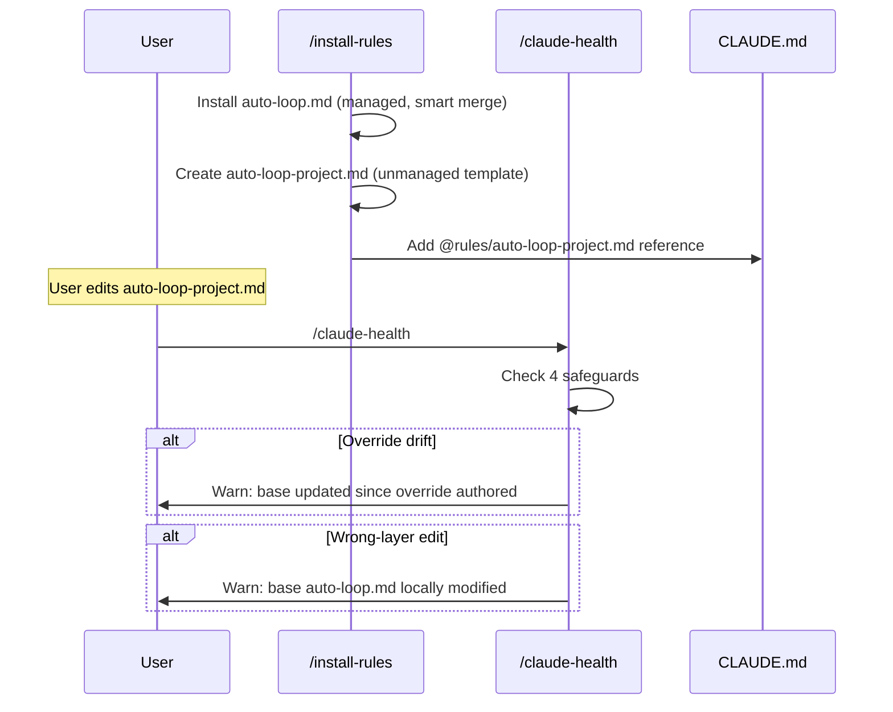

# Rule Override Pattern — Technical Spec

## 1. Requirement Summary

- **Problem**: Plugin 更新 `auto-loop.md` 時，若使用者已客製化同一 `##` section（如 Auto-Trigger table），smart merge 會觸發 `CONFLICT` 狀態，需手動解決。使用者無法在不觸碰 plugin-managed 檔案的情況下客製化 auto-loop 行為。
- **Goals**:
  1. 使用者可在獨立檔案中定義 project-specific auto-loop 行為
  2. Plugin 更新 base rules 時不會與使用者客製化衝突
  3. `/install-rules` 安裝時自動建立客製化 template，不需手動操作
  4. `/claude-health` 提供 safeguard 檢查（v1 為 4 項；R8 起為 6 項，新增 duplicate heading 與 legacy precedence header）
- **Scope**:
  - v1: 僅 `auto-loop-project.md`（最常客製化的規則）
  - R8 起: `auto-loop-project.md` 與 `testing-project.md` 皆為已定義的散布路徑；git-autonomy R2（2026-09-24）加入 `git-workflow-project.md`（見 § 3.4.1 `override_templates`）
  - 命名慣例 `*-project.md` 保留給未來擴展
- **Non-goals**:
  - 不修改 smart merge 演算法本身
  - 不重新命名現有 `auto-loop.md`（避免大量 blast radius）
  - 不通用化到所有 rules（v1 scope）

## 2. Existing Code Analysis

### Related Modules

| File | Purpose | Impact |
|------|---------|--------|
| `rules/auto-loop.md` | Plugin source auto-loop rule | Add redirect comment at bottom |
| `.claude/rules/auto-loop.md` | Local installed copy | Same redirect comment |
| `commands/install-rules.md` | Rule installation flow | Add project override file creation |
| `skills/claude-health/SKILL.md` | Health check + sync | Add 4 safeguards |
| `skills/project-setup/SKILL.md` | Project onboarding | Add override file to setup flow |
| `CLAUDE.md` / `.claude/CLAUDE.md` | Rule reference list | Add `@rules/auto-loop-project.md` |
| `CLAUDE.template.md` | Template for new projects | Add project override reference |

### Reusable Components

- Smart merge 8-state classification（reuse `FRESH_INSTALL` for project file creation）
- Manifest `.claude/.sd0x-install-state.json`（project file explicitly NOT tracked）
- `/claude-health` S2 component classification（extend with override-aware checks）

## 3. Technical Solution

### 3.1 Architecture Design



### 3.2 File Ownership Model

```
.claude/rules/
├── auto-loop.md              ← plugin-managed (smart merge tracked)
├── auto-loop-project.md      ← user-owned (NOT manifest-tracked)
├── codex-invocation.md       ← plugin-managed
└── ...
```

| File | Owner | Manifest Tracked | Smart Merge |
|------|-------|-----------------|-------------|
| `auto-loop.md` | Plugin | Yes | Yes (8-state) |
| `auto-loop-project.md` | User | No | No (unmanaged) |

> **Note**: Template source exists in `rules/` for `/install-rules` to copy from, but the installed copy is explicitly excluded from manifest hash tracking.

### 3.3 Project Override File Contract

```markdown
# Auto-Loop Project Overrides

Precedence: an active (non-comment) `##` section in this file customizes auto-loop.md — for
Default- and Guidance-tier instructions only. Anchor-tier instructions (rules/discretion.md
§ Anchor Register) cannot be overridden here: on conflict the Anchor wins and the conflict is
reported, and a tier annotation written in this file cannot downgrade a Register hit. Resolution
is Anchor-first; the heading → tier mapping and which headings are settings rather than section
replacements: auto-loop.md § Override Contract.

<!-- Based on: auto-loop.md @ <sha7> (<date>) -->

## Tier

<!-- A SETTING, not a section replacement: auto-loop.md has no `## Tier` section — its
     § Tiers prose reads this file's value. Uncomment a bare tier name to set it. -->
```

**Override semantics**: 兩種 override kind，語意不同且不可混談——**section replacement**（重述母檔實際存在的 `##` heading，整段取代）與 **setting**（heading 命名一個由母檔散文或 hook 具名讀取的設定槽，母檔並無同名段落）。出貨的 `auto-loop-project.md` 六個 heading **全為 setting**（`## Tier` 對應的是母檔 `## Tiers` 的「configured tier」，並非同名段落）；`testing-project.md` 則兩者皆有（`## Test Pyramid` 為 section replacement，`## Adequacy Mode` 為 setting）。每個 heading 的 kind 與 consumer 由母檔對照表明列。

兩種 kind 都**限 Default／Guidance 層級指示**。Anchor 層級指示（`rules/discretion.md` § Anchor Register）不可被覆寫——衝突時 Anchor 勝出並回報衝突；解析為 **Anchor-first**（先判定 Register 命中，非 Anchor 才套用明文標註與 heading 對照表），因此使用者檔中的自我標註無法把 Register 命中的指示降級。兩份文件（本規格與 discretion.md）對「使用者檔能否解除 Anchor」的答案一致：**不能**（R8）。

> **Note**: Override section headings must exactly match base section headings for clear section-level replacement semantics — **except documented project-only extension sections**（如 `testing-project.md` 的 `## Adequacy Mode`），其無母檔同名段落，由母檔發布的 heading → tier 對照表明列並依解析階序歸屬（未列入者 fail-closed → Default）。

| Design Decision | Choice | Rationale |
|----------------|--------|-----------|
| Override granularity | Heading-level (`##`)，分為 section replacement 與 setting 兩種 kind（R8） | LLM 更容易理解完整 section；避免 row-level delta 的歧義。R8 補正：出貨範本實際上以 setting 為主，母檔並無同名段落，故「granularity = section」只描述其中一種 kind |
| Precedence mechanism | Self-contained **live** header text（非 HTML 註解） | 不依賴 CLAUDE.md load order（`@` 引用無保證順序）。**R8 查證（2026-07-29）**：HTML 註解不進入模型 context——消費端第一手觀測：session 注入的 project instructions 中 `auto-loop-project.md` 僅呈現 6 個裸 heading、`testing-project.md` 僅剩 H1，而磁碟檔帶完整註解區塊；即 harness 於載入時剝除 `<!-- -->`。註解形式的 precedence 宣告因此觸不到其唯一讀者（模型）；工具路徑（`claude-health` 讀 `Based on:` 註解）為檔案解析，不受影響、維持註解形式 |
| Manifest tracking | Not tracked | 避免 plugin 更新觸碰 user 檔案 |

### 3.4 Core Logic Changes

#### 3.4.1 `/install-rules` Changes

**Phase 3.5 extension** — after managed rule classification, add:

```
# Exclusion: *-project.md files are NOT part of the managed install set.
# They are copied as templates only, with no manifest hash entry written.
managed_rules = rules/*.md EXCLUDING *-project.md

# Explicit override template mapping (not suffix-derived from managed_rules)
# Every distribution path is defined here (R8): testing-project.md previously had no
# defined path — it IS copied, same contract as auto-loop-project.md. git-workflow-project.md
# joined in git-autonomy R2 (2026-09-24), same contract.
override_templates = { "auto-loop.md": "auto-loop-project.md", "testing.md": "testing-project.md", "git-workflow.md": "git-workflow-project.md" }

For each (base_rule, project_file) in override_templates:
  if project_file NOT exists in .claude/rules/:
    Copy from rules/{project_file} as template
    # Stamp provenance at COPY TIME, not byte-for-byte (R8): the shipped template records
    # whatever hash it was authored against, so copying it verbatim makes /claude-health
    # check #1 report drift on a brand-new install with zero overrides written.
    base_hash = git hash-object --no-filters .claude/rules/{base_rule} | cut -c1-7
    Rewrite the copy's "<!-- Based on: {base_rule} @ <hash> -->" comment with base_hash
    Do NOT write manifest entry for project_file
    Log: "Created project override template: {project_file} (based on {base_rule} @ {base_hash})"
  else:
    Skip (user already has it — never rewritten by install or re-install, --force included;
          the only other writer is the user-invoked --customize <rule> --reset)
```

> **Important**: `/install-rules` must explicitly exclude `*-project.md` from the managed rule enumeration (`rules/*.md`) to prevent accidental manifest tracking. The template source `rules/auto-loop-project.md` is only a copy source, never a managed rule.

**New flag**: `--customize <rule-name>` — creates fuller template with examples.

#### 3.4.2 `/claude-health` Safeguard Checks

> **Shipped state is 6 checks, in `skills/claude-health/SKILL.md` § S2.5 — that skill is canonical for this subsection.** The v1 table below is the original 4; R8 added #5 (duplicate heading) and #6 (legacy precedence header), and amended #1 twice: the base file is **derived from the `Based on:` comment's own filename** (never hard-coded to `auto-loop.md`, since `testing-project.md` also ships), and drift is only evaluated when the override file has **active content** — a fully commented-out scaffold has no overrides to review.

4 checks as originally specified (v1):

| # | Check | Severity | Detection | Recommendation |
|---|-------|----------|-----------|----------------|
| 1 | Override drift | P2 | `based_on` hash in project file vs current base hash | "Base auto-loop updated; review your overrides" |
| 2 | Policy contradiction | P1 | Override disables required check that hook enforces | "Override conflicts with stop-guard enforcement" |
| 3 | Missing reference | P1 | CLAUDE.md references `@rules/auto-loop-project.md` but file missing, OR file exists but not referenced in CLAUDE.md | `/install-rules` to recreate or add reference |
| 4 | Wrong-layer edit | P2 | Base `auto-loop.md` has `LOCAL_MODIFIED`, `CONFLICT`, or `LEGACY` doctor state (user modified base) | "Move customization to auto-loop-project.md" |

**Policy contradiction detection contract**: ~~Parse the project override's Auto-Trigger table~~ — the Auto-Trigger table was retired by R3, so there is nothing to parse there. The shipped contract keys on **any restated `##` section**: extract the backticked check commands from the same-heading section of the base rule and require the restatement to keep every one of them; a restatement that drops one is P1. Routing itself now lives in an unheaded paragraph, which the exact-heading mechanism cannot restate, so it is not overridable and is out of scope. See `skills/claude-health/SKILL.md` § S2.5.

#### 3.4.3 Base `auto-loop.md` Redirect

Add at bottom of `rules/auto-loop.md`:

```markdown
## Project Customization

Project-specific overrides belong in `auto-loop-project.md` (not this file).
See `@rules/auto-loop-project.md` for your project's custom auto-loop behavior.
```

#### 3.4.4 CLAUDE.md / Template Updates

```markdown
## Rules

- @rules/auto-loop.md -- Auto review loop (highest priority)
- @rules/auto-loop-project.md -- Project-specific auto-loop overrides (user-owned)
```

**Backfill for existing projects**: `/install-rules` must perform idempotent missing-reference repair: if `@rules/auto-loop.md` reference exists in `## Rules` but `@rules/auto-loop-project.md` is absent, insert only the missing line. This ensures existing projects receive the reference on next `/install-rules` run without requiring manual CLAUDE.md edits.

### 3.5 Migration Strategy (Backward Compatibility)

| User State | Migration Path |
|-----------|---------------|
| No customization (base == manifest) | `/install-rules` creates empty project file → no behavioral change |
| Has local modifications (LOCAL_MODIFIED) | `/claude-health` detects wrong-layer → suggests moving to project file |
| Has CONFLICT state | Resolve conflict first, then move customizations to project file |

## 4. Risks and Dependencies

| Risk | Probability | Impact | Mitigation |
|------|------------|--------|------------|
| LLM ignores precedence instruction | Low | Medium | Explicit **live** header (R8 — a comment-form header never reaches the model at all). For section replacements, the restated section has no overlapping content; for settings, the parent names the slot it reads, so there is nothing to overlap |
| User edits base instead of project file | Medium | Low | `/claude-health` wrong-layer detection + base redirect comment |
| Override drift (base updated, project stale) | Medium | Medium | `based_on` hash + health check warning |
| Scope creep to all rules | Low | Medium | Scope is an **explicit closed mapping**, not a suffix convention: `override_templates` (§ 3.4.1) currently lists `auto-loop.md`, `testing.md` and `git-workflow.md`, and adding another is a deliberate edit there. (v1 shipped auto-loop only; R8 added testing; git-autonomy R2 added git-workflow.) |
| Override drift reported against the wrong base | Low | Medium | Check #1 derives the base from the override's own `Based on:` filename — hard-coding one base is what would break as soon as a second template shipped (R8) |

### Dependencies

| Dependency | Status | Risk |
|-----------|--------|------|
| `@rules/` flat include semantics in Claude Code | Verified | Low — well-tested |
| Smart merge 8-state classification | Existing | None |
| `/claude-health` S2 classification | Existing | Low — extend, not rewrite |

## 5. Work Breakdown

> **As-planned (v1), not current state.** Row 3's `commands/` directory was removed in v3 — the
> skill now lives at `skills/install-rules/SKILL.md`; row 4's count is 6 checks as of R8. The
> shipped contract is § 3.4.1 above plus `rules/auto-loop.md` § Override Contract; read those,
> not this table, for what exists today.

| # | Task | Files | Effort | Depends On |
|---|------|-------|--------|-----------|
| 1 | Create template source `rules/auto-loop-project.md` (installed as unmanaged — no manifest entry) | `rules/auto-loop-project.md` (new) | S | — |
| 2 | Add redirect section to `auto-loop.md` | `rules/auto-loop.md` | S | — |
| 3 | Update `/install-rules` to create project file | `commands/install-rules.md` | M | 1 |
| 4 | Update `/claude-health` with 4 safeguards | `skills/claude-health/SKILL.md` | M | 1 |
| 5 | Update CLAUDE.md + template references | `CLAUDE.md`, `CLAUDE.template.md`, `.claude/CLAUDE.md` | S | 1 |
| 6 | Update `/project-setup` flow | `skills/project-setup/SKILL.md` | S | 1, 3 |
| 7 | Tests for override detection | `test/` | M | 3, 4 |

## 6. Testing Strategy

> **As-planned (v1).** None of the filenames below were created under those names. The tests that
> actually pin this contract are `test/rules/override-contract.test.js`,
> `test/skills/install-rules-customize.test.js`, and `test/skills/claude-health.test.js` (R8).

| Type | Scope | File |
|------|-------|------|
| Unit | Override file detection (exists/missing/drift) | `test/scripts/install-rules-override.test.js` |
| Unit | Wrong-layer detection (base modified + project exists) | `test/scripts/claude-health-override.test.js` |
| Unit | Policy contradiction detection (override removes required review step) | `test/scripts/claude-health-override.test.js` |
| Unit | Manifest exclusion (no `auto-loop-project.md` entry in `.claude/.sd0x-install-state.json`) | `test/commands/install-rules-override.test.js` |
| Integration | `/install-rules` creates project file on fresh install | Manual |
| Integration | Plugin update doesn't touch project file | Manual |

## 7. Open Questions

| # | Question | Decision Owner |
|---|---------|---------------|
| 1 | Should `--customize` flag be on `/install-rules` or a separate command? | Plugin maintainer |
| 2 | Should the project file template include all sections as commented-out stubs? | UX decision |
| 3 | ~~v2: Extend to `codex-invocation-project.md`, `testing-project.md`?~~ **Resolved (R8)**: `testing-project.md` is shipped and in `override_templates`; `codex-invocation-project.md` remains undecided | Based on user demand |
