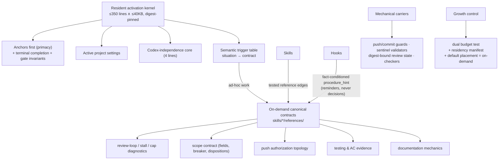

# Rules Residency — Technical Spec

> **Current behavior authority**: Yes
> **Doc role**: Current authority
> **Requirements**: [1-requirements.md](./1-requirements.md) · **Intent**: [intent-rules-residency.md](./intent-rules-residency.md)

> Restructure the rules layer around **residency**: a budgeted resident activation kernel,
> on-demand canonical contracts, mechanical carriers for exact-and-dangerous behaviour, and an
> enforced growth budget. Policy is not weakened anywhere; what changes is where each piece lives.
> Origin: `/codex-brainstorm` Nash equilibrium, 2026-08-29 (3 rounds, 7 valid attacks, converged).

## 1. Requirement Summary

- **Problem**: `CLAUDE.md` + `rules/*.md` load resident into every session — 1,106 lines /
  97,826 bytes ≈ 24–28K tokens, an estimated 150–300 discrete directives. External measurement
  (IFScale, arXiv 2507.11538) shows frontier-model adherence degrading from ~10–15 simultaneous
  instructions with strong primacy bias; context-rot studies show near-duplicate restatements act
  as distractors. Locally, high-priority concepts are restated 3–4× across files, and doc review
  has repeatedly caught the restatements contradicting each other. Compaction alone is refuted by
  history: the 2026-07-30 tier rewrite cut the layer to 767 lines and it regrew +339 within
  24 days, because incident knowledge defaults into resident prose.
- **Goals**: (1) resident surface ≤ 350 physical lines AND ≤ 40,000 UTF-8 bytes (~10K tokens),
  test-pinned; (2) every Anchor and gate invariant preserved with zero policy weakening;
  (3) detailed procedures reachable on demand from ad-hoc sessions, not only via skills;
  (4) a placement rule that stops regrowth; (5) canary shows behavioural non-inferiority.
- **Scope**: `CLAUDE.md`, `rules/*.md`, the skills that gain reference files, hook fact-line
  output, and the tests that pin rules prose. Out of scope: any change to what the anchors
  prohibit, the gate semantics, or `pre-push-gate.sh` / guard scripts themselves.

## 2. Existing State Analysis

Measured 2026-08-29 on `main` (6bbc589):

| Component | Lines | Bytes | Notes |
|---|---:|---:|---|
| `CLAUDE.md` | 74 | 7,944 | restates anchors, gates, sub-threshold rules |
| `rules/auto-loop.md` | 133 | 20,000 | invariant + dispatch + rotation + stall + caps + overrides + enforcement |
| `rules/scope-discipline.md` | 193 | 12,844 | full contract incl. field normalization, breaker counters |
| `rules/discretion.md` | 70 | 10,919 | tiers + Anchor Register + contains a pinned § Efficacy Boundary whose long paragraph is 3,702 chars (whole pinned section: 4,268) |
| `rules/git-workflow.md` | 25 | 8,835 | one 7,493-char push-safety line |
| 12 other rules files | 611 | 37,284 | mixed anchor/procedure/style content |
| **Total resident** | **1,106** | **97,826** | ≈ 24–28K tokens per session |

Consumer analysis (distinct referencing files in `skills/ scripts/ test/ hooks/`): strongly wired —
`auto-loop.md` (49), `git-workflow.md` (27), `testing.md` (26), `security.md` (20); weakly wired —
`context-management.md` (3), `scope-discipline.md` (3), `fix-all-issues.md` (1); unwired —
`framework.md` (0), `self-improvement.md` (0). "Referenced by tests" mostly means *prose pinned*,
not *behaviour enforced*; the dangerous operations already have mechanical carriers (push/commit
guards, digest-bound review state, sentinel validators).

Counter-evidence, recorded so the spec does not overclaim: in a very long real session
(2026-08-27..29) anchors were never violated and gates never skipped — the local failure is not
noncompliance but the certain token tax, drift between restatements, and unbounded regrowth.

## 3. Technical Solution

### 3.1 Architecture

### 3.2 Resident kernel content (the whole of it)

Ordered for primacy. Target ≈ 250–350 lines total across `CLAUDE.md` + surviving `rules/*.md`:

1. **Anchor Register + tier system** (`discretion.md`, compacted to ~40–50 lines): three tiers,
   closed register, `[DEVIATION]` syntax, proposal channel. § Efficacy Boundary is replaced by a
   compact semantic rule + pointer to the push authorization contract (**Anchor-level change —
   requires explicit human approval and coordinated test updates**).
2. **Auto-loop core** (~70–90 lines): terminal completion invariant, per-plane freshness, gate
   sequence, tier table + blocking thresholds, sentinel vocabulary, sub-threshold rule, human-exit
   summary, "hooks are reminders". Dispatch/fallback/rotation/stall/cap/override mechanics move
   out.
3. **Git/security anchors** (compact): prohibited mutations, the three approved workflows and
   their exact operations, no bare force, protected branches, no secrets, attribution whitelist.
   The 7,493-char topology matrix moves to the push contract (Anchor-level, same approval).
4. **Codex-independence core** (~4 lines, resident as high-priority Default): first dispatch —
   metadata only, mandate exploration, never feed conclusions or diff; same-thread reply may carry
   the new diff but never the interpretation; rotation restores the first-dispatch rule.
5. **Scope guard** (~15–25 lines): frozen baseline, one-hop/branch-introduced scope, uncertainty
   fails closed, no repo-wide helper sweeps, out-of-scope critical → human exit.
6. **Semantic trigger table** — the ad-hoc activation kernel:

| Situation observed | Load |
|---|---|
| First or rotated Codex dispatch | independent-dispatch contract |
| First review report, or any blocking verdict | review-loop contract |
| Finding/edit outside frozen baseline; uncertain scope | scope contract |
| Repeated failed rounds; no-progress evidence | stall-diagnosis contract |
| Git mutation intent | push/git authorization contract |
| Test or AC work | testing contract |
| Feature-document work | documentation contract |

**7.** **Active project settings** (`*-project.md` stripped to live values, ~10–15 lines each).

### 3.3 Three-path activation

1. **Resident triggers** (table above) — primary path for ad-hoc sessions; the model recognizes
   situations hooks cannot (baseline membership, finding identity, semantic progress).
2. **Skills** — each mutating/reviewing skill lists its required contracts; routing tests pin the
   skill→contract edges.
3. **Hooks** — `[AUTO_LOOP_STATE]` gains an optional `procedure_hint=<contract,…>` field derived
   from mechanical facts only (e.g. `rounds≥3` → review-loop,stall). Hooks never diagnose,
   classify, or block; `rounds` remains a floor, not a semantic stall verdict.

### 3.4 Two-carrier principle and destinations

Every critical policy = one compact resident semantic rule + one behaviourally independent carrier
(mechanical guard or workflow-loaded exact contract). No third resident paraphrase. Moves:

| Content | Destination |
|---|---|
| Review fallback, rotation, stall/cap diagnostics, override parsing | `skills/codex-code-review/references/` |
| Push authorization topology (the 7,493-char line + Efficacy narrative) | `skills/push-ci/references/authorization-contract.md`, shared by `/epic-merge` |
| Scope field normalization, gate derivation, breaker counters, dispositions | `skills/codex-code-review/references/scope-contract.md` |
| Test pyramid/naming/evidence caps (non-anchor rows) | `skills/test-review/references/` + feature/bug skills |
| Doc numbering/splitting/comment mechanics | document skills' references |
| Context thresholds, lesson-log format | on-demand references |
| Rule customization tutorials (commented scaffolds) | `skills/install-rules/references/` |
| Historical rationale and measurements | `docs/features/…` records |

Cut/merge: `framework.md` deleted (0 consumers); `fix-all-issues.md` merged into auto-loop core +
scope contract; duplicate anchor restatements in `CLAUDE.md` reduced to the single early summary.

### 3.5 Growth control

- **Dual budget test**: resident set (`CLAUDE.md` + transitively imported shipped rules + shipped
  override scaffolds) ≤ 350 physical lines AND ≤ 40,000 bytes. User-authored override content
  reported separately, never rejected.
- **Placement rule** (resident, one paragraph): new policy lands on-demand by default; promotion
  to residency requires either pre-activation necessity (needed before task type is knowable) or
  an irreversible/security/attribution/secret/gate-supremacy failure mode that cannot wait for a
  reference load. Over-budget additions must displace or compress. A genuinely new Anchor takes a
  human-approved exception (budget must not outrank safety).
- **Residency manifest**: per resident block — owner, tier, pre-activation justification,
  canonical detail reference, line/byte contribution, mechanical carrier if any. Test-verified.

### 3.6 Test policy for the migrated layer

Adversarial observation from the 2026-08-28 review session, unpersisted as a standalone experiment
record: claim-keyed semantic tests were the failure class — paraphrase-plus-decoy and equal-length
in-fence edits passed them — while digest pins and executable tests survived. The surviving
artifacts (`test/skills/create-request-scan.test.js`'s header and commit `6bbc589`) record the
resulting executable-test philosophy, not the specific experiments. Task 6 **must** persist a
minimal reproduction alongside the re-pinning so this policy rests on a committed record.
Therefore:

- Compact resident kernel: **exact digest pins** per stable contract unit (small + rarely edited ⇒
  hash churn is proportionate friction, not the old chore).
- Executable claims (regexes, recipes, commands): **executable fixture tests**.
- Claim-keyed semantic assertions: supplemental diagnostics only, never the authorizing guard.
- Every guard ships with a negative control (reversed contract + plausible decoy must fail).
- Existing pinned Anchors (`discretion-tiers.test.js` et al.) unchanged until the Anchor migration
  is approved; compaction and re-pinning land as one reviewed specification change.

## 4. Risks and Dependencies

| Risk | Mitigation |
|---|---|
| Trigger recognition is itself semantic — a degraded session may miss its own cue | Path redundancy: skills and hook hints activate the same contracts independently |
| On-demand contract not loaded before an ad-hoc dangerous act | Anchors + mutation prohibitions stay resident; mechanical guards are load-independent |
| Copied-not-moved content → split-brain contracts | Each contract has exactly one canonical file; skills/rules point, never restate; manifest + routing tests pin the edges |
| Removing duplicate restatements loses reinforcement | Two-carrier: resident semantics + independent mechanical/workflow carrier beats three prose copies |
| Budget gamed by dense lines or unreadable compression | Dual line+byte ceiling; review still rejects clarity-damaging wording |
| Anchor-level compaction (discretion § Efficacy, git-workflow push line) mis-migrated | Blocking dependency: explicit human approval; single reviewed change; old and new text diffed side-by-side; pinned tests updated in the same commit |
| Local benefit unproven | Canary is a **non-inferiority** test (§ 6); certain token/drift costs mean a null result favours the slim layer |

Dependencies: maintainer approval for the two Anchor-level migrations; `review-state.js` hook
output extension for `procedure_hint`; `/install-rules` update for the new scaffold shape.

## 5. Work Breakdown

| # | Task | Size | Depends on |
|---|---|---|---|
| 1 | Create canonical on-demand contracts (move, don't copy): push authorization, scope, review-loop/stall, testing, docs | M | — |
| 2 | Point skills at contracts; add routing tests (skill → required references) | M | 1 |
| 3 | Compact resident kernel: rewrite `CLAUDE.md`, `auto-loop.md`, `discretion.md`, `git-workflow.md`, `security.md`, scope guard; add trigger table; carry the temporary canary-staging duty as a manifest-marked temporary block; delete `framework.md`, merge `fix-all-issues.md` | L | 1, 2, **human approval for Anchor migrations** |
| 4 | Dual-budget test + residency manifest + placement rule | S | 3 |
| 5 | Hook `procedure_hint` (fact-conditioned only) | S | 1 |
| 6 | Re-pin: digest pins on compact kernel, executable tests, retire big prose pins; **persist the minimal adversarial reproduction** (§ 3.6) | M | 3 |
| 7 | Strip `*-project.md` scaffolds to live values; move tutorials to `/install-rules` | S | 3 |
| 8a | Install the temporary staging duty on the **current** layer (own gated change: one resident line naming the duty + staging path), then log 20 baseline changes | M | — |
| 8b | Land the prepared kernel change (carries task 3's human-approval dependency) | — | 3–7, 8a |
| 8c | Candidate cohort + decision per § 6; then freeze/import candidate records and **remove the staging duty** in a separately gated, non-cohort cleanup change | M | 8b |

Suggested tickets: one per row 1–2 (movement), one covering 3–4+6–7 (the kernel change, single
reviewed unit), one for 5, one for 8.

## 6. Testing Strategy

- **Mechanical**: dual-budget test; manifest completeness test; routing tests (every git-mutating
  skill loads the authorization contract; every review skill loads loop+scope+dispatch contracts;
  doc/test skills load theirs); digest pins on kernel units; executable fixture tests for every
  executable claim; negative controls per guard.
- **Canary (non-inferiority)** — executable protocol:
  - **Metrics artifact — two stages, so recording cannot invalidate what it records.** A record
    written into the repo at change close would move the code-plane digest (`tree-digest.js`
    classifies non-`.md` paths as code) and reopen the very gates the record just measured.
    Instead: (1) **staging** — at each change's close, append the record to an out-of-tree
    append-only log at `~/.cache/sd0x-dev-flow/state/<repo-key>/canary-staging.jsonl` (same
    location class as review-state; no digest impact). The measured change's gates and rounds are
    those noted **before** the record is staged. (2) **import** — when a cohort completes, copy
    the frozen records into the committed `docs/features/rules-residency/canary-log.jsonl` as one
    separate, non-cohort change with its own gates (two imports total: baseline, candidate).
    Record schema: `{date, change_id, review_rounds, scope_expansions, deviations,
    contracts_activated[], resident_tokens, hard_incidents[]}`. Staging is a behaviour-layer duty with an
    explicit lifecycle: installed on the current layer by task 8a (its own gated change, before
    any baseline change is counted), carried into the candidate kernel by task 3 as a
    manifest-marked **temporary** block, and removed by task 8c's separately gated cleanup change
    after the decision. An early hard rollback still imports the frozen partial candidate records
    before cleanup — evidence survives the rollback. `review-state.js` is a single-slot overwrite store
    and git history does not recover session boundaries, so **no retrospective baseline exists** —
    the baseline is prospective.
  - **Baseline cohort (task 8a, BEFORE the kernel change)**: the next **20** completed changes on
    the current layer that run at least one review gate (read-only sessions excluded), logged to
    the artifact. The kernel change does not land until the baseline is complete — no fallback
    thresholds; an absent baseline blocks, it is not substituted.
  - **Candidate cohort (task 8c, AFTER)**: the next **20** qualifying completed changes, same
    artifact, same schema.
  - **Hard metrics (gated on occurrence — any → rollback)**: anchor violations; gates declared
    passed without a noted fresh verdict; destructive-git or AI-attribution incidents.
  - **Soft metrics (non-inferiority, margin +20% vs. baseline mean, per completed change)**:
    review rounds; scope-expansion incidents; `[DEVIATION]` count.
  - **Certain gain (measured, not gated)**: resident tokens per session (expected ≈ −60%).
  - **Attribution (fixed map, no operator judgment)**: review-rounds breach → roll back the
    review-loop contract to residency; scope-expansion breach → the scope contract; deviations
    breach, a multi-metric breach, or any ambiguity → **whole-kernel rollback**. The
    `contracts_activated` field exists to audit the map, not to replace it.
  - **Decision table (in precedence order)**: (1) any hard incident → immediate whole-kernel
    rollback, **regardless of cohort size** — zero tolerance takes precedence over every other
    rule here. (2) Soft metric exceeds margin → extend candidate cohort by 10 once; still
    exceeding → apply the attribution map. (3) Otherwise → ship. Underpowered (<20 qualifying
    changes in 30 days, either cohort) → extend window; an underpowered **soft-metric** read
    never ships and never rolls back — hard incidents remain immediate whatever the count.

## 7. Open Questions

1. **Anchor-level approvals** (blocking): compaction of `discretion.md` § Efficacy Boundary and
   `git-workflow.md`'s push-safety line into the push authorization contract — maintainer must
   approve the migration and the replacement wording before task 3.
2. Exact byte ceiling: 40,000 is ~10K tokens by heuristic; confirm or tune after task 3 lands.
3. `procedure_hint` shape: extend `[AUTO_LOOP_STATE]` line vs. second fact line — decide in task 5.
4. Whether `docs-numbering.md`'s mechanical taxonomy half stays resident for `doc-classifier.js`
   parity, or moves with the rest — decide during task 1 by checking what the classifier reads.
