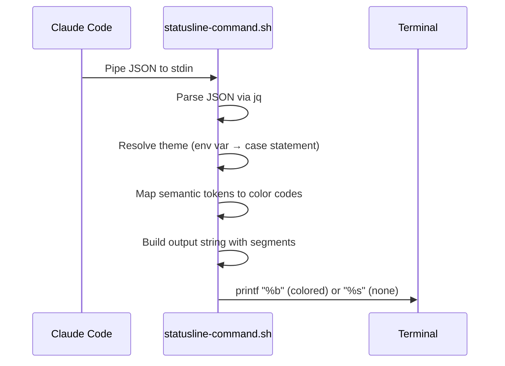

# StatusLine Config — Technical Specification

## Executive Summary

| Field | Value |
|-------|-------|
| Skill Name | `statusline-config` |
| Status | v2 implemented (stable) — see [Section 11](#11-v2-update-new-json-fields--segments) |
| Standalone Install | `npx skills add sd0xdev/sd0x-harness --skill statusline-config` |
| Output | `~/.claude/statusline-command.sh` (POSIX shell script) |
| Dependencies | `jq` (required), `git` (optional, for branch segment) |
| Claude Code Version | 2.1+ (v2 targets 2.1.80+ JSON schema) |

## 1. Overview

### Problem

Claude Code supports custom statusline scripts via `~/.claude/statusline-command.sh`, but writing a correct POSIX script that parses JSON stdin, handles color themes, and respects accessibility standards requires specialized knowledge.

### Solution

`/statusline-config` generates a production-ready statusline script with:

- 9 configurable segments (directory, git branch, agent, model, context %, token usage, cost, rate limits, worktree)
- 5 color themes with semantic token architecture
- WCAG AA contrast compliance (best-effort)
- `NO_COLOR` standard support

### Design Philosophy

| Principle | Implementation |
|-----------|---------------|
| POSIX portable | `#!/bin/sh` — no bash-isms, works on macOS/Linux |
| Semantic colors | 12 named tokens (`C_CWD`, `C_BRANCH`, ...) instead of hardcoded escape codes |
| Accessibility first | `NO_COLOR` env var disables all colors; bold provides non-color differentiation |
| Zero config viable | No arguments = best-practice defaults applied |

## 2. Standalone Installation

This skill can be installed independently — the full sd0x-dev-flow plugin is **not** required.

```bash
npx skills add sd0xdev/sd0x-harness --skill statusline-config
```

After installation, the skill files are located at:

```
.claude/skills/statusline-config/
├── SKILL.md              # Skill knowledge base
├── references/
│   ├── json-schema.md    # Claude Code JSON stdin schema
│   └── themes.md         # Theme token definitions
.claude/commands/
└── statusline-config.md  # Command entry point (auto-installed)
```

The command `/statusline-config` becomes available immediately.

## 3. Usage

```bash
# Apply best-practice defaults (all segments ON, ansi-default theme)
/statusline-config

# Switch to a specific theme
/statusline-config catppuccin-mocha

# Add or remove segments
/statusline-config remove cost
/statusline-config "add git, remove cost, use dracula"
```

### Arguments

| Argument | Description | Default |
|----------|-------------|---------|
| `<theme-name>` | Theme to apply: `catppuccin-mocha` (or `catppuccin`), `dracula`, `nord`, `ansi-default`, `none` | `ansi-default` |
| `add/remove <segment>` | Enable or disable a specific segment | — |
| (no args) | Apply best-practice defaults | All ON + `ansi-default` |

## 4. Segments

| Segment | JSON Field | Default | Notes |
|---------|------------|---------|-------|
| Directory | `workspace.current_dir` | ON | Truncate deep paths: `~/.../last-dir` |
| Git branch | shell `git` | ON | `--no-optional-locks`, cache 5s |
| Agent | `agent.name` | ON (conditional) | Show when present |
| Model | `model.display_name` + `context_window.context_window_size` | ON | Smart tier suffix: `Opus 4.6 (1M)` |
| Context % | `context_window.remaining_percentage` + `context_window_size` | ON | Green >40%, Yellow 20-40%, Red <=20% |
| Token Usage | `context_window.total_input_tokens` + `total_output_tokens` | ON (conditional) | `{in}k/{out}k` session cumulative |
| Cost | `cost.total_cost_usd` | ON | Show when >= $0.005, `est $X.XX` |
| Rate Limits | `rate_limits.five_hour.used_percentage` + `seven_day.used_percentage` | ON (conditional) | `5h: 85% left · 7d: 82% left` remaining %; OAuth only |
| Worktree | `worktree.name` + `worktree.branch` | ON (conditional) | Replaces Directory + Git branch when present |

## 5. Theme System

### 5.1 Available Themes

| Theme | Type | Default | Notes |
|-------|------|---------|-------|
| `ansi-default` | ANSI 16 | Yes | Safe fallback, works everywhere |
| `catppuccin-mocha` | TrueColor | — | Recommended — pastel, WCAG AA >=4.5:1 |
| `dracula` | TrueColor | — | Vibrant purple/pink accents |
| `nord` | TrueColor | — | Arctic blue, muted tones |
| `none` | — | — | No colors (`NO_COLOR` auto-triggers) |

### 5.2 Semantic Tokens

Scripts use semantic tokens instead of hardcoded colors. Each theme maps these 12 tokens to its palette:

| Token | Role | Example Colors |
|-------|------|---------------|
| `C_CWD` | Directory path | blue / sapphire |
| `C_BRANCH` | Git branch name | magenta / mauve |
| `C_MODEL` | Model display name | cyan / teal |
| `C_CTX_OK` | Context >= 41% | green |
| `C_CTX_WARN` | Context 21–40% | yellow |
| `C_CTX_BAD` | Context <= 20% | red |
| `C_COST` | Cost display | muted text |
| `C_ALERT` | >200k token warning (legacy, segment removed) | orange/peach + bold |
| `C_SEP` | Pipe separator `\|` | dim/overlay |
| `C_MUTED` | Secondary info | subtext |
| `C_TEXT` | General text | foreground |
| `C_RESET` | Reset all formatting | `\033[0m` |

### 5.3 Theme Switching

Switch themes at runtime via environment variable:

```bash
export CLAUDE_STATUSLINE_THEME=catppuccin-mocha
```

The script reads this on every invocation. Invalid theme names fall back to `ansi-default`. The alias `catppuccin` resolves to `catppuccin-mocha`.

## 6. Architecture



### Script Rules

| Rule | Implementation |
|------|---------------|
| Shebang | `#!/bin/sh` (POSIX) |
| JSON parsing | `jq -r '.field // fallback'` |
| Windows paths | Normalize `workspace.current_dir` (or `cwd`) with `gsub("\\\\"; "/")` before truncation, `git -C`, or `printf "%b"` |
| Theme resolution | `CLAUDE_STATUSLINE_THEME` env var → `case` statement |
| NO\_COLOR | `[ -n "${NO_COLOR:-}" ] && theme="none"` |
| TrueColor format | `\033[38;2;R;G;Bm` (24-bit foreground) |
| Git invocation | `git --no-optional-locks -C "$dir"` |
| Git cache | `/tmp/claude-statusline-git-cache-$(id -u)`, 5s TTL |
| CWD truncation | Depth >2 → `~/.../basename` |
| Cost display | Only when >= 0.005, format `est $X.XX` |
| Alert style | `C_ALERT` + bold (`\033[1m`) to distinguish from `C_CTX_BAD` |
| Color output | `printf "%b"` for ANSI/TrueColor, `printf "%s"` for none |

## 7. JSON Schema

> **Source of truth**: `skills/statusline-config/references/json-schema.md`. The table below reflects the **core schema**. For v2 additions (token usage, agent, worktree, rate limits), see [Section 11.3](#113-new-json-fields).

Claude Code pipes this JSON to the script's stdin on every update:

| Field | Type | Description |
|-------|------|-------------|
| `model.id` | string | `claude-opus-4-6` |
| `model.display_name` | string | `Opus` |
| `workspace.current_dir` | string | Current working directory |
| `workspace.project_dir` | string | Directory at session start |
| `context_window.used_percentage` | number \| null | Pre-calculated context used % |
| `context_window.remaining_percentage` | number \| null | Pre-calculated context remaining % |
| `context_window.context_window_size` | number | Total context window tokens |
| `cost.total_cost_usd` | number | Session cumulative cost (USD) |
| `cost.total_duration_ms` | number | Wall-clock time (ms) |
| `cost.total_api_duration_ms` | number | API wait time (ms) |
| `cost.total_lines_added` | number | Lines added this session |
| `cost.total_lines_removed` | number | Lines removed this session |
| `session_id` | string | Unique session identifier |
| `version` | string | Claude Code version |
| `vim.mode` | string \| undefined | `NORMAL`/`INSERT` (only when vim enabled) |
| `exceeds_200k_tokens` | boolean | Whether input exceeds 200k threshold |
| `output_style.name` | string | Current output style |

### Null Handling

These fields may be `null` before the first API call:

- `context_window.used_percentage`
- `context_window.remaining_percentage`

Always use jq fallback: `jq -r '.field // 0'`

## 8. Output Examples

```
~/.../my-project | feat/auth | Opus 4.6 | ctx 48% left · est $0.12
~/.../my-project | main | Opus 4.6 | ctx 18% left · est $1.23
```

With `NO_COLOR=1` (separators rendered as plain `·`):

```
~/.../my-project | main | Opus 4.6 | ctx 55% left · est $0.42
```

> **Separator convention**: `|` (pipe) between major segments, `·` (middle dot, UTF-8 `\xc2\xb7`) between minor sub-segments within the same group.

## 9. Accessibility

| Feature | Standard | Implementation |
|---------|----------|---------------|
| Color contrast | WCAG AA >= 4.5:1 | TrueColor themes target this against their dark backgrounds |
| No-color mode | [no-color.org](https://no-color.org/) | `NO_COLOR` env var → all `C_*` tokens become empty strings |
| Non-color differentiation | — | `C_ALERT` uses bold to distinguish from `C_CTX_BAD` |
| ANSI fallback | — | `ansi-default` theme uses standard 16-color codes for maximum compatibility |

Decorative tokens (`C_SEP`, `C_MUTED`, `C_COST`) may fall below 4.5:1 intentionally — they convey secondary information.

## 10. File Structure

```
skills/statusline-config/
├── SKILL.md                        # Skill knowledge base + workflow
├── references/
│   ├── json-schema.md              # Claude Code JSON stdin schema
│   └── themes.md                   # Theme token-to-color definitions
commands/
└── statusline-config.md            # Command entry point
```

---

## 11. v2 Update: New JSON Fields + Segments

### 11.1 Background

Claude Code 2.1.80+ 的 statusline JSON 新增了多個欄位（16 個 top-level 欄位 + 4 個 `current_usage` sub-fields = 20 entries）。本次更新將 skill 對齊官方 schema 並新增 4 個 conditional segments。

> **v2 Completion Checklist** (all completed):
> - [x] `references/json-schema.md` updated with all new fields
> - [x] `SKILL.md` Segments table + Script Rules + Examples updated
> - [x] Verification JSON updated and tested
> - [x] User script regenerated and verified

### 11.2 Design Decisions (Nash Equilibrium)

經由 Claude + Codex adversarial brainstorm 達成共識（threadId: `019d094a-f297-7852-905d-507df678e1f5`）。

| # | Decision | Result | Rationale |
|---|----------|--------|-----------|
| D1 | Token Usage segment | **A-compact**: independent segment `8.5k/1.2k` | 社群主流 + 語意清晰，不混入 context % |
| D2 | Color token strategy | **X (full reuse)**: themes.md zero changes | ROI: 5 themes x N tokens 的乘數效應使新增 token 成本過高 |
| D3 | Conditional segments | **ON when present**: auto-show, auto-hide | 匹配現有 cost/git/alert 的 conditional 模式 |
| D4 | Bright red in ansi-default | **No change**: keep `\033[31m` | ansi-default 是 compatibility fallback，`\033[91m` 非 POSIX 標準 |

### 11.3 New JSON Fields

以下欄位需加入 `references/json-schema.md`（16 個 top-level 欄位 + 4 個 `current_usage` sub-fields = 20 entries）：

#### Top-level Fields (16)

| Field | Type | Description | Segment? |
|-------|------|-------------|:--------:|
| `cwd` | string | Alias for `workspace.current_dir` | No (redundant) |
| `transcript_path` | string | Path to conversation transcript | No |
| `context_window.total_input_tokens` | number | Cumulative input tokens | **Yes** (Token Usage) |
| `context_window.total_output_tokens` | number | Cumulative output tokens | **Yes** (Token Usage) |
| `context_window.current_usage` | object\|null | Last API call token breakdown | No (diagnostic) |
| `agent.name` | string\|undefined | Agent name (only with `--agent`) | **Yes** |
| `worktree.name` | string\|undefined | Worktree name | **Yes** |
| `worktree.path` | string\|undefined | Worktree absolute path | No |
| `worktree.branch` | string\|undefined | Worktree git branch | (sub-display) |
| `worktree.original_cwd` | string\|undefined | Pre-worktree directory | No |
| `worktree.original_branch` | string\|undefined | Pre-worktree branch | No |
| `rate_limits` | object\|undefined | Rate limit usage (OAuth users only, added 2.1.80) | **Yes** |
| `rate_limits.five_hour.used_percentage` | number | 5-hour window usage % (0-100) | (sub-display) |
| `rate_limits.five_hour.resets_at` | string | 5-hour window reset time (ISO 8601) | No (v1) |
| `rate_limits.seven_day.used_percentage` | number | 7-day window usage % (0-100) | (sub-display) |
| `rate_limits.seven_day.resets_at` | string | 7-day window reset time (ISO 8601) | No (v1) |

#### `current_usage` Sub-fields (4)

| Field | Type | Description |
|-------|------|-------------|
| `context_window.current_usage.input_tokens` | number | Input tokens in current context |
| `context_window.current_usage.output_tokens` | number | Output tokens generated |
| `context_window.current_usage.cache_creation_input_tokens` | number | Tokens written to cache |
| `context_window.current_usage.cache_read_input_tokens` | number | Tokens read from cache |

#### Null/Undefined Handling

| Pattern | Fields | jq Guard |
|---------|--------|----------|
| `null` before first API call | `context_window.current_usage`, `used_percentage`, `remaining_percentage` | `// empty` (hide segment) |
| `undefined` (key absent) | `agent.name`, `worktree.*`, `vim.mode` | `// empty` (hide segment) |

### 11.4 New Segments

#### Render Modes

| Mode | Condition | Max Segments | Segment Slots (? = conditional) |
|------|-----------|:------------:|---------------|
| Normal | `worktree.name` absent | 9 | Directory, Git branch, Agent?, Model, Context %, Token Usage?, Cost?, Rate Limits? |
| Worktree | `worktree.name` present | 8 | [WT:name] branch, Agent?, Model, Context %, Token Usage?, Cost?, Rate Limits? |

> Worktree mode replaces Directory + Git branch with a single `[WT:{name}] {branch}` slot (9 - 2 + 1 = 8).
> Always-on slots: 4 in normal (Directory, Git branch, Model, Context %), 3 in worktree (WT slot, Model, Context %). Conditional slots: Agent, Token Usage, Cost, Rate Limits.

#### Example Output

```
v1 (6 segments):
~/.../my-project | feat/auth | Opus 4.6 | ctx 48% left · est $0.12

v2 normal mode (token usage + agent):
~/.../my-project | feat/auth | Opus 4.6 | ctx 48% left · 8.5k/1.2k · est $0.12
~/.../my-project | feat/auth | security-reviewer | Opus 4.6 | ctx 48% left · est $0.12

v2 worktree mode:
[WT:fix-123] bugfix/issue-123 | Opus 4.6 | ctx 22% left · 42.0k/8.0k · est $1.23
```

#### Segment Definitions

| Segment | JSON Field | Default | Display Format | Color Token | Condition |
|---------|-----------|---------|---------------|-------------|-----------|
| Token Usage | `context_window.total_input_tokens` + `total_output_tokens` | ON (conditional) | `{in}k/{out}k` | `C_COST` | Show when `total_input_tokens` is present |
| Agent | `agent.name` | ON (conditional) | `{name}` | `C_MODEL` | Show when `agent.name` exists |
| Worktree | `worktree.name` + `worktree.branch` | ON (conditional) | `[WT:{name}] {branch}` | `C_BRANCH` | Show when `worktree.name` exists; replaces Directory + Git branch |
| Rate Limits | `rate_limits.five_hour.used_percentage` + `seven_day.used_percentage` | ON (conditional) | `5h: {rem}% left · 7d: {rem}% left` | `C_CTX_OK`/`C_CTX_WARN`/`C_CTX_BAD` | Show when `rate_limits` present (OAuth users); color by worst remaining window: Green >40%, Yellow 20-40%, Red <=20% |

#### Token Usage Format

```sh
# Format: compact k-notation, input/output only (cache hidden in v1)
# Canonical examples: 8.5k/1.2k  |  42.0k/8.0k  |  150.0k/12.0k  |  850 (< 1000)
format_tokens() {
  tokens=$1
  if [ "$tokens" -ge 1000 ] 2>/dev/null; then
    # awk for POSIX-safe float division, 1 decimal place
    echo "$tokens" | awk '{printf "%.1fk", $1/1000}'
  else
    echo "${tokens}"
  fi
}
# format_tokens 8500  → "8.5k"
# format_tokens 1200  → "1.2k"
# format_tokens 42000 → "42.0k"
# format_tokens 850   → "850"
```

Threshold: always show when `total_input_tokens` is present (no minimum threshold). Rationale: token counts are always informative — unlike cost, there's no "zero" state to hide.

#### Worktree Behavior

When `worktree.name` is present:
1. **Replace** Directory segment with `[WT:{worktree.name}]`
2. **Replace** Git branch segment with `worktree.branch` (if available)
3. Rationale: worktree context supersedes regular directory/branch — showing both would be redundant

When `worktree.name` is absent: standard Directory + Git branch behavior (unchanged).

#### Agent Behavior

When `agent.name` is present:
1. Insert between the location slot (Git branch in normal mode, WT slot in worktree mode) and Model segment
2. Use `C_MODEL` color (semantic: "what identity is executing")
3. Separator: standard pipe `|`

Display order (left to right):

```
Normal mode:    Directory | Git branch | Agent? | Model | Context % | Token Usage? · Cost? · Rate Limits?
Worktree mode:  [WT:name] branch | Agent? | Model | Context % | Token Usage? · Cost? · Rate Limits?
```

#### Input Sanitization

`agent.name`, `worktree.name`, and `worktree.branch` are free-text fields from JSON. Before rendering:
- Strip control characters: `printf '%s' "$val" | tr -d '[:cntrl:]'`
- Truncate long values: max 30 chars to prevent statusline overflow
- Apply to all three fields before building output string

### 11.5 Color Token Reuse Map

| New Segment | Reuse Token | Rationale |
|-------------|-------------|-----------|
| Token Usage | `C_COST` | Both are session statistics; visual grouping with cost |
| Agent | `C_MODEL` | Both indicate "what's executing"; semantically adjacent |
| Worktree | `C_BRANCH` | Both indicate "where in the git graph"; semantically identical |
| Rate Limits | `C_CTX_OK`/`C_CTX_WARN`/`C_CTX_BAD` | Resource remaining % — threshold-based coloring same as context % |

No changes to `references/themes.md`.

### 11.6 File Change Matrix

| File | Action | Scope |
|------|--------|-------|
| `references/json-schema.md` | **Rewrite** | +20 entries (16 top-level + 4 sub-fields), restructure with grouping, update null handling |
| `SKILL.md` Segments table | **Edit** | +4 rows (Agent, Token Usage, Rate Limits, Worktree) |
| `SKILL.md` Semantic Tokens | **No change** | Reuse existing tokens |
| `SKILL.md` Script Rules | **Edit** | +token format rule, +conditional display rules, +worktree replace rule |
| `SKILL.md` Script Structure | **Edit** | Add field extraction examples |
| `SKILL.md` Example Output | **Edit** | Add v2 examples |
| `SKILL.md` Verification | **Edit** | Update test JSON with new fields |
| `references/themes.md` | **No change** | — |

### 11.7 Backward Compatibility

| Concern | Mitigation |
|---------|-----------|
| Existing scripts don't have new segments | New segments only appear in freshly generated scripts; existing scripts unaffected |
| `total_input_tokens` absent early in session | `// empty` guard hides Token Usage segment until data available |
| Worktree replaces Directory/Git branch | Only when `worktree.name` is present — standard behavior preserved otherwise |
| Theme token count unchanged | Full reuse strategy = zero theme migration needed |

### 11.8 Testing Strategy

#### Verification JSON (v2)

```json
{
  "model": {"id": "claude-opus-4-6", "display_name": "Opus 4.6"},
  "cwd": "/tmp/test",
  "workspace": {"current_dir": "/tmp/test", "project_dir": "/tmp/test"},
  "context_window": {
    "remaining_percentage": 55,
    "used_percentage": 45,
    "context_window_size": 200000,
    "total_input_tokens": 85000,
    "total_output_tokens": 12000,
    "current_usage": {
      "input_tokens": 8500,
      "output_tokens": 1200,
      "cache_creation_input_tokens": 5000,
      "cache_read_input_tokens": 2000
    }
  },
  "cost": {"total_cost_usd": 0.42, "total_duration_ms": 45000, "total_api_duration_ms": 2300, "total_lines_added": 156, "total_lines_removed": 23},
  "exceeds_200k_tokens": false,
  "session_id": "test-session",
  "version": "2.1.80",
  "output_style": {"name": "default"}
}
```

#### Test Cases

| # | Scenario | Input Override | Expected |
|---|----------|--------------|----------|
| T1 | All v2 segments present | + `agent.name`, `worktree.*`, `total_input/output_tokens` | Worktree replaces dir/branch; agent shows; token usage shows |
| T2 | Token usage present | Default JSON above | `8.5k/1.2k` appears after context % |
| T3 | Token usage absent | No `total_input_tokens` field | Token segment hidden |
| T4 | Agent only | + `"agent": {"name": "verify-app"}` | Agent name between branch and model |
| T5 | Worktree only | + `"worktree": {"name": "fix-123", "branch": "bugfix/issue-123"}` | `[WT:fix-123] bugfix/issue-123` replaces dir + branch |
| T6 | NO_COLOR | `NO_COLOR=1` | All segments plain text, no escape codes |
| T7 | v1 JSON (no new fields) | Original v1 test JSON | Output identical to v1 (backward compatible) |
| T8 | Rate limits present (green) | + `"rate_limits": {"five_hour": {"used_percentage": 42.5, "resets_at": "..."}, "seven_day": {"used_percentage": 18.2, "resets_at": "..."}}` | `5h: 58% left · 7d: 82% left` in green |
| T9 | Rate limits absent (non-OAuth) | No `rate_limits` key | No rate limits segment shown |
| T10 | Rate limits warning (yellow) | `five_hour.used_percentage: 75` | Yellow color for segment (remaining 25%) |
| T11 | Rate limits critical (red) | `five_hour.used_percentage: 92` | Red color for segment (remaining 8%) |

### 11.9 Open Questions

- [x] `rate_limits` field: **Resolved** — Claude Code 2.1.80 (2026-03-19) officially added `rate_limits` to statusline JSON. Structure: `rate_limits.five_hour.{used_percentage, resets_at}` + `rate_limits.seven_day.{used_percentage, resets_at}`. Feasibility study Option B (Wait for Official Support) realized. See SKILL.md Rate Limits segment.
- [ ] Cache token breakdown: v1 隱藏，未來可加 verbose mode 或 `CLAUDE_STATUSLINE_VERBOSE=1` flag
- [ ] `workspace.added_dirs`: Agent A 發現的新欄位，暫不加 segment（低 DX 價值）

### 11.10 References

- [Official Statusline Docs](https://code.claude.com/docs/en/statusline) — Full JSON schema
- [CLI Interface Guidelines](https://clig.dev/) — Information density, progressive disclosure
- [ccstatusline](https://github.com/sirmalloc/ccstatusline) — Community token display patterns
- [jtbr Statusline Guide](https://gist.github.com/jtbr/4f99671d1cee06b44106456958caba8b) — Rate limit display + pacing
- Brainstorm threadId: `019d094a-f297-7852-905d-507df678e1f5`
- Doc Review threadId: `019d0953-b1f0-7553-a775-2dd8b124d759` (3 rounds, ✅ Mergeable)
- Request Doc: [2026-03-20-v2-json-schema-new-segments.md](./requests/2026-03-20-v2-json-schema-new-segments.md)
- Feasibility Study: [0-feasibility-study-quota-display.md](./0-feasibility-study-quota-display.md)
