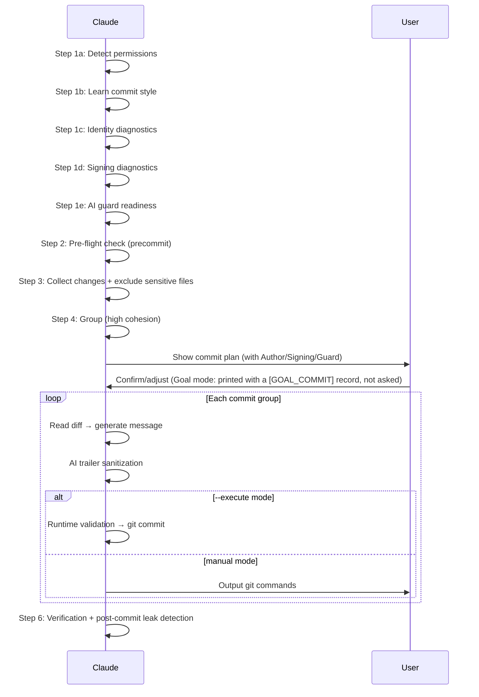

# Smart Commit

Analyze uncommitted changes → group by cohesion → generate commit messages → output git commands (or execute directly with `--execute`).

## Workflow



### Git Environment Policy (applies to every step below)

Every git command **this skill runs itself** — read or write, either mode — resolves the same
question: *which repository, tree, index, ancestry and configuration does it act on?* The answer is
pinned two ways, both defined in [git-environment.md](references/git-environment.md) § 1: the
inherited `GIT_*` variables are stripped, and every command carries `-C "$REPO_ROOT"`.

Where the stripping happens depends on who runs git:

| Callee | How the policy is applied |
|--------|---------------------------|
| A **fence** running `git` inline | The canonical `env -u` prefix, written out **literally** — never through a variable, because zsh does not word-split an expansion used as a command prefix |
| A helper that runs its **own** git commands and does **not** strip (`git-profile.sh`) | The prefix goes on the delegation, at the boundary |
| A helper that strips the same list **itself** (`smart-commit-inspect.sh`, `smart-commit-execute.sh`) | No prefix — the script's own `unset` block is the policy, and prefixing it as well would state the same rule twice in two places that could drift |

Every `/bin/bash -p -- "$INSPECT" …` call is the third row — all ten of them, across Steps 1b–1e,
3, 4, 5a and 6 — because `smart-commit-inspect.sh` unsets the list once for the whole process.
`$REPO_ROOT` is still re-derived in every fenced block: each block is a separate shell, so nothing
carries over.

What the skill **prints** is governed by § 2 of that file — the same list, the same spelling.

### Step 1: Detect Permissions + Learn Style

**1a. Permission Detection**

Read CLAUDE.md and `.claude/rules/git-workflow.md` to determine mode:

| Mode | Condition | Behavior |
|------|-----------|----------|
| manual | No `--execute` flag (default) | Output commands only |
| execute | `--execute` flag passed | Execute directly (with user approval via AskUserQuestion — or, under § Goal mode, without it) |

Default to **manual mode**. Direct execution requires explicit `--execute` flag regardless of project git restrictions.

**`--execute` mode**: When `--execute` is passed, use `AskUserQuestion` to show the full commit plan and get explicit user approval before executing. This is a skill-level exception to git-workflow rules (same pattern as `/push-ci`). The one exception to asking is § Goal mode below.

### Goal mode (git-autonomy FR-17)

While a goal **the user** set or approved is active, and `rules/git-workflow.md` § Proactive Offer
"Goal mode" says all four of its conditions hold — re-checked before every commit, including
`review-state.js goal-commit --format=json` returning `ok: true` — `--execute` runs without the plan
approval: the plan is **printed**, headed by one record line, and execution proceeds:

```
[GOAL_COMMIT] goal=<first 12 hex of `git hash-object --stdin` of the goal condition> | branch=<branch> | digest=<digest> | <ISO8601>
```

The goal text itself is never printed — a user may have put a secret in it. Everything else in this
skill is unchanged: every diagnostic and HALT, the sensitive-file exclusion, the attribution guard
on `smart-commit-execute.sh commit`, and every **judgement** question (an identity conflict, an
ambiguous grouping, a `--sign`/`--no-sign` override) still asks. `--ai-co-author` is never passed on
this path: when the user explicitly asks for it, Goal mode does not apply and the ordinary per-use
approval runs, so the attribution whitelist is always reached through the user. `needs_branch_allowance: true` means the first goal-mode commit on that protected branch
asks first (recommend a feature branch; if declined, ask to allow the branch for this goal).

**1b. Learn Commit Style**

```bash
REPO_ROOT=$(/usr/bin/env -u GIT_DIR -u GIT_WORK_TREE -u GIT_COMMON_DIR -u GIT_INDEX_FILE -u GIT_OBJECT_DIRECTORY -u GIT_ALTERNATE_OBJECT_DIRECTORIES -u GIT_NAMESPACE -u GIT_CEILING_DIRECTORIES -u GIT_GLOB_PATHSPECS -u GIT_ICASE_PATHSPECS -u GIT_NOGLOB_PATHSPECS -u GIT_LITERAL_PATHSPECS -u GIT_CONFIG -u GIT_CONFIG_PARAMETERS -u GIT_CONFIG_COUNT -u GIT_CONFIG_NOSYSTEM -u GIT_CONFIG_GLOBAL -u GIT_CONFIG_SYSTEM -u GIT_IMPLICIT_WORK_TREE -u GIT_GRAFT_FILE -u GIT_SHALLOW_FILE -u GIT_PREFIX -u GIT_NO_REPLACE_OBJECTS -u GIT_REPLACE_REF_BASE -u GIT_EXTERNAL_DIFF -u ALLOW_AI_COAUTHOR git rev-parse --show-toplevel && printf .) || { echo "⚠️ could not resolve the repository root — aborting" >&2; exit 1; }
REPO_ROOT=${REPO_ROOT%.}; REPO_ROOT=${REPO_ROOT%$'\n'}
INSPECT="$REPO_ROOT/.claude/scripts/smart-commit-inspect.sh"
[ -r "$INSPECT" ] || INSPECT="$REPO_ROOT/skills/smart-commit/scripts/smart-commit-inspect.sh"
[ -r "$INSPECT" ] || { echo "⚠️ smart-commit-inspect.sh not found — run /install-scripts" >&2; exit 1; }
/bin/bash -p -- "$INSPECT" style
```

Infer format, type vocabulary, subject conventions (capitalization/tense/ticket ID), and language from recent commits.

| Condition | Behavior |
|-----------|----------|
| Commits listed | Infer the convention from them |
| Non-zero exit, `does not have any commits yet` on stderr | **Not an error** — this is the first commit of a new repository, which is a case `/smart-commit` exists for. Fall back to the default `<type>: <subject>` convention and continue. Do **not** apply the "stop and report the stderr" rule the later steps carry: they read state a commit depends on, this one reads history that may legitimately be empty |
| Any other non-zero exit | Stop and report the stderr — the repository could not be read |

**1c. Identity Diagnostics**

**Shared diagnostic (preferred path)**:

```bash
REPO_ROOT=$(/usr/bin/env -u GIT_DIR -u GIT_WORK_TREE -u GIT_COMMON_DIR -u GIT_INDEX_FILE -u GIT_OBJECT_DIRECTORY -u GIT_ALTERNATE_OBJECT_DIRECTORIES -u GIT_NAMESPACE -u GIT_CEILING_DIRECTORIES -u GIT_GLOB_PATHSPECS -u GIT_ICASE_PATHSPECS -u GIT_NOGLOB_PATHSPECS -u GIT_LITERAL_PATHSPECS -u GIT_CONFIG -u GIT_CONFIG_PARAMETERS -u GIT_CONFIG_COUNT -u GIT_CONFIG_NOSYSTEM -u GIT_CONFIG_GLOBAL -u GIT_CONFIG_SYSTEM -u GIT_IMPLICIT_WORK_TREE -u GIT_GRAFT_FILE -u GIT_SHALLOW_FILE -u GIT_PREFIX -u GIT_NO_REPLACE_OBJECTS -u GIT_REPLACE_REF_BASE -u GIT_EXTERNAL_DIFF -u ALLOW_AI_COAUTHOR git rev-parse --show-toplevel && printf .) || { echo "⚠️ could not resolve the repository root — aborting" >&2; exit 1; }
REPO_ROOT=${REPO_ROOT%.}; REPO_ROOT=${REPO_ROOT%$'\n'}
/usr/bin/env -u GIT_DIR -u GIT_WORK_TREE -u GIT_COMMON_DIR -u GIT_INDEX_FILE -u GIT_OBJECT_DIRECTORY -u GIT_ALTERNATE_OBJECT_DIRECTORIES -u GIT_NAMESPACE -u GIT_CEILING_DIRECTORIES -u GIT_GLOB_PATHSPECS -u GIT_ICASE_PATHSPECS -u GIT_NOGLOB_PATHSPECS -u GIT_LITERAL_PATHSPECS -u GIT_CONFIG -u GIT_CONFIG_PARAMETERS -u GIT_CONFIG_COUNT -u GIT_CONFIG_NOSYSTEM -u GIT_CONFIG_GLOBAL -u GIT_CONFIG_SYSTEM -u GIT_IMPLICIT_WORK_TREE -u GIT_GRAFT_FILE -u GIT_SHALLOW_FILE -u GIT_PREFIX -u GIT_NO_REPLACE_OBJECTS -u GIT_REPLACE_REF_BASE -u GIT_EXTERNAL_DIFF -u ALLOW_AI_COAUTHOR /bin/bash -p -- "$REPO_ROOT/scripts/run-skill.sh" git-profile git-profile.sh doctor --json
```

The prefix goes on the **delegation**, not inside the helper: `git-profile.sh` runs its own
git commands, and stripping at the boundary is what makes it and the fallback below agree. The
interpreter is `/bin/bash -p --` for the reason given once in
[execute-mode.md § Why the entrypoint is spelled `/bin/bash -p --`](references/execute-mode.md) —
it applies here too, and this is the path whose JSON decides HALT versus continue.

**Known limitation.** In a **consuming project** this delegation cannot resolve `git-profile.sh`,
so the fallback below is the normal path there — not a broken installation. Two stacked defects,
both shared by the eleven skills that delegate through the runner; the first could be fixed here
alone, but not without diverging this one skill from the other ten, and the second would remain:
[4-implementation.md § 6](../../docs/features/smart-commit-hardening/4-implementation.md).

If the script succeeds, parse the JSON output:
- `status: "ok"` → silent continue, use `effective_identity` and `signing` fields
- `status: "warn"` → display warnings from `issues[]`, continue
- `status: "halt"` → display halt issues, stop with guidance

If the script fails (not found, parse error, non-zero exit), **fall back** to the diagnostic below. Infrastructure failure = warn-only; never halt on fallback path itself.

**Fallback** — the claim is narrow: the two still share the root derivation, `git` and
`/bin/bash`, and nothing here survives those failing. What they no longer share is the
*resolution* — the preferred path goes **through** `scripts/run-skill.sh`, the fallback resolves
`smart-commit-inspect.sh` by path, installed copy first. A missing or broken runner therefore
takes out the first and leaves the second working. Why that separation is load-bearing:
[4-implementation.md § 5](../../docs/features/smart-commit-hardening/4-implementation.md).

```bash
REPO_ROOT=$(/usr/bin/env -u GIT_DIR -u GIT_WORK_TREE -u GIT_COMMON_DIR -u GIT_INDEX_FILE -u GIT_OBJECT_DIRECTORY -u GIT_ALTERNATE_OBJECT_DIRECTORIES -u GIT_NAMESPACE -u GIT_CEILING_DIRECTORIES -u GIT_GLOB_PATHSPECS -u GIT_ICASE_PATHSPECS -u GIT_NOGLOB_PATHSPECS -u GIT_LITERAL_PATHSPECS -u GIT_CONFIG -u GIT_CONFIG_PARAMETERS -u GIT_CONFIG_COUNT -u GIT_CONFIG_NOSYSTEM -u GIT_CONFIG_GLOBAL -u GIT_CONFIG_SYSTEM -u GIT_IMPLICIT_WORK_TREE -u GIT_GRAFT_FILE -u GIT_SHALLOW_FILE -u GIT_PREFIX -u GIT_NO_REPLACE_OBJECTS -u GIT_REPLACE_REF_BASE -u GIT_EXTERNAL_DIFF -u ALLOW_AI_COAUTHOR git rev-parse --show-toplevel && printf .) || { echo "⚠️ could not resolve the repository root — aborting" >&2; exit 1; }
REPO_ROOT=${REPO_ROOT%.}; REPO_ROOT=${REPO_ROOT%$'\n'}
INSPECT="$REPO_ROOT/.claude/scripts/smart-commit-inspect.sh"
[ -r "$INSPECT" ] || INSPECT="$REPO_ROOT/skills/smart-commit/scripts/smart-commit-inspect.sh"
[ -r "$INSPECT" ] || { echo "⚠️ smart-commit-inspect.sh not found — run /install-scripts" >&2; exit 1; }
/bin/bash -p -- "$INSPECT" identity
```

**Read the output by key and kind, never by line number.** Field 1 is the key, field 2 is the
**kind** — `value`, `empty` or `unset`:

| Kind | Line shape |
|------|-----------|
| `value` | `<key><TAB>value<TAB><scope><TAB><origin><TAB><value>` |
| `empty` | `<key><TAB>empty<TAB><scope><TAB><origin>` — the key is set to the empty string |
| `unset` | `<key><TAB>unset` |

The kind is written by the script, never read out of the config, and every **data** field is
escaped (`\\`, `\n`, `\t`, `\r`, and every other C0 control byte plus DEL as `\xHH` — `P8v`) —
the value, the origin path, the four env values below, and the `effective` ident (`P8t`). So one
record is always exactly one line with a fixed field count, and **no data can forge a key or a
kind**. Both properties are load-bearing: without them a `user.name` containing a newline
emits a second line reading `user.name<TAB>unset` and the HALT below fires on a repository that
commits perfectly well; a `GIT_AUTHOR_NAME` containing one forges a whole identity record; and a
`GIT_AUTHOR_NAME` containing a raw ESC byte carries an ANSI/terminal escape sequence straight
into whatever prints the record later.

**Records for a key arrive in git's own precedence order, so the LAST one is what git would use.**
Read that line, not the presence of any line — an empty value in `~/.gitconfig` overridden by a
real one in `.git/config` produces both an `empty` and a `value` line, and only the last of them
describes the commit that would be made.

The script then prints the four env lines, and finally the four lines that carry the
**verdict** — two `effective`, two `configured`. On the abort path it exits before reaching any
of them.

The env lines carry the **same key/kind shape** (minus scope and origin, which the environment does
not have), because exported-and-empty and not-exported are different states and one blank line
cannot say which:

```
GIT_AUTHOR_NAME<TAB>value<TAB><value>     # exported, non-empty — this is what the commit uses
GIT_AUTHOR_NAME<TAB>empty                 # exported and empty — NOT the same as unset
GIT_AUTHOR_NAME<TAB>unset                 # not in the environment; config decides this role
```

**The last four lines are the answer; everything above them says where it came from.**

```
effective<TAB>author<TAB>value<TAB><ident>      # what `git commit` would record for this role
effective<TAB>committer<TAB>unresolvable        # git refuses this role outright
configured<TAB>author<TAB>yes                   # the ident came from something set for THIS repo
configured<TAB>committer<TAB>no                  # it fell through to $EMAIL or git's OS guess
```

`effective` is `git var GIT_AUTHOR_IDENT` / `GIT_COMMITTER_IDENT`, asked of git rather than rebuilt
here. git applies the whole chain — `GIT_<role>_*` when exported, else `user.*`, else `EMAIL`, else
a guess from the OS — then runs its ident parser and refuses in exactly the cases `git commit`
refuses. Two consequences a table over the config rows could not reach, both measured (§ 10.6):

| Input | The records above | `effective` |
|---|---|---|
| `user.name = "   "` (spaces) | `value` — looks configured | `unresolvable`; `git commit` fatals `name consists only of disallowed characters` |
| `GIT_AUTHOR_NAME=" Alice <evil@x> "` | reported verbatim | `Alice evil@x <…>` — git's parser strips the angle brackets, and the commit records the stripped form |
| `user.email` unset, `EMAIL` exported | `user.email<TAB>unset` | the `EMAIL` value — a source no record here reports, because it is git's fallback, not a git config |

The trailing `<unix-seconds> <tz>` git appends is stripped: the question is who, not when.

`configured` is `git -c user.useConfigOnly=true var GIT_<ROLE>_IDENT`, asked the same way as
`effective` — **not** a re-derivation from the records above. git's `useConfigOnly` mode refuses
the whole fallback half of resolution (`EMAIL`, the OS guess) and succeeds only when the ident came
from something set **for this repository or this invocation**: `user.*`/`author.*`/`committer.*`
config, or an exported `GIT_<role>_NAME`/`GIT_<role>_EMAIL`. It exists because `effective` alone
cannot make this distinction — git's OS guess resolves *successfully*, so a `value` line looks
identical whether it came from `.git/config` or from `uname`. Measured: `configured` reads `no` for
both `EMAIL` and a bare OS guess alike, and that grouping is not a gap — from the operator's view
neither is a value they set for this repository, and `git config --local` fixes both the same way.
Oracles: `P8r`, `P8s`.

Decision logic — read the `effective` lines first, then use the records to locate the cause:

| Condition | Behavior |
|-----------|----------|
| Both lines are `effective<TAB><role><TAB>value<TAB><ident>`, each with a non-empty name and a non-empty address, and the matching `configured<TAB><role>` line reads `yes` | Continue with no prompt. Show that ident in the commit plan; it is what git will record, whatever combination of env, config and fallback produced it |
| Either line is `effective<TAB><role><TAB>unresolvable` | **HALT** — git refuses that role, so no commit is possible. Locate the cause in the records above, and print `git var GIT_AUTHOR_IDENT` (or `GIT_COMMITTER_IDENT`) as the command that shows git's own message |
| An `effective` ident whose address is empty — `Name <>` | **HALT** — nothing fails here; git commits and the commit simply carries no attribution, which is the outcome CLAUDE.md rule 3 exists to prevent. Measured `P8m`: an empty `GIT_AUTHOR_EMAIL`/`GIT_COMMITTER_EMAIL` or an empty `user.email` both land here |
| **Provenance**: an `effective` line resolved to a value (not already caught by the empty-address row above), and the matching `configured<TAB><role>` line reads `no` | **HALT** — the ident did not come from anything set for this repository: it is `$EMAIL` or git's OS guess, and `configured` cannot tell those two apart (§ 10.8) — nor does the fix need it to: `git config --local user.name "..."` / `user.email "..."` (or the `author.*`/`committer.*` equivalent) covers both. This is a *policy* halt, not a git refusal: git commits happily on either source, `user.useConfigOnly=true` is what draws the line |
| Two or more `value` records for the same config key with **different** values | **AskUserQuestion**: list candidate profiles, user selects once. `effective` already says which one git picked — the prompt confirms that is the intended one |
| Conflict (the row above) + a `CI<TAB>value<TAB>...` record | **HALT** (fail-closed) — output fix guidance, do not silently inherit. `identity` emits this record the same way it emits the `GIT_AUTHOR_*`/`GIT_COMMITTER_*` ones, so the condition is readable from the fallback path's own output rather than assumed (`P8t2`) |
| `identity: could not read …` on stderr, non-zero exit | **Stop and report the stderr.** The config was unreadable; this is not an unset key and the setup guidance above would be the wrong instruction. Any stdout printed before the abort is not an answer |

**Locating the cause.** None of these rows is a verdict on its own — the verdict is above. They say
which input produced it, and therefore which fix can reach it. An env line outranks config **for the
role it names**: git takes `GIT_AUTHOR_NAME` when exported and falls back to `user.name` only when
it is not, so a role resolved from the environment is never fixed by `git config`.

The same outranking happens one level down, inside config itself: **`author.*`/`committer.*` outrank
`user.*` for their own role when both are set** (git >= 2.31) — `author.name` wins for the author
role even if `user.name` is also configured, and symmetrically for `committer.*`. Both keys can show
an equally-valid `value` record below; the records alone do not say which file git actually used.
`effective` does — it is the row that says which config key's file to edit, not the mere presence of
a `value` record for `user.*`.

| Record | What it means for the role |
|--------|---------------------------|
| `GIT_AUTHOR_NAME<TAB>value<TAB><value>` | Exported and non-empty — **this** is the input; `git config` cannot reach it, `unset` can |
| `GIT_AUTHOR_NAME<TAB>empty` | Exported and empty. For a `NAME` this is why `effective` says `unresolvable`; for an `EMAIL` it is why the address is `<>`. Fixed by `unset`, never by `git config` |
| `GIT_AUTHOR_NAME<TAB>unset` | Not in the environment — config decides this role, so read its key below |
| `<key><TAB>value<TAB><scope><TAB><origin><TAB><value>` | The configured input, and `<origin>` is the file to edit. Only the **last** record for the key is the one git used |
| `<key><TAB>empty<TAB><scope><TAB><origin>` | Set to the empty string in `<origin>`. As the last record for the key this is a cause; earlier in the list it is shadowed and irrelevant |
| `<key><TAB>unset` | Not configured anywhere. If no env var covers the role either, `effective` is one of two measured outcomes: it resolved from `EMAIL` or git's OS guess (the provenance HALT above), **or** it reads `unresolvable` — configuring the OTHER role's `author.*`/`committer.*` alone is enough to disable the OS guess for THIS one, even though this role itself has no record above saying so (`P8s`, § 10.8) |

Oracles: `P8`, `P8b`–`P8u`; the measured forgeries and misreads:
[4-implementation.md § 10](../../docs/features/smart-commit-hardening/4-implementation.md).

Design principles:
- **Diagnostic, not override**: Do not use `git -c user.name=...` to override. Respect `includeIf` settings.
- **Ask git, do not model git**: the verdict comes from `git var`; the records exist to locate a cause, never to re-derive the answer.
- **Interrupt only on anomaly**: Normal identity resolution produces no prompt.
- **Conflict ≠ multiple sources**: `includeIf` producing multiple config sources that resolve to the same value = normal.

**1d. Signing Diagnostics**

```bash
REPO_ROOT=$(/usr/bin/env -u GIT_DIR -u GIT_WORK_TREE -u GIT_COMMON_DIR -u GIT_INDEX_FILE -u GIT_OBJECT_DIRECTORY -u GIT_ALTERNATE_OBJECT_DIRECTORIES -u GIT_NAMESPACE -u GIT_CEILING_DIRECTORIES -u GIT_GLOB_PATHSPECS -u GIT_ICASE_PATHSPECS -u GIT_NOGLOB_PATHSPECS -u GIT_LITERAL_PATHSPECS -u GIT_CONFIG -u GIT_CONFIG_PARAMETERS -u GIT_CONFIG_COUNT -u GIT_CONFIG_NOSYSTEM -u GIT_CONFIG_GLOBAL -u GIT_CONFIG_SYSTEM -u GIT_IMPLICIT_WORK_TREE -u GIT_GRAFT_FILE -u GIT_SHALLOW_FILE -u GIT_PREFIX -u GIT_NO_REPLACE_OBJECTS -u GIT_REPLACE_REF_BASE -u GIT_EXTERNAL_DIFF -u ALLOW_AI_COAUTHOR git rev-parse --show-toplevel && printf .) || { echo "⚠️ could not resolve the repository root — aborting" >&2; exit 1; }
REPO_ROOT=${REPO_ROOT%.}; REPO_ROOT=${REPO_ROOT%$'\n'}
INSPECT="$REPO_ROOT/.claude/scripts/smart-commit-inspect.sh"
[ -r "$INSPECT" ] || INSPECT="$REPO_ROOT/skills/smart-commit/scripts/smart-commit-inspect.sh"
[ -r "$INSPECT" ] || { echo "⚠️ smart-commit-inspect.sh not found — run /install-scripts" >&2; exit 1; }
/bin/bash -p -- "$INSPECT" signing
```

Decision logic:

`signing` answers in the **same shape as Step 1c** — `<key><TAB><kind>[…]` for
`commit.gpgsign`, `user.signingkey` and `gpg.format`, in that order, read by key and never by
line number, with the last record for a key winning. It used to print three bare lines, which a
multi-line value silently shifted (§ 10.2). Oracles: `P9`, `P9b`, `P9c`.

**`commit.gpgsign` is read as a boolean**, so its value field is only ever the literal `true` or
`false`: git normalises `1`/`yes`/`on`/`True`, and a valueless `gpgsign` — which git reads as
**true** — is no longer byte-identical to `gpgsign =`, which git reads as **false**. That
distinction cannot be recovered from the raw string, which is why it is git that converts and not
a row in this table. `commit.gpgsign<TAB>empty` is therefore unreachable, and a non-boolean value
is a read failure rather than a verdict. Oracles: `P9d`–`P9f`; measurements: § 10.3.

| Condition (per key, last record) | Behavior |
|-----------|----------|
| `commit.gpgsign<TAB>value…true` + `user.signingkey<TAB>value` | Display `Signing: enabled (<gpg.format>)` |
| `commit.gpgsign<TAB>value…true` + `user.signingkey<TAB>unset` or `user.signingkey<TAB>empty` | ⚠️ Warning: signing enabled but key not configured |
| `commit.gpgsign<TAB>value…false` | Display `Signing: disabled (commit.gpgsign=false)`. Distinct from the row below: this is an explicit off, so `--sign` contradicts a stated intent rather than an absent one |
| `commit.gpgsign<TAB>unset` | Display `Signing: not configured (inherit)` |
| `commit.gpgsign<TAB>empty` | **Unreachable** under `--type=bool`. Treat as a read failure, not as false — reaching it means the script was invoked without the flag, so the verdict would be untrustworthy either way |
| `gpg.format<TAB>value` | Use it as the `<gpg.format>` shown above |
| `gpg.format<TAB>unset` or `gpg.format<TAB>empty` | Use git's default, `gpg`. The script reports the fact; applying the default is this step's job |
| `signing: could not read …` on stderr, non-zero exit | **Stop and report the stderr** — same reasoning as Step 1c. This is also where a non-boolean `commit.gpgsign` lands, and it is not stricter than git: git's own `--bool` read exits 128 on the same config, so a `git commit` would fail too |
| `--execute` mode signing failure | **Immediate stop** + fix guidance |

Post-commit visibility (`--execute` mode):

```bash
REPO_ROOT=$(/usr/bin/env -u GIT_DIR -u GIT_WORK_TREE -u GIT_COMMON_DIR -u GIT_INDEX_FILE -u GIT_OBJECT_DIRECTORY -u GIT_ALTERNATE_OBJECT_DIRECTORIES -u GIT_NAMESPACE -u GIT_CEILING_DIRECTORIES -u GIT_GLOB_PATHSPECS -u GIT_ICASE_PATHSPECS -u GIT_NOGLOB_PATHSPECS -u GIT_LITERAL_PATHSPECS -u GIT_CONFIG -u GIT_CONFIG_PARAMETERS -u GIT_CONFIG_COUNT -u GIT_CONFIG_NOSYSTEM -u GIT_CONFIG_GLOBAL -u GIT_CONFIG_SYSTEM -u GIT_IMPLICIT_WORK_TREE -u GIT_GRAFT_FILE -u GIT_SHALLOW_FILE -u GIT_PREFIX -u GIT_NO_REPLACE_OBJECTS -u GIT_REPLACE_REF_BASE -u GIT_EXTERNAL_DIFF -u ALLOW_AI_COAUTHOR git rev-parse --show-toplevel && printf .) || { echo "⚠️ could not resolve the repository root — aborting" >&2; exit 1; }
REPO_ROOT=${REPO_ROOT%.}; REPO_ROOT=${REPO_ROOT%$'\n'}
INSPECT="$REPO_ROOT/.claude/scripts/smart-commit-inspect.sh"
[ -r "$INSPECT" ] || INSPECT="$REPO_ROOT/skills/smart-commit/scripts/smart-commit-inspect.sh"
[ -r "$INSPECT" ] || { echo "⚠️ smart-commit-inspect.sh not found — run /install-scripts" >&2; exit 1; }
/bin/bash -p -- "$INSPECT" signature
```

It prints **one character**, git's `%G?` alphabet (`git log` manual, git 2.54.0), and nothing else.
Read the character, not the line count — and treat an empty stdout with a non-zero exit as its own
state, because a repository with no commit to inspect is not an unsigned commit:

| `%G?` | git's meaning | Behavior |
|-------|---------------|----------|
| `G` | good (valid) signature | Display `Signed: good` |
| `U` | good signature, unknown validity | Display `Signed: good (signer key not trusted locally)` — a local keyring fact, not a defect in the commit |
| `X` | good signature that has expired | ⚠️ Warning: verifies locally, and this is the state a server-side signature policy rejects |
| `Y` | good signature made by an expired key | ⚠️ Warning — same reason as `X` |
| `R` | good signature made by a revoked key | ⚠️ Warning — same reason as `X`, and the most likely of the three to be rejected |
| `E` | signature cannot be checked (e.g. missing key) | ⚠️ Warning: says the local keyring cannot verify it, **not** that the commit is unsigned |
| `B` | bad signature | **Stop and report.** The commit carries a signature that does not verify |
| `N` | no signature | Benign when Step 1d reported signing off or unset. **Stop** when this batch was meant to be signed (`commit.gpgsign=true`, no `--no-sign`): the commit just made is unsigned |
| *(empty stdout, non-zero exit)* | — | **Not a verdict.** The repository has no commit to inspect (measured: unborn repo → rc 128, empty stdout) or could not be read. Report the stderr; do not read it as `N` |

Oracles: `P11`, `P11b`.

**Signing override flags** (`--sign` / `--no-sign`):

| Flag | Effect | Git flag |
|------|--------|----------|
| `--sign` | Force signing for this batch | `-S` on each `git commit` |
| `--no-sign` | Disable signing for this batch | `--no-gpg-sign` on each `git commit` |
| Both | **Error** — mutually exclusive | Halt with error message |
| Neither | Inherit from `commit.gpgsign` config | (default behavior) |

When `--sign` or `--no-sign` is used, **AskUserQuestion** to confirm the override and warn about potential branch protection / CI policy conflicts.

**1e. AI Guard Readiness**

```bash
# Hook resolution is git's answer, not ours: `--git-path` honours core.hooksPath
# (including `~` and `%(prefix)`) and resolves linked worktrees. Why the three states
# differ: test/scripts/smart-commit-inspect.test.js `P6`. Why a resolution FAILURE is
# a fourth state and not `guard:missing`: smart-commit-inspect.sh, `guard`.
REPO_ROOT=$(/usr/bin/env -u GIT_DIR -u GIT_WORK_TREE -u GIT_COMMON_DIR -u GIT_INDEX_FILE -u GIT_OBJECT_DIRECTORY -u GIT_ALTERNATE_OBJECT_DIRECTORIES -u GIT_NAMESPACE -u GIT_CEILING_DIRECTORIES -u GIT_GLOB_PATHSPECS -u GIT_ICASE_PATHSPECS -u GIT_NOGLOB_PATHSPECS -u GIT_LITERAL_PATHSPECS -u GIT_CONFIG -u GIT_CONFIG_PARAMETERS -u GIT_CONFIG_COUNT -u GIT_CONFIG_NOSYSTEM -u GIT_CONFIG_GLOBAL -u GIT_CONFIG_SYSTEM -u GIT_IMPLICIT_WORK_TREE -u GIT_GRAFT_FILE -u GIT_SHALLOW_FILE -u GIT_PREFIX -u GIT_NO_REPLACE_OBJECTS -u GIT_REPLACE_REF_BASE -u GIT_EXTERNAL_DIFF -u ALLOW_AI_COAUTHOR git rev-parse --show-toplevel && printf .) || { echo "⚠️ could not resolve the repository root — aborting" >&2; exit 1; }
REPO_ROOT=${REPO_ROOT%.}; REPO_ROOT=${REPO_ROOT%$'\n'}
INSPECT="$REPO_ROOT/.claude/scripts/smart-commit-inspect.sh"
[ -r "$INSPECT" ] || INSPECT="$REPO_ROOT/skills/smart-commit/scripts/smart-commit-inspect.sh"
[ -r "$INSPECT" ] || { echo "⚠️ smart-commit-inspect.sh not found — run /install-scripts" >&2; exit 1; }
/bin/bash -p -- "$INSPECT" guard
```

Decision logic:

| Condition | Behavior |
|-----------|----------|
| Hook installed + executable | Display `AI guard: active` |
| Hook not installed | ⚠️ Warning (non-blocking): suggest install (`/install-scripts commit-msg-guard` then `cp .claude/scripts/commit-msg-guard.sh <hooks-path>/commit-msg && chmod +x <hooks-path>/commit-msg`) |
| Hook exists but not executable | ⚠️ Warning: suggest `chmod +x <hook-path>` |
| **Non-zero exit** (`guard: could not resolve the hooks path — aborting`) | **Stop and report the stderr.** This is not `guard:missing`: that verdict says "install the hook", which is the wrong instruction when the truth is that the repository could not be read |

**Important**: Hook installation is NOT a blocker for `--execute` mode — runtime validation (Step 5c) is an independent safety layer.

### Step 2: Pre-flight Check

Check precommit status by change type — structural `.md` under `skills/` has test coverage (`skills-schema.test.js`) that catches reference errors CI would find.

| Change Type | Required Check | Rationale |
|-------------|---------------|-----------|
| Code files (`.ts/.js/.py/.go/.rs` etc.) | `/precommit` or `/precommit-fast` passed | Code correctness + lint |
| Structural `.md` (`skills/**`) | `/precommit-fast` passed | Schema/ref tests cover SKILL.md structure |
| Other `.md` (README, docs/) | `/codex-review-doc` passed (per CLAUDE.md) | No structural tests; doc review sufficient |
| Trivial whitespace in non-code files | Skip allowed | No test coverage expected. Comment edits inside code files are **not** here — `CLAUDE.md` classifies them conservatively as code (comments can carry compiler/lint/build directives), so they follow the code-file row above |

**Default: advisory, not a gate.** `/smart-commit` can be invoked before review has ever run — the
terminal completion invariant (`rules/auto-loop.md`) constrains the moment a *change* is declared
complete, not the moment this skill is called — so on the common path, where auto-loop already ran
review and precommit and noted the verdict, re-halting on the same evidence is friction, not
added safety.

| Status | Default action | `--strict-preflight` action |
|--------|-----------------|------------------------------|
| Required check passed **in current session after last edit** | Continue (silent) | Continue (silent) |
| Not run, stale, or uncertain | ⚠️ **Warn and continue** — name the missing/stale gate(s) and the exact command to close each one | **Halt** — ask user to run the required check first |

**`--strict-preflight`**: opt-in flag restoring the original Halt behavior for the not-fresh row —
the passed row already continues silently in both columns, so there is nothing for the flag to
change there. Manual and `--execute` modes honor it identically — the flag changes Step 2's own
decision, not which mode invoked the skill.

**The warning must be actionable** — name the gate and the command, not just "not passed":

```
⚠️ Pre-flight: 2 of 3 changed files have no fresh check this session.
  - src/service/rpc.ts (code): run /precommit-fast or /precommit
  - docs/features/x/2-tech-spec.md (other .md): run /codex-review-doc
Continuing without --strict-preflight. Pass --strict-preflight to halt on this instead.
```

**Freshness**: A "passed" result is only valid if it ran after the most recent file edits in this
session. Stale results from earlier in the session do not count — freshness decides *which* row
above applies, not whether that row warns or halts.

**Policy note**: see "Default: advisory, not a gate" above for the rationale — this only relaxes
this skill's own *extra* pass over verdicts already noted; `@rules/auto-loop.md`'s gates are
unaffected, and `/precommit`/`/codex-review-doc` are not exempted for anyone still passing through
them. Worth stating plainly: the Stop hook is a **reminder, never a block**
(hook-lightweighting § 3.2 — it emits markdown and exits 0), so Step 2's own Halt is the only
*blocking* barrier this side of the git hooks between an unreviewed edit and a commit.
`--strict-preflight` is how to raise that barrier, not a stylistic preference.

**Fast vs full**: `/precommit-fast` runs `test:fast`; CI runs `test:ci`. Deletions (skills, scripts) can leave orphaned test files that only fail in CI, so when only `/precommit-fast` ran, output: `⚠️ Only fast tests ran. If you deleted files, consider /precommit (full suite) to catch orphaned imports before commit.`

### Step 3: Collect Changes

```bash
# Root-relative by construction — `git status --short` reports paths relative to the
# CURRENT directory, so a subdirectory would emit pathspecs a later `-C` misresolves.
REPO_ROOT=$(/usr/bin/env -u GIT_DIR -u GIT_WORK_TREE -u GIT_COMMON_DIR -u GIT_INDEX_FILE -u GIT_OBJECT_DIRECTORY -u GIT_ALTERNATE_OBJECT_DIRECTORIES -u GIT_NAMESPACE -u GIT_CEILING_DIRECTORIES -u GIT_GLOB_PATHSPECS -u GIT_ICASE_PATHSPECS -u GIT_NOGLOB_PATHSPECS -u GIT_LITERAL_PATHSPECS -u GIT_CONFIG -u GIT_CONFIG_PARAMETERS -u GIT_CONFIG_COUNT -u GIT_CONFIG_NOSYSTEM -u GIT_CONFIG_GLOBAL -u GIT_CONFIG_SYSTEM -u GIT_IMPLICIT_WORK_TREE -u GIT_GRAFT_FILE -u GIT_SHALLOW_FILE -u GIT_PREFIX -u GIT_NO_REPLACE_OBJECTS -u GIT_REPLACE_REF_BASE -u GIT_EXTERNAL_DIFF -u ALLOW_AI_COAUTHOR git rev-parse --show-toplevel && printf .) || { echo "⚠️ could not resolve the repository root — aborting" >&2; exit 1; }
REPO_ROOT=${REPO_ROOT%.}; REPO_ROOT=${REPO_ROOT%$'\n'}
INSPECT="$REPO_ROOT/.claude/scripts/smart-commit-inspect.sh"
[ -r "$INSPECT" ] || INSPECT="$REPO_ROOT/skills/smart-commit/scripts/smart-commit-inspect.sh"
[ -r "$INSPECT" ] || { echo "⚠️ smart-commit-inspect.sh not found — run /install-scripts" >&2; exit 1; }
/bin/bash -p -- "$INSPECT" collect
```

**Classify changes**:

**Check `unmerged` first — it pre-empts every row below it, including `staged`.** `UU`/`AA`/`DD`
(and the `AU`/`UD`/`UA`/`DU` variants) all carry a non-blank column 1, so reading the table
top-to-bottom without this note routes an unresolved conflict into "staged" — group it with no
`git add` needed, then `git commit` a path the merge never finished. Measured: `UU` after a real
`git merge` conflict.

| Type | Status code | Description |
|------|-------------|-------------|
| unmerged | `UU`, `AA`, `DD`, `AU`, `UD`, `UA`, `DU` | **Stop, do not group.** An unresolved merge conflict — surface it to the user; it needs `git add` only after the conflict markers are resolved by hand |
| staged | any other code in column 1 | Already `git add`-ed |
| modified | `M` | Tracked but unstaged |
| typechange | `T` in either column (e.g. `T`, `T`) | File replaced by a different type at the same path — most commonly a regular file swapped for a symlink. Group like `modified`; the path is unambiguous, there is nothing to resolve |
| untracked | `??` | New files (decide whether to include) |
| deleted | `D` in either column | Deleted files |
| renamed | `R` | **Two paths on one line**: `R  <old> -> <new>`. Group by `<new>` — that is the path a later `git add -- ':(literal)<path>'` must name |
| copied | `C` | Same two-path shape. Reachable whenever `status.renames=copies` is inherited from any config scope, so it is not a case this skill may assume away |

The ` -> ` in those two rows is a **separator, not part of a path**, and telling the two apart is
not a guess: git quotes any path containing ` -> `, in every status shape. Measured on an untracked
file, a modified file, and a rename in each direction — the four lines `collect` produced:

```text
?? "a -> b.txt"
 M "a -> b.txt"
R  src.txt -> "dst -> x.txt"
R  "a -> b.txt" -> plain.txt
```

So an **unquoted** ` -> ` is always the rename separator. Splitting on it without that check is
what turns `a -> b.txt` into two pathspecs that match nothing.

**Exclusion rules** (warn user, do not include):

```
.env* | *.pem | *.key | *.p12 | id_rsa* | .aws/credentials | *.secret
credentials.json | .npmrc | token.txt | node_modules/ | dist/ | .cache/ | .gitignore'd
```

**Partial-staged detection**: If a file has both staged and unstaged changes (`MM` in `git status`), warn user and ask them to resolve first.

**`--scope` filtering**: When `--scope <path>` is specified, only include changes under that path. Apply after collecting all changes:

```bash
REPO_ROOT=$(/usr/bin/env -u GIT_DIR -u GIT_WORK_TREE -u GIT_COMMON_DIR -u GIT_INDEX_FILE -u GIT_OBJECT_DIRECTORY -u GIT_ALTERNATE_OBJECT_DIRECTORIES -u GIT_NAMESPACE -u GIT_CEILING_DIRECTORIES -u GIT_GLOB_PATHSPECS -u GIT_ICASE_PATHSPECS -u GIT_NOGLOB_PATHSPECS -u GIT_LITERAL_PATHSPECS -u GIT_CONFIG -u GIT_CONFIG_PARAMETERS -u GIT_CONFIG_COUNT -u GIT_CONFIG_NOSYSTEM -u GIT_CONFIG_GLOBAL -u GIT_CONFIG_SYSTEM -u GIT_IMPLICIT_WORK_TREE -u GIT_GRAFT_FILE -u GIT_SHALLOW_FILE -u GIT_PREFIX -u GIT_NO_REPLACE_OBJECTS -u GIT_REPLACE_REF_BASE -u GIT_EXTERNAL_DIFF -u ALLOW_AI_COAUTHOR git rev-parse --show-toplevel && printf .) || { echo "⚠️ could not resolve the repository root — aborting" >&2; exit 1; }
REPO_ROOT=${REPO_ROOT%.}; REPO_ROOT=${REPO_ROOT%$'\n'}
INSPECT="$REPO_ROOT/.claude/scripts/smart-commit-inspect.sh"
[ -r "$INSPECT" ] || INSPECT="$REPO_ROOT/skills/smart-commit/scripts/smart-commit-inspect.sh"
[ -r "$INSPECT" ] || { echo "⚠️ smart-commit-inspect.sh not found — run /install-scripts" >&2; exit 1; }
/bin/bash -p -- "$INSPECT" scope '<path>'
```

Substitute the `--scope` argument for `'<path>'`, single-quoted, and a path containing an apostrophe is written `'\''` at that position (the same rule `references/git-environment.md` § 2 gives for printed commands; without it the fence is syntactically broken rather than merely wrong) — written out rather than passed
as `"$SCOPE_PATH"` because each fence is **one tool call, so one shell**: a variable this fence
never assigned expands to the empty string, the script refuses it (`scope: the path must not be
empty`, exit 2) and the scoping the caller asked for never happens — loudly, but it still does not
happen. Same rule Step 5c.3 states for `"$EXECUTE"`.

Exclude changes outside the scope path. `--scope` takes a **path, never a glob**: every operand
carries `:(literal)`, so `*.ts` matches a file literally named `*.ts` and nothing else. If no
changes remain after filtering → report "No changes under `<path>`" and stop.

If no changes → report "No uncommitted changes" and stop.

**A non-zero exit from `collect` is not an empty change set.** The subcommand accumulates the
status of all three git commands, so one failing among two that printed still surfaces — output
with no status lines can mean a broken `git status`, not a clean tree. Report the stderr and stop;
never take the "no changes" branch on a non-zero exit. A *successful* empty answer is a real clean
tree: `collect`, `status` and `scope` all pin `--untracked-files=all`, so `showUntrackedFiles=no`
cannot fake one, and a wholly-untracked directory is enumerated per file rather than collapsed to
`?? dir/` — which is what lets the exclusion list below match a secret by **filename**. Two kinds
of directory stay collapsed because git will not traverse them, an embedded repository and a
symlink to a directory; both stage as a gitlink or a symlink and carry no file content, so nothing
hides inside them. This holds wherever those three subcommands are used, Step 6's re-check
included. The cost is real and accepted: a large untracked tree that is **not** gitignored now
lists one line per file. Triggers, measurements and the trade-off: `P15`, `P17`, `P17b`, `P17c` in
`test/scripts/smart-commit-inspect.test.js` and
[4-implementation.md § 9](../../docs/features/smart-commit-hardening/4-implementation.md).

**Selection is live git status, whole tree.** Every uncommitted change `collect` reported — minus
the exclusion rules and any `--scope` filter above — is a candidate for grouping. There is no
session-scoped filter: the hook-maintained `session_commit_scope` store retired with the state
machine that wrote it (hook-lightweighting § 3.4), and nothing now records which files this
session touched. What replaces it is not a narrower selection but a visible one: the Commit Plan
in Step 4 lists every file it is about to group, and the user confirming that plan is the
selection decision — under § Goal mode the printed plan is. A file the user does not want committed is removed at the plan, or fenced out
up front with `--scope`.

### Step 4: Group (High Cohesion)

Each group should form a semantically complete commit.

**Grouping strategy** (priority order):

1. **Already staged changes**: Respect user intent — separate group (no `git add`, just `git commit`)
2. **Same feature/module**: Group by path prefix + filename semantics
   - Same directory changes (e.g. `src/service/xxx/`)
   - Flat files by name prefix
   - Controller + Service + Test = complete feature
3. **Same type**: Pure tests → `test:`, pure docs → `docs:`, pure config → `chore:`
4. **Related changes**: `src/xxx.ts` + `test/unit/xxx.test.ts` in same group
5. **Remaining scattered files**: Merge into misc commit or ask user

**Group limit**: No more than 15 files per commit.

**Ticket ID**: If `{TICKET_PATTERN}` is configured, extract ticket ID from branch name:

```bash
REPO_ROOT=$(/usr/bin/env -u GIT_DIR -u GIT_WORK_TREE -u GIT_COMMON_DIR -u GIT_INDEX_FILE -u GIT_OBJECT_DIRECTORY -u GIT_ALTERNATE_OBJECT_DIRECTORIES -u GIT_NAMESPACE -u GIT_CEILING_DIRECTORIES -u GIT_GLOB_PATHSPECS -u GIT_ICASE_PATHSPECS -u GIT_NOGLOB_PATHSPECS -u GIT_LITERAL_PATHSPECS -u GIT_CONFIG -u GIT_CONFIG_PARAMETERS -u GIT_CONFIG_COUNT -u GIT_CONFIG_NOSYSTEM -u GIT_CONFIG_GLOBAL -u GIT_CONFIG_SYSTEM -u GIT_IMPLICIT_WORK_TREE -u GIT_GRAFT_FILE -u GIT_SHALLOW_FILE -u GIT_PREFIX -u GIT_NO_REPLACE_OBJECTS -u GIT_REPLACE_REF_BASE -u GIT_EXTERNAL_DIFF -u ALLOW_AI_COAUTHOR git rev-parse --show-toplevel && printf .) || { echo "⚠️ could not resolve the repository root — aborting" >&2; exit 1; }
REPO_ROOT=${REPO_ROOT%.}; REPO_ROOT=${REPO_ROOT%$'\n'}
INSPECT="$REPO_ROOT/.claude/scripts/smart-commit-inspect.sh"
[ -r "$INSPECT" ] || INSPECT="$REPO_ROOT/skills/smart-commit/scripts/smart-commit-inspect.sh"
[ -r "$INSPECT" ] || { echo "⚠️ smart-commit-inspect.sh not found — run /install-scripts" >&2; exit 1; }
/bin/bash -p -- "$INSPECT" branch
```

Show grouping plan and ask user to confirm. Under § Goal mode, show it and do not ask. Include identity, signing, and AI guard metadata from
Step 1c/1d/1e, and the pre-flight verdict from Step 2 — in `--execute` mode this is the same block
`AskUserQuestion` shows, so the approval screen carries pre-flight state rather than only the
grouping. **Pre-flight** is one of `passed` / `stale` / `not run`; when it is not `passed`, append
the same actionable gate+command list Step 2 warns with, and whether `--strict-preflight` is set:

```
## Commit Plan

**Selection**: all uncommitted changes (live git status)
**Author**: Jane Doe <jane@company.com> (local config)
**Signing**: enabled (GPG, key: ABCD1234)
**AI guard**: active (commit-msg hook installed)
**Pre-flight**: stale (2 of 3 changed files have no fresh check this session)
  - src/service/rpc.ts (code): run /precommit-fast or /precommit
  - docs/features/x/2-tech-spec.md (other .md): run /codex-review-doc
  --strict-preflight: not set

| # | Type | Files | Summary |
|---|------|-------|---------|
| 1 | fix  | 3     | Fix circuit breaker logic |
| 2 | test | 2     | Add RPC client unit tests |
| 3 | docs | 4     | Update performance audit docs |

### Excluded — sensitive files (never committed by this skill)
| File | Reason |
|------|--------|
| .env.local | Matches exclusion rules (Step 3) |

> To narrow the commit to one area: rerun with `--scope <path>`

Adjust grouping?   ← ordinary mode only; under § Goal mode this line is omitted
```

### Step 5: Generate Commits (Loop)

**5a. Read diff**

```bash
# `:(literal)` is applied by the script, per operand, so a call site cannot forget it:
# diffing `report1.md` while staging `report[1].md` describes one file and commits another.
REPO_ROOT=$(/usr/bin/env -u GIT_DIR -u GIT_WORK_TREE -u GIT_COMMON_DIR -u GIT_INDEX_FILE -u GIT_OBJECT_DIRECTORY -u GIT_ALTERNATE_OBJECT_DIRECTORIES -u GIT_NAMESPACE -u GIT_CEILING_DIRECTORIES -u GIT_GLOB_PATHSPECS -u GIT_ICASE_PATHSPECS -u GIT_NOGLOB_PATHSPECS -u GIT_LITERAL_PATHSPECS -u GIT_CONFIG -u GIT_CONFIG_PARAMETERS -u GIT_CONFIG_COUNT -u GIT_CONFIG_NOSYSTEM -u GIT_CONFIG_GLOBAL -u GIT_CONFIG_SYSTEM -u GIT_IMPLICIT_WORK_TREE -u GIT_GRAFT_FILE -u GIT_SHALLOW_FILE -u GIT_PREFIX -u GIT_NO_REPLACE_OBJECTS -u GIT_REPLACE_REF_BASE -u GIT_EXTERNAL_DIFF -u ALLOW_AI_COAUTHOR git rev-parse --show-toplevel && printf .) || { echo "⚠️ could not resolve the repository root — aborting" >&2; exit 1; }
REPO_ROOT=${REPO_ROOT%.}; REPO_ROOT=${REPO_ROOT%$'\n'}
INSPECT="$REPO_ROOT/.claude/scripts/smart-commit-inspect.sh"
[ -r "$INSPECT" ] || INSPECT="$REPO_ROOT/skills/smart-commit/scripts/smart-commit-inspect.sh"
[ -r "$INSPECT" ] || { echo "⚠️ smart-commit-inspect.sh not found — run /install-scripts" >&2; exit 1; }
/bin/bash -p -- "$INSPECT" diff '<path>' …
```

**5b. Generate commit message** (following Step 1b inferred style)

- Subject focuses on "what was done", not "which files changed"
- If project convention includes scope → `<type>(<scope>): <subject>`
- If project convention includes ticket ID → append `[TICKET-ID]`
- **`--type` override**: When `--type <type>` is specified, use that type for all commit groups instead of inferring from changes. Takes precedence over inferred type.

**AI trailer sanitization** (mandatory, before outputting any commit command):

Scan the generated message for forbidden patterns and **strip them silently** unless `--ai-co-author` was explicitly passed:

| Forbidden Pattern | Regex (ERE with `\b`, `grep -Ei`) |
|-------------------|------|
| Co-Authored-By AI | `Co-Authored-By:.*(Claude\|Anthropic\|\bAI\b\|GPT\|OpenAI\|Copilot\|Codex\|Gemini\|noreply@anthropic)` |
| Generated-by tag | `Generated[ -](by\|with).*(Claude\|Anthropic\|\bAI\b\|GPT\|OpenAI\|Copilot\|Codex\|Gemini)` |
| Emoji robot tag | `🤖.*(Claude\|Anthropic\|\bAI\b\|GPT\|OpenAI\|Copilot\|Codex\|Gemini)` |

> **Note**: `\|` in the table above is Markdown table escaping. Actual ERE uses unescaped `|`. Only `AI` is `\b`-bounded — it keeps bare `AI` from matching inside ordinary words ("maintainer", "domain") under `-i`. `GPT` and `OpenAI` are intentionally left unbounded so they still match inside `ChatGPT` / `GPT-4` (no English word contains "gpt").
> **Canonical regex source**: `scripts/commit-msg-guard.sh` (ERE, `grep -Ei`)

If any pattern matches and `--ai-co-author` was **not** passed → remove the matching line(s) from the message before output/execute.

**`--ai-co-author` narrow whitelist** (enforced by the guard, in both places it runs): When `--ai-co-author` is passed, only the exact line `Co-Authored-By: Claude <noreply@anthropic.com>` is permitted. All other AI patterns (`Generated by`, `🤖`, variant Co-Authored-By formats) remain blocked even with `--ai-co-author`. Note: `ALLOW_AI_COAUTHOR=1` no longer bypasses the commit-msg hook wholesale. The hook removes exactly the permitted line and holds the remainder to the full pattern set, so `Generated by …`, a 🤖 tag and variant `Co-Authored-By` forms are still rejected with the flag set. The narrow whitelist is therefore enforced in **both** places by the **same script**: runtime validation in Step 5c runs `scripts/commit-msg-guard.sh` itself rather than a second copy of the patterns, so the two cannot disagree. The guard enforces the whitelist's *content*; it cannot verify that `--ai-co-author` was actually passed, which is why only that branch sets `ALLOW_AI_COAUTHOR=1`.

**5c. Output or execute commands**

**Manual mode** — output copy-pasteable commands:

**Repository coherence**: every printed command is self-contained —
`<PREFIX> git -C '<REPO_ROOT>' <subcommand> … -- ':(literal)<path>' …`. The form, the two
independent protection layers it needs (shell quoting *and* per-operand `:(literal)`), and the
scope of what the prefix does not claim are defined once in
[git-environment.md](references/git-environment.md) § 2 — emit exactly that form.

> **Heredoc delimiter**: `SD0X_MSG_EOF`, not `EOF`. A heredoc ends at the first line equal to its
> delimiter, so a message containing a bare `EOF` line terminates it early and the rest is pasted
> into the user's shell as commands. Check each message for such a line before emitting and
> reword it. (`--execute` uses no heredoc — the message goes to a file via the Write tool.)

Already staged group (no `git add` needed):

````markdown
### Commit 1/3: fix: Fix circuit breaker timeout logic

```bash
/usr/bin/env -u GIT_DIR -u GIT_WORK_TREE -u GIT_COMMON_DIR -u GIT_INDEX_FILE -u GIT_OBJECT_DIRECTORY -u GIT_ALTERNATE_OBJECT_DIRECTORIES -u GIT_NAMESPACE -u GIT_CEILING_DIRECTORIES -u GIT_GLOB_PATHSPECS -u GIT_ICASE_PATHSPECS -u GIT_NOGLOB_PATHSPECS -u GIT_LITERAL_PATHSPECS -u GIT_CONFIG -u GIT_CONFIG_PARAMETERS -u GIT_CONFIG_COUNT -u GIT_CONFIG_NOSYSTEM -u GIT_CONFIG_GLOBAL -u GIT_CONFIG_SYSTEM -u GIT_IMPLICIT_WORK_TREE -u GIT_GRAFT_FILE -u GIT_SHALLOW_FILE -u GIT_PREFIX -u GIT_NO_REPLACE_OBJECTS -u GIT_REPLACE_REF_BASE -u GIT_EXTERNAL_DIFF -u ALLOW_AI_COAUTHOR git -C '<REPO_ROOT>' commit -m "$(cat <<'SD0X_MSG_EOF'
fix: Fix circuit breaker timeout logic

SD0X_MSG_EOF
)"
```
````

Unstaged group (needs `git add` first):

````markdown
### Commit 2/3: test: Add RPC client unit tests

```bash
/usr/bin/env -u GIT_DIR -u GIT_WORK_TREE -u GIT_COMMON_DIR -u GIT_INDEX_FILE -u GIT_OBJECT_DIRECTORY -u GIT_ALTERNATE_OBJECT_DIRECTORIES -u GIT_NAMESPACE -u GIT_CEILING_DIRECTORIES -u GIT_GLOB_PATHSPECS -u GIT_ICASE_PATHSPECS -u GIT_NOGLOB_PATHSPECS -u GIT_LITERAL_PATHSPECS -u GIT_CONFIG -u GIT_CONFIG_PARAMETERS -u GIT_CONFIG_COUNT -u GIT_CONFIG_NOSYSTEM -u GIT_CONFIG_GLOBAL -u GIT_CONFIG_SYSTEM -u GIT_IMPLICIT_WORK_TREE -u GIT_GRAFT_FILE -u GIT_SHALLOW_FILE -u GIT_PREFIX -u GIT_NO_REPLACE_OBJECTS -u GIT_REPLACE_REF_BASE -u GIT_EXTERNAL_DIFF -u ALLOW_AI_COAUTHOR git -C '<REPO_ROOT>' add -- \
  ':(literal)test/unit/provider/clients/basic-json-rpc-client.test.ts' ':(literal)test/unit/utils/concurrence-as-one.test.ts'
/usr/bin/env -u GIT_DIR -u GIT_WORK_TREE -u GIT_COMMON_DIR -u GIT_INDEX_FILE -u GIT_OBJECT_DIRECTORY -u GIT_ALTERNATE_OBJECT_DIRECTORIES -u GIT_NAMESPACE -u GIT_CEILING_DIRECTORIES -u GIT_GLOB_PATHSPECS -u GIT_ICASE_PATHSPECS -u GIT_NOGLOB_PATHSPECS -u GIT_LITERAL_PATHSPECS -u GIT_CONFIG -u GIT_CONFIG_PARAMETERS -u GIT_CONFIG_COUNT -u GIT_CONFIG_NOSYSTEM -u GIT_CONFIG_GLOBAL -u GIT_CONFIG_SYSTEM -u GIT_IMPLICIT_WORK_TREE -u GIT_GRAFT_FILE -u GIT_SHALLOW_FILE -u GIT_PREFIX -u GIT_NO_REPLACE_OBJECTS -u GIT_REPLACE_REF_BASE -u GIT_EXTERNAL_DIFF -u ALLOW_AI_COAUTHOR git -C '<REPO_ROOT>' commit -m "$(cat <<'SD0X_MSG_EOF'
test: Add RPC client unit tests

SD0X_MSG_EOF
)"
```
````

**Execute mode** (`--execute`) — run commands directly:

1. Use `AskUserQuestion` to show the full commit plan (all groups) and get approval once — under § Goal mode, print the plan with its `[GOAL_COMMIT]` record instead
2. For each commit group in the approved plan (or, under § Goal mode, the printed plan), execute `<PREFIX> git -C "$REPO_ROOT" add -- ':(literal)<path>' …` (if needed), where `<PREFIX>` is the literal `env -u` list from § 1 — same prefix **and same `-C`** as every other command, so staging cannot target a different repository, index or path base than the commit
3. **Runtime validation and commit** — do not assemble this from bash. Allocate the message file, write the sanitized message into it **with the Write tool** (not a heredoc — see below), then hand it to the checked-in script, which validates against the canonical guard and commits in one process:

   Each call below is **one tool call, so one shell**. A variable set while allocating is gone by the time the commit runs — the Write tool sits between them — so every fence carries its own locator. Substituting the absolute path the locator resolved to is equally acceptable, and is the same thing written out; what is not acceptable is `"$EXECUTE"` in a shell that never assigned it, which invokes `bash` with an empty script path or with a value the caller chose.

   **Fence 1 — allocate.** The locator is repo-relative, installed copy first: the same order and the same reason as the guard, since no variable may name the thing that enforces policy.

   ```bash
   REPO_ROOT=$(/usr/bin/env -u GIT_DIR -u GIT_WORK_TREE -u GIT_COMMON_DIR -u GIT_INDEX_FILE -u GIT_OBJECT_DIRECTORY -u GIT_ALTERNATE_OBJECT_DIRECTORIES -u GIT_NAMESPACE -u GIT_CEILING_DIRECTORIES -u GIT_GLOB_PATHSPECS -u GIT_ICASE_PATHSPECS -u GIT_NOGLOB_PATHSPECS -u GIT_LITERAL_PATHSPECS -u GIT_CONFIG -u GIT_CONFIG_PARAMETERS -u GIT_CONFIG_COUNT -u GIT_CONFIG_NOSYSTEM -u GIT_CONFIG_GLOBAL -u GIT_CONFIG_SYSTEM -u GIT_IMPLICIT_WORK_TREE -u GIT_GRAFT_FILE -u GIT_SHALLOW_FILE -u GIT_PREFIX -u GIT_NO_REPLACE_OBJECTS -u GIT_REPLACE_REF_BASE -u GIT_EXTERNAL_DIFF -u ALLOW_AI_COAUTHOR git rev-parse --show-toplevel && printf .) || { echo "❌ not in a git repository" >&2; exit 1; }
   REPO_ROOT=${REPO_ROOT%.}; REPO_ROOT=${REPO_ROOT%$'\n'}
   EXECUTE="$REPO_ROOT/.claude/scripts/smart-commit-execute.sh"
   [ -r "$EXECUTE" ] || EXECUTE="$REPO_ROOT/skills/smart-commit/scripts/smart-commit-execute.sh"
   [ -r "$EXECUTE" ] || { echo "❌ smart-commit-execute.sh not found — run /install-scripts --skill smart-commit, then retry" >&2; exit 1; }
   /bin/bash -p -- "$EXECUTE" alloc
   ```

   **Then Write** the sanitized message into the path that printed — with the Write tool, not a heredoc.

   **Fence 2 — commit.** A separate tool call is a separate shell: `$EXECUTE` from fence 1 no longer exists, so the locator is repeated in full. This is not redundancy to be tidied away; deleting it leaves `bash` running an empty script path, or one the caller exported.

   ```bash
   REPO_ROOT=$(/usr/bin/env -u GIT_DIR -u GIT_WORK_TREE -u GIT_COMMON_DIR -u GIT_INDEX_FILE -u GIT_OBJECT_DIRECTORY -u GIT_ALTERNATE_OBJECT_DIRECTORIES -u GIT_NAMESPACE -u GIT_CEILING_DIRECTORIES -u GIT_GLOB_PATHSPECS -u GIT_ICASE_PATHSPECS -u GIT_NOGLOB_PATHSPECS -u GIT_LITERAL_PATHSPECS -u GIT_CONFIG -u GIT_CONFIG_PARAMETERS -u GIT_CONFIG_COUNT -u GIT_CONFIG_NOSYSTEM -u GIT_CONFIG_GLOBAL -u GIT_CONFIG_SYSTEM -u GIT_IMPLICIT_WORK_TREE -u GIT_GRAFT_FILE -u GIT_SHALLOW_FILE -u GIT_PREFIX -u GIT_NO_REPLACE_OBJECTS -u GIT_REPLACE_REF_BASE -u GIT_EXTERNAL_DIFF -u ALLOW_AI_COAUTHOR git rev-parse --show-toplevel && printf .) || { echo "❌ not in a git repository" >&2; exit 1; }
   REPO_ROOT=${REPO_ROOT%.}; REPO_ROOT=${REPO_ROOT%$'\n'}
   EXECUTE="$REPO_ROOT/.claude/scripts/smart-commit-execute.sh"
   [ -r "$EXECUTE" ] || EXECUTE="$REPO_ROOT/skills/smart-commit/scripts/smart-commit-execute.sh"
   [ -r "$EXECUTE" ] || { echo "❌ smart-commit-execute.sh not found — run /install-scripts --skill smart-commit, then retry" >&2; exit 1; }
   /bin/bash -p -- "$EXECUTE" commit <msg-file> [--ai-co-author] [--sign|--no-sign]
   ```

   **`/bin/bash -p`, both halves load-bearing** — the measurements are in
   [execute-mode.md § Why the entrypoint is spelled `/bin/bash -p --`](references/execute-mode.md),
   stated there once rather than restated at each call site.

   Anchored to `$REPO_ROOT` for the same reason Step 1c is — a relative `scripts/…` resolves against wherever the shell happens to be. **No `env -u` prefix on the script itself**, and that is not an omission: it unsets the same list process-wide at its own first lines, so prefixing it would apply one policy twice rather than adding a second. The prefix on `git rev-parse` above is a different matter — that call is deriving `$REPO_ROOT`, and `GIT_DIR` would otherwise decide the answer.

   The script fails closed when the guard cannot be located, removes the message file once it starts consuming it (a usage error returns first and leaves it for you to reuse), and **verifies the commits it created before returning**. Exit statuses and what each one means: [execute-mode.md](references/execute-mode.md).
4. After each commit, verify with `<PREFIX> git -C "$REPO_ROOT" log --oneline -1` to confirm success
5. If any commit fails or runtime validation fails, stop and report the error (do not continue to next group)

With `--ai-co-author` the commit is the same self-contained command, with the assignment placed
**after** the prefix (never before it — the prefix strips the variable) and one trailer line
appended byte-exact as the last line of the message:

````markdown
```bash
/usr/bin/env -u GIT_DIR -u GIT_WORK_TREE -u GIT_COMMON_DIR -u GIT_INDEX_FILE -u GIT_OBJECT_DIRECTORY -u GIT_ALTERNATE_OBJECT_DIRECTORIES -u GIT_NAMESPACE -u GIT_CEILING_DIRECTORIES -u GIT_GLOB_PATHSPECS -u GIT_ICASE_PATHSPECS -u GIT_NOGLOB_PATHSPECS -u GIT_LITERAL_PATHSPECS -u GIT_CONFIG -u GIT_CONFIG_PARAMETERS -u GIT_CONFIG_COUNT -u GIT_CONFIG_NOSYSTEM -u GIT_CONFIG_GLOBAL -u GIT_CONFIG_SYSTEM -u GIT_IMPLICIT_WORK_TREE -u GIT_GRAFT_FILE -u GIT_SHALLOW_FILE -u GIT_PREFIX -u GIT_NO_REPLACE_OBJECTS -u GIT_REPLACE_REF_BASE -u GIT_EXTERNAL_DIFF -u ALLOW_AI_COAUTHOR ALLOW_AI_COAUTHOR=1 git -C '<REPO_ROOT>' commit -m "$(cat <<'SD0X_MSG_EOF'
fix: Fix circuit breaker timeout logic

Co-Authored-By: Claude <noreply@anthropic.com>
SD0X_MSG_EOF
)"
```
````

`ALLOW_AI_COAUTHOR=1` is what lets the commit-msg hook accept that one line; it widens nothing
else and replaces no part of the prefix.

**5d. Continue to next group** — manual mode: output all groups' commands at once, prompt the
user to execute in order. Execute mode: proceed to the next group after a successful commit.

### Step 6: Verification

**Execute mode**:

```bash
REPO_ROOT=$(/usr/bin/env -u GIT_DIR -u GIT_WORK_TREE -u GIT_COMMON_DIR -u GIT_INDEX_FILE -u GIT_OBJECT_DIRECTORY -u GIT_ALTERNATE_OBJECT_DIRECTORIES -u GIT_NAMESPACE -u GIT_CEILING_DIRECTORIES -u GIT_GLOB_PATHSPECS -u GIT_ICASE_PATHSPECS -u GIT_NOGLOB_PATHSPECS -u GIT_LITERAL_PATHSPECS -u GIT_CONFIG -u GIT_CONFIG_PARAMETERS -u GIT_CONFIG_COUNT -u GIT_CONFIG_NOSYSTEM -u GIT_CONFIG_GLOBAL -u GIT_CONFIG_SYSTEM -u GIT_IMPLICIT_WORK_TREE -u GIT_GRAFT_FILE -u GIT_SHALLOW_FILE -u GIT_PREFIX -u GIT_NO_REPLACE_OBJECTS -u GIT_REPLACE_REF_BASE -u GIT_EXTERNAL_DIFF -u ALLOW_AI_COAUTHOR git rev-parse --show-toplevel && printf .) || { echo "⚠️ could not resolve the repository root — aborting" >&2; exit 1; }
REPO_ROOT=${REPO_ROOT%.}; REPO_ROOT=${REPO_ROOT%$'\n'}
INSPECT="$REPO_ROOT/.claude/scripts/smart-commit-inspect.sh"
[ -r "$INSPECT" ] || INSPECT="$REPO_ROOT/skills/smart-commit/scripts/smart-commit-inspect.sh"
[ -r "$INSPECT" ] || { echo "⚠️ smart-commit-inspect.sh not found — run /install-scripts" >&2; exit 1; }
/bin/bash -p -- "$INSPECT" status
```

- Still has unhandled changes (committable files in included set) → return to Step 4
- Only excluded files remain (sensitive files) → stop with warning summary listing excluded files
- All clear → output summary table

After each commit, run **post-commit AI trailer detection** (hard stop on leak):

```bash
# Same locator as Step 5c.3 — this is a separate shell, so nothing carries over.
REPO_ROOT=$(/usr/bin/env -u GIT_DIR -u GIT_WORK_TREE -u GIT_COMMON_DIR -u GIT_INDEX_FILE -u GIT_OBJECT_DIRECTORY -u GIT_ALTERNATE_OBJECT_DIRECTORIES -u GIT_NAMESPACE -u GIT_CEILING_DIRECTORIES -u GIT_GLOB_PATHSPECS -u GIT_ICASE_PATHSPECS -u GIT_NOGLOB_PATHSPECS -u GIT_LITERAL_PATHSPECS -u GIT_CONFIG -u GIT_CONFIG_PARAMETERS -u GIT_CONFIG_COUNT -u GIT_CONFIG_NOSYSTEM -u GIT_CONFIG_GLOBAL -u GIT_CONFIG_SYSTEM -u GIT_IMPLICIT_WORK_TREE -u GIT_GRAFT_FILE -u GIT_SHALLOW_FILE -u GIT_PREFIX -u GIT_NO_REPLACE_OBJECTS -u GIT_REPLACE_REF_BASE -u GIT_EXTERNAL_DIFF -u ALLOW_AI_COAUTHOR git rev-parse --show-toplevel && printf .) || { echo "❌ not in a git repository" >&2; exit 1; }
REPO_ROOT=${REPO_ROOT%.}; REPO_ROOT=${REPO_ROOT%$'\n'}
EXECUTE="$REPO_ROOT/.claude/scripts/smart-commit-execute.sh"
[ -r "$EXECUTE" ] || EXECUTE="$REPO_ROOT/skills/smart-commit/scripts/smart-commit-execute.sh"
[ -r "$EXECUTE" ] || { echo "❌ smart-commit-execute.sh not found — run /install-scripts --skill smart-commit, then retry" >&2; exit 1; }

/bin/bash -p -- "$EXECUTE" verify-last [<commit-ish>] [--ai-co-author]
```

At most **one** commit-ish: a second operand is a usage error (exit 2), not a silent decision about which commit to check.

This is a **secondary** convergence check. The primary one already ran: `commit` verifies the commits it created before it returns, in the same process, against their exact OIDs — deferring detection to a later call would read whatever is at the tip by then, and a post-commit hook controls that. Reproduced: a commit-msg hook injecting a trailer plus a post-commit hook stacking a clean commit made the deferred check report 0 while the trailer sat in history.

Exit 0 is clean; **exit 4 means a commit this invocation provably made carries AI attribution** → immediately stop all remaining groups. Exit 3 or 7 means UNVERIFIED, which is also a stop. On the `commit` subcommand there is one more: **exit 8 means the guard could not evaluate the policy at all** (its own exit contract distinguishes a content verdict, exit 1, from an environment failure, exit 3 — a pattern grep that could not run, say, or under `--ai-co-author` a failed `mktemp`) — nothing was committed, and reporting it as "AI content detected" would send the developer hunting a leak that never happened; `verify-last` folds the same condition into its existing UNVERIFIED status 7. The full status table lives in [execute-mode.md § Subcommands, exit statuses, and who owns the message file](references/execute-mode.md); leak handling in [§ On a leak](references/execute-mode.md). **Do NOT auto-amend** — amending is a destructive git operation reserved for the developer.

**Read the OID before offering amend guidance.** Exit 4 names the offending commit, and it is *not* always the one at HEAD: a `post-commit` hook can park the attribution-bearing commit on a side ref and rebuild the branch on top of a clean one, and the hook's work is attributed to this operation because it inherits the run's reflog marker. Amend guidance is correct only when the named OID **is** HEAD; when it is not, the commit is still reachable and still pushable, and the developer needs to be shown *where* it is rather than told to amend something else. Exit 7 never carries amend guidance at all. It is the script's single **UNVERIFIED** status and covers more than ownership: the message could not be read back (or read back empty), the ref space could not be listed, a **graft or shallow** file was present, or a trailer-bearing commit appeared in the window that no reflog entry ties to this invocation. Replace refs are *not* a status-7 cause — they are neutralized by `--no-replace-objects` on every verification read rather than refused, so a masked leak surfaces as exit 4. What they share is that the script cannot state what was recorded — so the instruction is to inspect, and the diagnostic says which of these it was.

**Manual mode**:

In manual mode, Step 6 outputs a post-execution checklist (Claude has NOT executed any commands):

```
## Post-Execution Checklist
After running the commands above:
1. /usr/bin/env -u GIT_DIR -u GIT_WORK_TREE -u GIT_COMMON_DIR -u GIT_INDEX_FILE -u GIT_OBJECT_DIRECTORY -u GIT_ALTERNATE_OBJECT_DIRECTORIES -u GIT_NAMESPACE -u GIT_CEILING_DIRECTORIES -u GIT_GLOB_PATHSPECS -u GIT_ICASE_PATHSPECS -u GIT_NOGLOB_PATHSPECS -u GIT_LITERAL_PATHSPECS -u GIT_CONFIG -u GIT_CONFIG_PARAMETERS -u GIT_CONFIG_COUNT -u GIT_CONFIG_NOSYSTEM -u GIT_CONFIG_GLOBAL -u GIT_CONFIG_SYSTEM -u GIT_IMPLICIT_WORK_TREE -u GIT_GRAFT_FILE -u GIT_SHALLOW_FILE -u GIT_PREFIX -u GIT_NO_REPLACE_OBJECTS -u GIT_REPLACE_REF_BASE -u GIT_EXTERNAL_DIFF -u ALLOW_AI_COAUTHOR git -C '<REPO_ROOT>' status --short  (verify all changes committed)
2. /usr/bin/env -u GIT_DIR -u GIT_WORK_TREE -u GIT_COMMON_DIR -u GIT_INDEX_FILE -u GIT_OBJECT_DIRECTORY -u GIT_ALTERNATE_OBJECT_DIRECTORIES -u GIT_NAMESPACE -u GIT_CEILING_DIRECTORIES -u GIT_GLOB_PATHSPECS -u GIT_ICASE_PATHSPECS -u GIT_NOGLOB_PATHSPECS -u GIT_LITERAL_PATHSPECS -u GIT_CONFIG -u GIT_CONFIG_PARAMETERS -u GIT_CONFIG_COUNT -u GIT_CONFIG_NOSYSTEM -u GIT_CONFIG_GLOBAL -u GIT_CONFIG_SYSTEM -u GIT_IMPLICIT_WORK_TREE -u GIT_GRAFT_FILE -u GIT_SHALLOW_FILE -u GIT_PREFIX -u GIT_NO_REPLACE_OBJECTS -u GIT_REPLACE_REF_BASE -u GIT_EXTERNAL_DIFF -u ALLOW_AI_COAUTHOR git -C '<REPO_ROOT>' log -3 --format='%H%n%B%n----'
   (no AI trailers — except, under `--ai-co-author`, exactly `Co-Authored-By: Claude <noreply@anthropic.com>`)
```

Do NOT run `git status` convergence loops or `git log -1` trailer detection in manual mode — the commands have not been executed yet.

## AI Co-Author Attribution

**Off by default** — the developer owns the commit. Without `--ai-co-author` no `Co-Authored-By`
trailer is added; with it, exactly one is: `Co-Authored-By: Claude <noreply@anthropic.com>`.

## Prohibited

- **No AI signatures by default**: Never add `Co-Authored-By`, `Generated by`, or any AI attribution trailer unless `--ai-co-author` is explicitly passed
- **No guessing**: If uncertain about file grouping, ask user
- **No merging unrelated changes**: Better an extra commit than sacrificing cohesion
- **No omissions**: Must `git status` verify after completion
- **No secrets**: Sensitive files must be warned about, never included
- **No unauthorized execution**: Without `--execute` flag, **never** directly execute git add/commit
- **No silent execution**: In `--execute` mode, must use `AskUserQuestion` for approval before executing commits — except under § Goal mode, where the plan is printed with its `[GOAL_COMMIT]` record, never silently
- **No file the plan never showed**: Selection is the whole live git status, so the Commit Plan is the only filter — every file a commit will touch appears in the confirmed plan (under § Goal mode, the printed plan), and a file added after confirmation (or after printing) re-opens the plan

## Bundled References

| File | Purpose | When |
|------|---------|------|
| [execute-mode.md](references/execute-mode.md) | What `scripts/smart-commit-execute.sh` does, its exit statuses, and why validation invokes the canonical `commit-msg-guard.sh` instead of re-implementing it | `--execute` mode |
| [git-environment.md](references/git-environment.md) | Why the `env -u` prefix exists, what it does and does not claim, and the self-contained form of printed commands | Both modes |

## Bundled Scripts

| File | Purpose |
|------|---------|
| `scripts/smart-commit-execute.sh` | The `--execute` implementation: `alloc`, `commit`, `verify-last` |
| `scripts/smart-commit-dispatch.sh` | The single external-execution entry point; permits only `bash git mktemp rm` |
| `scripts/smart-commit-inspect.sh` | The read-only diagnostics of Steps 1b–1e, 3, 4, 5a and 6: `style`, `identity`, `signing`, `signature`, `guard`, `collect`, `status`, `scope`, `diff`, `branch` |

Each basename carries the skill name because `/install-scripts` flattens every skill's `scripts/*` into one `.claude/scripts/` directory — a future skill shipping `execute.sh` would otherwise overwrite the script that enforces the attribution anchor. That flattening is also why `smart-commit-execute.sh` and `smart-commit-inspect.sh` are both located installed-copy-first: in a consuming project `.claude/scripts/` is the only place either one exists.

> **Note**: `--execute` runs the script above; it is not a procedure Claude assembles from bash in a reference document. That is why this skill needs no `Bash(mktemp:*)` or `Bash(rm:*)` grant — the only shell command it issues for `--execute` is `/bin/bash -p -- "$EXECUTE" …`, where `$EXECUTE` was assigned by the locator **in that same fence**. Why that exact spelling: [execute-mode.md § Why the entrypoint is spelled `/bin/bash -p --`](references/execute-mode.md).

## Examples

| Input | Action |
|-------|--------|
| "Help me commit these changes" | Manual mode → pre-flight → analyze 20 changes → group into 4 → output 4 sets of commands |
| `/smart-commit` | Manual mode → pre-flight → 5 changes, all one feature → 1 commit |
| `/smart-commit --execute` | Execute mode → pre-flight → group → AskUserQuestion approval → `git add` + `git commit` per group → `git status` verify |
| `/smart-commit --execute --ai-co-author` | As above, plus the one permitted `Co-Authored-By` trailer |
| `/smart-commit --execute` while a goal the user set is active (no `--ai-co-author`) | § Goal mode → `goal-commit` check → plan printed with a `[GOAL_COMMIT]` record → `git add` + `git commit` per group, no approval question → verify |
